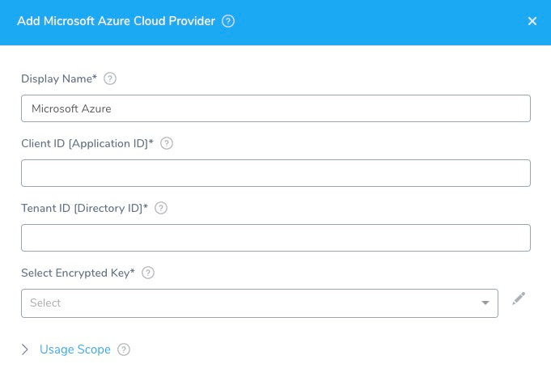
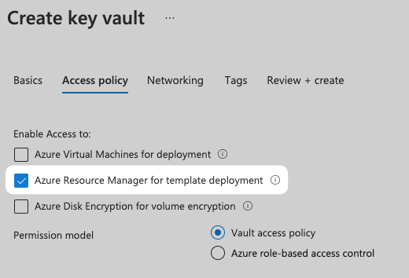
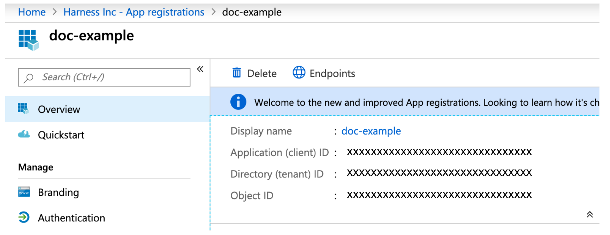
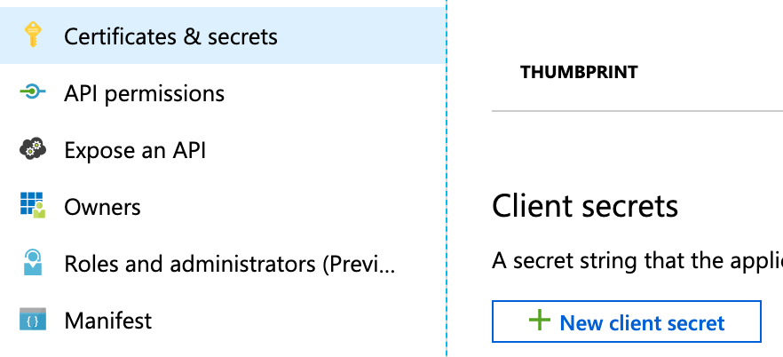

This topic explains how to connect to the Microsoft Azure cloud where you will deploy your applications or virtual machine scale set (VMSS) using Harness.

You add Cloud Providers to your Harness Account and then reference them when defining deployment environments.

In this topic:

* [Before You Begin](#before-you-begin)
* [Visual Summary](#visual-summary)
* [Review: Permissions](#review-permissions)
* [Step 1: Add the Cloud Provider](#step-1-add-the-cloud-provider)
* [Step 2: Gather the Required Information](#step-2-gather-the-required-information)
* [Step 3: Client ID](#step-3-client-id)
* [Step 4: Tenant ID](#step-4-tenant-id)
* [Step 5: Select Encrypted Key](#step-5-select-encrypted-key)
* [Artifact Support for Download and Copy](#artifact-support-for-download-and-copy)

## Before You Begin

* See [Harness Key Concepts](../../../starthere-firstgen/harness-key-concepts.md).

## Visual Summary

Here's an overview of the Microsoft Azure Cloud Provider settings.

## Review: Permissions

This section assume you are familiar with Azure RBAC.

For security reasons, Harness uses an application object and service principal rather than a user identity. The process is described in [How to: Use the portal to create an Azure AD application and service principal that can access resources](https://docs.microsoft.com/en-us/azure/active-directory/develop/howto-create-service-principal-portal) from Azure.

Briefly, the process is:

1. Register an application with Azure AD and create a service principal.
2. Assign a role to the Azure application.  
You assign the role depending on the scope you want to use (Azure subscription or resource group). Typically, an Azure subscription is used.  
You use the scope to assign a role to the Azure application.  
The role you assign depends on which Azure resource Harness will use (ACR, AKS, etc). See the list below these steps.  
You will use the same scope on the resource Harness will use. For example, your ACR container registry will use the same Azure subscription that you used to assign a role to the Azure application.
3. Get the application's tenant and app/client ID values for signing in.
4. Create a new application secret.
5. Use the tenant ID, app/client ID, and new application secret in the Harness Azure Cloud Provider.

Make sure the following permissions are assigned to the roles.

### Azure Container Repository (ACR)
:::note
Currently, Harness supports **public** ACR repos. Harness will be supporting private repos soon. Contact [Harness Sales](https://harness.io/company/contact-sales) for more information.
:::

The **Reader** role must be assigned. **This is the minimum requirement.**

You must provide the **Reader** role in the role assignment at the **Subscription** level used by the Application ID entered in the Cloud Provider. The application needs permission to list **all** container registries.

Some common mistakes:

* If you put the Reader role in a different IAM section of Azure.
* If you provide only the **AcrPull** role instead of **Reader**. It might appear that the AcrPull role gives access to a specific registry, but Harness needs to list **all** registries.

:::note
Harness supports 500 images from an ACR repo. If you do not see some of your images you might have exceeded this limit. This is the result of an Azure API limitation.  
  
If you connect to an ACR repo via the platform agnostic [Docker Registry](add-docker-registry-artifact-servers.md), the limit is 100.
:::

### Azure Kubernetes Services (AKS)

There are two options for connecting Harness to your target AKS cluster:

* **Recommend:** Install a [Kubernetes Delegate](../manage-delegates/install-kubernetes-delegate.md) in the target AKS cluster and use it for authentication in a Harness [Kubernetes Cluster Cloud Provider](add-kubernetes-cluster-cloud-provider.md). The Harness Kubernetes Cluster Cloud Provider is platform-agnostic.  
With this method, AKS permissions are not required at all. This is recommended.
* As an alternative, use the Harness Azure Cloud Provider as described in this topic. The **Owner** role must be assigned.

### Azure Web Apps

The **Contributor** role must be assigned. This is the minimum requirement.

### Azure Virtual Machines for IIS and SSH Deployments

The **Reader** role must be assigned. This is the minimum requirement.

This role is only used by the Harness Delegate when it uses the Azure APIs to discover target VMs.

For IIS deployments, Harness uses a WinRM connection for credentials. See [Add WinRM Connection Credentials](../../security/secrets-management/add-win-rm-connection-credentials.md).

For SSH deployments, Harness uses SSH keys for credentials. See [Add SSH Keys](../../security/secrets-management/add-ssh-keys.md).

### Azure Resource Management (ARM)

:::note
Currently, this feature is behind a Feature Flag. Contact [Harness Support](mailto:support@harness.io) to enable the feature. Feature Flags can only be removed for Harness Professional and Essentials editions. Once the feature is released to a general audience, it is available for Trial and Community Editions.
:::

The roles required depend on the scope type of your ARM template:

* **Resource group:** requires the **Contributor** role.
* **Subscription:** requires the **Contributor** role.
* **Management group:** requires the **Contributor** role.
* **Tenant:** requires the **Contributor** or **Owner** role. For example, creating a Tenant requires the **Contributor** role, but the **Owner** role is required to create role assignments.
* **Key Vault access:** to enable access to Key Vaults from the ARM templates you use in Harness, make sure you select the **Azure Resource Manager for template deployment** option in the Key Vault Access Policy.

:::note
The Azure roles provided in the Cloud Provider must allow Harness to provision the Azure resources in your ARM templates. For example, to create a policy assignment, the **Resource Policy Contributor** role is required.
:::

### Azure Blueprint

Currently, this feature is behind a Feature Flag. Contact [Harness Support](mailto:support@harness.io) to enable the feature. Feature Flags can only be removed for Harness Professional and Essentials editions. Once the feature is released to a general audience, it is available for Trial and Community Editions.

In Azure, the permissions required to create and delete Blueprints are listed in [Permissions in Azure Blueprints](https://docs.microsoft.com/en-us/azure/governance/blueprints/overview#permissions-in-azure-blueprints) from Azure.

The Azure roles required on the service principal used by Harness depend on the scope type of your Blueprint definition.

#### Management Scope

* **System-assigned managed identity:**
	+ **Contributor** role at the management group scope where the Blueprint definitions will be created and published
	+ **Owner** role at subscription scope where the assignment will be done.
* **System-assigned user identity:**
	+ **Contribute** role at the management group scope where Blueprint definitions will be created and published  
	Harness does not manage the right and lifecycle of a user-managed identity. You will need to manage the user-managed identity.

#### Subscription Scope

* **System-assigned managed identity:**
	+ **Owner** role at the subscription scope.
* **System-assigned user identity:**
	+ **Contribute** role to create and publish the Blueprint definition.  
	Harness does not manage the right and lifecycle of a user-managed identity. You are responsible for managing the right and lifecycle of a user-managed identity that is in charge of assignment.

## Step 1: Add the Cloud Provider

To add a cloud provider to your Harness account, do the following:

1. Click **Setup**, and then click **Cloud Providers**.
2. Click **Add Cloud Provider** and select **Microsoft Azure**.

The **Add Microsoft Azure Cloud Provider** panel appears.

## Step 2: Gather the Required Information

In Microsoft Azure, you can find the information you need in the App registration **Overview** page:

## Step 3: Client ID

This is the **Client Application ID** for the Azure app registration you are using. It is found in the Azure Active Directory **App registrations**. For more information, see [Quickstart: Register an app with the Azure Active Directory v1.0 endpoint](https://docs.microsoft.com/en-us/azure/active-directory/develop/quickstart-v1-add-azure-ad-app) from Microsoft.

To access resources in your Azure subscription, you must assign the Azure App registration using this Client ID to a role in that subscription. Later, when you set up an Azure service infrastructure in a Harness environment, you will select a subscription.

If the Azure App registration using this Client ID is not assigned a role in a subscription, no subscriptions will be available.

For more information, see [Assign the application to a role](https://docs.microsoft.com/en-us/azure/active-directory/develop/howto-create-service-principal-portal#assign-the-application-to-a-role) and [Use the portal to create an Azure AD application and service principal that can access resources](https://docs.microsoft.com/en-us/azure/active-directory/develop/howto-create-service-principal-portal) from Microsoft.

## Step 4: Tenant ID

The **Tenant ID** is the ID of the Azure Active Directory (AAD) in which you created your application. This is also called the **Directory ID**. For more information, see [Get tenant ID](https://docs.microsoft.com/en-us/azure/azure-resource-manager/resource-group-create-service-principal-portal#get-tenant-id) and [Use the portal to create an Azure AD application and service principal that can access resources](https://docs.microsoft.com/en-us/azure/active-directory/develop/howto-create-service-principal-portal) from Azure.

## Step 5: Select Encrypted Key

:::note
For secrets and other sensitive settings, select or create a new [Harness Encrypted Text secret](../../security/secrets-management/use-encrypted-text-secrets.md).
:::

This is the authentication key for your application. This is found in **Azure Active Directory**, **App Registrations**. Click the App name. Click **Certificates & secrets**, and then click **New client secret**.

You cannot view existing secret values, but you can create a new key. For more information, see [Create a new application secret](https://docs.microsoft.com/en-us/azure/active-directory/develop/howto-create-service-principal-portal#create-a-new-application-secret) from Azure.

## Artifact Support for Download and Copy

See [Service Types and Artifact Sources](../../../continuous-delivery/model-cd-pipeline/setup-services/service-types-and-artifact-sources.md).

