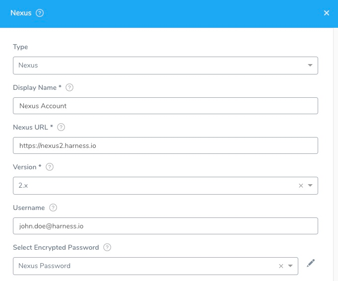
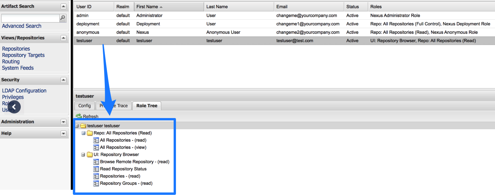

Connect your Nexus artifact servers with Harness.

## Before You Begin

* See [Harness Key Concepts](../../../starthere-firstgen/harness-key-concepts.md).

## Visual Summary

Here's an example configuration of the Nexus Artifaction Source addition.

## Review: Nexus Permissions

Make sure the connected user account has the following permissions in the Nexus Server.

* Repo: All repositories (Read)
* Nexus UI: Repository Browser

If used as a Docker Repo, the user needs:

* List images and tags
* Pull images

See [Nexus Managing Security](https://help.sonatype.com/display/NXRM2/Managing+Security).

## Step 1: Select Nexus Artifact Server

To connect to an artifact server, do the following:

1. Click **Setup**.
2. Click **Connectors**.
3. Click **Artifact Servers**.
4. Click **Add Artifact Server**.
5. In **Type**, select **Nexus**.

## Step 2: Nexus URL

In **Nexus U****RL**, enter the URL that you use to connect to your Nexus server. For example, `https://nexus2.dev.mycompany.io`.

## Step 3: Version

The **Version** field in the dialog lists the supported Nexus versions, 2.x and 3.x.

For Nexus 2.x, Harness supports repository formats Maven, npm, and NuGet. See Sonatype's website at [Supported Formats](https://help.sonatype.com/repomanager3/supported-formats).

For Nexus 3.x, Harness supports repository formats Docker 3.0 and greater, Maven, npm, NuGet, and raw.

## Step 4: Enter the Credentials

Enter the username and Select Encrypted Password.

For secrets and other sensitive settings, select or create a new [Harness Encrypted Text secret](../../security/secrets-management/use-encrypted-text-secrets.md).

Usage Scope is determined by the secret you selected.

## Step 5: Delegate Selector

Select the Delegate Selector(s) of the Delegate(s) you want this Connector to use.

When Harness needs to run a task, it makes a connection to a resource via its Delegates. Harness selects the best Delegate according to its history or it round-robins between Delegates. See [How Does Harness Manager Pick Delegates?](../manage-delegates/delegate-installation.md#how-does-harness-manager-pick-delegates).

In a few cases, you might want Harness to select specific Delegates. In these cases, you can use Delegate Selectors.

See [Select Delegates with Selectors](../manage-delegates/select-delegates-for-specific-tasks-with-selectors.md).

