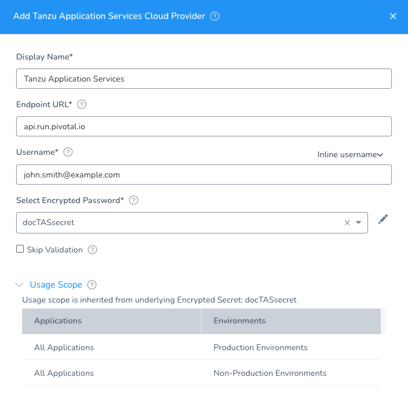

Connect the Tanzu Application Service (TAS, formerly PCF) cloud provider where you will deploy your services using Harness.

You add cloud providers to your Harness Account and then reference them when defining deployment environments.

In this topic:

* [Before You Begin](#before-you-begin)
* [Visual Summary](#visual-summary)
* [Review: TAS Permissions](#review-tas-permissions)
* [Step 1: Add the Cloud Provider](#step-1-add-the-cloud-provider)
* [Step 2: Endpoint URL](#step-2-endpoint-url)
* [Step 3: Username and Password](#step-3-username-and-password)
* [Step 4: Skip Validation](#step-4-skip-validation)
* [Step 5: Usage Scope](#step-5-usage-scope)
* [Artifact Support for Download and Copy](#artifact-support-for-download-and-copy)

## Before You Begin

* See [Harness Key Concepts](../../../starthere-firstgen/harness-key-concepts.md).

## Visual Summary

Here's an example configuration of TAS as Cloud Provider in Harness.

## Review: TAS Permissions

TAS user account with Admin, Org Manager, or Space Manager role. The user account must be able to update spaces, orgs, and applications.

For more information, see [Orgs, Spaces, Roles, and Permissions](https://docs.pivotal.io/pivotalcf/2-3/concepts/roles.html) from Tanzu.

## Step 1: Add the Cloud Provider

To add a cloud provider to your Harness account, do the following:

1. Click **Setup**, and then click **Cloud Providers**.
2. Click **Add Cloud Provider** and select **Tanzu Application Service**.

The **Add Tanzu Application Service Cloud Provider** panel appears.

## Step 2: Endpoint URL

Enter the API endpoint URL, without URL scheme. For example, **api.run.pivotal.io**. Omit **http://**.For more information, see [Identifying the API Endpoint for your PAS Instance](https://docs.pivotal.io/pivotalcf/2-3/opsguide/api-endpoint.html) from TAS.

## Step 3: Username and Password

Username and password for the TAS account to use for this connection.

You can use an inline username or a Harness [Encrypted Text secret](../../security/secrets-management/use-encrypted-text-secrets.md).

For the password, select or create a new Harness Encrypted Text secret.

## Step 4: Skip Validation

If you do not have a specific Endpoint URL or credentials set up, you can skip validation and add the Cloud Provider as is.

:::note
Enable this option during *creation* of the Cloud Provider only.
:::

Later, when you create an Infrastructure Definition as part of your Harness setup, Harness will need to validate. Return to this Cloud Provider and disable **Skip Validation**.

## Step 5: Usage Scope

Usage scope is inherited from the secret you selected for **Select Encrypted Password**.

## Artifact Support for Download and Copy

See [Service Types and Artifact Sources](../../../continuous-delivery/model-cd-pipeline/setup-services/service-types-and-artifact-sources.md).

