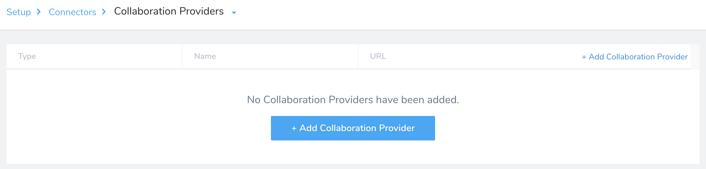
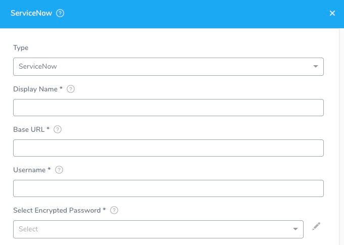

```mdx-code-block
import image_1 from './static/add-service-now-collaboration-provider-26.png'
```

You can use ServiceNow tickets to track/audit the progress of Harness deployments (and Pipelines), and to approve or reject Pipeline stages or Workflows.

Harness creates and polls tickets using ServiceNow's REST API.


## Before You Begin

* [Add Collaboration Providers](collaboration-providers.md)


## Limitations

Your ServiceNow account should ideally have the `admin` role. If this is not possible, it should have at least the `itil_admin`, `itil`, and `personalize_choices` roles to create and modify tickets.

Your account should also have the `import_admin` or `import_transformer` role to manage import set transform maps. For details, see ServiceNow's [Base System Roles](https://docs.servicenow.com/bundle/newyork-platform-administration/page/administer/roles/reference/r_BaseSystemRoles.html) documentation.


## Step 1: Add Collaboration Provider

Start adding a Collaboration Provider to Harness as follows:

1. Click **Setup**.
2. Click **Connectors**.
3. Click **Collaboration Providers**.

4. Click **Add Collaboration Provider**. This opens the default Collaboration Provider settings, which you will configure in the following steps.

```mdx-code-block

```

## Step 2: Type

Set the **Type** drop-down to **ServiceNow**. The settings now display ServiceNow-specific fields.



## Step 3: Display Name

In **Display Name**, enter a unique name to identify this ServiceNow account connection. When you add ServiceNow steps to Workflows or Pipelines, you will select the appropriate ServiceNow account using this name.


## Step 4: Base URL

In **Base URL**, enter the base URL by which your users access your ServiceNow applications. For example: `https://example.service-now.com/`.


## Step 5: Username

In **Username**, enter the username of the ServiceNow account to use for the connection.


## Step 6: Password

In **Select Encrypted Password**, select or create a new [Harness Encrypted Text secret](../../security/secrets-management/use-encrypted-text-secrets.md).


## Step 7: Delegate Selector

Select the Delegate Selector(s) of the Delegate(s) you want this Connector to use.

When Harness needs to run a task, it makes a connection to a resource via its Delegates. Harness selects the best Delegate according to its history or it round-robins between Delegates. See [How Does Harness Manager Pick Delegates?](../manage-delegates/delegate-installation.md#how-does-harness-manager-pick-delegates).

In a few cases, you might want Harness to select specific Delegates. In these cases, you can use Delegate Selectors.

See [Select Delegates with Selectors](../manage-delegates/select-delegates-for-specific-tasks-with-selectors.md).

## Step 8: Skip Validation

Select **Skip Validation** to skip credential verification and creation or update process.

## Step 9: Usage Scope

Usage Scope is determined by the secret you used in **Select Encrypted Password**.


## Step 10: Test and Save

1. Click **Test** to check your configuration.
2. When the test is successful, click **Submit** to save your ServiceNow Collaboration Provider.


## Next Steps

* To use your ServiceNow Collaboration Provider in Workflows and Pipelines, see [ServiceNow Integration](../../../continuous-delivery/model-cd-pipeline/workflows/service-now-integration.md).

