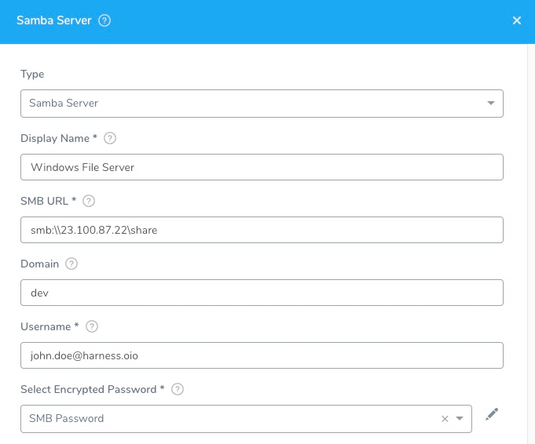

```mdx-code-block
import image_1 from './static/add-smb-artifact-servers-05.png'
```
You can share files and folders on your network and use them for an SMB Artifact Server connection.

In this topic:

* [Before You Begin](#before-you-begin)
* [Visual Summary](#visual-summary)
* [Step 1: Select Samba Server](#step-1-select-samba-server)
* [Step 2: Display Name](#step-2-display-name)
* [Step 3: SMB URL](#step-3-smb-url)
* [Step 4: Domain](#step-4-domain)
* [Step 5: Username and Password](#step-5-username-and-password)
* [Review: Adding Samba Server to a Service](#review-adding-samba-server-to-a-service)

## Before You Begin

* See [Harness Key Concepts](../../../starthere-firstgen/harness-key-concepts.md).

## Visual Summary

Here's an example configuration of Samba Server Artifact Source.



The SMB dialog has the following fields.

## Step 1: Select Samba Server

To connect to an artifact server, do the following:

1. Click **Setup**.
2. Click **Connectors**.
3. Click **Artifact Servers**.
4. Click **Add Artifact Server**.
5. In **Type**, click **Samba Server**.

## Step 2: Display Name

Enter a name for the Samba Server. This is the name you will use to identify this connection when adding the Artifact Source to a Harness Service.

## Step 3: SMB URL

Enter a value that contains the `smb:\\` scheme followed by the hostname or IP address and folder name. For example, `smb:\\23.100.87.22\share`.

If you want to specify a folder in the URL, you can enter the folder using the `\myFolder` format, such as `smb:\\23.100.87.22\myFolder`. Typically, you will specify the folder when you use the SMB Artifact Server as an Artifact Source for a Service.

## Step 4: Domain

Enter the Windows domain where the host containing the shared folder is located.

## Step 5: Username and Password

Use a user account that has permissions to access the shared folder.

For secrets and other sensitive settings, select or create a new [Harness Encrypted Text secret](../../security/secrets-management/use-encrypted-text-secrets.md).

Usage Scope is determined by the secret you selected.

Click **Submit**.

## Review: Adding Samba Server to a Service

When you use the SMB Artifact Server as an Artifact Source for a Service, you can specify a file or a folder for the artifact. This allows a folder to be copied to the deployment target host by the Harness Delegate. Here is the SMB Artifact Source dialog:

```mdx-code-block

```

In **Artifact Path**, you can specify a file or folder by name or using wildcards. The following are examples for matching different files and folders:

* todo-\*zip - All matching files, such todo-1.0.zip, todo-2.0.zip.
* test/\*zip - All zip files under **test** folder.
* test/1\* - All folders under **test** folder starting with 1.
* test/\* - All folders under **test** folder.

