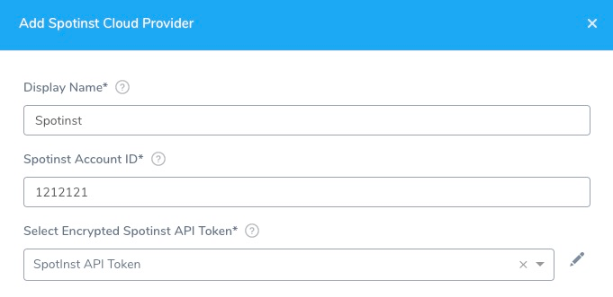

Connect the SpotInst cloud provider where you will deploy your services using Harness.

You add cloud providers to your Harness Account and then reference them when defining deployment environments.

In this topic:

* [Before You Begin](#before_you_begin)
* [Visual Summary](#visual_summary)
* [Step 1: Add the Cloud Provider](#step_1_add_the_cloud_provider)
* [Step 2: Display Name](#step_2_display_name)
* [Step 3: Spotinst Account ID](#step_3_spotinst_account_id)
* [Step 4: Select Encrypted Spotinst API Token](#step_4_select_encrypted_spotinst_api_token)
* [Step 5: Test and Submit](#step_5_test_and_submit)

### Before You Begin

* See [Harness Key Concepts](https://docs.harness.io/article/4o7oqwih6h-harness-key-concepts).

### Visual Summary

Here's an overview of the settings required to add a SpotInst Cloud Provider.

### Step 1: Add the Cloud Provider

To add a cloud provider to your Harness account, do the following:

1. Click **Setup**, and then click **Cloud Providers**.
2. Click **Add Cloud Provider** and select **SpotInst**.

The **Add Spotinst Cloud Provider** panel appears.

### Step 2: Display Name

Enter a unique **Display Name**. You will use this name to select the Spotinst Cloud Provider when you create the Infrastructure Definition.

### Step 3: Spotinst Account ID

From the Spotinst Console's **ACCOUNT** tab, copy/paste your **Spotinst Account ID** into the Harness Cloud Provider dialog. (Harness will store the ID in cleartext.)

### Step 4: Select Encrypted Spotinst API Token

1. Log into the **Spotinst Console**, generate an API Token, and copy it to your clipboard. Keep the Spotinst Console open.For details, see Spotinst's [Create an API Token](https://docs.spot.io/administration/api/create-api-token?id=create-an-api-token) documentation.
2. In the Harness Cloud Provider, in , click **Create Encrypted Text**, and then paste the token into **Select Encrypted Spotinst API Token**.

### Step 5: Test and Submit

1. Click **Test** to ensure that your credentials work.
2. Click **Submit** to add the Cloud Provider.

