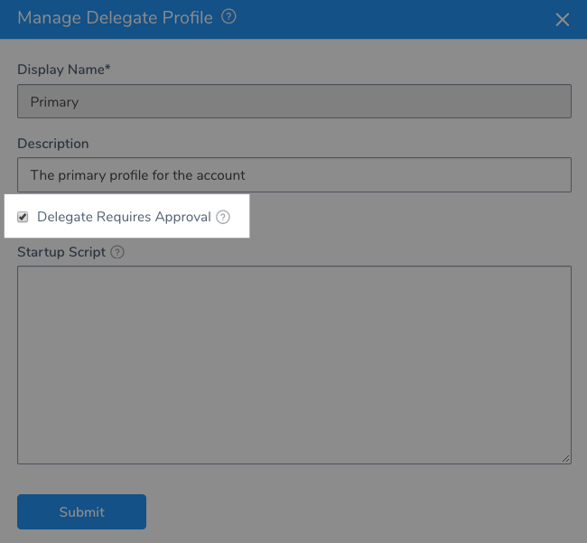
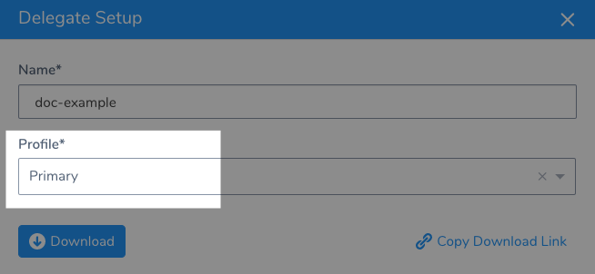
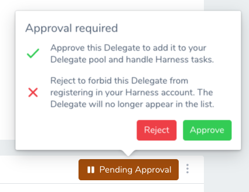
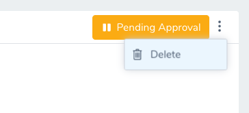

Harness users should limit the Delegates registered in their Harness accounts to only those Delegates they need and trust. Controlling which Delegates are installed helps make your deployments safer, predictable, and dependable.

You can use the Delegate Profile Approval feature to approve or reject Delegates attempting to register in your Harness Account.

In addition to administration benefits, Delegate Profile Approval is a security feature that ensures only Delegates from trusted sources register in your account. In this topic:

* [Before You Begin](#before-you-begin)
* [Step 1: Create a Delegate Profile](#step-1-create-a-delegate-profile)
* [Step 2: Enforce Profile Approval](#step-2-enforce-profile-approval)
* [Step 3: Download a Delegate](#step-3-download-a-delegate)
* [Step 4: Approve or Reject Delegate](#step-4-approve-or-reject-delegate)
* [Step 5: Stop and Delete the Delegate](#step-5-stop-and-delete-the-delegate)
* [Notes](#notes)

## Before You Begin

* [Harness Key Concepts](../../../starthere-firstgen/harness-key-concepts.md)
* [Harness Delegate Overview](delegate-installation.md)
* [Run Scripts on Delegates using Profiles](run-scripts-on-the-delegate-using-profiles.md)

## Step 1: Create a Delegate Profile

1. In Harness, click **Setup**, and then click **Harness Delegates**. The Harness Delegates page appears, listing your registered Delegates.
2. Click **Delegate Profiles**, and then click **Add Delegate Profiles**.
3. Enter a name for the Delegate Profile.

If the purpose of this Profile is to simply approve/reject Delegate registrations, you don't need to enter a script in **Startup Script**.

If this Profile will also run a script on Delegates, add the script in **Startup Script**.

Harness includes the default Profile named **Primary**. This can be a useful Profile for approving/rejecting Delegate registrations.

## Step 2: Enforce Profile Approval

To enforce Profile approval, and use this Profile for approving/rejecting Delegate registrations, select the **Delegate Requires Approval** setting.

Click **Submit**.

### Delegate Registrations Only

The **Delegate Requires Approval** setting only applies to Delegates attempting to register with your Harness account. If you enable **Delegate Requires Approval** on a Profile and then apply that Profile to a registered Delegate, it has no effect.

## Step 3: Download a Delegate

1. Click **Download Delegate**, and then click a Delegate type. The **Delegate Setup** settings appear.
2. Enter a name for the Delegate.
3. In **Profile**, select the Profile in which you enabled **Delegate Requires Approval**.  
  
    You can select any Profile with **Delegate Requires Approval** enabled. If there is a Profile created for approving/rejecting Delegate registrations only, select that Profile.

    

4. Install and start the Delegate in your infrastructure as described in [Delegate Installation and Management](delegate-installation.md).

It will take a few minutes for the Delegate registration attempt to appear in your **Harness Delegates** page.

## Step 4: Approve or Reject Delegate

When the Delegate registration attempt appears in your **Harness Delegates** page, a **Pending Approval** button appears.

  

1. Click **Pending Approval**. The **Approve** and **Reject** buttons appear.

  

2. Click **Approve** or **Reject**.

When you approve, Harness indicates that the Delegate is activated.

When you reject, the Delegate listing is removed and the Delegate is not registered with Harness.

**Be very careful rejecting a Delegate.** If you accidentally reject a Delegate, you must download and install a new Delegate.The Delegate is still running in your infrastructure, but Harness will not use it.

## Step 5: Stop and Delete the Delegate

Stop the Delegate running in your infrastructure, and then delete its files.

There are different ways to stop a Delegate. For a Shell Script Delegate, you can use the **stop.sh** script.

For the Delegates running in container or orchestration platforms, you need to remove the container or object.

### Deleting a Kubernetes Delegate

To delete a Harness Delegate from your Kubernetes cluster, you can delete the StatefulSet for the Delegate.

Once created, the StatefulSet ensures that the desired number of pods are running and available at all times. Deleting the pod without deleting the StatefulSet will result in the pod being recreated.

For example, if you have the Delegate pod name `mydelegate-vutpmk-0`, you can delete the StatefulSet with the following command:

`$ kubectl delete statefulset -n harness-delegate mydelegate-vutpmk`

Note that the `-0` suffix in the pod name is removed for the StatefulSet name.

## Notes

You can also Delete a Delegate after it is registered or when it is pending approval.

This simply deletes the Delegate from the **Harness Delegates** page list. You still need to delete it from your infrastructure.

## See Also

* [Run Scripts on Delegates using Profiles](run-scripts-on-the-delegate-using-profiles.md)
* [Use Secrets in a Delegate Profile](use-a-secret-in-a-delegate-profile.md)

