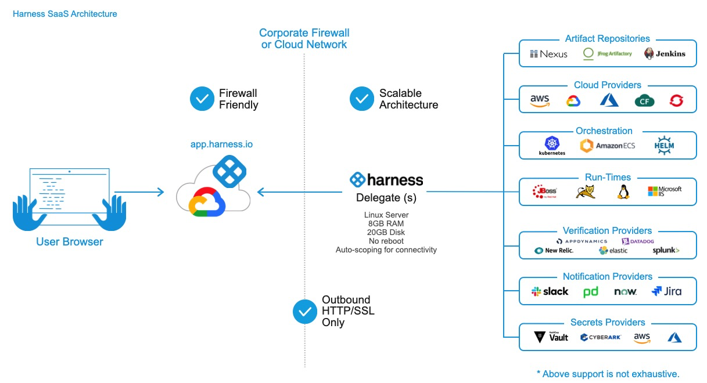

This content is for Harness [FirstGen](../../../../getting-started/harness-first-gen-vs-harness-next-gen.md). Switch to [NextGen](../../../../platform/2_Delegates/delegate-reference/delegate-requirements-and-limitations.md).This topic lists the limitations and requirements of the Harness Delegate.

For all the topics related to the Harness Delegate, see [Manage Harness Delegates](https://docs.harness.io/category/manage-harness-delegates-firstgen).

### Delegate Limitations

* **Deployment limits:** Deployment limits are set by account type**.** See [Harness Products and Editions](https://docs.harness.io/article/y1t8hhz4y5-harness-editions).
* You might need to install multiple Delegates depending on how many Continuous Delivery tasks you do concurrently, and on the compute resources you are providing to each Delegate. Typically, you will need one Delegate for every 300-500 service instances across your applications.

### System Requirements

The Delegate is installed in your network and connects to the Harness Manager.

* Linux/UNIX server or container.
* ​Minimum 1 CPU.
* Minimum 8GB RAM — There is a cap of 4GB per Delegate, but when the Delegate is updating there might be two Delegates running. Hence, the minimum is 8GB.  
Ensure that you provide the minimum memory for the Delegate and enough memory for the host/node system. For example, an AWS EC2 instance type such as m5a.xlarge has 16GB of RAM, 8 for the Delegate and 8 for the remaining operations.If you using the Harness Kubernetes Delegate with Harness Community Edition and using a small server, you can adjust the Kubernetes Delegate YAML setting `memory: "8Gi"` to something smaller.
* Minimum 6GB Disk space.
* [Shell Script Delegate](install-shellscript-delegate.md) requires cURL 7.64.1 or later.
* Access to artifact servers, deployment environments, and cloud providers. As shown in the following illustration:

Multiple Delegates can be used and their scope can be managed.

### Whitelist Harness Domains and IPs

Harness SaaS Delegates only need outbound access to the Harness domain name (most commonly, **app.harness.io)** and, optionally, to **logging.googleapis.com**. The URL logging.googleapis.com is used to provide logs to Harness support.

See [Whitelist Harness Domains and IPs](../delegate-ref/whitelist-harness-domains-and-ips.md).

### Network Requirements

The following network requirements are for connectivity between the Harness Delegate you run in your network and the **Harness Manager** (SaaS or On-Prem), and for your browser connection to the Harness Manager.

All network connections from your local network to Harness SaaS are outbound-only.* HTTPS port 443 outbound from the Delegate to Harness.
* HTTP/2 for gRPC (gRPC Remote Procedure Calls)
* Delegate requirements: The Delegate will need API/SSH/HTTP access to the providers you add to Harness, such as:
	+ Cloud Providers.
	+ Verification Providers.
	+ Artifact Servers (repos).
	+ Source repositories.
	+ Collaboration Providers.
	+ SSH access to target physical and virtual servers.

For more information, see [Supported Platforms and Technologies](https://docs.harness.io/article/220d0ojx5y-supported-platforms).

#### gRPC Limitations

If you do not enable gRPC connections, the following limitations apply:

* [Cloud Cost Management](https://docs.harness.io/article/rr85306lq8-continuous-efficiency-overview) will not collect events.
* If the `ARTIFACT_PERPETUAL_TASK` feature flag is enabled in your account, Harness performs perpetual artifact collection. If you do not enable gRPC connections, this will not work.

Contact [Harness Support](mailto:support@harness.io) to enable or disable feature flags.

### Permissions and Ports

See [Permissions and Ports for Harness Connections](../delegate-ref/connectivity-and-permissions-requirements.md).

### Add Certificates and Other Software to Delegate

For steps on adding certs or other software to the Delegate, see [Common Delegate Profile Scripts](../delegate-ref/common-delegate-profile-scripts.md).

### Delegate Access Requirements

* The Harness Delegate does NOT require root account access, but the Kubernetes, ECS, and Docker Delegates run as root by default. This is to enable the Delegate to install applications using Delegate Profiles (apt-get, etc). If you do not need to install applications using Delegate Profiles, then you can use a non-root account or install the application without the Delegate.
* If you do not run the Delegate as root, be aware that you cannot install any software using a Delegate Profile.

