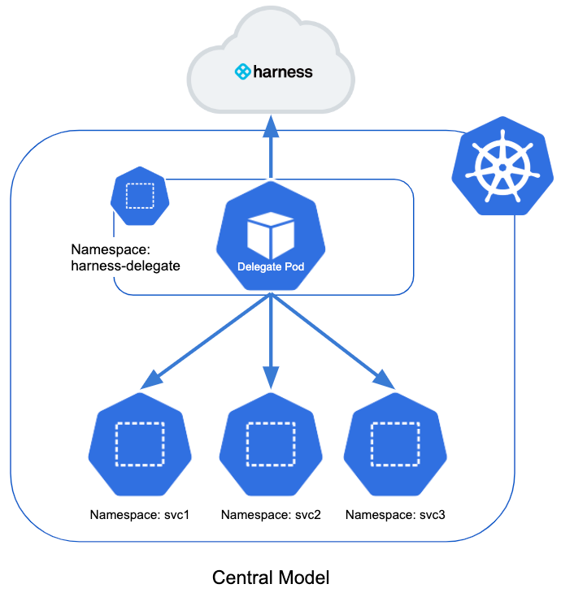
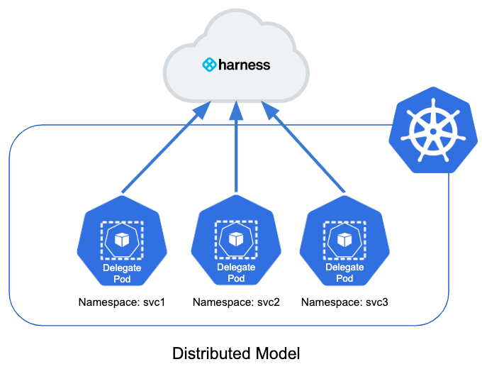
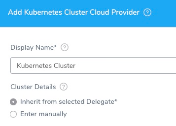
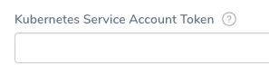

By default, Harness Delegates deploy to all namespaces in a Kubernetes cluster. This topic describes how to configure Delegates to deploy into specific namespaces.

In this topic:

* [Before You Begin](#before-you-begin)
* [Visual Summary](#visual-summary)
* [Review: Harness Connections to Kubernetes](#review-harness-connections-to-kubernetes)
	+ [Inherit from selected Delegate](#inherit-from-selected-delegate)
	+ [Enter Manually](#enter-manually)
* [Step 1: Create Service Account](#step-1-create-service-account)
* [Step 2: Create Role and RoleBinding](#step-2-create-role-and-role-binding)
* [Option 1: Use the Service Account Token](#option-1-use-the-service-account-token)
* [Option 2: Add Service Account to Delegate Spec](#option-2-add-service-account-to-delegate-spec)
* [Review: Enable Skip Validation in Kubernetes Cluster Cloud Provider](#review-enable-skip-validation-in-kubernetescluster-cloud-provider)
* [Notes](#notes)
* [Next Steps](#next-steps)

## Before You Begin

* [Harness Delegate Overview](delegate-installation.md)
* [Install the Harness Kubernetes Delegate](install-kubernetes-delegate.md)

## Visual Summary

Let's take a quick look at the two ways the Delegate can deploy to namespaces in a cluster.

### Central Model

By default, the Delegate resides in a namespace in the target cluster with a service account attached to it. The service account uses a ClusterRole for permission to deploy to all namespaces in the cluster.

The is called this the central model. Here is a simple illustration of the central model:



The central model is simple and efficient, but it does not let you restrict teams to deploying into specific namespaces. Any team member can deploy to any namespace.

As an alternative, you can use a distributed model.

### Distributed Model

This model places a Delegate in each namespace in the cluster. It limits each Delegate to deploying into its own namespace.

Here is the illustration of the distributed model:



In this model, each team uses their own Delegate for their deployments into their own namespace.

The distributed model is more complex, but it prevents a team member from deploying into the wrong namespace.

## Review: Harness Connections to Kubernetes

First, we'll review how Harness connects to the target Kubernetes cluster using the Delegate.

For the Delegate to perform operations on a target Kubernetes cluster, it requires one of the following:

* A service account. The default service account created by the Kubernetes and Helm Delegates uses the Kubernetes **cluster-admin** role.
* Service account token.
* Username and password.
* CA certificate, client certificate, and client key.

For this topic, we will focus on the service account.

The Harness Kubernetes and Helm Delegates are designed to create the Kubernetes resources they need when you install them. This includes the namespace, service account, and a ClusterRole that enables the Delegate to deploy to any namespaces in the cluster.


```
apiVersion: rbac.authorization.k8s.io/v1beta1  
kind: ClusterRoleBinding  
metadata:  
  name: harness-delegate-cluster-admin  
subjects:  
  - kind: ServiceAccount  
    name: default  
    namespace: harness-delegate  
roleRef:  
  kind: ClusterRole  
  name: cluster-admin  
  apiGroup: rbac.authorization.k8s.io
```
This ClusterRoleBinding binds the service account with the **cluster-admin** ClusterRole. The cluster-admin ClusterRole exists by default in your Kubernetes cluster, and allows superuser operations in all of the cluster resources.

:::note 
For other type of Delegates (Shell Script, Docker, ECS), you need to create the Kubernetes resources yourself and then use the service account when setting up the Harness Kubernetes Cluster Cloud Provider.Once a Delegate is installed and running, you can add a Harness Kubernetes Cluster Could Provider to connect to the target cluster.
:::

There are two ways for the Kubernetes Cluster Could Provider to get credentials:

* Inherit from selected Delegate
* Enter manually



Both methods can use the service account to provide either the central or distributed models.

### Inherit from selected Delegate

**Supported Delegate types:** Kubernetes and Helm Delegate.

In this option, the Cloud Provider inherits the service account created when you installed the Delegate.

### Enter Manually

**Supported Delegate types:** Shell Script, Docker, ECS, Kubernetes, Helm.

In this option, the Cloud Provider uses the credentials that you enter manually. The Delegate uses these credentials to send deployment tasks to the cluster.

The Delegate can be outside or within the target cluster. 

Some examples:

* Shell Script Delegate on a VM.
* Docker Image Delegate outside of the target cluster.
* Kubernetes Delegate in a pod outside of the target cluster.

:::note
Providing the **Master URL** is mandatory. This is the Kubernetes master node URL.
:::

The remaining steps in this topic explain how to create the Kubernetes resources needed for the service account used by the Delegates in the distributed model.


## Step 1: Create Service Account

To restrict the Delegate to deploy to a specific namespace, first you create the namespace, if it isn't already created.


```
apiVersion: v1  
kind: Namespace  
metadata:  
  name: mynamespace
```
Next you create the service account in that namespace for the Delegate.


```
apiVersion: v1  
kind: ServiceAccount  
metadata:  
  name: mynamespace-delegate-sa  
  namespace: mynamespace
```
## Step 2: Create Role and RoleBinding

By default, the Delegate can deploy to all namespaces. Its service account uses the cluster-admin ClusterRole. This method enables the central model.

In the distributed model, you restrict the Delegate to a specific namespace by using the following:

* A Role in the namespace that grants access to items in that namespace only.
* A RoleBinding in the namespace. It binds the Role in that namespace to the service account you created.


```
kind: Role  
apiVersion: rbac.authorization.k8s.io/v1beta1  
metadata:  
  name: default-full-access  
  namespace: mynamespace  
rules:  
- apiGroups: ["", "extensions", "apps", "autoscaling", "rbac.authorization.k8s.io", "roles.rbac.authorization.k8s.io"]  
  resources: ["*"]  
  verbs: ["*"]  
- apiGroups: ["batch"]  
  resources:  
  - jobs  
  - cronjobs  
  verbs: ["*"]  
   
---  
kind: RoleBinding  
apiVersion: rbac.authorization.k8s.io/v1beta1  
metadata:  
  name: default-view  
  namespace: mynamespace  
subjects:  
- kind: ServiceAccount  
  name: mynamespace-delegate-sa  
  namespace: mynamespace  
roleRef:  
  apiGroup: rbac.authorization.k8s.io  
  kind: Role  
  name: default-full-access
```
The service account is bound to a Role that limits it to the namespace.

Now you have two options:

* **Option 1:** Install a Delegate outside of the namespace and simply enter the service account token in the Kubernetes Cluster Cloud Provider.
* **Option 2:** Install a Kubernetes or Helm Delegate in the namespace using the service account. You simply reference the service account in the Delegate spec. You can then have the Kubernetes Cluster Cloud Provider inherit credentials from the Delegate.

### Resources and Verbs

If you don't want to use `resources: ["*"]` for the role you can list out the resources you want to grant. Harness needs `configMap`, `secret`, `event`, `deployment`, and `pod` at a minimum. Beyond that, it depends on the resources you are deploying via Harness.

If you don't want to use `verbs: ["*"]` for the role you can list out the verbs you want to grant (create, delete, get, list, patch, update, watch).

## Option 1: Use the Service Account Token

If you are using the **Enter Cluster Details manually** option in the Kubernetes Cloud Provider, use the service account in the **Service Account Token** setting.

The following shell script is a quick method for obtaining the service account token. Run this script wherever you run kubectl to access the cluster.

Set the `SERVICE_ACCOUNT_NAME` and `NAMESPACE` values to the values in your infrastructure:


```
SERVICE_ACCOUNT_NAME=default  
NAMESPACE=mynamespace  
SECRET_NAME=$(kubectl get sa "${SERVICE_ACCOUNT_NAME}" --namespace "${NAMESPACE}" -o json | jq -r '.secrets[].name')  
TOKEN=$(kubectl get secret "${SECRET_NAME}" --namespace "${NAMESPACE}" -o json | jq -r '.data["token"]' | base64 -d)  
echo $TOKEN
```
Next, enter the service account token in the Kubernetes Cluster Cloud Provider:




## Option 2: Add Service Account to Delegate Spec

In you are using the **Inherit from selected Delegate** option in the Kubernetes Cloud Provider, add the service account to the Delegate YAML. See `serviceAccountName: mynamespace-delegate-sa` below:


```
---  
apiVersion: apps/v1  
kind: StatefulSet  
metadata:  
  labels:  
    harness.io/app: harness-delegate  
    harness.io/account: wsxvws  
    harness.io/name: demo-delegate  
  # Name must contain the six letter account identifier: wsxvws  
  name: demo-delegate-wsxvws  
  namespace: harness-delegate  
spec:  
 **serviceAccountName: mynamespace-delegate-sa**  
  replicas: 1  
...
```
When you download the Kubernetes Delegate YAML from Harness, you get the harness-delegate-kubernetes.tar.gz file. Once you extract the file, you get the harness-delegate.yaml file.

By default, the harness-delegate.yaml uses a role with the `default` service account and `harness-delegate` namespace.

As discussed above, to restrict the Delegate to a single namespace, you will create a namespace, service account, Role, and RoleBinding, and then reference the service account in the Delegate spec.

Edit the harness-delegate.yaml file to create these new resources.

Here is an example of the Kubernetes Delegate YAML that creates all the necessary resources:

<details>
  <summary>Kubernetes Delegate YAML Sample</summary>

```
  

apiVersion: v1  

kind: Namespace  

metadata:  

  name: mynamespace  

  

---  

apiVersion: v1  

kind: ServiceAccount  

metadata:  

  name: mynamespace-delegate-sa  

  namespace: mynamespace  

  

---  

kind: Role  

apiVersion: rbac.authorization.k8s.io/v1beta1  

metadata:  

  name: default-full-access  

  namespace: mynamespace  

rules:  

- apiGroups: ["", "extensions", "apps", "autoscaling", "rbac.authorization.k8s.io", "roles.rbac.authorization.k8s.io"]  

  resources: ["*"]  

  verbs: ["*"]  

- apiGroups: ["batch"]  

  resources:  

  - jobs  

  - cronjobs  

  verbs: ["*"]  

   

---  

kind: RoleBinding  

apiVersion: rbac.authorization.k8s.io/v1beta1  

metadata:  

  name: default-view  

  namespace: mynamespace  

subjects:  

- kind: ServiceAccount  

  name: mynamespace-delegate-sa  

  namespace: mynamespace  

roleRef:  

  apiGroup: rbac.authorization.k8s.io  

  kind: Role  

  name: default-full-access  

    

---  

apiVersion: v1  

kind: Secret  

metadata:  

  name: demo-delegate-proxy  

  namespace: mynamespace  

  kubernetes.io/service-account.name: mynamespace-delegate-sa  

type: Opaque  

data:  

  # Enter base64 encoded username and password, if needed  

  PROXY_USER: ""  

  PROXY_PASSWORD: ""  

  

---  

apiVersion: apps/v1  

kind: StatefulSet  

metadata:  

  labels:  

    harness.io/app: harness-delegate  

    harness.io/account: wsxvws  

    harness.io/name: demo-delegate  

  # Name must contain the six letter account identifier: wsxvws  

  name: demo-delegate-wsxvws  

  namespace: harness-delegate  

spec:  

  serviceAccountName: mynamespace-delegate-sa  

  replicas: 1  

  selector:  

    matchLabels:  

      harness.io/app: harness-delegate  

      harness.io/account: wsxvws  

      harness.io/name: demo-delegate  

  serviceName: ""  

  template:  

    metadata:  

      labels:  

        harness.io/app: harness-delegate  

        harness.io/account: wsxvws  

        harness.io/name: demo-delegate  

    spec:  

      containers:  

      - image: harness/delegate:latest  

        imagePullPolicy: Always  

        name: harness-delegate-instance  

        resources:  

          limits:  

            cpu: "1"  

            memory: "8Gi"  

        readinessProbe:  

          exec:  

            command:  

              - test  

              - -s  

              - delegate.log  

          initialDelaySeconds: 20  

          periodSeconds: 10  

        livenessProbe:  

          exec:  

            command:  

              - bash  

              - -c  

              - '[[ -e /opt/harness-delegate/msg/data/watcher-data && $(($(date +%s000) - $(grep heartbeat /opt/harness-delegate/msg/data/watcher-data | cut -d ":" -f 2 | cut -d "," -f 1))) -lt 300000 ]]'  

          initialDelaySeconds: 240  

          periodSeconds: 10  

          failureThreshold: 2  

        env:  

        - name: ACCOUNT_ID  

          value: wsxvws  

        - name: DELEGATE_TOKEN  

          value: 123abc  

        - name: MANAGER_HOST_AND_PORT  

          value: https://qa.harness.io  

        - name: WATCHER_STORAGE_URL  

          value: https://qa.harness.io/storage/wingswatchers  

        - name: WATCHER_CHECK_LOCATION  

          value: watcherqa.txt  

        - name: DELEGATE_STORAGE_URL  

          value: https://qa.harness.io/storage/wingsdelegates  

        - name: DELEGATE_CHECK_LOCATION  

          value: delegateqa.txt  

        - name: DEPLOY_MODE  

          value: KUBERNETES  

        - name: DELEGATE_NAME  

          value: demo-delegate  

        - name: DELEGATE_PROFILE  

          value: ""  

        - name: MANAGER_TARGET  

          value: "qa.harness.io"  

        - name: MANAGER_AUTHORITY  

          value: "manager-grpc-qa.harness.io"  

        - name: PROXY_HOST  

          value: ""  

        - name: PROXY_PORT  

          value: ""  

        - name: PROXY_SCHEME  

          value: ""  

        - name: NO_PROXY  

          value: ""  

        - name: PROXY_MANAGER  

          value: "true"  

        - name: PROXY_USER  

          valueFrom:  

            secretKeyRef:  

              name: demo-delegate-proxy  

              key: PROXY_USER  

        - name: PROXY_PASSWORD  

          valueFrom:  

            secretKeyRef:  

              name: demo-delegate-proxy  

              key: PROXY_PASSWORD  

        - name: POLL_FOR_TASKS  

          value: "false"  

        - name: HELM_DESIRED_VERSION  

          value: ""  

        - name: CF_PLUGIN_HOME  

          value: ""  

      restartPolicy: Always  

  


```
</details>

Next, connect to your cluster and run the kubectl command to install the Delegate:

`kubectl apply -f harness-delegate.yaml`

For Helm Delegate, you download the Delegate file harness-delegate-values.yaml. It includes instructions for adding the Harness Helm repo and


```
helm repo add harness https://app.harness.io/storage/harness-download/harness-helm-charts/
```
Next, you fetch the Delegate file:


```
helm fetch harness/harness-delegate
```
This results in the file harness-delegate-1.0.0.tgz. Extract it to see the YAML files.

In the **harness-delegate** folder you will see the **values.yaml** file where you specify the namespace for the Delegate to use.


```
namespace: harness-delegate
```
Simply replace the namespace with the new namespace:


```
namespace: mynamespace
```
In the **harness-delegate/templates** folder you will see the default YAML files that use values.yaml.

Modify these files in the same way that you modified the Kubernetes Delegate YAML. Use placeholder `{{ .Values.namespace }}` for to reference the new namespace in values.yaml.

You will delete **cluster-rolebinding.yaml**. and replace it a new file(s) for the service account, Role, and RoleBinding.

For details on installing the Helm Delegate, see [Install the Harness Helm Delegate](using-the-helm-delegate.md).

## Review: Enable Skip Validation in Kubernetes Cluster Cloud Provider

By default, Harness uses the default namespace to validate credentials the first time you set up a Kubernetes Cluster Cloud Provider.

If you add a Kubernetes Cluster Cloud Provider in Harness with a Service Account that does not have list all namespaces permissions in the cluster, ensure that you enable the **Skip Validation** option.

## Notes

You can also enable a Delegate to deploy to namespaces outside its own. In this model, the Delegate does not have to be in the same namespace as the deployment target.

For this method, do the following:

1. Create a service account for the Delegate in the namespace where you will install the Delegate. Let's call this the `delegate-ns`. We'll call the deployment target namespace `target`.
2. Create the service account in namespace `delegate-ns`.
3. Create a Role in namespace `target`.
4. Create a RoleBinding in namespace `target`, with the following properties:
	1. RoleRef pointing to the Role in the same namespace `target`
	2. Subject pointing to the Delegate service account and namespace: `delegate-ns`.

## Next Steps

* [Add Cloud Providers](../manage-connectors/cloud-providers.md)

