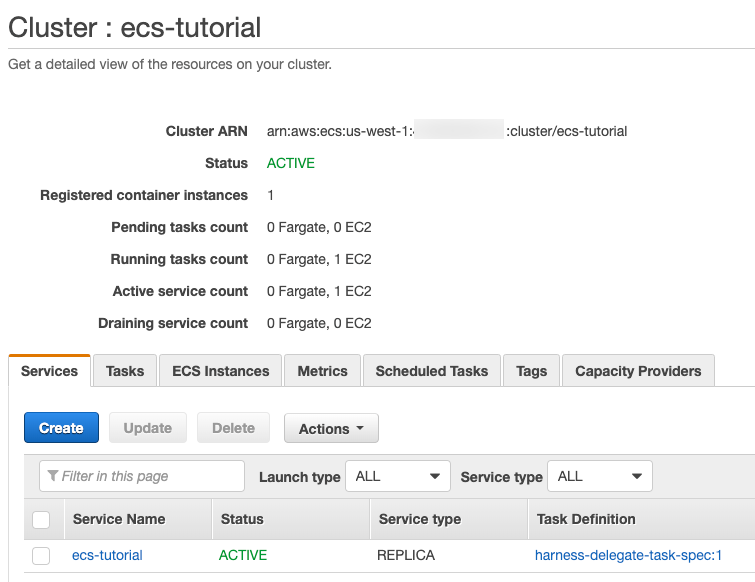

The Harness Delegate is a service you run in your deployment target environment, such as your local network, VPC, or cluster. The Delegate connects all of your artifact, infrastructure, collaboration, verification and other providers with the Harness Manager.

Most importantly, the Delegate performs all deployment operations.

There are several types of Delegates. This topic describes how to install the ECS Delegate.


## Before You Begin

* [Harness Key Concepts](../../../starthere-firstgen/harness-key-concepts.md)
* [Harness Delegate Overview](delegate-installation.md)
* [Delegate Requirements and Limitations](delegate-requirements-and-limitations.md)

## Visual Summary

The following diagram shows how the Delegate enables Harness to integrate with all of your deployment resources:


## Review: ECS Requirements

Ensure that your AWS account and the ECS cluster that will host the Delegate meet the following requirements:

* ​**ecsInstanceRole** — Ensure this role exists. See  [Amazon ECS Instance Role](https://docs.aws.amazon.com/batch/latest/userguide/instance_IAM_role.html) from AWS.
* **ECS Role for Delegate:** The Harness ECS Delegate requires an IAM role and policies to execute its deployment tasks (API calls, etc). Create a new IAM role named **ECSDelegate** that contains: **AmazonEC2ContainerServiceforEC2Role** and **AmazonEC2ContainerServiceRole** from AWS.
	+ **Customer Managed Policy** named **HarnessECS** you create for using Application Auto Scaling.

		<details>

		<summary>Policy JSON</summary>

		```
		{  

		            "Version": "2012-10-17",  

		            "Statement": [  

		              {  

		                "Effect": "Allow",  

		                "Action": [  

		                  "ecr:DescribeRepositories",  

		                  "ecs:ListClusters",  

		                  "ecs:ListServices",  

		                  "ecs:DescribeServices",  

		                  "ecr:ListImages",  

		                  "ecs:RegisterTaskDefinition",  

		                  "ecs:CreateService",  

		                  "ecs:ListTasks",  

		                  "ecs:DescribeTasks",  

		                  "ecs:DeleteService",  

		                  "ecs:UpdateService",  

		                  "ecs:DescribeContainerInstances",  

		                  "ecs:DescribeTaskDefinition",  

		                  "application-autoscaling:DescribeScalableTargets",  

		                  "iam:ListRoles",  

		                  "iam:PassRole"  

		                ],  

		                "Resource": "*"  

		              }  

		            ]  

		          }  

		          
		```
		</details>

		Attach all of these policies to one IAM role, or attach them all to ecsInstanceRole, and apply that to your ECS cluster as the **Container instance IAM role** when you create it.  
		
		Once you have your role set up, you can create your clusters.
		
* **ECS Cluster for Harness Delegate:** You will need an existing ECS cluster to run the Harness ECS Delegate. The cluster for the Harness ECS Delegate must meet the following requirements:
	+ **EC2 Linux + Networking** cluster.
	+ The ECS Cluster must have a minimum of 8GB memory for the Delegate. A **m5.xlarge** minimum is suggested.
	+ 1 registered container instance.
	+ AWS IAM Role containing the required policies, described above. Apply the role you created to this cluster.	


## Review: ECS Task Spec

As you have seen, the Harness ECS Delegate is downloaded as an ECS Task Spec that you can run as an ECS service in your ECS cluster.

:::note
Although it can help simplify deployments, the Harness ECS Delegate service does not need to be installed in the same cluster or VPC as the target ECS cluster (the cluster where Harness will deploy your container and image). The Harness ECS Delegate you use only needs to be able to connect to the target ECS cluster.
:::

Here is an example of a task definition that creates a Harness ECS Delegate as a service in your ECS cluster:

<details>
<summary>Task definition for creating a Hanress ECS Delegate</summary>

```
{  
  "containerDefinitions": [  
    {  
      "portMappings": [  
        {  
          "hostPort": 8080,  
          "protocol": "tcp",  
          "containerPort": 8080  
        }  
      ],  
      "cpu": 1,  
      "environment": [  
        {  
          "name": "ACCOUNT_ID",  
          "value": "xxxx"  
        },  
        {  
          "name": "DELEGATE_TOKEN",  
          "value": "xxxx"  
        },  
        {  
          "name": "DELEGATE_CHECK_LOCATION",  
          "value": "delegateprod.txt"  
        },  
        {  
          "name": "DELEGATE_STORAGE_URL",  
          "value": "https://app.harness.io/storage/wingsdelegates"  
        },  
        {  
          "name": "DELEGATE_TYPE",  
          "value": "ECS"  
        },  
        {  
          "name": "DELEGATE_GROUP_NAME",  
          "value": "example-ecs-delegate"  
        },  
        {  
          "name": "DELEGATE_PROFILE",  
          "value": ""  
        },  
        {  
          "name": "DEPLOY_MODE",  
          "value": "KUBERNETES"  
        },  
        {  
          "name": "MANAGER_HOST_AND_PORT",  
          "value": "https://app.harness.io"  
        },  
        {  
          "name": "POLL_FOR_TASKS",  
          "value": "false"  
        },  
        {  
          "name": "WATCHER_CHECK_LOCATION",  
          "value": "watcherprod.txt"  
        },  
        {  
          "name": "WATCHER_STORAGE_URL",  
          "value": "https://app.harness.io/storage/wingswatchers"  
        }  
      ],  
      "memory": 6144,  
      "image": "harness/delegate:latest",  
      "essential": true,  
      "hostname": "Harness-ECS-Delegate",  
      "name": "ecs-delegate"  
    }  
  ],  
  "memory": "6144",  
  "requiresCompatibilities": [  
    "EC2"  
  ],  
    
  "cpu": "1024",  
  "family": "harness-delegate-task-spec"  
}
```
</details>

The cluster must have a minimum of 8GB of memory (t2.large minimum). Run the above command and the ECS Delegate will install as a service in your cluster. The Delegate will appear in the **Setup** > **Harness Delegates** page in a few minutes.

:::note
If you are using Fargate, follow the steps in the README.
:::

## Step 1: Install and Launch the ECS Delegate

1. Click **Setup**., and then click **Harness Delegates**.
2. In the **Delegate** tab, click **Install Delegate**.
3. In **Download Type**, select **ECS Task Spec**.
4. In **Delegate Group Name**, enter the name for the Delegate group. For more information, see [Delegate Groups](#delegate-groups) below.
5. In **Profile**, select a Delegate Profile. See [Run Scripts on the Delegate using Profiles](run-scripts-on-the-delegate-using-profiles.md).

:::note
A Delegate Profile is mandatory. The **Primary** Profile is the default and contains no script. You can add a script to it, or create and apply new Profiles for your Delegate.
:::

6. If you are installing the Delegate in an ECS cluster, do not select **Use AWS VPC Mode**. **Use AWS VPC Mode** runs the ECS Delegate task with a [FARGATE launch type](https://docs.aws.amazon.com/AmazonECS/latest/developerguide/launch_types.html).

7. You can leave **Hostname** empty. ECS will use the default hostname **Harness-ECS-Delegate**.
8. Click **Download**. The ECS Task Spec is downloaded. Next, you will use the AWS CLI to register the ECS Task Spec and then create the ECS service for the ECS Delegate.

## Step 2: Register the ECS Task Spec in AWS

1. Open a Terminal and navigate to the folder where you downloaded the ECS Task Spec.

	```
	cd /Users/johnsmith/Desktop/delegates/ECS
	```

2. Extract the ECS Task Spec download.

	```
	tar -zxvf harness-delegate-ecs.tar.gz
	```

3. Navigate to the extracted folder: `cd harness-delegate-ecs`.
4. Log into AWS using your AWS Access Key ID and AWS Secret Key ID.

	```
		aws configure  
		  
		AWS Access Key ID [****************LPAA]: XXXXXXX  
		  
		AWS Secret Access Key [****************4z52]: XXXXXXX
	```

5. Register the ECS task definition using the Harness ECS Task Spec.

	```
	aws ecs register-task-definition --cli-input-json file://ecs-task-spec.json
	```
	
  The JSON for the task is output.

6. View the completed task.

	```
		aws ecs list-task-definitions
	```
   The `taskDefinitionArns` is output.

Using the name of the ECS cluster for the Delegate, you will create the ECS service using the Task Definition. The cluster must have a minimum of 8GB of memory (m5ad.xlarge minimum).

## Step 3: Create the ECS Service for ECS Delegate

1. Create the ECS service using the task definition, providing the service name in `--service-name`, cluster name in `--cluster`, and the desired number of tasks in `--desired-count`. The cluster will need a minimum of 8GB of memory per task.  

	```
		aws ecs create-service --service-name ecs-tutorial --task-definition harness-delegate-task-spec --cluster ecs-tutorial --desired-count 1
	```
		
	The output will display the JSON for the new service.  

	```
		{  
		    "service": {  
		        "status": "ACTIVE",   
		        "serviceRegistries": [],   
		        "pendingCount": 0,   
		        "launchType": "EC2",   
		        "schedulingStrategy": "REPLICA",   
		        "loadBalancers": [],   
		        "placementConstraints": [],   
		        "createdAt": 1579134813.18,   
		        "desiredCount": 1,   
		        "serviceName": "ecs-tutorial",   
		...  
		}
	```
2. View the new service.  

		```
		aws ecs list-services --cluster ecs-tutorial
		```
		
	 The output will display the new service:  
		  
		```
		{  
		    "serviceArns": [  
		        "arn:aws:ecs:us-east-1:XXXXX:service/ecs-tutorial"  
		    ]  
		}
		```
3. Wait 5 to 10 minutes for ECS to allocate resources for the service.

  When ECS is ready, the new service is running in the cluster:

  
  
4. View the new ECS Delegate in Harness Manager. In **Harness Manager**, in the **Harness** **Delegates** page. When the ECS Delegate connects to the Harness Manager, it is listed with a status of **Connected**.  

Congratulations! You are done installing and running the ECS Delegate.

## Delegate Groups

ECS Delegates can be grouped to make it easier to manage multiple ECS Delegates.

To group ECS Delegates, you enter a name in the **Delegate Group Name** setting when you create each Delegate. You use the same name for each new Delegate you add.

The Delegate group is displayed in a single expand/collapse (accordion) panel.

All Delegates in this group use the same Task Definition, and share the same Delegate settings, including [Selectors](select-delegates-for-specific-tasks-with-selectors.md), [Profiles](run-scripts-on-the-delegate-using-profiles.md), and [Scopes](scope-delegates-to-harness-components-and-commands.md).

When you change a Selector, Profile, or Scope for a Delegate in the group, the change is applied to all Delegates running under that group.

Individual Delegates that are not grouped are called autonomous and are managed as individual Delegates.

### Delegate Disappear?

When an ECS Delegate is stopped or offline, it will disappear from the Delegate list.

## See Also

* For all the topics related to the Harness Delegate, see [Manage Harness Delegates](/docs/category/manage-harness-delegates-firstgen).
* Delegate are used to provide credentials for some Harness [Cloud Providers](../manage-connectors/cloud-providers.md).

