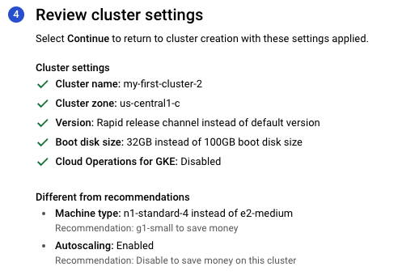
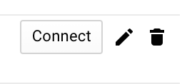
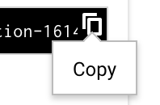

The Harness Delegate is a service you run in your deployment target environment, such as your local network, VPC, or cluster. The Delegate connects all of your artifact, infrastructure, collaboration, verification and other providers with the Harness Manager.

Most importantly, the Delegate performs all deployment operations.

There are several types of Delegates. This topic describes how to install the Kubernetes Delegate.

:::note
If you want to run multiple Delegates on the same or different clusters, see [Automate Harness Kubernetes Delegate Setup](automate-harness-kubernetes-delegate-setup.md).
:::

## Before You Begin

* [Harness Key Concepts](../../../starthere-firstgen/harness-key-concepts.md)
* [Harness Delegate Overview](delegate-installation.md)
* [Delegate Requirements and Limitations](delegate-requirements-and-limitations.md)

## Limitations

Currently, Harness Kubernetes Delegates do not install with the default settings in GKE Auto Pilot Mode. Please use the Manual mode when creating the cluster to make sure it meets the Delegate requirements.

## Visual Summary

The following diagram shows how the Delegate enables Harness to integrate with all of your deployment resources:


## Step 1: Download the Kubernetes Delegate

1. Log into Harness.
2. In the Harness Manager, click **Setup**, and then click **Harness Delegates**.
3. In the **Delegate** tab, click **Install Delegate**.
4. In **Download Type**, select **Kubernetes YAML**.
5. In **Name**, enter a name for your Delegate.
6. In **Profile**, select a Delegate Profile. See [Run Scripts on the Delegate using Profiles](run-scripts-on-the-delegate-using-profiles.md).

:::note
A Delegate Profile is mandatory. The **Primary** Profile is the default and contains no script. You can add a script to it, or create and apply new Profiles for your Delegate.
:::

7. Click **Download** or **Copy Download Link**.


## Step 2: Apply the Delegate Spec

1. Ensure the host where you run the Delegate meets the [Delegate Requirements and Limitations](delegate-requirements-and-limitations.md).
2. Open a terminal and navigate to where the Delegate file is located.
3. If you downloaded the Delegate, extract the YAML file's folder from the download and then navigate to the **harness-delegate-kubernetes** folder that you extracted:

    ```
    tar -zxvf harness-delegate-kubernetes.tar.gz  
      
    cd harness-delegate-kubernetes
    ```
    You will connect to your cluster using the terminal so you can simply copy the YAML file over.

4. Log into your Kubernetes cluster.
5. Let's quickly confirm that the cluster you created can connect to the Harness platform. Enter the following command:
    ```
    wget -p https://app.harness.io/ -O /dev/null
    ```
    A successful connection will display the following:
    ```
    HTTP request sent, awaiting response... 200 OK
    ```
6. Next, install the Harness Delegate using the **harness-delegate.yaml** file you just downloaded. In the terminal connected to your cluster, run this command:
    ```
    kubectl apply -f harness-delegate.yaml
    ```
    If you are not using your terminal to connect to your cluster, just copy the **harness-delegate.yaml** file to the cluster and run the command.

7. Run this command to verify that the Delegate pod was created:
    
	```
  kubectl get pods -n harness-delegate
  ```

It will take a moment for the Delegate to appear in **Harness Delegates** page.

The **Delegates** page provides a list of installed Delegates. The information displayed includes:

* Hostname.
* IP Address.
* Status.
* Last heartbeat. This is the last time the Delegate communicated with the Harness Manager. The Delegate pings the Manager once per minute.
* Available Versions
* [Selectors](select-delegates-for-specific-tasks-with-selectors.md)
* [Profiles](run-scripts-on-the-delegate-using-profiles.md)
* [Scopes](scope-delegates-to-harness-components-and-commands.md)

Now you're ready to connect Harness to your artifact servers, clusters, and so on.

:::note
When you onboard your own applications, you might need to install multiple Delegates, depending on their workloads, network segmentation, and firewall zones. Typically, you will need one Delegate for every 300-500 service instances across your applications, and will need one Delegate in each subnet or zone.
:::

## Installation Example: Google Cloud Platform

The following steps describe how to install the Kubernetes Delegate in a Kubernetes cluster in Google Cloud Platform. The steps assume you have Google Cloud SDK installed, as it is used to execute gcloud command-line commands. For more information on installing the Google Cloud SDK, see [Install the Latest Cloud SDK version](https://cloud.google.com/sdk/docs/#install_the_latest_cloud_sdk_version) from Google.

:::note
A Kubernetes cluster in Google Cloud Platform has a variety of settings that are different from other vendors. For example, when creating your cluster in Google Cloud Platform, you might need to add more or less CPUs or RAM to your nodes than you would with another cloud vendor or an Internal cluster.
:::

1. Sign up for a [free tier Google Cloud Platform account](https://cloud.google.com/free/?gclid=EAIaIQobChMI7q3r8Krr3gIVvh-tBh2F0AOuEAAYASABEgLMI_D_BwE).
2. In Google Cloud Platform, create a Kubernetes cluster.
	1. In **Kubernetes Engine**, click **CREATE CLUSTER**.
	2. Click **My first cluster**.
	3. Click **CUSTOMIZE**.
	4. Enter the following:  
	**Name:** Enter the name for the cluster.  
	**Zone:** Select the default Compute Engine compute zone, as the location type is Zonal.
	5. Click **NEXT**.
	6. In **Set release channel**, click **NEXT**.
	7. In **Choose low-cost resources**, in **Machine Configuration**, enter the following:  
	**Machine family:** GENERAL-PURPOSE.  
	**Series:** N1.  
	**Machine type:** n1-standard-4 (4 vCPU, 15 GB memory)
	8. Select **Enable autoscaling**, and enter the following:  
	**Minimum number of nodes:** 3  
	**Maximum number of nodes:** 8
	9. Click **NEXT**.  
	
     The settings will look something like this:
	
	   

	10. Click **Create** to create the cluster. It will take a few minutes to create the Kubernetes cluster.
  
3. When the cluster is created, click the **Connect** button.

   

4. In the **Connect to the cluster** dialog, copy the **Command-line access** command.

   

5. On your local machine, open a Terminal, and paste the command, and press **Enter**. You are now connected to the Kubernetes cluster.  
  
   By default, your cluster should be able to connect to the Internet. If you run into errors, ensure the GCE firewall isn’t blocking port 22 to your VMs. For more information, see [Debug Running Pods](https://kubernetes.io/docs/tasks/debug/debug-application/debug-running-pod/) from Kubernetes.

   1. Let's quickly confirm that the cluster you created can connect to the Harness platform. Enter the following command:	  
   
	   `wget -p https://app.harness.io/ -O /dev/null` 
   
	   A successful connection will display the following output:  
	
    `Resolving app.harness.io (app.harness.io)... 35.197.53.196`  
  	`Connecting to app.harness.io (app.harness.io)|35.197.53.196|:443... connected.`  
  	`HTTP request sent, awaiting response... 200 OK`
  
6. Download the Kubernetes Delegate from Harness as described above.
7. Install the Delegate in your cluster:
	1. In the **Terminal** you used to connect to the Kubernetes cluster, navigate to the folder where you downloaded the Harness Delegate YAML file.  
	For example, `cd ~/Downloads`.
	2. Extract the YAML file: `tar -zxvf harness-delegate-kubernetes.tar.gz`.
	3. Navigate to the **harness-delegate** folder that was created:  
	   `cd harness-delegate-kubernetes`
	4. Paste the following installation command into the Terminal and press enter:  
	   
     `kubectl apply -f harness-delegate.yaml`  
	    
      You will see the following output (this delegate is named **k8s-test**): 
       
	    `namespace/harness-delegate created`  
	    `clusterrolebinding.rbac.authorization.k8s.io/harness-delegate-cluster-admin created`  
	    `statefulset.apps/k8s-test-vutpmk created`
	5. Run this command to verify that the Delegate pod was created:  
	   `kubectl get pods -n harness-delegate`  
	  
	    You will see output with the status **Pending**. The **Pending** status simply means that the cluster is still loading the pod.
      
8. Wait a few moments for the cluster to finish loading the pod and for the Delegate to connect to Harness Manager.
9. In **Harness Manager**, in the **Harness Delegates** page, the new Delegate will appear. You can refresh the page if you like.

:::note
StatefulSets is used for the the Kubernetes Delegate to ensure the same pod name is used each time a pod is scheduled.
:::

You can also open a shell session to a Delegate pod using the following command:

`kubectl exec -n harness-delegate <pod_name> -it -- /bin/bash`

## See Also

* For all the topics related to the Harness Delegate, see [Manage Harness Delegates](/docs/category/manage-harness-delegates-firstgen).
* Delegate are used to provide credentials for some Harness [Cloud Providers](../manage-connectors/cloud-providers.md).

