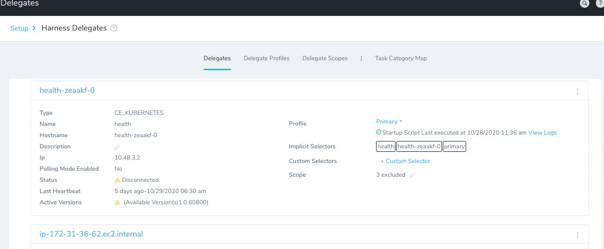
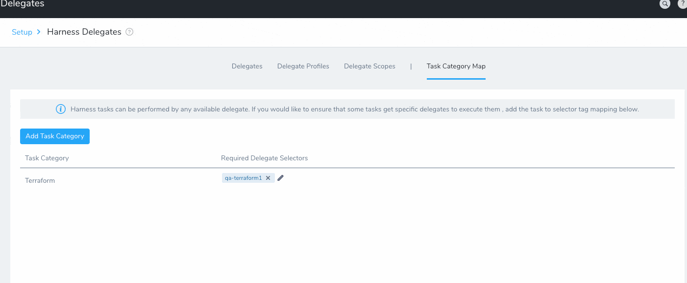

:::note
The **Task Category Map** feature replaces the **Command** setting in Delegate Scopes, which is deprecated and will be removed soon.Harness deployments are broken down into separate tasks performed by Harness Delegates.
:::

Tasks are organized by category. For example, all the connections and images pulled using Docker Hub are part of the Docker Hub Task Category.

By default, Harness performs tasks using any available Delegates. If you want Harness to prioritize a specific Delegate for a task category, you can map the task category to a Selector, and apply that Selector to a Delegate.

The mapped Selector can also be used in certain Harness entities to prioritize Delegates, such as [Cloud Providers](../manage-connectors/cloud-providers.md) and the [Shell Script Workflow step](../../../continuous-delivery/model-cd-pipeline/workflows/capture-shell-script-step-output.md).

This topic describes how to map task categories to Selectors, and then apply the Selector to one or more Delegates.

## Before You Begin

The Delegate is a key component of your Harness setup. Please review the following topics to ensure you have a solid understanding of the Delegate:

* [Harness Key Concepts](../../../starthere-firstgen/harness-key-concepts.md)
* [Harness Delegate Overview](delegate-installation.md)
* [Select Delegates with Selectors](select-delegates-for-specific-tasks-with-selectors.md)
* [Run Scripts on Delegates using Profiles](run-scripts-on-the-delegate-using-profiles.md)

## Supported Platforms and Technologies

See [Supported Platforms and Technologies](../../../starthere-firstgen/supported-platforms.md).

## Visual Summary

Here is example of adding a new Selector to a Delegate, and then mapping the Selector to a Task Category:

Here is an example of adding a Selector to a Task Category Mapping, and then applying the Selector to a Delegate:

## Step 1: Set Permissions

To map Selectors to Task Categories a user must belong to a User Group with the Account Permission **Manage Delegates** enabled.

See [Managing Users and Groups (RBAC)](../../security/access-management-howtos/users-and-permissions.md).

## Step 2: Map a Selector to a Task Category

1. To map a Selector to a Task Category, in **Setup**, click **Harness Delegates**.
2. Click **Task Category Map**.
3. Click **Map Task Category**.
4. In **Task Category**, select the category you want to map. See [Review: Task Categories](#review_task_categories).
5. Select or create selectors to map to this Task Category.
	1. You can simply enter the name of a new Selector and click **Create**.
	2. If you have an existing Selector, one that is perhaps already used by a Delegate or Delegate Profile, you can start entering its name and it will appear. Next, click its name to select it.
	:::note
	You must select or create at least one Selector.
	:::
6. Click **Submit**. The Task Category is now mapped to the Selector.

If this Selector is not being used by a Delegate or Profile, you can now add it to one or both.

## Review: Applying Selectors to Delegates and Profiles

Once you have mapped a Selector to a Task Category, you can apply the Selector to a Delegate using the following options:

* Add the Selector to the Delegate's **Custom Selectors** setting.
* Add the Selector to a Delegate Profile, and then add the Profile to any Delegates. All the Delegates using that Profile are thereby mapped to the Task Category.

For steps on adding Custom Selectors, see [Select Delegates with Selectors](select-delegates-for-specific-tasks-with-selectors.md).

For steps on adding Profile Selectors, see the Selector option in [Run Scripts on Delegates using Profiles](run-scripts-on-the-delegate-using-profiles.md).

### Which option to use?

If your task requires a Delegate Profile, it is best to map the Task Category to a Selector and apply that Selector to the Profile. All Delegates assigned that Profile will then perform the mapped tasks.

If your task can only be performed by specific Delegates because of their location or credentials, it is best to map it to specific Delegate using a Delegate's **Custom Selectors** setting.

## Review: Task Categories

The following table describes the different task categories.

|  |  |
| --- | --- |
| **Task Category** | **Description** |
| Amazon Machine Image (AMI) | Perform tasks related to [AMI Deployments](../../../first-gen-quickstarts/aws-ami-deployments.md). |
| Amazon Elastic Container Registry (ECR) | Connect and pull images from ECR. |
| Amazon S3 | Connect and pull artifacts and files from Amazon S3. |
| AppDynamics | Perform [AppDynamics verification tasks](../../../continuous-delivery/continuous-verification/continuous-verification-overview/concepts-cv/app-dynamics-verification-overview.md). |
| AWS | Connect using any Harness [AWS Cloud Provider](../manage-connectors/add-amazon-web-services-cloud-provider.md). |
| APM | Delegate can perform any APM task |
| Artifactory | Connect to JFrog Artifactory using the [Artifactory Artifact Server](../manage-connectors/add-artifactory-servers.md) credentials. |
| Azure Container Registry | Connect and pull [Azure Container Registry](../../../continuous-delivery/azure-deployments/aks-howtos/azure-deployments-overview.md) images and artifacts. |
| Bamboo | Perform Bamboo related tasks using the [Bamboo Artifact Server](../manage-connectors/add-bamboo-artifact-servers.md) credentials. |
| Build Source | Perform tasks for any [Build Workflow](../../../continuous-delivery/concepts-cd/deployment-types/artifact-build-and-deploy-pipelines-overview.md). |
| CloudFormation | Perform CloudFormation tasks such as CloudFormation Create Stack and CloudFormation Delete Stack Workflow steps. See [CloudFormation Provisioning with Harness](../../../continuous-delivery/concepts-cd/deployment-types/cloud-formation-provisioning-with-harness.md). |
| CloudWatch | Perform configuration and verification using AWS [CloudWatch](../../../continuous-delivery/continuous-verification/continuous-verification-overview/concepts-cv/cloud-watch-verification-overview.md). |
| Collaboration Provider | Connect and configure Harness [Collaboration Providers](../manage-connectors/collaboration-providers.md). |
| Command | Delegate will be used first for [Service commands](../manage-templatelib/create-a-service-command-template.md). |
| Connectivity Validation | Tests connectivity with resources, such as Harness Cloud Providers. |
| Container | Performs the following container-related tasks: <ul><li>Container active service counts </li><li>Container information</li><li>Controller names with labels</li><li>Container Continuous Efficiency (CE) validation</li> <li>CE Delegate validation</li> <li>Container connection validation</li> <li>List clusters</li> <li>Container validation</li> <li>Fetch Kubernetes master URL</li> <li>Kubernetes steady state check</li> <li>Kubernetes swap service selectors</li> <li>ECS steady state check</li> <li>Validate Kubernetes config</li></ul>|
| Custom Artifact Source | Collect artifacts using [Custom Artifact Sources](../../../continuous-delivery/model-cd-pipeline/setup-services/custom-artifact-source.md). |
| Custom Log Collection and Bugsnag | Perform configuration and verification using [Custom Logs](../../../continuous-delivery/continuous-verification/custom-metrics-and-logs-verification/verify-deployments-with-custom-logs.md) and [Bugsnag Verification Overview](../../../continuous-delivery/continuous-verification/continuous-verification-overview/concepts-cv/bugsnag-verification-overview.md).  |
| Dynatrace | Perform configuration and verification using [Dynatrace](../../../continuous-delivery/continuous-verification/continuous-verification-overview/concepts-cv/dynatrace-verification-overview.md). |
| Docker Hub | Connect to [Docker Hub](../manage-connectors/add-docker-registry-artifact-servers.md) and pull down metadata associated with the artifact. |
| ELK | Perform configuration and verification using [ELK](../../../continuous-delivery/continuous-verification/continuous-verification-overview/concepts-cv/elasticsearch-verification-overview.md). |
| Git | Perform configuration and tasks [Git Source Repo Providers](../manage-connectors/add-source-repo-providers.md). |
| Google Cloud Build | Perform [Google Cloud Build](../../../continuous-delivery/google-cloud/trigger-google-cloud-builds.md) related tasks. |
| Google Cloud Storage | Connect and pull artifacts from [Google Cloud Storage](../manage-connectors/add-google-cloud-platform-cloud-provider.md#review-google-gcs-and-gcr-requirements). |
| Google Container Registry | Connect and pull artifacts from [GCR](../manage-connectors/add-google-cloud-platform-cloud-provider.md#review-google-gcs-and-gcr-requirements). |
| Helm | Delegate can perform [Native Helm deployment](../../../continuous-delivery/concepts-cd/deployment-types/helm-deployments-overview.md) tasks. |
| Helm Repo Config Validation | Validate the [Helm Repo](../manage-connectors/add-helm-repository-servers.md) connection. |
| Helm Values Fetch | Fetch values.yaml for [Native](../../../continuous-delivery/concepts-cd/deployment-types/helm-deployments-overview.md) and [Kubernetes Helm](../../../continuous-delivery/kubernetes-deployments/use-a-helm-repository-with-kubernetes.md) deployments. |
| HTTP Verification | Perform the [HTTP step](../../../continuous-delivery/model-cd-pipeline/workflows/using-the-http-command.md) in a Workflow. |
| Host Validation | Validating target hosts availability. For example, see [Select Nodes Workflow Step](../../techref-category/cd-ref/workflow-steps-and-settings/select-nodes-workflow-step.md). |
| Jenkins | Connect and perform tasks for [Jenkins](../../../continuous-delivery/model-cd-pipeline/workflows/using-the-jenkins-command.md). |
| Jira | Connect and perform tasks for [Jira](../../../continuous-delivery/model-cd-pipeline/workflows/jira-integration.md). |
| Key Management Service | Connect and perform tasks for [Harness Secrets Managers](../../security/secrets-management/secret-management.md). |
| Kubernetes | Performs Kubernetes rollouts for [Kubernetes deployments](../../../first-gen-quickstarts/kubernetes-quickstart.md). |
| LDAP | Connect to LDAP server and perform [LDAP tasks](../../security/access-management-howtos/sso-ldap.md). |
| Logz | Connect and perform [Logz tasks](../../../continuous-delivery/continuous-verification/logz-io-verification/verify-deployments-with-logz-io.md). |
| Nexus | Connect to [Nexus](../../techref-category/cd-ref/artifacts-ref/nexus-artifact-sources.md) and pull down metadata associated with the artifact. |
| New Relic | Connect and perform [New Relic](../../../continuous-delivery/continuous-verification/continuous-verification-overview/concepts-cv/new-relic-verification-overview.md) tasks. |
| Prometheus | Connect and perform [Prometheus](../../../continuous-delivery/continuous-verification/continuous-verification-overview/concepts-cv/prometheus-verification-overview.md) tasks. |
| PCF | Connect and perform [Pivotal (PCF) deployments](../../../first-gen-quickstarts/pivotal-cloud-foundry-quickstart.md). |
| Service Guard | Perform [24/7 Service Guard](../../../continuous-delivery/continuous-verification/continuous-verification-overview/concepts-cv/24-7-service-guard-overview.md) tasks. |
| ServiceNow | Connect and perform [ServiceNow](../../../continuous-delivery/model-cd-pipeline/workflows/service-now-integration.md) tasks. |
| SFTP | Delegate can perform [SFTP](../manage-connectors/add-sftp-artifact-servers.md) (email server) tasks such as sending emails. |
| Splunk | Connect and perform [Splunk](../../../continuous-delivery/continuous-verification/continuous-verification-overview/concepts-cv/splunk-verification-overview.md) tasks. |
| Shell Script | Perform [Shell Script](../../../continuous-delivery/model-cd-pipeline/workflows/capture-shell-script-step-output.md) step in a Workflow. |
| Shell Script Provision | Delegate can perform [Shell Script Provisioner](../../../continuous-delivery/model-cd-pipeline/infrastructure-provisioner/ssh-provisioner-category/shell-script-provisioner.md) tasks. |
| Slack Notifications | Delegate can perform tasks related to sending [Slack notifications](../manage-notegroups/send-notification-using-slack.md). |
| SMB | Delegate can perform tasks related to [SMB Artifact Servers](../manage-connectors/add-smb-artifact-servers.md).  |
| SpotInst | Delegate can perform [SpotInst Deployments](../../../continuous-delivery/concepts-cd/deployment-types/ami-spotinst-elastigroup-deployments-overview.md) and connect to the [SpotInst Cloud Provider](../manage-connectors/add-spot-inst-cloud-provider.md). |
| Sumo Logic | Delegate can perform tasks related to [Sumo Logic calls](../../../continuous-delivery/continuous-verification/continuous-verification-overview/concepts-cv/sumo-logic-verification-overview.md) and [Sumo Logic Verification Provider](../../../continuous-delivery/continuous-verification/sumo-logic-verification/1-sumo-logic-connection-setup.md). |
| Terraform | Delegate can perform [Terraform tasks](../../../continuous-delivery/concepts-cd/deployment-types/terraform-provisioning-with-harness.md). |
| Trigger | Delegate can perform tasks related to [Harness Triggers](../../../continuous-delivery/model-cd-pipeline/triggers/add-a-trigger-2.md). |
| Continuous Integration | Delegate can perform tasks related to CI: [Jenkins](../../../continuous-delivery/model-cd-pipeline/workflows/using-the-jenkins-command.md), [Bamboo](../manage-connectors/add-bamboo-artifact-servers.md). |
| Artifact Collection In Pipeline | Delegate can perform the [artifact collection](../../../continuous-delivery/concepts-cd/deployment-types/artifact-build-and-deploy-pipelines-overview.md) step in a Pipeline. |

 

