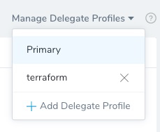
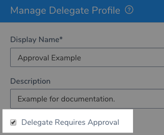
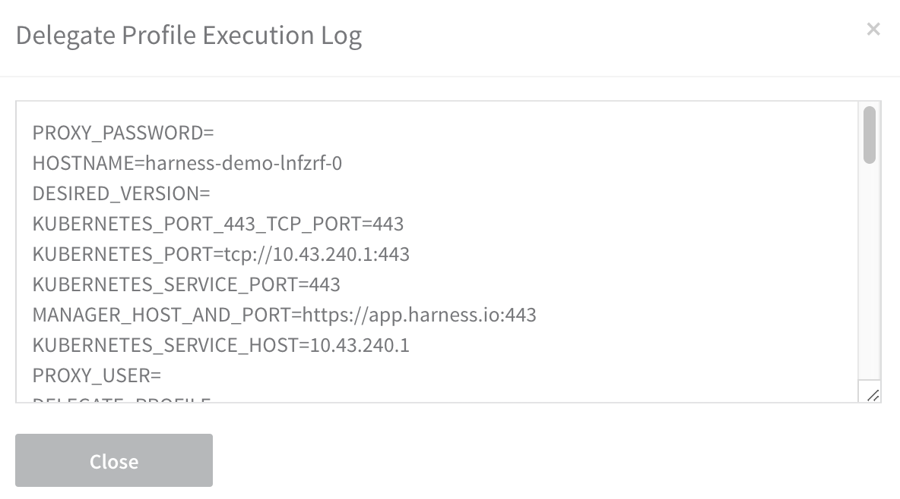

:::caution
Using Profiles is Deprecated. Please use [Run Initialization Scripts on Delegates](run-initialization-scripts-on-delegates.md).
:::

A Delegate Profile enables you to run a startup script on the host/container/pod for a Harness Delegate when the Delegate is installed, or any time after that. You can create a single Delegate Profile and apply it to multiple Delegates.

:::note
A Delegate Profile is mandatory. The Primary Profile is the default and contains no script. You can add a script to it, or create and apply new Profiles for your Delegate.
:::

## Review: Delegate Profile Summary

A Delegate Profile lets you install and run script and software every time a Harness Delegate is added.

To do this, you could create a Delegate Profile containing the commands for installing and running the software.

Each time you add a Delegate, you can apply the profile.

When the Delegate is started, the commands to install and run the software are executed.

For example, a Delegate Profile that installs Terraform:


```
curl -O -L https://releases.hashicorp.com/terraform/0.11.13/terraform_0.11.13_linux_amd64.zip  
unzip terraform_0.11.13_linux_amd64.zip  
sudo mv terraform /usr/local/bin/  
terraform --version
```
For examples of Delegate Profile scripts, see [Common Delegate Profile Scripts](../../techref-category/account-ref/delegate-ref/common-delegate-profile-scripts.md).

### Primary Profile

Your Harness account comes with a default Primary Profile. When you install a new Delegate and it registers with Harness, the Primary Profile is added to that Delegate automatically.

It cannot be renamed or deleted.




You can add any script to the Primary Profile, and apply it to any Delegate.

### Profile Approvals

When you create a Profile you can require that its use be approved by a member of the Harness Account Administrator group.



When this option is selected, and Delegate that uses this Profile will appear with a **Pending Approval** option in the **Harness Delegates** page.

If you reject the Delegate, it is not registered with Harness and does not appear in the list.

See [Approve or Reject Harness Delegates](approve-or-reject-harness-delegates.md).

### What Can I Run In a Profile?

You can add any commands supported on the host/container/pod running the Delegate. Linux shell commands are most common. If kubectl, Helm, or Docker is running on the host/container/pod where you install the Delegate, then you can use their commands.

The base image for the Delegate is Ubuntu 18.04 or later, and so any default Ubuntu packages may be used in the Delegate Profile script.

All Delegates include cURL and unzip as part of their installation package, and so you may use cURL and unzip in your Delegate Profile scripts without installing them. The following script will work without having to install any packages:


```
usr/bin/apt-get install -y python  
curl "https://s3.amazonaws.com/aws-cli/awscli-bundle.zip" -o "awscli-bundle.zip"  
unzip awscli-bundle.zip  
./awscli-bundle/install -b ~/bin/aws
```
### When is the Profile Executed?

Delegate Profiles are applied under the following conditions:

* **New Delegate** - If you add a Delegate Profile when you create the Delegate, the profile commands are executed after the Delegate is started.
* **Running Delegate** - If you apply a Delegate Profile to a running Delegate, either by applying it as a new profile or switching the Delegate’s current profile, the profile commands are executed immediately.
* **Edited Profile** - If you edit a Delegate Profile, the new commands in the profile are applied to all Delegates using the profile.

### Profile Timeouts

The profile execution timeout limit is 10 minutes.

## Step 1: Create a Delegate Profile

To create a Delegate Profile, do the following:

1. In **Harness**, click **Setup**.
2. Click **Harness Delegates**.
3. Click **Delegate Profiles**, and then click **Add Delegate Profiles**. The **Manage Delegate Profile** dialog appears.
4. In **Display** **Name**, enter a name for the profile.
5. In **Startup Script**, enter the script you want to run when the profile is applied, such as when the Delegate is started.  
For **Delegate Requires Approval**, see [Approve or Reject Harness Delegates](approve-or-reject-harness-delegates.md).
6. Click **Submit**. The profile is created. Now you can apply the profile to new or existing Delegates.

## Option: Secrets in Profiles

You can use Harness encrypted text and file secrets in your Profile script. This is very common for usernames and passwords.

To use a secret in a Delegate Profile, the secret's **Usage Scope** must be set to **Scope to Account**.

See [Restrict Secrets Usage](../../security/secrets-management/restrict-secrets-usage.md) and [Use Secrets in a Delegate Profile](use-a-secret-in-a-delegate-profile.md).

## Option: Add a Selector to a Delegate Profile

You can add a Selector to a Delegate Profile and then when you apply the Profile to a Delegate, the Delegate inherits the Selector.

This provides a dynamic way to add and remove Selectors to a Delegate, and ensure that any Delegate with the Selector also uses a specific Profile.

This enables you to use the Selector in a [Shell Script step](../../../continuous-delivery/model-cd-pipeline/workflows/capture-shell-script-step-output.md), or anywhere else you use Delegate Selectors, and be confident that the Delegate selected also has the Delegate Profile.

When the Profile is removed from the Delegate, the Selector is also removed.

A Delegate Profile Selector does not apply the Profile. It is simply a method of adding/removing Profile-specific Selectors dynamically.

## Step 2: Applying a Profile

You can apply a profile in the following ways:

* **Kubernetes and ECS Task Delegate** - For a Harness Kubernetes or ECS Task Delegate, you can apply a profile when you download the Kubernetes YAML file or ECS Task Spec for the Delegate, or after the Delegate is installed and running.
* **Shell Script and Docker Image Delegate** - For the Harness Shell Script and Docker Image delegates, you download, install, and run the Delegates first, and then apply the profile using the Harness Manager.

To apply a profile to an existing Delegate, do the following:

1. Locate the Delegate to which you want to apply the profile.
2. Do one of the following:
3. Click the dropdown menu next to **Profile** and then click the profile you want applied to the Delegate.
4. In the confirmation dialog, click **Confirm**.

### Notes

* It might take a few minutes to apply the new profile.
* When switching profiles, any binaries installed as part of the earlier profile are not removed automatically. If you need to remove them, then restart the Kubernetes pod hosting the Kubernetes Delegate or manually clean up the VM hosting the Shell or Docker delegate.
* To remove a profile from a Delegate, click **Select Profile**, and then click another Profile, such as the default **Primary** Profile. Delegates must always have a profile. You can use the Primary Profile as a blank default.

### Profile Logs

You can view the execution log of the Profile script for each Delegate. For example, we'll use a Profile that simply prints out its environment variables using `printenv`.

The date next to the Profile name is a timestamped link to the script execution log. Click the link to see the log:




## Step 3: Manage Profiles

When you update a Delegate Profile, the changes are applied to the Delegates using the profile.

You can also delete a profile and it will be removed from the Delegates using it.

:::note
When editing or deleting profiles, any binaries installed as part of the earlier profile are not removed automatically. If you need to remove them, then restart the Kubernetes pod hosting the Kubernetes Delegate or manually clean up the VM hosting the Shell or Docker Delegate.
:::

## See Also

* [Use Secrets in a Delegate Profile](use-a-secret-in-a-delegate-profile.md)

