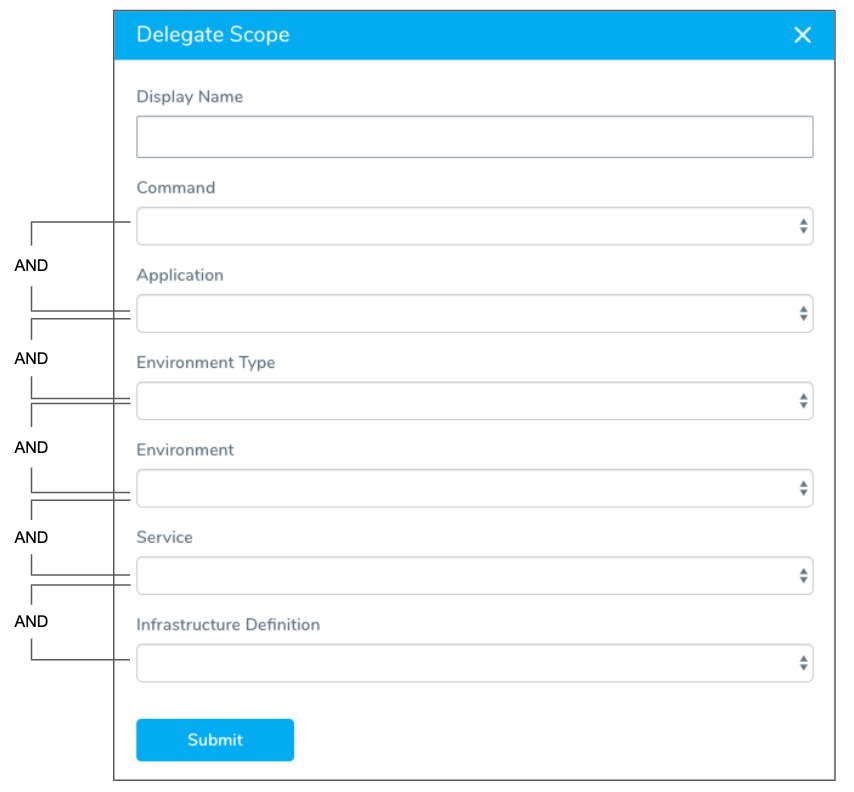

:::note
The Command setting in Delegate Scopes is deprecated and will be removed soon. Please use Task Category Map to scope commands to specific Delegates. See [Delegate Task Category Mapping](map-tasks-to-delegates-and-profiles.md).
:::

By default, a Delegate will perform all connections you set up and processes you run. To limit, or scope, a Delegate, you can set specific boundaries and associations for each Delegate you run.

In this topic:

* [Review: Delegate Scope Example](#review-delegate-scope-example)
* [Step 1: Scope a Delegate](#step-1-scope-a-delegate)
* [Best Practices and Notes](#best-practices-and-notes)

## Review: Delegate Scope Example

You need to restrict access to a production environment. Without defining a scope, the Delegate scans all network ports to map out the Environment and performs checks to access the Artifact Servers and Cloud Providers it needs. By defining a scope, you can limit the Delegate to connect to only the specific Environments, Applications, and Infrastructure Definition it needs. 

Defining a scope is optional, but if you use scoping you can prevent the Delegate from constantly looking for what’s available or accessible.

You can apply multiple scopes to a Delegate.

## Step 1: Scope a Delegate

To scope a Delegate, do the following:

1. On the **Harness Delegates** page, in the Delegate you want to scope, click **See delegate scopes**.
2. Do one of the following:
	1. In **Scopes Limited To**, click **Add Scope**. If you select this option, then the Delegate is only used for the entities selected.
	2. In **Scopes Excluded**, click **Exclude Scope**. If you select this option, then the Delegate is never used for the entities selected.
3. In **Add Delegate Scope**, do one of the following:
	1. Select **From existing scope**, and then in **Scope**, select the existing Scope and click **Add Scope**.
	2. Select **New scope**, and then click **Add Scope**.
4. If you selected **New Scope**, in **Display Name**, enter a name for the scope.
5. Select the entities the Scope applies to.  
You must pick at least one Delegate Scope property.
6. Click **Submit**. The scope is added to the Delegate.

## Best Practices and Notes

The following information will help you prevent many Delegate issues.

### Scopes Excluded is More Effective

The most important decision when creating a Delegate Scope is selecting **Scopes Limited To** or **Scopes Excluded**.

**Scopes Limited To** is rarely used by Harness users. Scoping one Delegate to the **Production** Environment Type and a second Delegate to the **Non-Production** Environment Type might appear logical, but your Harness deployments typically involve operations that do not fall into either of those Environment Types and, consequently, there is no Delegate scoped to perform them.

It is better to use **Scope Excluded** to exclude one Delegate from the **Production** Environment Type and the other Delegate from the **Non-Production** Environment Type. This way, either Delegate can still perform general operations outside of Environment Type.

### Scope Options are ANDs

The fields in the Delegate Scope dialog narrow the scope of the Delegate's operations as you move down the dialog. For example, you can pick an operation in Command, and the limit its scope further by picking the Application and Environment.Think of using the Delegate Scope dialog fields as ANDs: Command AND Application AND Environment Type, and so on.

:::note
If you want to OR Delegate Scope settings, you need to make separate Delegate Scopes and apply them to the same Delegate.
:::

### Use a Display Name

Ensure that you enter a name in **Display Name**. This will help you and others quickly select the scope in the future.

