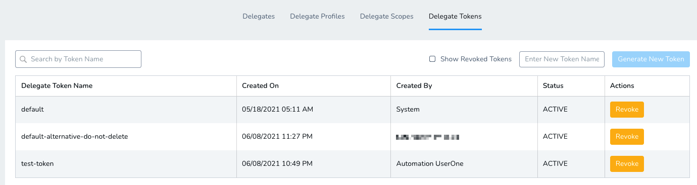
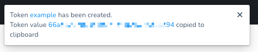
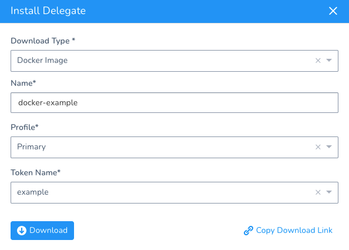

:::note
Currently, this feature is behind a Feature Flag. Contact [Harness Support](mailto:support@harness.io) to enable the feature. Feature Flags can only be removed for Harness Professional and Essentials editions. Once the feature is released to a general audience, it's available for Trial and Community Editions.  
  
See [New features added to Harness](https://changelog.harness.io/?categories=fix,improvement,new) and [Features behind Feature Flags](https://changelog.harness.io/?categories=early-access) (Early Access) for Feature Flag information.
:::

Delegate tokens are used by Harness to encrypt communication between Harness Delegates and the Harness Manager. By default, when a new Harness account is created, all Harness Delegates in that account include the same token.

You can further secure Delegate to Harness communication by replacing the default Delegate token with new tokens. You can rotate and revoke Delegate tokens per your governance policies and replace revoked tokens with custom tokens when needed.

In this topic:

* [Before You Begin](secure-delegates-with-tokens.md#before-you-begin)
* [Step 1: Generate a New Token](secure-delegates-with-tokens.md#step-1-generate-a-new-token)
* [Option: Install a New Delegate with New Token](secure-delegates-with-tokens.md#option-install-a-new-delegate-with-new-token)
* [Option: Update and Restart Existing Delegate](secure-delegates-with-tokens.md#option-update-and-restart-existing-delegate)
	+ [Kubernetes Delegate](secure-delegates-with-tokens.md#kubernetes-delegate)
	+ [Shell Script Delegate](secure-delegates-with-tokens.md#shell-script-delegate)
	+ [Docker Delegate](secure-delegates-with-tokens.md#docker-delegate)
	+ [ECS Task Delegate](secure-delegates-with-tokens.md#ecs-task-delegate)
	+ [Helm Delegate](secure-delegates-with-tokens.md#helm-delegate)
* [Option: Revoke Tokens](secure-delegates-with-tokens.md#option-revoke-tokens)
* [See Also](secure-delegates-with-tokens.md#see-also)

## Before You Begin

* [Delegate Installation Overview](delegate-installation-overview.md)
* [Install the Harness Kubernetes Delegate](install-kubernetes-delegate.md)
* [Install the Harness Shell Script Delegate](install-shellscript-delegate.md)
* [Install the Harness ECS Delegate](install-ecs-delegate.md)
* [Install the Harness Helm Delegate](using-the-helm-delegate.md)
* [Install the Harness Docker Delegate](install-docker-delegate.md)

## Step 1: Generate a New Token

In Harness, click **Setup**.

Click **Harness Delegates**.

Click **Delegate Tokens**.

Here you can see, create, and revoke all Delegate tokens.


Enter a name for the new token, and then click **Generate New Token**.

The new token is created and its value is copied to your system clipboard. The new token also appears in the list using the name you gave it.

Save the new token value. You cannot retrieve the token value after this.



Now you can update the Delegate(s) with the new token.

## Option: Install a New Delegate with New Token

When you install a new Delegate, you can select the token to use:



After the new Delegate registers with Harness, you can:

* Remove any Delegates that use old tokens
* Revoke the old tokens

## Option: Update and Restart Existing Delegate

You can update an existing Delegate with the new token value and then restart the Delegate.

### Kubernetes Delegate

The Delegate is set up using the **harness-delegate.yaml** you downloaded originally.

Edit the **harness-delegate.yaml** you downloaded originally with the new token and then run `kubectl apply -f harness-delegate.yaml` to restart the Delegate pods.

Paste the token into the `value` field of the `DELEGATE_TOKEN` environment variable:


```
...  
env:  
        - name: ACCOUNT_ID  
          value: AQ8xh0000000005bSM8Fg  
        - name: DELEGATE_TOKEN  
          value: [enter new token here]  
        - name: MANAGER_HOST_AND_PORT  
          value: https://app.harness.io  
...
```
Run `kubectl apply -f harness-delegate.yaml`

The Delegate pods restart automatically. The pods restart with the updated settings.

### Shell Script Delegate

You can rotate tokens for shell script delegates using one of the following methods:

* Download a new tar.gz file and reinstall the delegate.
* Update the value of the `delegateToken` variable in the start.sh, config-watcher.yaml, and config-delegate.yaml files.

If your delegates were not recently installed, the shart.sh, config-watcher.yaml, and config-delegate.yaml files might refer to the token name `accountSecret`. Replace these references with `delegateToken`. 

When you build the delegate image, add the changes in the init.sh file to the image. The init.sh file must be at the same level as start.sh (`/opt/harness-delegate`).

### Docker Delegate

Docker doesn't provide a way to modify an environment variable in a running container because the operating system doesn't provide a way to modify an environment variable in a running process. You must destroy and recreate the container.

To destroy and recreate the container, use the **launch-harness-delegate.sh** you downloaded originally.

Paste the token as the value of the `DELEGATE_TOKEN` variable:


```
#!/bin/bash -e  
  
sudo docker pull harness/delegate:latest  
  
sudo docker run -d --restart unless-stopped --hostname=$(hostname -f) \  
-e ACCOUNT_ID=kmpySm00000006NL73w \  
-e DELEGATE_TOKEN=[enter new token here] \  
-e MANAGER_HOST_AND_PORT=https://app.harness.io/ \  
...
```
Create a new container: `./launch-harness-delegate.sh`

You can verify that the environment variable has the new token using `docker exec [container ID] env`.

### ECS Task Delegate

Update the Delegate by updating the existing ECS task and container instances.

Stop the Delegate task:


```
aws ecs stop-task --task [task ID or full ARN of the task]
```
Paste the token into the `DELEGATE_TOKEN` `value` field:


```
...  
      "cpu": 1,  
      "environment": [  
        {  
          "name": "ACCOUNT_ID",  
          "value": "Ws0x0000008z4g"  
        },  
        {  
          "name": "DELEGATE_TOKEN",  
          "value": "[enter new token here]"  
        },  
        {  
          "name": "DELEGATE_CHECK_LOCATION",  
          "value": "delegate.txt"  
        },  
  
...
```
Start the Delegate task:


```
aws ecs start-task \  
    --task-definition [family and revision (family:revision ) or full ARN of the task definition] \  
    --container-instances [container instance IDs or full ARN entries for the container instances]
```
### Helm Delegate

The Delegate is set up using the Helm values YAML file, **harness-delegate-values.yaml**, that you originally downloaded.

Stop the Helm Delegate.

Paste the token into the `delegateToken` field in the harness-delegate.yaml file:


```
# Account Id to which the delegate will be connecting  
accountId: XIC000000Ox-cQ  
  
# Secret identifier associated with the account  
delegateToken: [enter new token here]  
  
# Short 6 character identifier of the account  
accountIdShort: xicobc  
  
delegateName: helm-example  
...
```
Install the Helm Delegate using the Helm Values YAML (in this example, the name is **helm-delegate-doc**):

`helm install --name helm-delegate-doc harness/harness-delegate -f harness-delegate-values.yaml`

If you are installing into a specific namespace, you will need the `--namespace` parameter also:

`helm install harness-helm-repo/harness-delegate --name helm-delegate-doc -f harness-delegate-values.yaml --namespace doc-example`

## Option: Revoke Tokens

To revoke unused token, in Harness, click **Setup**.

Click **Harness Delegates**.

Click **Delegate Tokens**.

Here you can see, create, and revoke all Delegate tokens.


Select the token you want to revoke, and click **Revoke**.

Click **Confirm**. The token is revoked. The Harness Manager will not accept connections from any Delegates using this revoked token.

## See Also

* [Approve or Reject Harness Delegates](approve-or-reject-harness-delegates.md)

