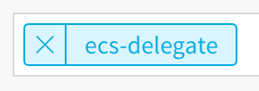

:::note
Delegate selectors were formerly called tags. Now, *tags* refers only to tagging Harness application components as described in [Using tags](../tags/tags.md).
:::

When Harness needs to run a task, it makes a connection to a resource via its delegates. Harness selects the best delegate according to its history. Go to [How Does Harness Manager Pick Delegates?](delegate-installation.md#how-does-harness-manager-pick-delegates).

In a few cases, you might want Harness to select specific delegates. In these cases, you can use delegate selectors:

* **For some Cloud Provider types:** You can use delegate selectors to select the delegate to use for authentication. The Cloud Provider inherits the authentication permissions used by the Delegate.
* **For some Workflow step types:** You can target specific delegates using selectors. This is only done if the Workflow Infrastructure Definition's Cloud Provider does not use delegate selectors already.

In this topic:

- [Review: Implicit and Custom Selectors](#review-implicit-and-custom-selectors)
- [Review: How Selectors are Used](#review-how-selectors-are-used)
  - [Pre-deployment Steps](#pre-deployment-steps)
- [Step 1: Create a Selector](#step-1-create-a-selector)
- [Step 2: Select Delegates Using Selectors](#step-2-select-delegates-using-selectors)
- [See Also](#see-also)

## Review: Implicit and custom selectors

There are two types of selectors:

* **Implicit:** Harness provides these selectors as part of your account. They are generated automatically and can be used to identify the delegate, and can be used in AWS Cloud Providers.
* **Custom:** These are selectors that you add to identify this Delegate and select it in other entities, such as the Shell Script Workflow step.

In this topic, we will focus on custom selectors.

## Review: How Harness uses selectors

By default, when your Workflow is deployed, Harness uses the Cloud Provider in the Workflow's Infrastructure Definition to connect to the target environment. 

If the Infrastructure Definition's Cloud Provider uses a delegate selector (supported in Kubernetes cluster and AWS Cloud Providers), then the Workflow uses the selected delegate for all of its steps.

In these cases, you should not add a delegate selector to any step in the Workflow. The Workflow is already using a selector via its Infrastructure Definition's Cloud Provider.

import Selector from '/docs/platform/2_Delegates/shared/selector-infrastructure.md'

<Selector />

In cases where the Infrastructure Definition's Cloud Provider does not use a delegate selector, Harness selects the delegate to use based on criteria explained [here](delegate-installation.md#how-does-harness-manager-pick-delegates).

In these cases, you might want a Workflow step to use a specific delegate. You can use a delegate selector to select the delegate.

For that Workflow step only, Harness will use the delegate selected via the delegate selector.

### Pre-deployment Steps

Workflow types with **Pre-deployment Steps** do not use the Infrastructure Definition, and so they do not use the Infrastructure Definition's Cloud Provider and any related delegate selectors. 

Steps added to this section can select delegates using the step's delegate selectors setting.

## Step 1: Create a selector

1. In Harness, click Setup, and then click **Harness Delegates**.
2. In the listing of the delegate where you want to add a Selector, click **Custom** **Selector**.
3. In **Edit Selectors**, type in the Selector name, such as **dev**, and press **Enter**. You can enter as many Selectors as you like.
4. Click **Submit**. The selector is added.

## Step 2: Select delegates using selectors

Elsewhere, such as in a [Shell Script step in a Workflow](../../../continuous-delivery/model-cd-pipeline/workflows/capture-shell-script-step-output.md), you can use the selector to ensure that this delegate is used when executing the command.

:::note
**All of the selectors** that you enter must be in the delegate(s) you are targeting. Another common use of a delegate selector is in an [AWS Cloud Provider](../manage-connectors/add-amazon-web-services-cloud-provider.md).
:::

For example, you can install a delegate in an AWS VPC and then select it in the AWS Cloud Provider Credentials when you select **Assume IAM Role on Delegate**.

In the **Delegate Selector** setting, you select the selector by name, such as **ecs-delegate**.

Now the Harness AWS Cloud Provider will use the delegate's credentials to connect with AWS.

## See Also

* [Run Scripts on Delegates using Profiles](run-scripts-on-the-delegate-using-profiles.md)
* [Scope Delegates to Harness Components and Commands](scope-delegates-to-harness-components-and-commands.md)
