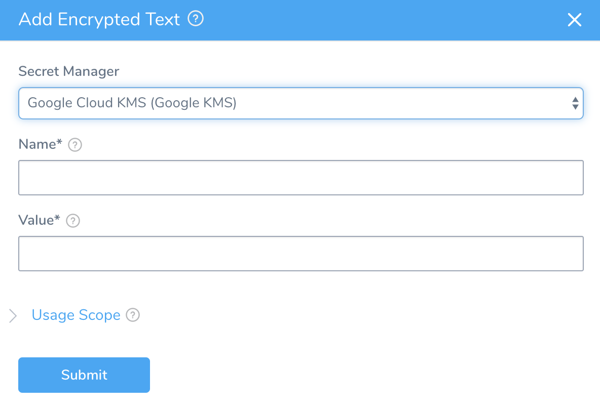
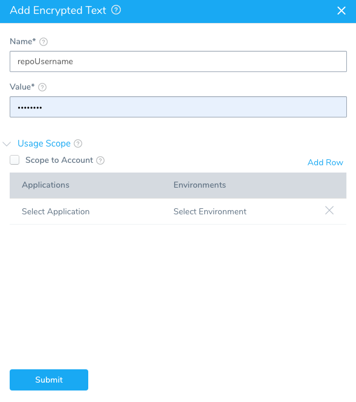
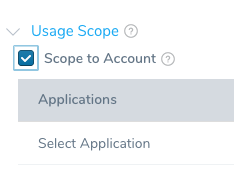
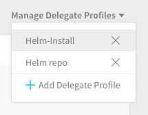
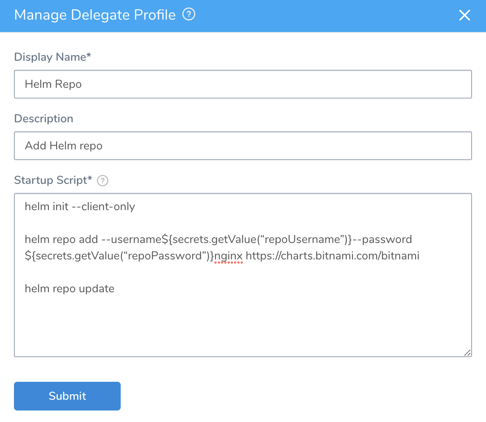
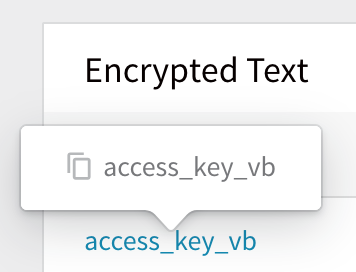

Using Profiles is Deprecated. Please use [Run Initialization Scripts on Delegates](run-initialization-scripts-on-delegates.md).To use secrets in a Delegate Profile, create encrypted text in Harness Secrets Management for the credentials, and then use variable names for those credentials in the Delegate Profile.

In this topic:

* [Before You Begin](#before_you_begin)
* [Step 1: Add Encrypted Texts](#step_1_add_encrypted_texts)
* [Step 2: Manage Delegate Profiles](#step_2_manage_delegate_profiles)
* [Step 3: Use Secret in Profile Script](#step_3_use_secret_in_profile_script)
* [Review: Use Config Files in Delegate Profiles](use-a-secret-in-a-delegate-profile.md#review-use-config-files-in-delegate-profiles)

### Before You Begin

* [Harness Key Concepts](https://docs.harness.io/article/4o7oqwih6h-harness-key-concepts)
* [Secrets Management Overview](../../security/secrets-management/secret-management.md)
* [Use Encrypted Text Secrets](../../security/secrets-management/use-encrypted-text-secrets.md)
* [Run Scripts on Delegates using Profiles](run-scripts-on-the-delegate-using-profiles.md)

### Step 1: Add Encrypted Text

For [Delegate Profiles](delegate-installation.md#delegate-profiles), if you wanted to add a Helm repo that requires login credentials to every Kubernetes pod running a Harness Kubernetes Delegate, you can create encrypted text in Harness Secrets Management for those credentials, and then use variable names for those credentials in the Delegate Profile using the `${secrets.getValue("secret_name")}` expression.

For more information about Delegate Profiles, see [Run Scripts on Delegates using Profiles](run-scripts-on-the-delegate-using-profiles.md) and [Common Delegate Profile Scripts](../delegate-ref/common-delegate-profile-scripts.md).

1. In Harness, select **Continuous Security** > **Secrets Management**.  
The **Secrets Management** page appears.
2. Under **Execution Credentials**, click **Encrypted Text**. The **Encrypted Text** page appears.
3. Click **Add Encrypted Text**. The **Add Encrypted Text** dialog appears.
4. In **Name**, enter **repoUsername**. This name will be used later in the **Delegate Profile** script to reference this secret.
5. In **Value**, enter any **username**. The dialog will look like this:

1. In **Usage Scope**, click **Scope to Account**. This will scope the secret to the Account-level. It can then be used in a Delegate Profile.You must set **Usage Scope** to **Scope to Account** to use the secret in a Delegate Profile. Once it is set to **Scope to Account**, the secret can used in a Delegate Profile only.
2. Click **Submit**.
3. Add a second encrypted text with the name **repoPassword**, using any password. Be sure to set **Usage Scope** to **Scope to Account**, also. The dialog will look like this:
4. Click **Submit**. Now you can create a Delegate Profile and use these secrets.

### Step 2: Manage Delegate Profiles

1. Click **Setup**.
2. Click **Harness Delegates**.
3. Click **Manage Delegate Profiles**, and then **Add Delegate Profile**.The **Manage Delegate Profile** dialog appears.
4. In **Name**, enter **Helm Repo**.

### Step 3: Use Secret in Profile Script

1. In **Startup Script**, enter your Helm commands using the secrets you created:  
  
`helm init --client-only`  
  
`helm repo add --username`**`${secrets.getValue(“repoUsername”)}`**`--password`**`${secrets.getValue(“repoPassword”)}`**`nginx https://charts.bitnami.com/bitnami`  
  
`helm repo update`  
  
The secrets are referenced as variables using `${secrets.getValue()}` and the names you gave them, **repoUsername** and **repoPassword**:  
  
`${secrets.getValue(“repoUsername”)}`  
`${secrets.getValue(“repoPassword”)}`  
  
The **Manage Delegate Profile** dialog will look like this:
2. Click **Submit**.

Now when you add this profile to a Kubernetes Delegate, it will add the Helm repo using the credentials you added as **Encrypted Text** in Harness **Secrets Management**.

A quick way to get the name of a secret is to hover over the secrets in **Secrets Management** and click the Copy icon:



### Review: Use Config Files in Delegate Profiles

The [Service Config file](../../../continuous-delivery/model-cd-pipeline/setup-services/add-service-level-configuration-files.md) expressions `${configFile.getAsString("fileName")}` and `${configFile.getAsBase64("fileName")}` are not supported in [Delegate Profiles](run-scripts-on-the-delegate-using-profiles.md).

Instead, encode the file in base64 and then add the file to Harness as an [Encrypted File Secret](../../security/secrets-management/use-encrypted-file-secrets.md).

Next, in the Delegate Profile script, reference the secret, pipe it to base64 and output it to the path where you need it:


```
echo ${secrets.getValue("secret_name")} | base64 -d > /path/to/file
```
