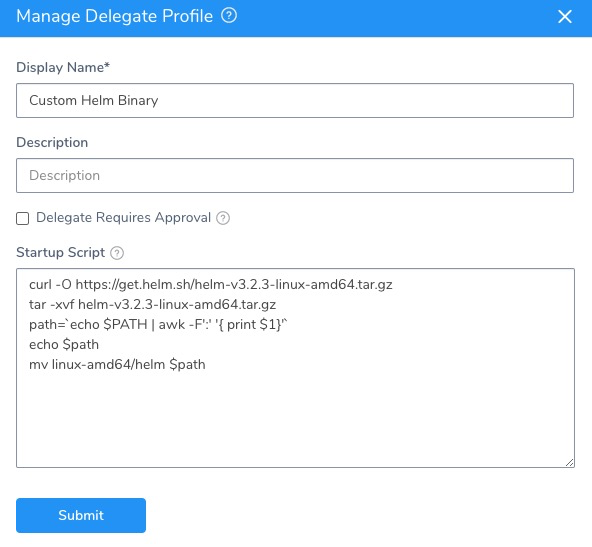
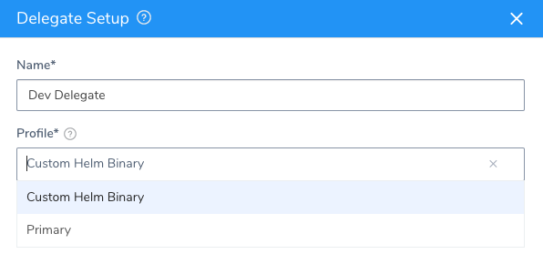

```mdx-code-block
import image_1 from './static/use-custom-helm-binaries-on-harness-delegates-33.png'
```

Harness Delegate includes Helm 3 by default. You can optionally specify the use of a custom binary from the [helm](https://github.com/helm/helm/releases) repository. This is useful when your Harness deployment uses a chart that is incompatible with the default Helm version.

This document describes how to specify the use of a custom Helm binary based on Delegate type.

## Usage Notes

This topic provides usage notes on specific Helm binary versions.

:::note
For Helm binary versions with feature flags requirements, contact [Harness Support](mailto:support@harness.io) to enable them.
:::

### Helm Binary v3.5 to v3.7

The use of Helm binaries version 3.5 or later requires the following feature flags to be enabled on your Harness account:

* `DISABLE_HELM_REPO_YAML_CACHE`
* `BYPASS_HELM_FETCH`

This is required because of changes to Helm CLI in Helm version 3.5. The process that the`helm repo add` command uses to invoke the`helm repo update` command changed.

### Helm v3.8.0 Binary

The use of Helm v3.8.0 binaries requires the following feature flags to be enabled on your Harness account:

* `DISABLE_HELM_REPO_YAML_CACHE`
* `HELM_VERSION_3_8_0`

Additionally, in **Remote Manifests**, locate the **Helm Version** option and select **V3**.

### Helm v2 Binary for Native Helm Deployments

If you are performing a [Native Helm deployment](../../../continuous-delivery/concepts-cd/deployment-types/helm-deployments-overview.md), do not use `HELM_PATH` for the Helm 2 binary. Harness searches for the Helm 2 binary on the Delegate in its standard path, for example, `/usr/local/bin/helm`.

## Step 1: Create a Delegate Profile to Install the Custom Binary

To download and install the custom Helm binary onto a Harness Delegate, you can use a Delegate Profile.

A Delegate Profile is simply a script that you can apply to any new or existing Delegate.

1. In Harness, click **Setup**, and then click **Harness Delegates**.
2. Click **Manage Delegate Profiles**, and click **Add Delegate Profile**.
3. In **Display Name**, give your custom binary Profile a name.
4. In **Startup Script**, add the script to download and install the custom binary.

The Delegate Profile script should do the following:

1. Download your desired Helm version.
2. Unpack it.
3. Move it to its desired destination on the Delegate host. This is the location you will add to the Delegate config file later.

Example Delegate Profile script:


```
curl -O https://get.helm.sh/helm-v3.2.3-linux-amd64.tar.gz  
tar -xvf helm-v3.2.3-linux-amd64.tar.gz  
path=`echo $PATH | awk -F':' '{ print $1}'`  
echo $path  
mv linux-amd64/helm $path
```
It will look something like this:



Next, you can add a Delegate Profile to a new or existing Delegate.

## Step 2: Apply the Profile to a New or Existing Delegate

If you are adding a new Delegate, you select the profile when you download the Delegate.



If you apply the profile to an existing Delegate, you simply select the it in the Delegate's **Profile** setting:

```mdx-code-block

```


## Step 3: Update the Delegate Config File and Start the Delegate

Each type of Delegate uses a configuration file that specifies the path to the custom binary installed by your Delegate Profile.

The remainder of this topic explains, for each Delegate type, how to modify the configuration to use a custom Helm binary.

### Kubernetes

1. Open the Kubernetes Delegate file **harness-delegate.yaml**. If the Delegate is already running, this is the same file you used to create the Delegate on your cluster.
2. Locate the Helm path settings in the `StatefulSet` declaration:


  ```
    ...  
            - name: HELM3_PATH  
              value: ""  
            - name: HELM_PATH  
              value: ""  
    ...
  ```
3. Specify the path in the `value` field as follows:
	* For a Helm 3 binary, enter the path in `HELM3_PATH`.
	* For a Helm 2 binary, enter the path in `HELM_PATH`.

:::note
If you are performing a [Native Helm deployment](../../../continuous-delivery/concepts-cd/deployment-types/helm-deployments-overview.md), do not use `HELM_PATH` for the Helm 2 binary. Harness searches for the Helm 2 binary on the Delegate in its standard path, for example,`/usr/local/bin/helm`.
:::

4. Apply the modified file and restart Harness Delegate:

```
kubectl apply -f harness-delegate.yaml
```
You can alternately delete the Delegate pod; the **StatefulSet** object will recreate it with the updated settings. For example, given a Delegate pod named `mydelegate-vutpmk-0`, use the following instruction:


```
kubectl delete pod mydelegate-vutpmk -n harness-delegate
```
For information about the Kubernetes Delegate, see Harness [Kubernetes Quickstart](../../../first-gen-quickstarts/kubernetes-quickstart.md#step-1-install-and-launch-the-kubernetes-delegate).

### ECS

1. For a new ECS Delegate, open the ECS task `spec`that you downloaded from Harness: **ecs-task-spec.json.**  
If this is an existing ECS Delegate, open the task definition in the AWS console and create a new revision. You can edit the JSON for the task definition in the new revision. For more information, see [Updating a Task Definition](https://docs.aws.amazon.com/AmazonECS/latest/developerguide/update-task-definition.html) from AWS.
2. In `containerDefinitions`, locate the Helm path settings:


   ```
   ...  
        {  
          "name": "HELM3_PATH",  
          "value": ""  
        },  
        {  
          "name": "HELM_PATH",  
          "value": ""  
        }  
   ...
   ```
3. Specify the path in the `value` field as follows:
	* For a Helm 3 binary, enter the path in `HELM3_PATH`.
	* For a Helm 2 binary, enter the path in `HELM_PATH`.
4. Register the task definition and create the ECS service as described in the Harness [ECS Quickstart](../../../first-gen-quickstarts/aws-ecs-deployments.md#step-1-install-and-launch-the-ecs-delegate).  
If this is an existing ECS Delegate, update the ECS Delegate service by following the steps in [Updating a Service](https://docs.aws.amazon.com/AmazonECS/latest/developerguide/update-service.html) from AWS.

### Shell Script

Use the following process to specify a custom Helm binary for a Shell Script Delegate. Do not directly edit the **config-delegate.yml** file. The configuration file is overwritten on Delegate restart.

1. Use the `export` command to obtain the path of the binary as follows:  
For Helm 2:  
`export HELM_PATH=<helm2 path>`  
For Helm 3:  
`export HELM3_PATH=<helm3 path>`
2. Run the Delegate script (`./start.sh`). This creates the **config-delegate.yml** file.
3. Restart the Delegate:  
`./stop`  
`./start`

For more information about Shell Script Delegates, see the Harness AWS [AMI Quickstart](/docs/first-gen/first-gen-quickstarts/aws-ami-deployments) documentation.

### Helm

1. Open the Helm Delegate values.yaml file that you downloaded from Harness, **harness-delegate-values.yaml**. If the Delegate is already running, this is the same file you used to create the Delegate on your cluster.
2. Specify the path of the binary as follows:
	* For a Helm 3 binary, enter the path in `helm3Path`.
	* For a Helm 2 binary, enter the path in `helmPath`.
3. Install the Helm Delegate using the **harness-delegate-values.yaml** file:


```
helm install --name helm-delegate-doc harness/harness-delegate -f harness-delegate-values.yaml
```
For more information about Helm Delegates, see [Install the Harness Helm Delegate](using-the-helm-delegate.md).

### Docker

1. Open the Docker Delegate values.yaml file that you downloaded from Harness, **launch-harness-delegate.sh**. If the Delegate is already running, this must be the same file you used to create the Delegate on your cluster.
2. Specify the path of the binary as follows:
	* For a Helm 3 binary, enter the path before the `\` in `-e HELM3_PATH= \`.
	* For a Helm 2 binary, enter the path before the `\` in `-e HELM_PATH= \`.
3. Restart the Docker Delegate:


```
./launch-harness-delegate.sh
```
## See Also

* [Upgrade Native Helm 2 Deployments to Helm 3](../../../continuous-delivery/helm-deployment/upgrade-native-helm-2-deployments-to-helm-3.md)
* [Upgrade to Helm 3 Charts in Kubernetes Services](../../../continuous-delivery/kubernetes-deployments/upgrade-to-helm-3-charts-in-kubernetes-services.md)

