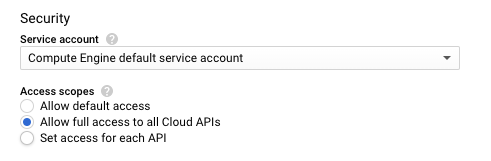
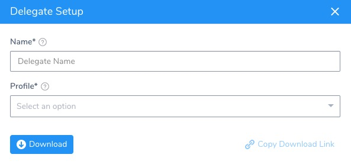
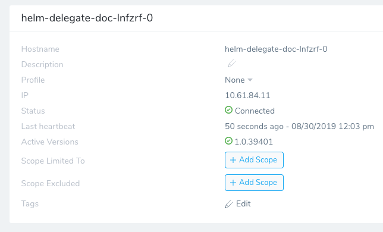
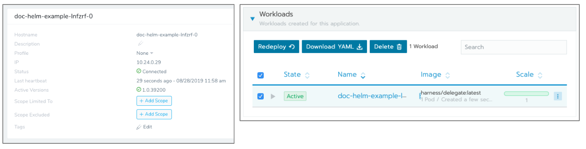

```mdx-code-block
import image_1 from './static/using-the-helm-delegate-45.png'
import image_2 from './static/using-the-helm-delegate-50.png'
import image_3 from './static/using-the-helm-delegate-51.png'
import image_4 from './static/using-the-helm-delegate-52.png'
```

The Helm Delegate can be installed on your Kubernetes cluster using the Harness Helm Delegate YAML file and Helm chart, located in the Harness Helm Delegate repo at:

`https://app.harness.io/storage/harness-download/harness-helm-charts/`

**Rancher** — The Helm Delegate can also be installed using the Kubernetes management platform, Rancher.

In this guide:

* [Before You Begin](#before-you-begin)
* [Visual Summary](#visual-summary)
* [Review: Helm Version Support](#review-helm-version-support)
* [Review: Helm Delegate Requirements](#review-helm-delegate-requirements)
* [Option 1: Install using Helm](#option-1-install-using-helm)
* [Option 2: Install Using Rancher](#option-2-install-using-rancher)
* [Troubleshooting](#troubleshooting)

:::note
Harness [on-prem installations](../../../starthere-firstgen/harness-on-premise-versions.md) do not currently support the Helm Delegate.
:::

## Before You Begin

* [Harness Key Concepts](../../../starthere-firstgen/harness-key-concepts.md)
* [Harness Delegate Overview](delegate-installation.md)
* [Delegate Requirements and Limitations](delegate-requirements-and-limitations.md)

## Visual Summary

The following diagram shows how the Delegate enables Harness to integrate with all of your deployment resources:


## Review: Helm Version Support

The Harness Helm Delegate uses Helm 3.

## Review: Helm Delegate Requirements

Ensure that the Kubernetes cluster where you are installing the Helm Delegate has the following.

### Helm Requirement

The Kubernetes cluster where you install the Helm Delegate must have Helm installed. Many Kubernetes providers have Helm installed by default.

#### Cloud Platform Permissions

Ensure that the account you use to install the Helm Delegate in your Kubernetes cluster has permissions to deploy to the target namespace. If the account does not have permissions, you might see the error:

`namespaces "default" is forbidden: User "system:serviceaccount:kube-system:default" cannot get resource "namespaces" in API group "" in the namespace "default"`

In this case, use the following kubectl command to add the user as a cluster admin:

`kubectl edit clusterrolebinding cluster-admin`

Add user to the file, save, and re-run the installation:


```
- apiGroup: rbac.authorization.k8s.io  
  kind: User  
  name: john.doe@example.com
```
Different Kubernetes platforms might require different roles for Helm to deploy to the cluster. For example, the Kubernetes Engine Cluster Admin role is required for the service account on Google Kubernetes Engine that will run the commands to install the Helm Delegate.

```mdx-code-block

```

GKE clusters also have security settings that might need to be applied. For example, the [Access Scope](https://cloud.google.com/compute/docs/access/service-accounts#accesscopesiam) might need to be set to **Allow full access to all Cloud APIs** for some clusters.




## Option 1: Install using Helm

To install the Helm Delegate using Helm commands, do the following:

1. In Harness, click **Setup**.
2. Click **Harness Delegates**.
3. In the **Harness Delegates** page, click **Download Delegate**, and then click **Helm Values YAML**. The Delegate Setup dialog appears.

   

4. In **Name**, enter a name for the Delegate. You will use this name later when you install the Delegate in Kubernetes using the command `helm install --name <delegate_name> harness-helm-repo/harness-delegate -f harness-delegate-values.yaml`.
5. In **Profile**, select a [Delegate Profile](https://harness.helpdocs.io/article/h9tkwmkrm7-delegate-installation#delegate_profiles) to apply to the Delegate. The default is named **Primary**.
6. Click **Download**. The Helm Values YAML is downloaded.
7. Open a Terminal and navigate to where the Helm Values YAML file is downloaded.
8. In the Terminal, log into the Kubernetes cluster where you want to install the Helm Delegate. In GKE, you click the **Connect** button for the cluster, and then copy and paste the login command into your Terminal.
9. Ensure that Helm is installed and is using Helm binary version 3.x. Run `helm version`.
10. Add the Harness Helm Delegate chart to the Helm repo:

  `helm repo add harness https://app.harness.io/storage/harness-download/harness-helm-charts/`

  `helm repo update`

  You will see the following output:

  `"harness-helm-repo" has been added to your repositories`

  You can use `helm search repo harness` to see the chart.

11. Install the Helm Delegate using the Helm Values YAML file you downloaded and the name you gave the Delegate (in this example, the name is **helm-delegate-doc**):

   `helm install my-release harness/harness-delegate -f harness-delegate-values.yaml`

   If you are installing into a specific namespace, you will need the `--namespace` parameter also:

   `helm install my-release harness/harness-delegate -f harness-delegate-values.yaml --namespace doc-example`

The successful output will look something like this:

```
NAME:   helm-delegate-doc  
LAST DEPLOYED: Fri Aug 30 11:22:01 2019  
NAMESPACE: doc-example  
STATUS: DEPLOYED  
  
RESOURCES:  
==> v1/ConfigMap  
NAME                         DATA  AGE  
helm-delegate-doc-configmap  17    1s  
  
==> v1/Namespace  
NAME              STATUS  AGE  
harness-delegate  Active  1s  
  
==> v1/Pod(related)  
NAME                        READY  STATUS             RESTARTS  AGE  
helm-delegate-doc-lnfzrf-0  0/1    ContainerCreating  0         1s  
  
==> v1/Secret  
NAME                      TYPE    DATA  AGE  
helm-delegate-doc-secret  Opaque  2     1s  
  
==> v1beta1/ClusterRoleBinding  
NAME                             AGE  
helm-delegate-doc-cluster-admin  1s  
  
==> v1beta1/StatefulSet  
NAME                      READY  AGE  
helm-delegate-doc-lnfzrf  0/1    1s
```
Wait a few minutes and the Helm Delegate will appear in the **Harness Delegates** page, using the name you entered when you downloaded the Helm Values YAML file:




## Option 2: Install Using Rancher

The Harness Helm Delegate integrates with [Rancher](https://rancher.com/docs/rancher/v2.x/en/) as many users now use Rancher to deploy and manage multiple Kubernetes clusters running anywhere, on any provider.

The following procedure assumes that you have a Rancher account.

To install the Helm Delegate using Rancher, do the following:

1. In Harness, click **Setup**.
2. Click **Harness Delegates**.
3. In the **Harness Delegates** page, click **Download Delegate**, and then click **Helm Values YAML**. The **Delegate Setup** dialog appears.

   

4. In **Name**, enter a name for the Delegate.
5. In **Profile**, select a [Delegate Profile](https://harness.helpdocs.io/article/h9tkwmkrm7-delegate-installation#delegate_profiles) to apply to the Delegate. The default is named **Primary**.
6. Click **SUBMIT**. The Helm Values YAML is downloaded.
7. Log into your Rancher account.
8. Click **Apps**.

    ```mdx-code-block
    
    ```

9. Click Launch.
10. In **Search**, enter **Harness**. The **Harness Delegate** app appears.

    ```mdx-code-block
    
    ```

11. Click **View Details**. Next, you will use the Helm Values YAML file you downloaded to fill out the fields in the Harness Delegate app in Rancher.
12. Open the Helm Values YAML you downloaded in a text editor. It will look something like this:

    ```
    # Account Id to which the delegate will be connecting  
    accountId: xxxxxxxxx  
      
    # Secret identifier associated with the account  
    delegateToken: xxxxxxxxx  
      
    # Short 6 character identifier of the account  
    accountIdShort: lnfzrf  
      
    delegateName: doc-helm-example  
      
    # Id of the delegate profile that needs to run when the delegate is  
    # coming up  
    delegateProfile: ""  
      
    managerHostAndPort: https://app.harness.io  
    watcherStorageUrl: https://app.harness.io/storage/wingswatchers  
    watcherCheckLocation: watcherprod.txt  
    delegateStorageUrl: https://app.harness.io/storage/wingsdelegates  
    delegateCheckLocation: delegateprod.txt
    ```
    
In **Rancher**, use the Helm Values YAML file to enter the following:

1. in **Name**, enter a name for the Delegate App.
2. In **Namespace**, enter the Kubernetes namespace in the target cluster where you want the Delegate installed. To see the **Namespace** field, you might need to change to the Project in Rancher:

    ```mdx-code-block
    
    ```

3. In **Account ID**, enter the value used for `accountId`.
4. In **Account Secret**, enter the value used for `delegateToken`.
5. In **Short Account ID**, enter the value used for `accountIdShort`.
6. In **Delegate Name**, enter the name used for the `delegateName`.
7. To set advanced configurations, in **Show Advanced Server Configurations**, click **True**, and change the defaults. This is rarely necessary.

:::note
The **Helm version** setting can be used to control the Helm version, but ensure that the Helm and Tiller versions match.
:::

To set proxy configurations, in **Show Advanced Proxy Configurations**, click **True**, and change the defaults. This is rarely necessary. The proxy settings are visible in the Helm Values YAML file you downloaded also.

When you are finished setting up the Delegate, click **Launch**. Rancher will launch the Helm Delegate.

In a few minutes, the Helm Delegate appears in Harness in the **Harness Delegates** page. Here is the Helm Delegate and its corresponding Rancher status page:




## Troubleshooting

The Helm Delegate installation requires that admin privileges in the cluster. If the user account you use to install the Delegate does not have these privileges, you might see the following error:

`namespaces "default" is forbidden: User "system:serviceaccount:kube-system:default" cannot get resource "namespaces" in API group "" in the namespace "default"`

To add the user account to the cluster admin group, enter:

`kubectl edit clusterrolebinding cluster-admin`

Add user to file and save:


```
- apiGroup: rbac.authorization.k8s.io  
 kind: User  
 name: john.does@harness.io
```
