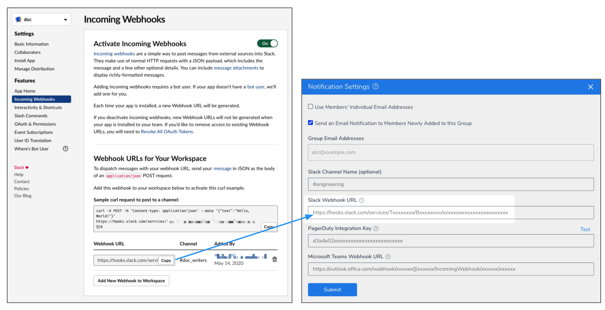
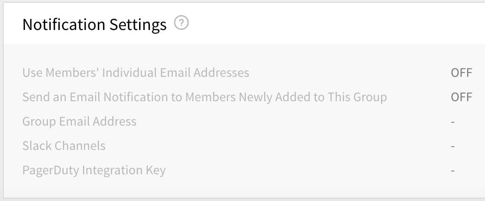

You can receive Harness notifications in your Slack channels. You simply add a Slack Incoming Webhook into a Harness User Groups' Notification Settings.

Then you can add your User Group to a Workflow [Notification Strategy](../../../continuous-delivery/model-cd-pipeline/workflows/add-notification-strategy-new-template.md) and other settings and receive deployment and alert info in Slack. 

In this topic:

* [Before You Begin](#before-you-begin)
* [Visual Summary](#visual-summary)
* [Step 1: Create a Slack App and Webhook for your Channel](#step-1-create-a-slack-app-and-webhook-for-your-channel)
* [Step 2: Add the Webhook to the User Group Notification Settings](#step-2-add-the-webhook-to-the-user-group-notification-settings)
* [Related Topics](#related-topics)

## Before You Begin

* [Manage User Notifications](notification-groups.md)

## Visual Summary

Adding a Slack channel to your Harness User Groups **Notification Settings** is as simple as pasting in a Slack Webhook:

## Step 1: Create a Slack App and Webhook for your Channel

Follow the steps in Slack documentation for creating a Slack app, selecting your channel, and creating a webhook:  [Sending messages using Incoming Webhooks](https://api.slack.com/messaging/webhooks).

When you are done, you'll have a webhook that looks something like this:

Copy the Webhook.

## Step 2: Add the Webhook to the User Group Notification Settings

1. In Harness Manager, click **Continuous Security**, and then click **Access Management**.
2. In **Access Management**, click **User Groups**.
3. Click the name of an existing User Group, or create a new User Group with the steps in  [Managing Users and Groups (RBAC)](../../security/access-management-howtos/users-and-permissions.md).
4. Locate the **Notification Settings** section.

5. Click more options (⋮), then click **Edit**. The **Notification Settings** appear.
6. Paste the Webhook into **Slack Webhook URL** and click **Submit**.

Now your Slack channel will be used to notify this User Group when it is added to a Workflow [Notification Strategy](../../../continuous-delivery/model-cd-pipeline/workflows/add-notification-strategy-new-template.md), as well as other alerts.

## Related Topics

* [Send Slack Messages from Workflows](slack-notifications.md)

