Harness notifies your User Groups of events in Workflows, Pipelines, Delegates, Service Guard 24/7, and general alerts.

You can integrate your Harness User Group with Microsoft Teams and receive notifications in Teams channels.

Setup is a simple process of generating a Webhook in Microsoft Teams and adding it to a Harness User Group. Let's get started.

## Before You Begin

Review the following topics to understand Harness notification and alert options:

* [Manage User Notifications](notification-groups.md)
* [Add a Workflow Notification Strategy](../../../continuous-delivery/model-cd-pipeline/workflows/add-notification-strategy-new-template.md)
* [Manage Alert Notifications](manage-alert-notifications.md)

We assume that you have a Microsoft Teams administrator account.

## Visual Summary

As stated earlier, setup is a simple process of generating a Webhook in Microsoft Teams and adding it to a Harness User Group.

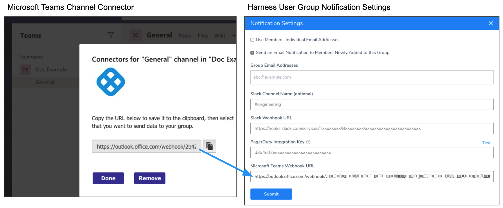

The following steps walk you through this process.

Here's a video summary:

<docvideo src="https://www.youtube.com/embed/fz8suWNHk1g" />

## Step 1: Create Connector for Microsoft Teams Channel

You create a channel connector in Microsoft Teams to generate the Webhook Harness needs for notification.

1. In Microsoft Teams, right-click the channel where you want to send notifications, and select **Connectors**.

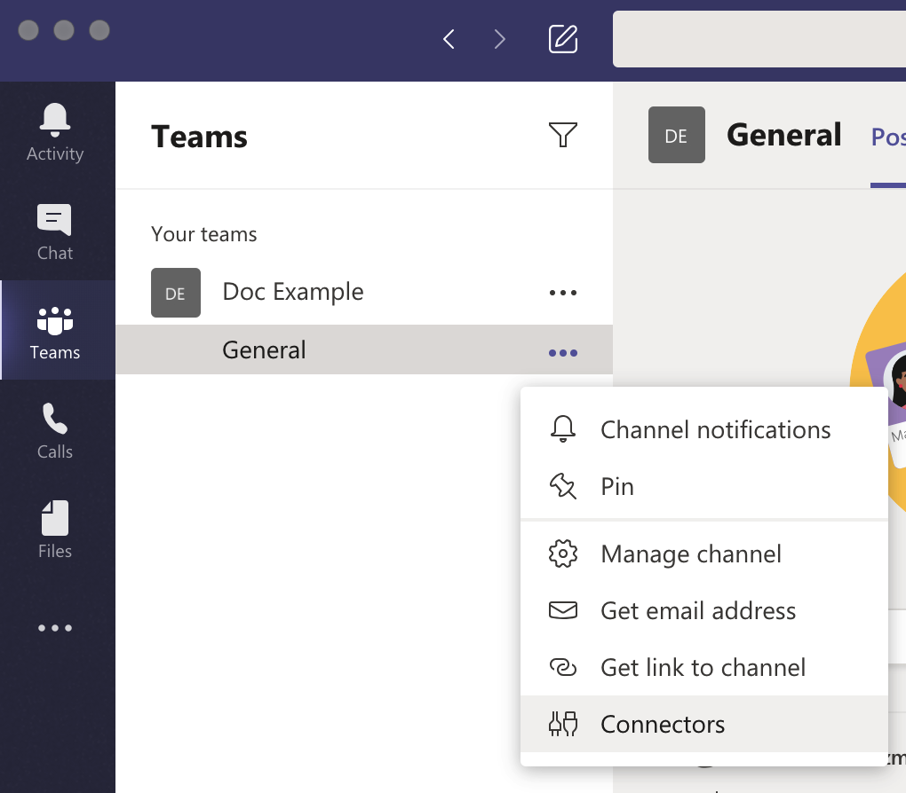

2. In **Connectors**, locate **Incoming Webhook**, and click **Configure**.

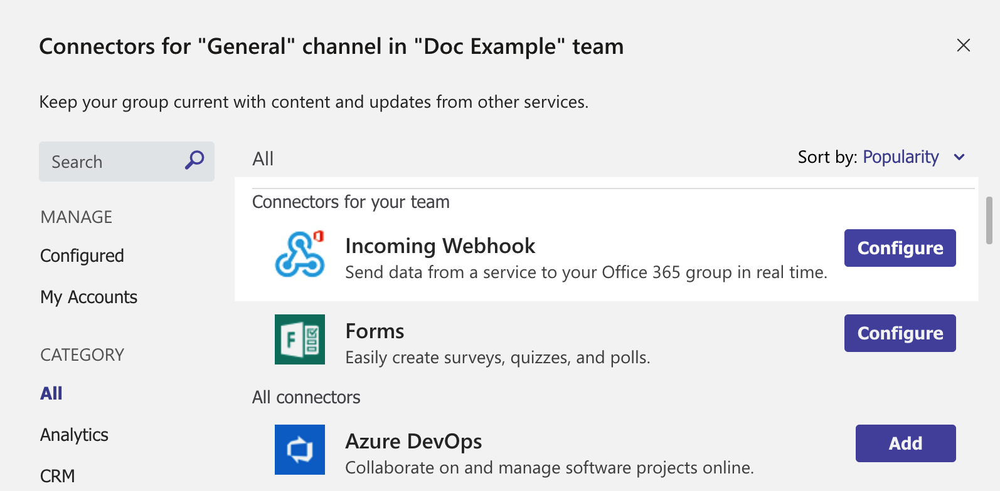

3. In **Incoming Webhook**, enter a name, such as **Harness**.
4. Right-click [here](https://github.com/wings-software/harness-docs/blob/main/harness_logo.png)
 and click **Save Link As** to download the Harness icon, or right-click and save the image from here:
 
 

5. Click **Upload Image** and add the Harness icon you downloaded.

Next, you'll create the Webhook URL needed by Harness.

## Step 2: Generate Channel Webhook

1. In your Microsoft Teams Connector, click **Create**. The Webhook URL is generated.

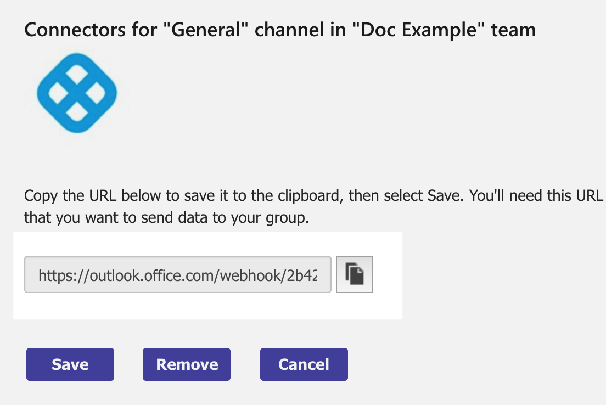

2. Click the copy button to copy the Webhook URL, and then click **Done**.

The channel indicates that the Connector was set up.

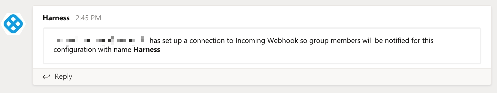

Next, you will add the Webhook URL to the Harness User Group you want to notify using Microsoft Teams.

## Step 3: Add Webhook to Harness User Group Notifications Settings

1. In Harness, click **Continuous Security**, and then click **Access Management**.
2. Click **User Groups**.
3. In **User Groups**, select the User Group you want to receive Microsoft Teams notifications.
4. In **Notification Settings**, click **Edit**.

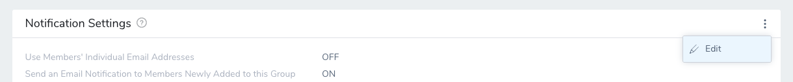

5. In **Microsoft Teams Webhook URL**, enter the Webhook URL you copied from your Microsoft Teams connector.

6. Click **Submit**.

That's it. Your Microsoft Teams channel will now receive notifications for events in Workflows, Pipelines, Delegates, Service Guard 24/7, and general alerts.

Click back in User Groups to see that the User Group now indicates that it is integrated with Microsoft Teams:

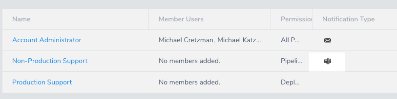


## Example: Workflow Notification Strategy

The most common example of notifications is a [Workflow Notification Strategy](../../../continuous-delivery/model-cd-pipeline/workflows/add-notification-strategy-new-template.md).

When you add the User Group to the Notification Strategy of a Workflow, you will see the Microsoft Teams icon next to its name:

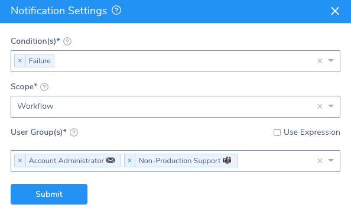
Let's look at an example message sent to the integrated Microsoft Teams channel when a Workflow is aborted:

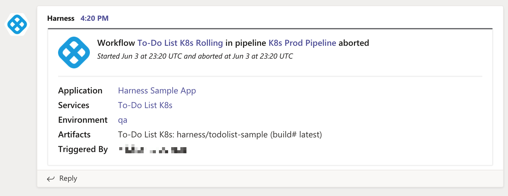
You can click any links in the message to open the corresponding Harness components.

For Workflow notifications to Microsoft Teams, ensure that the **Send notification to me only** option in the **Start New Deployment** setting is not selected:

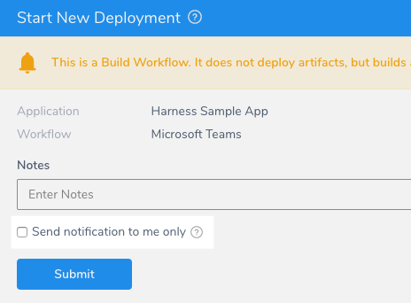


## Option: Send a Message to Microsoft Teams using cURL

You can send a message to any Microsoft Teams channel that has a Webhook enabled using cURL.

Here is an example of a Harness [Shell Script](../../../continuous-delivery/model-cd-pipeline/workflows/capture-shell-script-step-output.md) step in a Workflow executing the cURL command:

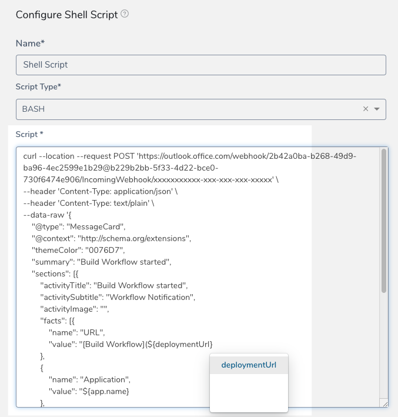

You will notice that Harness built-in and custom Workflow variable expressions can be used in the message. See [Variables and Expressions in Harness](../../techref-category/variables/variables.md) and [Set Workflow Variables](../../../continuous-delivery/model-cd-pipeline/workflows/add-workflow-variables-new-template.md).

Here is an example of the cURL command in the Shell Script step:


```
curl --location --request POST 'https://outlook.office.com/webhook/xxxxx-xxx-xxx-xxx-xxxx@xxxx-xxx-xxx-bce0-xxx/IncomingWebhook/xxxxxxxxxxx-xxx-xxx-xxx-xxxxx' \  
--header 'Content-Type: application/json' \  
--data-raw '{  
    "@type": "MessageCard",  
    "@context": "http://schema.org/extensions",  
    "themeColor": "0076D7",  
    "summary": "Rolling Workflow started",  
    "sections": [{  
        "activityTitle": "Rolling Workflow started",  
        "activitySubtitle": "Workflow Notification",  
        "activityImage": "",  
        "facts": [{  
            "name": "URL",  
            "value": "[Rolling Workflow](${deploymentUrl}"  
        },  
        {  
            "name": "Application",  
            "value": "${app.name}"  
        },  
        {  
            "name": "Services",  
            "value": "${service.name}"  
        },  
        {  
            "name": "Artifacts",  
            "value": "${artifact.buildFullDisplayName}"  
        },  
        {  
        	"name": "Triggered By",  
            "value": "${deploymentTriggeredBy}"  
        }],  
        "markdown": true  
    }]  
}'
```
