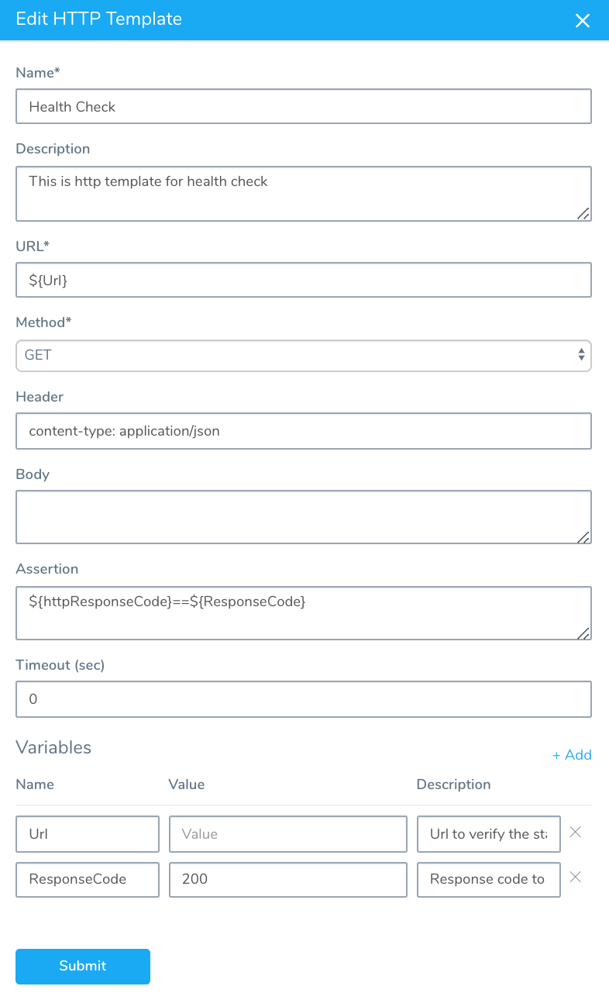
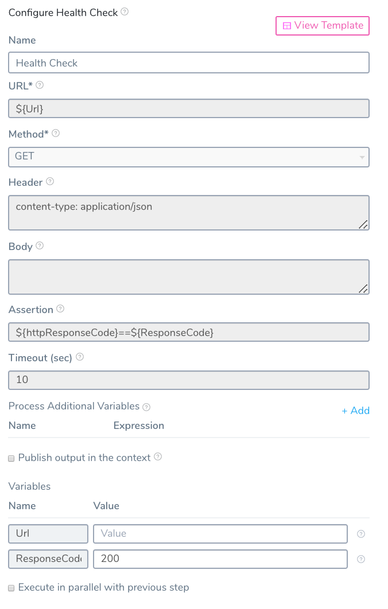

You can use Template Library to create templates of scripts and other commands and copy or link them into Harness Services and Workflows. Templates are created in the Template Library. Each template can have multiple versions with unique variables.

:::note
When creating a template, type `${...}` in a field, then enter the variable name to create a template variable. Also Template variable names cannot contain hyphens or dots (`.`) between names.
:::

HTTP templates contain HTTP URLs, methods, headers, assertions, and variables. You can use the HTTP template in a Harness Workflow.

:::note
Only members of a Harness User Group with the **Manage Template Library** permission may create, edit, and delete Account and Application-level templates. Members of a User Group with this permission disabled can view and link to templates only.
:::

In this topic:

* [Before You Begin](#before-you-begin)
* [Step: Create HTTP Template](#step-create-http-template)
* [Next Steps](#next-steps)

## Before You Begin

* [Account and Application Templates](../../../continuous-delivery/concepts-cd/deployment-types/use-templates.md)
* [Add a Service](../../../continuous-delivery/model-cd-pipeline/setup-services/service-configuration.md)
* [Add a Workflow](../../../continuous-delivery/model-cd-pipeline/workflows/workflow-configuration.md)

## Step: Create HTTP Template

To create a HTTP template, do the following:

1. Click **Setup**.
2. In **Account**, click **Template Library**.
3. Click the template folder where you want to add your new template.
4. Click **Add Template** and select the **HTTP** template type. The **Add HTTP Template** settings appear.  

|  |  |
| --- | --- |
| **Field** | **Description** |
| **Name** | Enter a name for your template. Use a name that describes the purpose of the template. |
| **Description** | Enter a description for the template. |
| **URL** | Enter the URL for the HTTP call. |
| **Method** | Select the [HTTP method](https://restfulapi.net/http-methods/#summary). |
| **Header** | Enter the media type for the message. For example, if you are using the GET method, the header is used to specify the GET response body message type Harness will check, such as **content-type: application/json**. |
| **Body** | Enter the message body (if any) of the HTTP message. |
| **Assertion** | The assertion is used to validate the incoming response or request. For example, if you wanted to check the health of an HTTP connection, you could use the assertion **${httpResponseCode}==200**. |
| **Timeout** | Enter a value, in seconds, for how long Harness should wait for a response from the server you specified in **URL**. |
| **Variables** | Enter the variable names and default values you want to use in the template. When a user adds or links this template to a Workflow, the user will provide the values for the variables. Using our assertion example above, you could create a variable named **ResponseCode** and give it a value of **200**. Next, in the Assertion field, you could use the variable like this: **${httpResponseCode}==${ResponseCode}**. The variable name shouldn't include dots(.). |

  
The following table displays the HTTP template in the Template Library and the applied template in a Workflow. Notice how the variable names defined in the template are greyed out in the applied template, and only the variable values are editable.

|  |  |
| --- | --- |
| **Template in Template Library** | **Template Applied in a Workflow** |
|  |  |

## Next Steps

* [Create a Shell Script Workflow Step Template](create-a-shell-script-workflow-step-template.md)
* [Create a Service Command Template](create-a-service-command-template.md)
* [Add Service Command Templates into Command Units](add-service-command-templates-into-command-units.md)
* [Link Templates to Services and Workflows](link-templates-to-services-and-workflows.md)

