You can add multiple Service commands into a single template as a Service Command Unit. You can share and change variables across the commands in the unit, and then use the unit in Services and Workflows just like an individual Service command.

Here is an example of a Service Command Unit named **MyServiceTest** that contains the Service command **MeetAndCheck** and two instances of the Service command **ServiceCheck**.

In this topic:

* [Before You Begin](#before-you-begin)
* [Review: Differences between Service Command and Shell Script Template Types](#review-differences-between-service-command-and-shell-script-template-types)
* [Step 1: Create a Service Command Unit](#step-1-create-a-service-command-unit)
* [Step 2: Add Service Command Unit to a Workflow](#step-2-add-service-command-unit-to-a-workflow)
* [Next Steps](#next-steps)

## Before You Begin

* [Account and Application Templates](../../../continuous-delivery/concepts-cd/deployment-types/use-templates.md)
* [Create a Service Command Template](create-a-service-command-template.md)
* [Add a Service](../../../continuous-delivery/model-cd-pipeline/setup-services/service-configuration.md)
* [Add a Workflow](../../../continuous-delivery/model-cd-pipeline/workflows/workflow-configuration.md)

## Review: Differences between Service Command and Shell Script Template Types

Harness provides different methods for executing scripts in the Service Command and Shell Script Template types:

* **Service Command Template**: a Service Command can run multiple scripts, including built-in scripts Harness provides, like the [Exec](../../../continuous-delivery/model-cd-pipeline/setup-services/service-types-and-artifact-sources.md#exec-script) and [Copy Artifact](../../../continuous-delivery/model-cd-pipeline/setup-services/service-types-and-artifact-sources.md#copy-and-download-of-metadata-artifact-sources) scripts.  
When run on the target host, the commands are copied to the target host and run as an input parameter like `./internal-executor.sh script.sh` where `script.sh` is the script you provide. This is done using the Bourne shell (sh).
* **Shell Script Template:** a Shell Script step runs a single script.  
When run on the target host, the script is run inline using the Bash shell.

### Where are they executed?

Both Service Commands and Shell Scripts can be executed on the target host or the Harness Delegate.

When you create the templates, you do not pick where to deploy it.

When you apply the template, you use the **Execute on Delegate** option to run the script on the Delegate host, and the **Delegate Selector** option to pick specific Delegates, if desired.

* **Run on target host:** Harness moves the complete script to the target host (VM, pod, etc), and then executes the script.
* **Run on Delegate:** Harness doesn't copy any file to the target host. Harness executes the script on the Delegate directly.

## Step 1: Create a Service Command Unit

To create a Service Command Unit, do the following:

1. In a **Template Library** (Application or Shared), create the individual Service commands that you want to use as a unit.
2. Create a Service Command Unit by adding the Service commands to one Service Command.
	1. Click **Add Template**, and click **Service Command**.
	2. In **Name**, enter a name for the new Service command.
	3. In **Variables**, add any variables that you want to use in the subordinate commands. You can leave **Variables** empty, and when you add subordinate commands their variables will be added to the **Variables** section.
	4. Click **Submit**. The Service Command is created.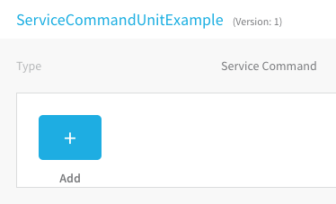

	5. Click **Add** to add the subordinate Service commands. The Service commands in the same folder are displayed.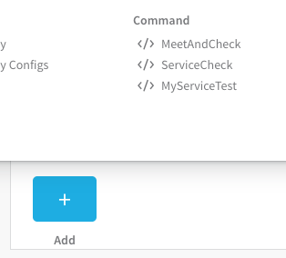

	6. Click a command. The command's dialog appears, and you can change any variables in the command.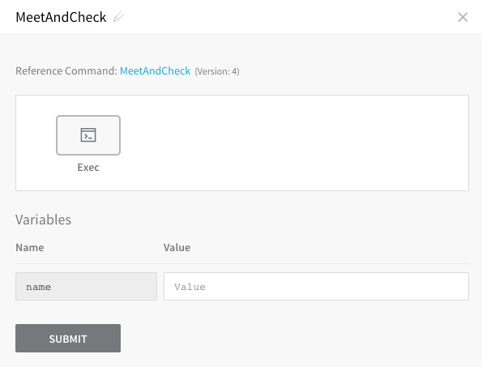

	7. Click **Submit**.  
	  
	If you click the parent Service Command Unit's name you will see that the variable from the subordinate Service command you added is now in the parent Service command's **Variables** section.

	8. Add any more Service commands to the unit. All of the variables used in the subordinate commands are also added to the parent Service command's **Variables** section.
		1. You can also add the same Service command more than once and Harness will add a **-*****number*** suffix to their names.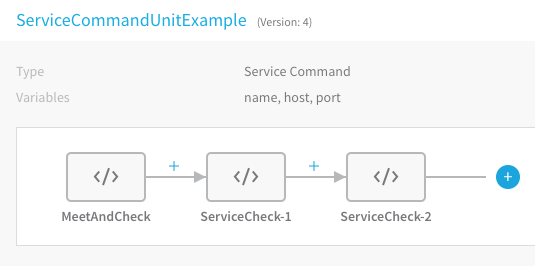

		2. You can also use different versions of the same command in the unit: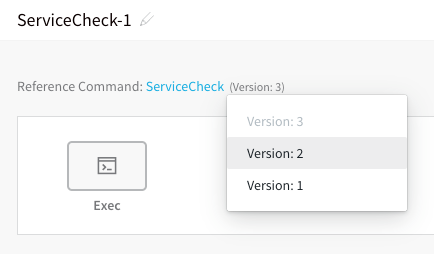

		3. You can also add a variable to the parent Service command, and use it in a subordinate Service command.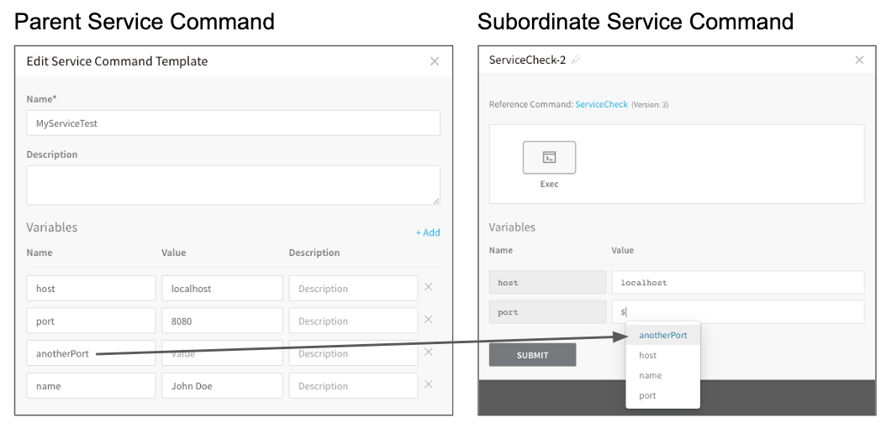

	9. When you are done, link the Service Command Unit to a Service. In the Service, click **Add Command**, and select the Service Command Unit from a Template Library by clicking its **Link** button.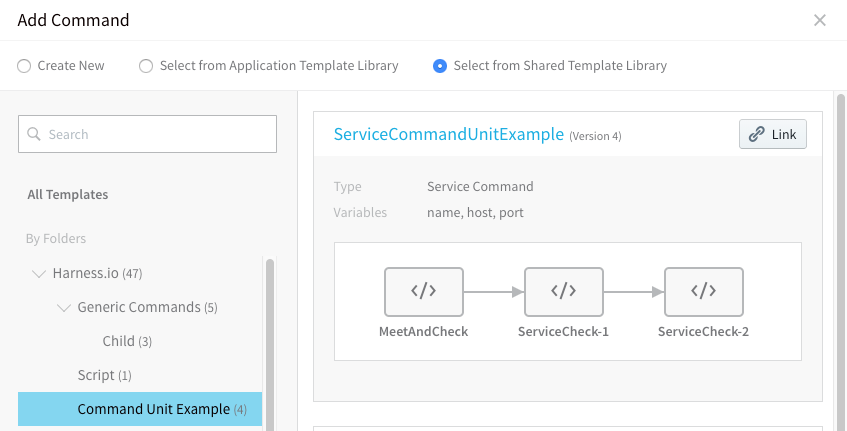
You will be prompted to replace any Service command variables.

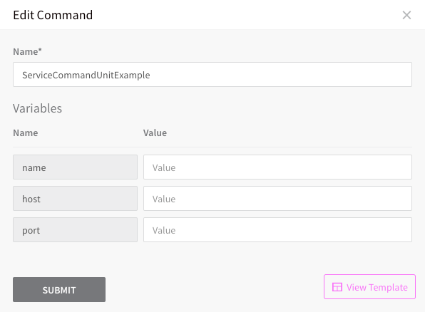

	10. Change any variables, if needed, and click **Submit**. The Service Command Unit is added to the Service.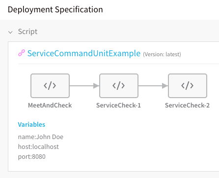

## Step 2: Add Service Command Unit to a Workflow

The Service Command Unit can be added to Workflow in two ways:

* [From Template Library](add-service-command-templates-into-command-units.md#template-library)
* [From the Service in the Workflow](add-service-command-templates-into-command-units.md#service-in-the-workflow)

### Template Library

1. In the Workflow, click **Add Command**, and select the Service Command Unit from a Template Library.

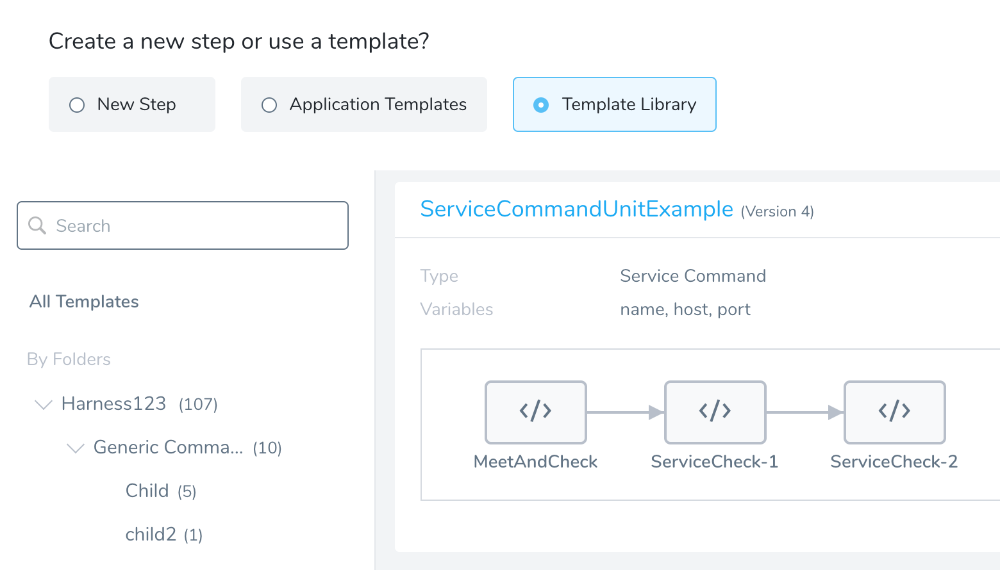

### Service in the Workflow

1. When you create a Workflow you select a Harness Service to deploy. If the Service contains a Service Command Unit, click **Add Command** and the Service Command Unit is available in the **Commands** options.

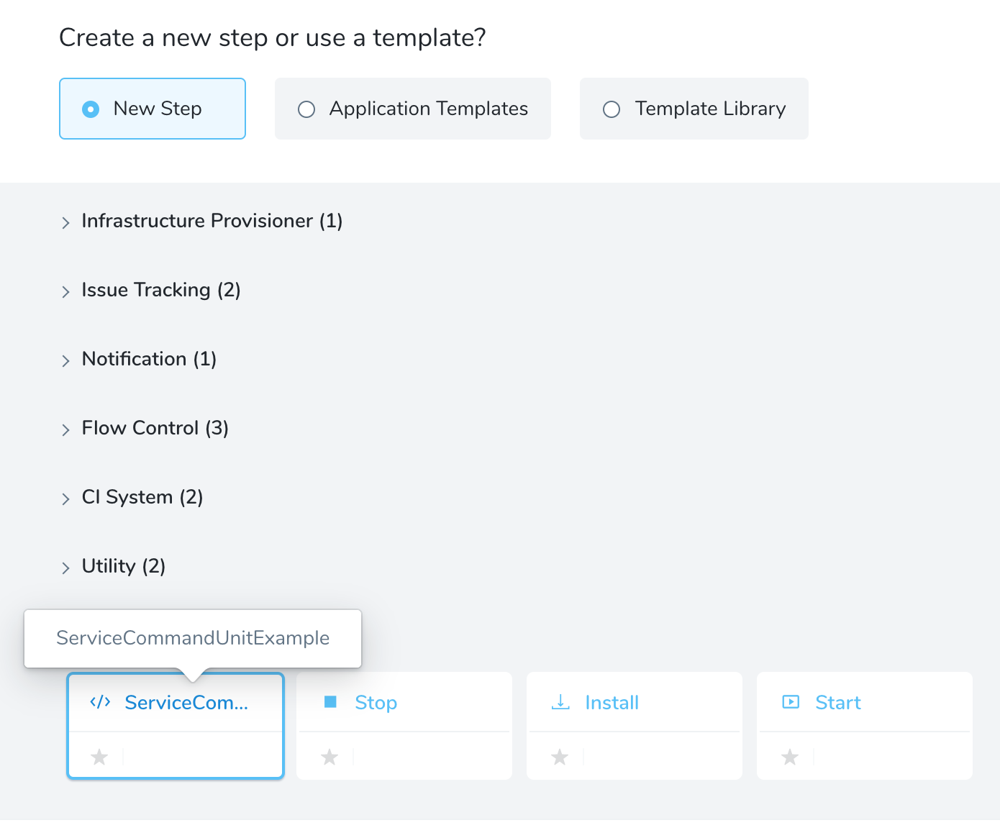

### Notes

The same Service Command Unit added from the Template Library is different from the Service Command Unit added via the Service:

* The Service Command Unit added from a Template Library will contain the variable values set in the Template Library.
* The Service Command Unit added from the Service will contain the variable values set in the Service.

## Next Steps

* [Link Templates to Services and Workflows](link-templates-to-services-and-workflows.md)

