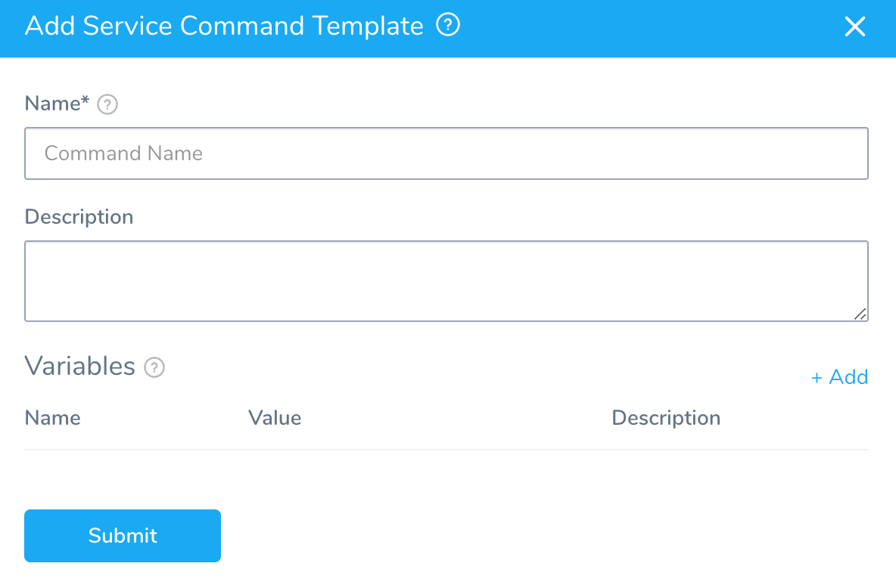
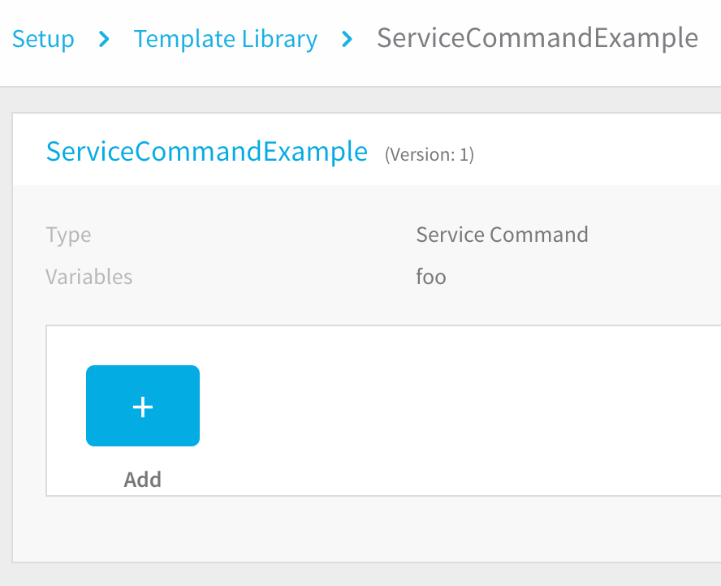
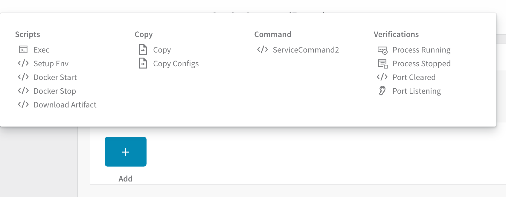
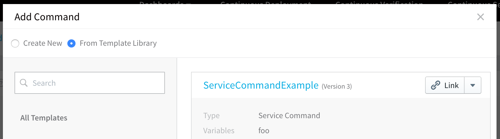
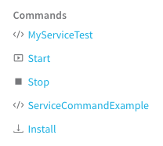

You can use Template Library to create templates of scripts and other commands and copy or link them into Harness Services and Workflows.

To add bash and PowerShell commands to Services, you can create templates using a Service Command template. You can add variables to the template and have values supplied to the variables in the Service using the template.

Only members of a Harness User Group with the **Manage Template Library** permission may create, edit, and delete Account and Application-level templates. Members of a User Group with this permission disabled can view and link to templates only.

In this topic:

* [Before You Begin](#before-you-begin)
* [Review: Differences between Service Command and Shell Script Template Types](#review-differences-between-service-command-and-shell-script-template-types)
* [Step: Create a Service Command](#step-create-a-service-command)
* [Next Steps](#next-steps)

## Before You Begin

* [Account and Application Templates](../../../continuous-delivery/concepts-cd/deployment-types/use-templates.md)
* [Add a Service](../../../continuous-delivery/model-cd-pipeline/setup-services/service-configuration.md)
* [Add a Workflow](../../../continuous-delivery/model-cd-pipeline/workflows/workflow-configuration.md)

## Review: Differences between Service Command and Shell Script Template Types

Harness provides different methods for executing scripts in the Service Command and Shell Script Template types:

* **Service Command Template**: a Service Command can run multiple scripts, including built-in scripts Harness provides, like the [Exec](../../../continuous-delivery/model-cd-pipeline/setup-services/service-types-and-artifact-sources.md#exec-script) and [Copy Artifact](../../../continuous-delivery/model-cd-pipeline/setup-services/service-types-and-artifact-sources.md#copy-and-download-of-metadata-artifact-sources) scripts.  
When run on the target host, the commands are copied to the target host and run as an input parameter like `./internal-executor.sh script.sh` where `script.sh` is the script you provide. This is done using the Bourne shell (sh).
* **Shell Script Template:** a Shell Script step runs a single script.  
When run on the target host, the script is run inline using the Bash shell.

#### Where are they executed?

Both Service Commands and Shell Scripts can be executed on the target host or the Harness Delegate.

When you create the templates, you do not pick where to deploy it.

When you apply the template, you use the **Execute on Delegate** option to run the script on the Delegate host, and the **Delegate Selector** option to pick specific Delegates, if desired.

* **Run on target host:** Harness moves the complete script to the target host (VM, pod, etc), and then executes the script.
* **Run on Delegate:** Harness doesn't copy any file to the target host. Harness executes the script on the Delegate directly.

## Step: Create a Service Command

To create a Service Command, do the following:

1. Click **Setup**.
2. In **Account**, click **Template Library**.
3. Click the template folder where you want to add your new template.
4. Click **Add Template** and select the **Service Command** template type. The **Add Service Command Template** settings appear.

5. Enter a name and description for the command.
6. In **Variables**, click **Add** to add variables to the template. You can set a default value. The variable value can be supplied or replaced when the template is used in a Service.
7. Click **Submit**. The new Service Command template is created.

8. Hover over **Add** to see the list of available subcommands to add to the template.

9. Click a subcommand to see its script and make any changes.
10. To use the template in a Service, click **Add Command** in the Service and then click **From Template Library**. The template is displayed.

11. Click **Link** to link to the template. You can then edit the template in your Service, providing values for the variables in the template. When you use this Service in a Workflow, the Service command will be available as a step.

## Step: Run Service Commands From a Template Library in a Workflow

One of the steps you can include in a Harness Workflow is a **Service Command** step.

You can link a Service Command to a Workflow as a step and its script will be run on the target host(s) or Harness Delegate.

:::note
Template variable names cannot contain hyphens or dots (`.`) between names.
:::

In a Harness Application, open a Workflow and then click **Add Step**.

1. Select **Template Library** to select the Service Command from the Template Library. You can also select **Application Templates** to select from the command from the Application Template Library.
2. Locate your command and click **Link**.
3. Set the **Timeout** period for your Service Command. If the command execution hangs beyond the timeout, Harness will fail the step.
4. Select **Execute on Delegate** option if you wish to execute Workflow on Harness Delegate. This option allow users to select Delegates on Service commands.
5. In **Delegate Selector** enter the Selectors of the Delegates you want to use.  
  
You can use Selectors to select which Harness Delegates to use when executing the Service Command step. For more information, see [Select Delegates with Selectors](../manage-delegates/select-delegates-for-specific-tasks-with-selectors.md).
	* Harness will use Delegates matching the Selectors you select.
	* If you use one Selector, Harness will use any Delegate that has that Selector.
	* If you select two Selectors, a Delegate must have both Selectors to be selected. That Delegate might also have other Selectors, but it must have the two you selected.
	* Selectors can be used whether **Execute on Delegate** is enabled or not. The Shell Script command honors the Selector and executes the SSH connection to the specified target host via the selected Delegate. An example where Selectors might be useful when **Execute on Delegate** is disabled: When you specify an IP address in **Target Host**, but you have 2 VPCs with the same subnet and duplicate IP numbers exist in both. Using Selectors, you can scope the the shell session towards the delegate in a specific VPC.
	* You can also use [Harness variable expressions](../../techref-category/variables/variables.md). For example, if you have a Workflow variables named delegate, you can enter `$(workflow.variables.delegate)`. When you deploy the Workflow, you can provide a value for the variable that matches a Delegate Selector.
6. If you do not select **Execute on Delegate** option and want to run it in another host, enter the following details:
	1. **Target Host**: In **Target Host**, enter the IP address or hostname of the remote host where you want to execute the script. The target host must be in the **Infrastructure Definition** selected when you created the workflow, and the Harness Delegate must have network access to the target host. You can also enter the variable `${instance.name}` and the script will execute on whichever target host is used during deployment.
	2. **Connection Type**: Select **WinRM** or **SSH**.

7. Click **Submit**.

## Next Steps

* [Create an HTTP Workflow Step Template](account-and-application-templates.md)
* [Create a Shell Script Workflow Step Template](create-a-shell-script-workflow-step-template.md)
* [Link Templates to Services and Workflows](link-templates-to-services-and-workflows.md)
* [Add Service Command Templates into Command Units](add-service-command-templates-into-command-units.md)

