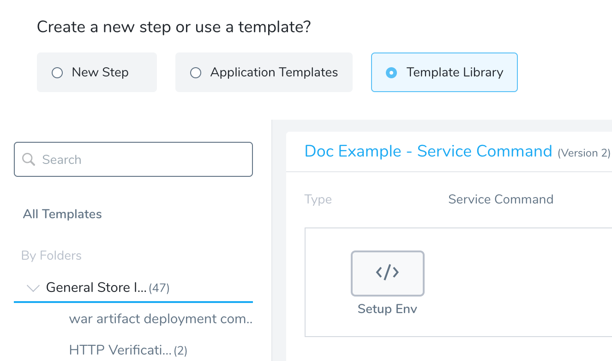
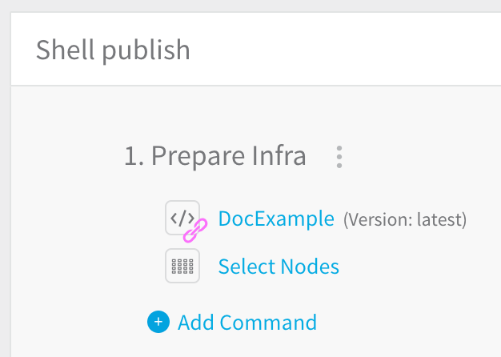

You can use Template Library to create templates of scripts and other commands and copy or link them into Harness Services and Workflows. Templates are created in the Template Library. Each template can have multiple versions with unique variables.

:::note
When creating a template, type `${...}` in a field, then enter the variable name to create a template variable.
:::

Shell Script templates contain Bash and PowerShell commands and parameters. You can enter variables into the template, apply the template to Workflows, and have the Workflow enter Workflow-specific values for the command.

:::note
Only members of a Harness User Group with the **Manage Template Library** permission may create, edit, and delete Account and Application-level templates. Members of a User Group with this permission disabled can view and link to templates only.
:::

In this topic:

* [Before You Begin](create-a-shell-script-workflow-step-template.md#before-you-begin)
* [Review: Differences between Service Command and Shell Script Template Types](#review-differences-between-service-command-and-shell-script-template-types)
* [Step: Create a Shell Script Template](#step-create-a-shell-script-template)
* [Next Steps](#next-steps)

## Before You Begin

* [Account and Application Templates](../../../continuous-delivery/concepts-cd/deployment-types/use-templates.md)
* [Add a Service](../../../continuous-delivery/model-cd-pipeline/setup-services/service-configuration.md)
* [Add a Workflow](../../../continuous-delivery/model-cd-pipeline/workflows/workflow-configuration.md)
* [Using the Shell Script Command](../../../continuous-delivery/model-cd-pipeline/workflows/capture-shell-script-step-output.md)

## Review: Differences between Service Command and Shell Script Template Types

Harness provides different methods for executing scripts in the Service Command and Shell Script Template types:

* **Service Command Template**: a Service Command can run multiple scripts, including built-in scripts Harness provides, like the [Exec](../../../continuous-delivery/model-cd-pipeline/setup-services/service-types-and-artifact-sources.md#exec-script) and [Copy Artifact](../../../continuous-delivery/model-cd-pipeline/setup-services/service-types-and-artifact-sources.md#copy-and-download-of-metadata-artifact-sources) scripts.  
When run on the target host, the commands are copied to the target host and run as an input parameter like `./internal-executor.sh script.sh` where `script.sh` is the script you provide. This is done using the Bourne shell (sh).
* **Shell Script Template:** a Shell Script step runs a single script.  
When run on the target host, the script is run inline using the Bash shell.

### Where are they executed?

Both Service Commands and Shell Scripts can be executed on the target host or the Harness Delegate.

When you create the templates, you do not pick where to deploy it.

When you apply the template, you use the **Execute on Delegate** option to run the script on the Delegate host, and the **Delegate Selector** option to pick specific Delegates, if desired.

* **Run on target host:** Harness moves the complete script to the target host (VM, pod, etc), and then executes the script.
* **Run on Delegate:** Harness doesn't copy any file to the target host. Harness executes the script on the Delegate directly.

## Step: Create a Shell Script Template

To create a Shell Script template, do the following:

1. Click **Setup**.
2. In **Account**, click **Template Library**.
3. Click the template folder where you want to add your new template.
4. Click **Add Template** and select the **Shell** **Script** template type. The **Add Shell Script Template** settings appear.
5. Enter a name for your script. Use a name that describes the purpose of the script.
6. In **Script**, fill out the Shell Script command as described in [Using the Shell Script Command](../../../continuous-delivery/model-cd-pipeline/workflows/capture-shell-script-step-output.md). The article describe how to create variables in the template, for example, `${myVar}`.
7. Click **Submit** to create the script. The script appears with a list of the variables you created.
8. Next, apply the Shell Script template as a command in a Workflow. In a Workflow, simply click **Add Command**, and select **Template Library**. The Shell Script template appears.

9. Click **Link** to link to the template. You can then edit the template in your Workflow, providing values for the variables in the template.  
  
The following table displays the Shell Script template in the Template Library and the applied template in a Workflow. Notice how the variable names defined in the template are greyed out in the applied template, and only the variable values are editable:  
  

|  |  |
| --- | --- |
| **Template in Template Library** | **Template Applied in a Workflow** |
|  |  |

  
Once the Shell Script template is linked and added to the workflow, a link icon appears next to the command:

## Next Steps

* [Create an HTTP Workflow Step Template](account-and-application-templates.md)
* [Create a Service Command Template](create-a-service-command-template.md)
* [Add Service Command Templates into Command Units](add-service-command-templates-into-command-units.md)
* [Link Templates to Services and Workflows](link-templates-to-services-and-workflows.md)

