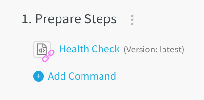

You can link a template to a Service or Workflow. The templates available for linking depend on whether you are adding them to a Service or Workflow. For example, if you are adding a command in a Service, then the templates available to you will be Bash and PowerShell scripts. If you are in a Workflow that deploys to a an AWS cloud provider, then HTTP templates are available.

When you add a command by linking to a Template, the Template often shows you Template variables that require values. These values are mandatory.In this topic:

* [Before You Begin](#before-you-begin)
* [Link Template to a Service](#link-template-to-a-service)
* [Link Template to a Workflow](#link-template-to-a-workflow)
* [Next Steps](#next-steps)

## Before You Begin

* [Account and Application Templates](../../../continuous-delivery/concepts-cd/deployment-types/use-templates.md)
* [Create an HTTP Workflow Step Template](account-and-application-templates.md)
* [Create a Shell Script Workflow Step Template](create-a-shell-script-workflow-step-template.md)
* [Create a Service Command Template](create-a-service-command-template.md)
* [Add Service Command Templates into Command Units](add-service-command-templates-into-command-units.md)

## Link Template to a Service

To link a template to a Service, do the following:

1. In **Setup**, click an application, and in **Services**, click a Service. The **Service** settings appear.
2. Click **Add Command**. The **Add Command** settings appear.
3. Click **From Template Library**. The Template Library appears.
4. Locate the template you want, and click the **Link** button.
5. Provide values for the template variables and click **Submit**.  
  
The template is added to the service and linked. You can see the **Version:** and **Template icon** next to the entity you selected. For example:

## Link Template to a Workflow

To link a template to a Workflow, do the following:

1. In **Setup**, click an application, and in **Workflows**, click a Workflow. The **Workflow** settings appear.
2. In the Workflow steps, click **Add Command**.
3. Click **From Template Library**. The **Template Library** settings appear.
4. Locate the template you want, and click the **Link** button.
5. Provide values for the template variables and click **SUBMIT**.  
  
The template is added to the workflow and linked. You can see the **Version:** and **Link icon** next to the entity you selected. For example:

