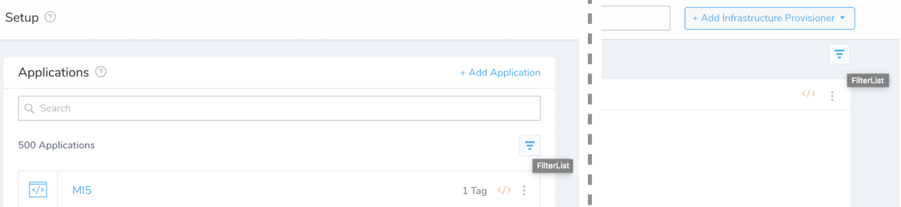
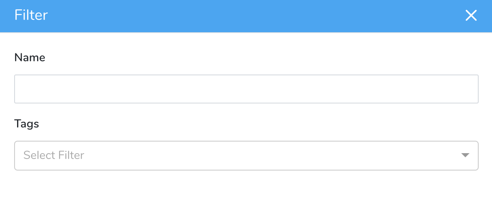
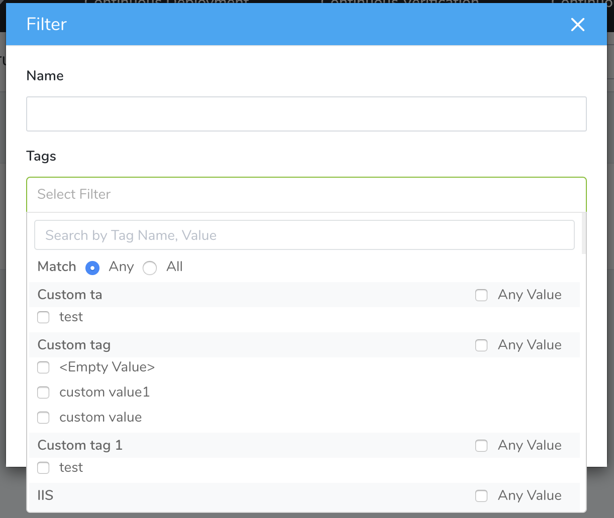
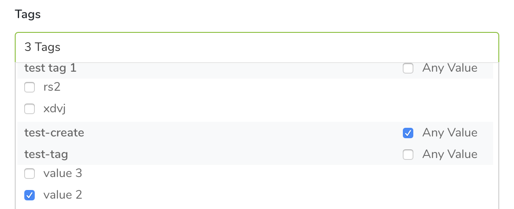

Once you’ve Applied Tags to your Harness Applications and components, you can use these Tags to filter what components you see. This topic describes how to use Tags to create different views of your Applications and components. 

In this topic:

* [Before You Begin](#before-you-begin)
* [Step 1: Filter Applications or Components by Tags](#step-1-filter-applications-or-components-by-tags)
* [Step 2: Manage Applied Filters](#step-2-manage-applied-filters)
* [Next Steps](#next-steps)

## Before You Begin

* See [Harness Key Concepts](../../../starthere-firstgen/harness-key-concepts.md).
* See [Assign Metadata Using Tags](tags.md).

## Step 1: Filter Applications or Components By Tags

Look for a Filter button at the upper right. These are shown below (with tooltips) for the **Setup** > **Applications** list, and for a single Application's **Infrastructure Provisioners** page:

To filter Applications or their components by Tags:

1. Click the Filter button (highlighted above).  
  
  This opens the **Filter** dialog, initially empty:

  

2. The **Name** field enables free-text filtering of the currently displayed Harness entity (Applications or an Application component). This option will display entities whose *names* (or their substrings) match the text that you enter. 

:::note 
Harness applies AND search logic between the **Name** and **Tags** fields. So any **Name** string that you enter will further restrict the results of your **Tags** selection, and vice versa.
:::

3. Click the **Tags** multi-select field to open the controls shown below.

   

4. Click the **Match:All** radio button to apply AND (restrictive) search logic among multiple Tag selections. Accept the default **Match:Any** radio button to perform an OR (inclusive) search among multiple Tags.

5. Use the Search box to locate desired Tags, or Tag values, by free-text search. Or, manually scroll the list of Tags and values.  
  
   Tag names have a gray background. Tag values have a white background, and are indented after their check boxes.

6. To retrieve Harness entities that match a given Tag with any value, select the **Any Value** check box to the Tag's right. To match only one or more specific values, select the check boxes to their left.

:::note 
Within a given Tag, inclusive OR search logic is *always* applied among the *values* you select. (Remember that each Tag can take only one value on a given Application or component—so a restrictive AND search for two or more values would always return zero results.) The search logic among your selected *Tags* is either OR or AND—depending on your **Match**  [setting](#tags_search_logic). 
:::

   The **Tags** field updates to display a running summary of your selections.

   

4. When you are ready to display the results of your selected filter conditions, click **Apply**. To discard all selections and keep the dialog open to make new selections, click **Clear All**.

   

## Step 2: Manage Applied Filters

Once you've applied filters to an Application or component, you can adjust or remove them using controls similar to those that Harness provides for Audit Trails filters. For details, see [Update or Save Filters](../../security/auditing-howtos/audit-trail.md#update-filters).

## Next Steps

* [Manage Tags](manage-tags.md)

