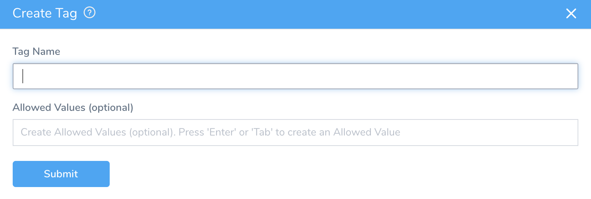
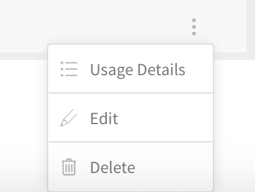
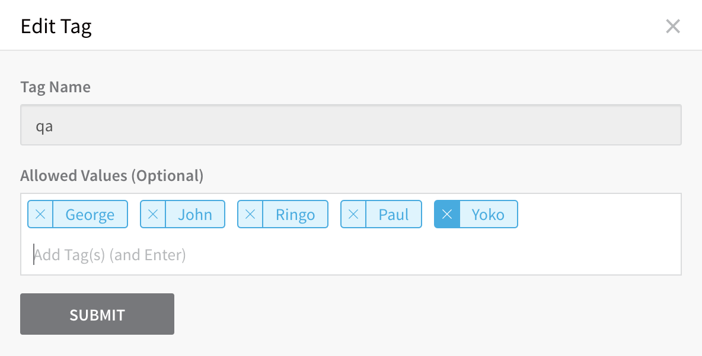
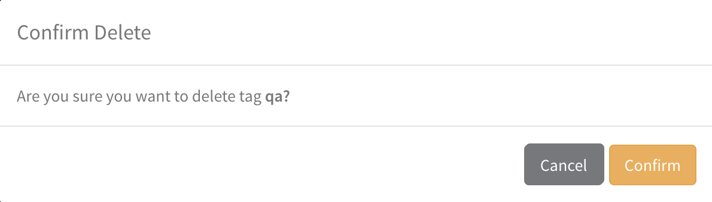
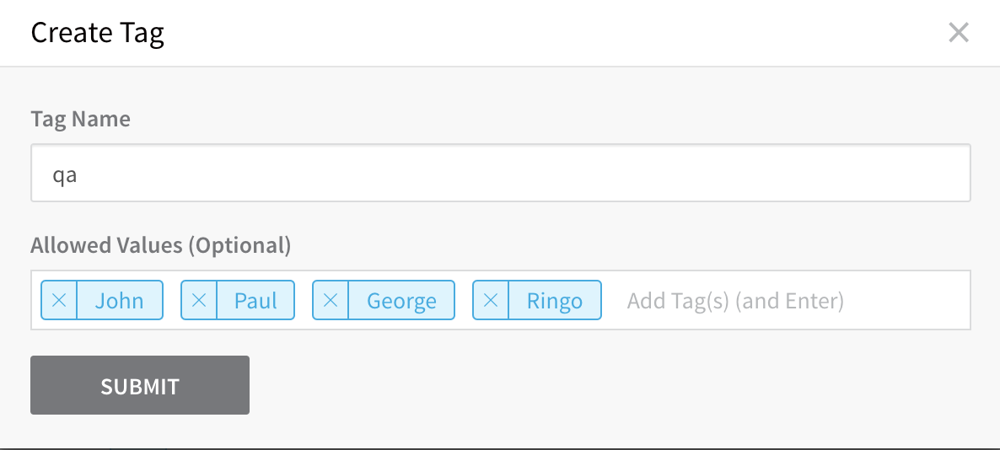
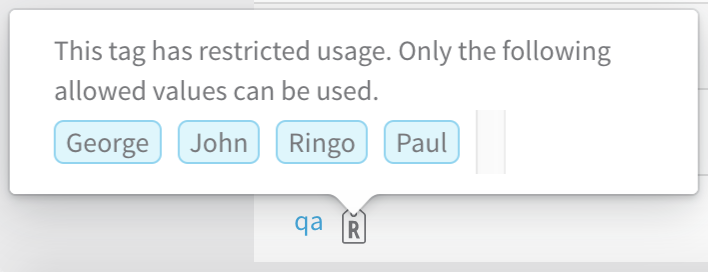

Tags are used to provide metadata for organizing, searching, and filtering components. This topic describes how to manage all the Tags used in your Harness account.

To access all Tags for your Harness account, select **Setup** > **Tags Management**. This displays the **Tags Management** page.

Here, all Harness users can:

* View Tags. (Note the **Search by Tag Name** field at the top right, which filters the display.)
* View Tags' usage in the **Used Values** column.
* Click individual entries in the **Tag Name** or **Used Values** columns to display expanded usage details. (The **Tag Usage Details** modal expands the previous display's row for the **owner** Tag. Within this **Tag Usage Details** modal, you can click the linked components to view their configuration.)

In this topic:

* [Before You Begin](#before-you-begin)
* [Step: Create Tag Keys](#step-create-tag-keys)
* [Option 1: Update Tag Keys](#option-1-update-tag-keys)
* [Option 2: Restrict Allowed Values](#option-2-restrict-allowed-values)

## Before You Begin

* See [Harness Key Concepts](../../../starthere-firstgen/harness-key-concepts.md).
* See [Assign Metadata Using Tags](tags.md).
* See [Apply Filters Using Tags](apply-filters-using-tags.md).

## Step: Create Tag Keys

Users whose User Group includes the **Manage Tag** Account permission can create a new Tag, as follows:

1. Select **Setup** > **Tags Management** page > **Create Tag** (upper-right corner).
2. In the resulting **Create Tag** dialog, assign a unique **Tag Name** as the key.

Optionally, you can restrict the new Tag to a set of [Allowed Values](#allowed_values) before you click **SUBMIT**.

## Option 1: Update Tag Keys

Users who have the **Manage Tag** Account permission can update an existing Tag on the Tags Management page, by clicking on that Tag row's More Options ⋮ menu.

This menu provides the following options:

* Click **Usage Details** to open the same [**Tag Usage Details modal**](#usage_details) available by clicking in the **Tag Name** column.
* Click **Edit** to open the **Edit Tag** dialog, where you can add or remove **Allowed Values**. (You cannot change the **Tag Name** here.)

* Click **Delete** to delete the Tag key from Harness. (This also frees up its name for reuse.) You will see the confirmation message box below.

:::caution
There is no automatic undo. To restore a removed Tag key, you will need to manually re-enter it, along with any Allowed Values.
:::

## Option 2: Restrict Allowed Values

To restrict the values that users can apply to a Tag, simply type your approved values into the **Allowed Values** field. Press **Tab** or **Enter** after each entry.

After you click **SUBMIT** to create the Tag, it will appear on the **Tags Management** page with an **R**(estricted) icon. Hover over the icon to display the restrictions.

