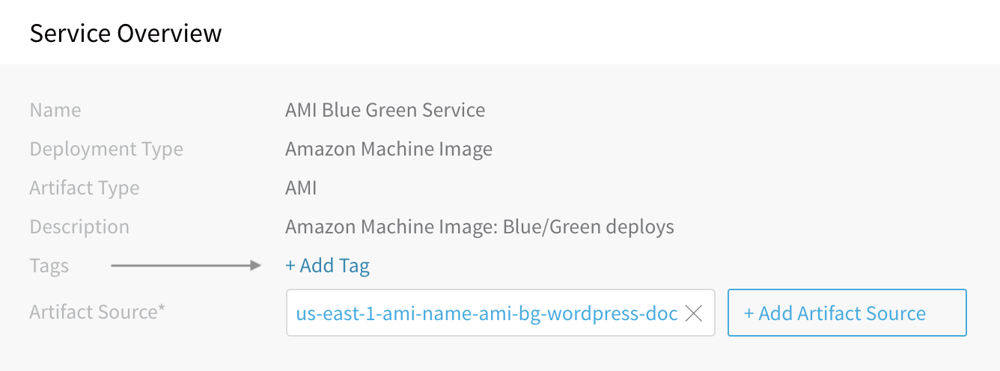
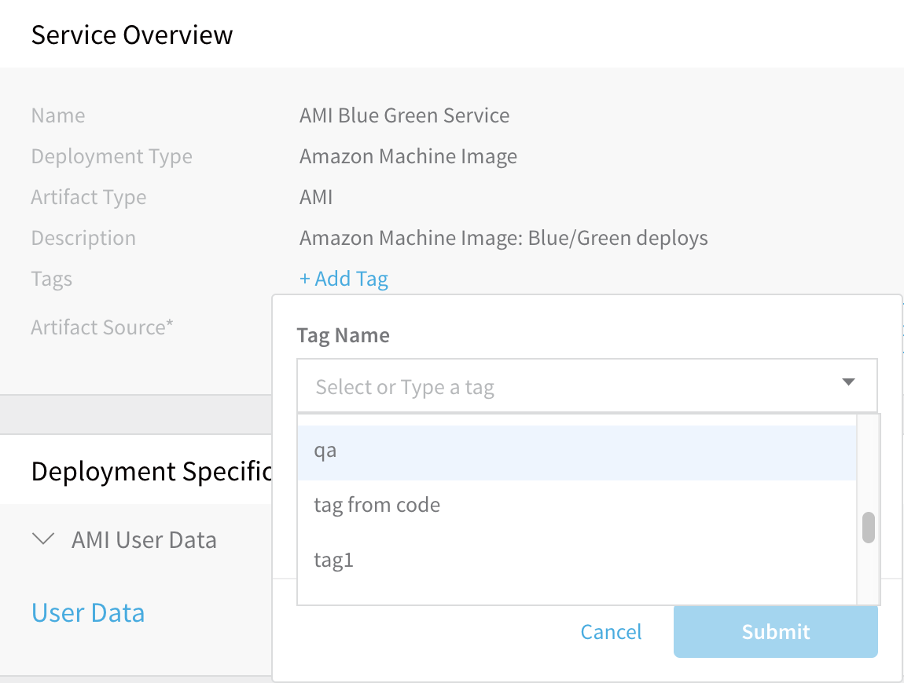
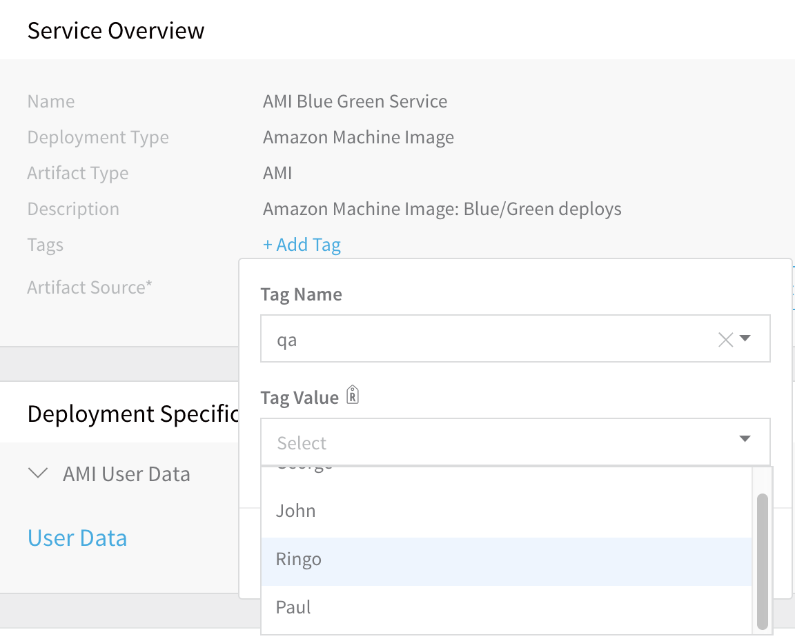
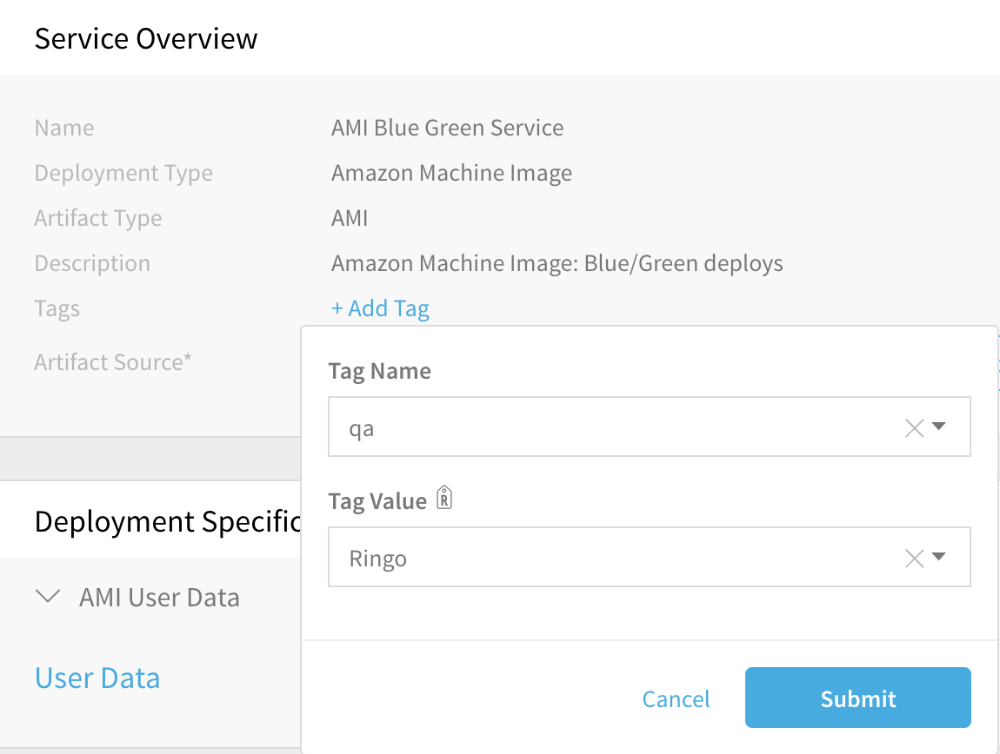
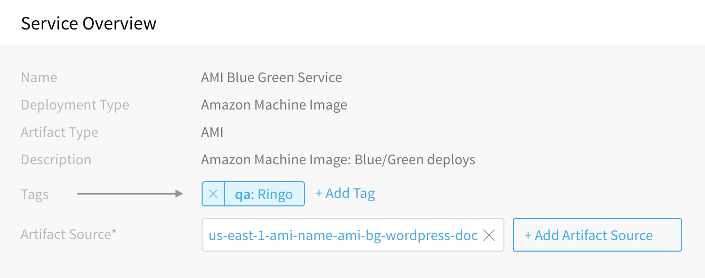
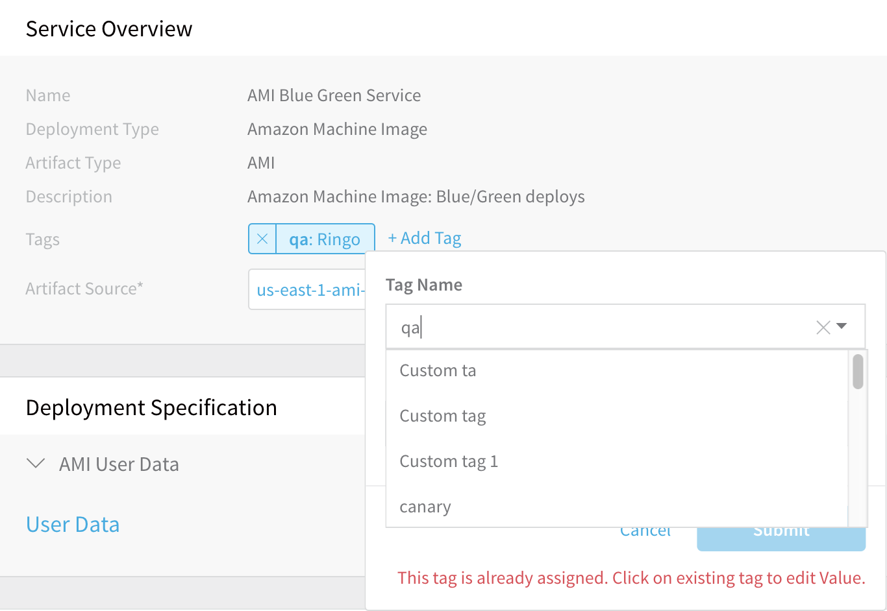
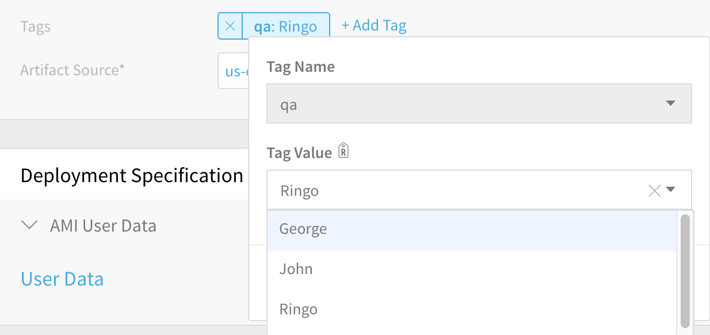
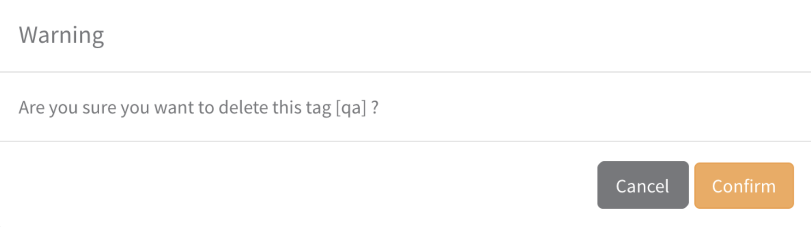

Harness enables you to provide metadata for organizing, searching, and filtering components. You add your metadata using Harness Tags. This topic explains how to create Tags, including guidelines and restrictions.

## Before You Begin

* See [Harness Key Concepts](../../../starthere-firstgen/harness-key-concepts.md).

## Video Summary

Here's a quick video demo of the process of creating and applying Tags in Harness.

<docvideo src="https://www.youtube.com/embed/JiryB5tyY3o" />

## Review: Tag Guidelines

Harness Tags function like the tags on common cloud providers' platforms. They are arbitrary key-value pairs that you can apply to Harness Applications and Application components. As metadata, they facilitate organizing, searching, and filtering on these Harness entities.

Using Tags, you can overlay your organization’s structure onto Harness resources. Here are some sample use cases:

* Categorizing Applications and components by team.
* Marking Applications and components for reuse, preservation, or deletion.
* Allocating costs.

Some examples of Tag keys, with representative values, are:

* `org: engineering`
* `owner: jenny`
* `validUntil: 1557444441`
* `do-not-delete`

The final Tag example above is a key with no value. If assigned to a component, such a Tag with no value simply acts like a flag.

### Tag Format Restrictions

Tag names and values are restricted to the following format:

`^[/A-Za-z0-9 _-]+`

If you are adding Tags in Workflows and Pipelines, you can use variable expressions in the names and values. Variable expressions follow the format `${<variable_name>}`.

When the variable expression is evaluated by Harness, it does **not** need to meet the standard Tag format restrictions. It has no restrictions.

If a Tag uses a variable expression in its name or value, you cannot edit it in **Tags Management**. You must edit the Tag in a Workflow or Pipeline.

For more information, see [Use Expressions in Workflow and Pipeline Tags](use-expressions-in-workflow-and-pipeline-tags.md).

### Tag General Restrictions

**Tags** in Harness have these general restrictions:

* A Harness account can maintain a maximum of 500 Tag names.
* Each Application, or Application component, can have a maximum of 50 Tags applied to it.
* When applied to an Application or component, each instance of a Tag key can have only one value.
* The Tag-name prefix `harness.io/` is reserved for future use by Harness.

**Tag names** (keys) have the following restrictions:

* Length: 1 to 128 characters.
* Allowed characters: letters, numbers, spaces, `_,-,/`
* Names must be unique across your Harness account.
* Names are case-sensitive.
* Names must not begin with the characters `_, -` or spaces.
* System tags will have the Tag-name prefix `system/`.

**Tag values**, when applied to Applications or components, have the following restrictions:

* Length: 0 to 256 characters. (Entering a value is optional—unless the Tag key imposes [Allowed Values](#allowed_values), in which case one of those values is required.)
* Allowed characters: letters, numbers, spaces, `_,-,/`
* Values are case-sensitive.
* Must not begin with the characters `_, -` or spaces.

## Review: Tag Scope

Tags can be added to Harness Applications, and to the following Application components:

* Service
* Environment
* Workflow
* Pipeline
* Infrastructure Provisioner

Harness plans to add further tagging options.

## Step 1: Assign Required Permissions

Your options for interacting with Tags depend on your Harness [User Group permissions](../../security/access-management-howtos/users-and-permissions.md), as follows:

* All users can view Tags (and values) that have been applied to Applications and their components.
* Users' [Application Permissions](../../security/access-management-howtos/users-and-permissions.md#application-permissions) determine their ability to apply, update, and remove Tags on specific Applications and Application components.
* Users who have the [Account Permission:](../../security/access-management-howtos/users-and-permissions.md#account-permissions) **Manage Tags** can create Tag keys, impose Allowed Values on keys, and edit and delete keys.

### Applying Tags

Users who have appropriate [Application-level permissions](../../security/access-management-howtos/users-and-permissions.md#application-permissions) can add and modify Tags on the Harness Application components listed above under [Tag Scope](#tag_scope).

## Step 2: Add Tags

To add a Tag to an Application or [supported](#tag_scope) Application component:

1. Click into the Application or component to display its Overview card: **Application Overview**, **Environment Overview**, **Workflow Overview**, etc. Here, you can locate and click the **Add Tag** link:

2. In the resulting pop-up, select a key from the **Tag Name** drop-down:

3. The **Tag Value** field can normally be left empty, or can accept a single free-form value (subject to Harness' restrictions on Tag values):

   

   However, if the tag has [Allowed Values](#allowed_values)—indicated by a **R**(estricted) symbol—you must select a value from the drop-down list, as shown below:

   

4. Click **Submit** to add your Tag:
Each applied Tag's key and value will now appear on the Application's or component's **Overview** card:

   

## Option 1: Replace Tag Values

If you click **Add Tag**, and then select a **Tag Name** that has already been applied to this Application or component, you will see the error message shown below:

This is a reminder that each Tag can have only one value on a given Application or component. You can just click on the existing Tag to type (or select) a replacement **Tag Value**:

Click **Submit** to update the tag's value.

## Option 2: Remove Tags

You can remove Tags from the same Applications and components where you have [Application Permissions](../../security/access-management-howtos/users-and-permissions.md#application-permissions) to add (attach) Tags. Simply click the Tag's **X** box, then respond to the confirmation message box shown below.

There is no automatic undo. To restore a removed Tag, you will need to manually re-enter its key and value.
## Next Steps

* [Apply Filters Using Tags](apply-filters-using-tags.md)
* [Manage Tags](manage-tags.md)

