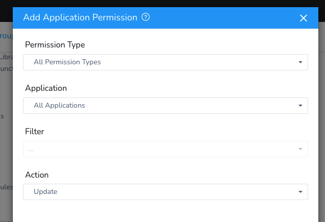
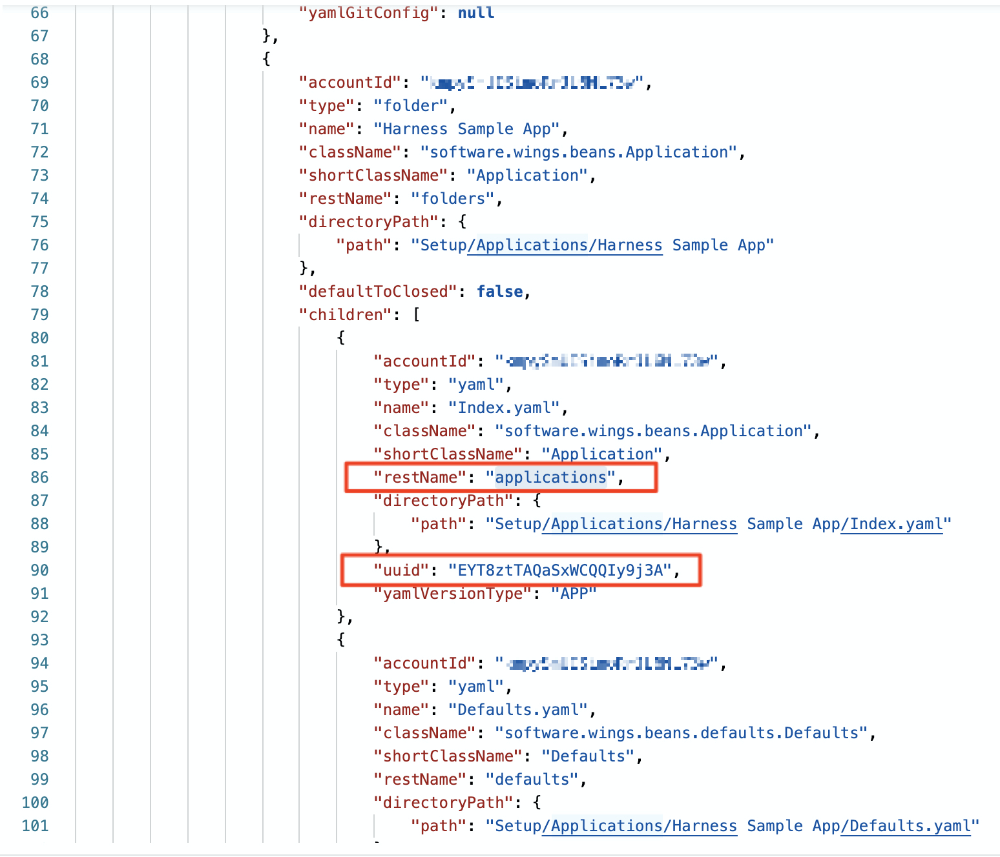
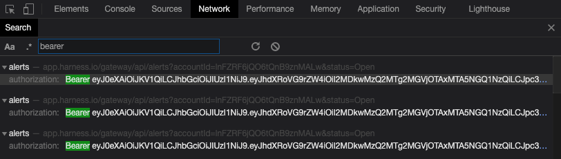

Harness includes many REST APIs that allow you to have full control over its Config-as-Code functionality.

The REST APIs allow you to perform CRUD operations on Harness YAML entities.

The CRUD REST API is different from Harness GraphQL API. For information on the GraphQL API, see [Harness GraphQL API FAQs](../../firstgen-fa-qs/harness-graph-ql-api-faqs.md).

### Before You Begin

* [Configuration as Code Overview](configuration-as-code.md)
* [Managing Users and Groups (RBAC)](../security/access-management-howtos/users-and-permissions.md)
* [API Keys](../security/access-management-howtos/api-keys.md)

### Harness Permissions Required

The Harness User account that executes the API must belong to a User Group with the following [Account Permission](../security/access-management-howtos/users-and-permissions.md#account-permissions):

* **Account Permission:** `Administer Other Account Functions`.


### Granular Permissions for CRUD

Currently, this feature is behind the feature flag `YAML_APIS_GRANULAR_PERMISSION`. Contact Harness Support to enable the feature.To perform CRUD operations on a specific Harness entity, your account must have **Create/update** permissions for that entity.

For example, to create a Service within an Application, the User Group must have `Create Service` permission for that Application.

### REST API Summary

Harness provides CRUD APIs that allow you to have full control over your account’s Config-as-Code YAML without having to use the Harness Manager or sync with a Git repo.

Authorization for the APIs is performed using Harness [API keys](../security/access-management-howtos/api-keys.md). Ensure you have Harness API keys before using the commands below.

For each API, you use a CURL command that contains the URL and ID of the Harness account and the type of change to make:

`https://app.harness.io/gateway/api/setup-as-code/yaml/{change_type}?accountId={account_ID}`

You also include headers for Content-Type and authentication:


```
--header 'accept: application/json, text/plain, */*' \  
--header 'x-api-key: [API_key]'
```
That’s it. You can simply run CRUD operations via REST API to manage your Harness Config-as-Code YAML.

### Create and Update Multiple YAML Entities

You can use a ZIP file to create or replace multiple YAML entities in your Harness account.

The `upsert-entities` parameter identifies that this is a Create or Update operation.

**URL**: `/api/setup-as-code/yaml/upsert-entities?accountId={accountId}`

**HTTP Method**: **POST**

**Query Param**: `accountId` is your account identifier (ID).

**Request body**: a ZIP (`.zip`) file consisting of the YAML files for a Harness Application(s) and Application entities (Services, Workflows, Pipelines, Environments, Triggers, Infrastructure Provisioners).

**Sample ZIP file**:

[harness-docs/Setup.zip at main · wings-software/harness-docs](https://github.com/wings-software/harness-docs/blob/main/Setup.zip)

Click **Download** to view the contents of the ZIP file.

**Sample cURL:**


```
curl --location --request POST 'https://app.harness.io/gateway/api/setup-as-code/yaml/upsert-entities?accountId=12345678910' \  
--header 'accept: application/json, text/plain, */*' \  
--header 'authorization: Bearer {bearer_token}' \  
--form 'file=@/Users/johndoe/Documents/SampleApp.zip'
```
**API key example:**


```
curl --location --request POST 'https://app.harness.io/gateway/api/setup-as-code/yaml/upsert-entities?accountId=12345678910' \  
--header 'accept: application/json, text/plain, */*' \  
--header 'x-api-key: {api_key}' \  
--form 'file=@"/Users/johndoe/Downloads/Setup.zip"'
```
### Delete YAML Entities

The `delete-entities` parameter identifies that this is a Delete operation.

A comma-separated list of file paths identifies the entities to delete.

**URL**: `/api/setup-as-code/yaml/delete-entities?accountId={accountId}&filePaths={comma-separated-list-of-filePaths}`

The `filePaths` should be a full path to the YAML file(s) you want to delete. For example, the following path is to a Kubernetes manifest:

`1filePaths=Setup/Applications/test%20app/Services/test3/Manifests/Files/templates/deployment.yaml`

**HTTP Method**: **DELETE**

**Query Params**:

* `accountId` is your account identifier (ID).
* `filePaths` is a comma-separated list of filePath(s).

**Response**: status code `200 OK` if successful, error message if failed.

**Sample cURL**:


```
curl --location --request DELETE 'https://app.harness.io/gateway/api/setup-as-code/yaml/delete-entities?accountId=12345678910&filePaths=Setup/Applications/test%20app/Services/test3/Manifests/Files/templates/deployment.yaml' \  
--header 'accept: application/json, text/plain, */*' \  
--header 'authorization: Bearer {bearer_token}'
```
**API key example:**


```
curl --location --request DELETE 'https://app.harness.io/gateway/api/setup-as-code/yaml/delete-entities?accountId=12345678910&filePaths=Setup/Applications/test%20app/Services/test3/Manifests/Files/templates/deployment.yaml' \  
--header 'accept: application/json, text/plain, */*' \  
--header 'x-api-key: {api_key}'
```
### Create and Update a Single YAML Entity

Instead of posting a ZIP file to create or update all of the entities in an Application, you can post a single YAML change.

You simply provide the full path to the YAML file and the YAML content (`yamlContent`) to create/update.

The content must identify the YAML key and value with careful attention paid to any quotes.

For example, here's a line in YAML that you want to change:


```
harnessApiVersion: '1.0'
```
The `yamlContent` must escape the quotes:


```
'yamlContent={key_name}: '\''1.0'\''
```
**URL**: `/api/setup-as-code/yaml/upsert-entity?accountId={accountId}&yamlFilePath={yamlFilePath}`

**HTTP Method**: **POST**

**Query Params**:

* `accountId` is your account identifier (ID).
* `filePaths` is a comma-separated list of filePath(s).
* `yamlContent` is the form-data parameter holding the YAML content to be created/updated.

**Sample curl:**


```
curl -X POST \  
  'https://app.harness.io/gateway/api/setup-as-code/yaml/upsert-entity?accountId=12345678910&yamlFilePath=Setup/Applications/test%20app/Index.yaml' \  
  -H 'accept: application/json, text/plain, */*' \  
  -H 'authorization: Bearer {bearer_token}' \  
  -H 'content-type: multipart/form-data; boundary=----WebKitFormBoundary7MA4YWxkTrZu0gW' \  
  -F 'yamlContent=harnessApiVersion: '\''1.0'\''  
type: APPLICATION'
```
**API key example:**


```
curl -X POST \  
  'https://app.harness.io/gateway/api/setup-as-code/yaml/upsert-entity?accountId=12345678910&yamlFilePath=Setup/Applications/test%20app/Index.yaml' \  
  -H 'accept: application/json, text/plain, */*' \  
  --header 'x-api-key: {api_key}' \  
  -H 'content-type: multipart/form-data; boundary=----WebKitFormBoundary7MA4YWxkTrZu0gW' \  
  -F 'yamlContent=harnessApiVersion: '\''1.0'\''  
type: APPLICATION'
```
### Fetch Config-as-Code Directory Structure

You can fetch the directory structure for a Harness Application using the `directory` parameter.

**URL**: `/api/setup-as-code/yaml/directory?accountId={accountId}&appId={applicationId}`

**Query Params:**

* `accountId` is your account identifier (ID).
* `appId` is the Application identifier (ID).

**HTTP Method**: **GET**

**Sample cURL:**


```
curl --location --request GET 'https://app.harness.io/gateway/api/setup-as-code/yaml/directory?accountId=12345678910&appId=fCLnFhwsTryU-HEdKDVZ1g' \  
--header 'accept: application/json' \  
--header 'content-type: application/json; charset=utf-8' \  
--header 'x-api-key: {api_key}'
```
**API key example:**


```
curl --location --request GET 'https://app.harness.io/gateway/api/setup-as-code/yaml/directory?accountId=12345678910&appId=fCLnFhwsTryU-HEdKDVZ1g' \  
--header 'accept: application/json' \  
--header 'content-type: application/json; charset=utf-8' \  
--header 'x-api-key: {api_key}'
```
### Fetch YAML Content for a Single Entity

At this time, this API supports bearer token authentication only. It will be updated in the near future.Using the response from the Fetch Config-as-Code Directory Structure API (`/api/setup-as-code/yaml/directory`), you can fetch the YAML content of an individual Application or account-level entity based on its `restName` and `uuid`.

For example, here’s the response from a `/api/setup-as-code/yaml/directory` API call:


For all Application-level entities like Service, Workflow, Pipeline etc., you can use the API to fetch YAML content.

**URL:** `/api/setup-as-code/yaml/{node.restName}/{node.uuid}?accountId={accountId}&appId={appId}`

Every node in the tree directory structure returned using the `directory` parameter has an associated `restName` property and a `uuid`. These can be used in the API.

**Query Params:**

* `node.restName` the name of the Harness entity type: `workflows, services, pipelines, environments`, etc.
* `node.uuid` is the universally unique identifier (**UUID**) of the node.
* `accountId` is your account identifier (ID).
* `appId` is the Application identifier (ID).

**Sample cURL:**


```
curl --location --request GET 'https://qa.harness.io/gateway/api/setup-as-code/yaml/services/pT65F_wHTzSALR2qYknX9Q?accountId=12345678910&appId=fCLnFhwsTryU-HEdKDVZ1g' \  
--header 'authorization: Bearer {bearer_token}'
```
Here `node` is a node in the YAML tree.

Similarly, for all account-level entities like Cloud providers and Connector, the API call would look like this:


```
/api/setup-as-code/yaml/{node.restName}/{node.uuid}?accountId={accountId}
```
### Notes

* To find the bearer token for your session, open Dev Tools in your browser and search for **bearer**:


