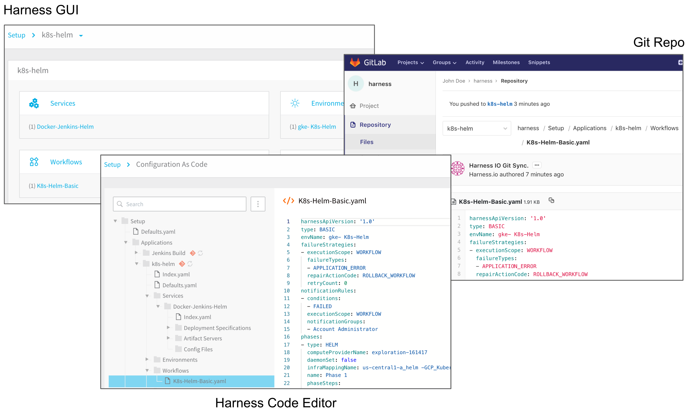
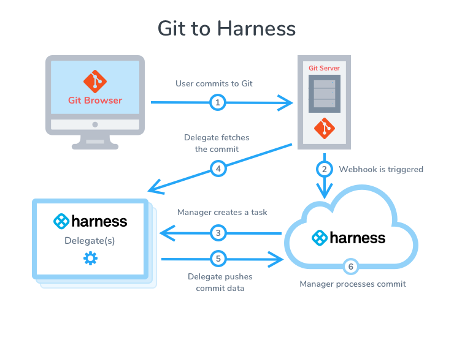
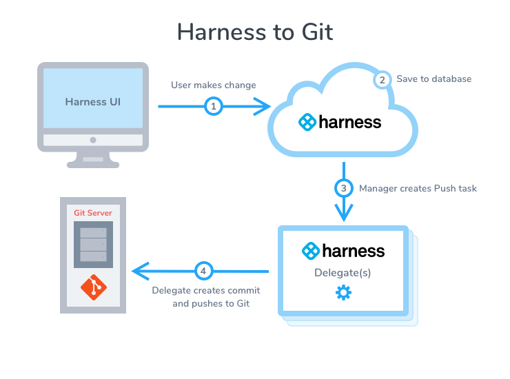
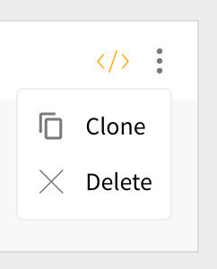

Configuration As Code allows you to configure Pipelines, Triggers, Workflows, Environments, and Services in Harness using YAML. Nearly everything you can do in the Harness platform GUI, you can do in YAML as well.

In an enterprise, you might have hundreds of apps and teams. In such a case, defining all your deployment Pipelines and configurations using Harness GUI can be time-consuming and difficult to use.

Configuration as Code provides the ability to define the whole configuration using YAML syntax. This approach provides the following major benefits:

* Automation and Consistency (templates)
* Version Control
* Scalability
* Traceability

Using the Harness code editor, you can set up and manage accounts for artifact servers, cloud providers, and verification providers. You can edit Application services, Environments, Workflows, etc. all in YAML. You can sync your Git repo with Harness to simply use YAML files in your source repo to make changes to Harness.

Here is the same Harness Workflow in the Harness GUI, Harness code editor, and a Git repo.

### Before You Begin

* if you're trying to resolve git sync issues, see [Diagnose Git Sync Errors](../../firstgen-troubleshooting/diagnose-git-errors.md).
* Connect your Git provider to Harness using the steps in [Add Source Repo Providers](../account/manage-connectors/add-source-repo-providers.md).
* Trigger Harness Workflow and Pipeline execution from Git using Harness Triggers. See [Manual Triggers and Git Webhooks](../../continuous-delivery/model-cd-pipeline/triggers/add-a-trigger-2.md#manual-triggers-and-git-webhooks) and [File-based Repo Triggers](../../continuous-delivery/model-cd-pipeline/triggers/add-a-trigger-2.md#file-based-repo-triggers).

Currently, [YAML-based Triggers](../techref-category/configuration-as-code-yaml/harness-yaml-code-reference.md#triggers) are behind the feature flag `TRIGGER_YAML`. Contact [Harness Support](mailto:support@harness.io) to enable the feature.Review the [Harness YAML Code Reference](../techref-category/configuration-as-code-yaml/harness-yaml-code-reference.md).

### Sync Scenarios Overview

Here is a visual summary of Git to Harness sync:

Here is a visual summary of Harness to Git sync:

The following table provides an overview of the sync scenarios and how to configure them.

|  |  |
| --- | --- |
| **Sync Scenario** | **Configuration** |
| Sync one-way (**unidirectionally**) from Harness to your Git repo. | Set up a Source Repo Provider with your repo and do not enable the **Generate Webhook URL** option or apply the Webhook to the Git repo.Select this Source Repo Provider for all applications that you want to sync unidirectionally. |
| Sync two-way (**bidirectionally**) between Harness and your Git repo. | Set up a Source Repo Provider with your repo and apply the Webhook created by the **Generate Webhook URL** option to the Git repo.Ensure that the **Content type** in your repo Webhook is set to **application/json**. By default, some repos are set to application/x-www-form-urlencoded.Select this Source Repo Provider for all applications that you want to sync bidirectionally. |
| Stop syncing an application with a Git repo, but keep the Source Repo Provider connected for future syncs. | In the **Git Sync** setting for the application, turn off the **Enable/Disable** setting. Later, when you want to start syncing again, turn on the **Enable/Disable** setting. |
| Stop using a Source Repo provider with an application. | In the **Git Sync** setting for the application, click **DELINK**. |
| Have the Source Repo Provider sync bidirectionally with the Git repo, but have an application using that Source Repo Provider only sync unidirectionally. | This is not available. |

Repo and brach names may not contain characters from the Emoticons unicode block.

### Rapid Development with Harness and Git

One of the advantages with Harness Git integration is the ability to clone or duplicate a Harness Application entity quickly in the Git repo, and then have the cloned entity show up in the Harness platform. For example, you can clone a Harness Environment in the Harness GUI using the **Clone** button.

But if you want to make several copies, this can be time-consuming in the GUI.

With Harness GitOps, you can simply duplicate the environment folder in Git, give the duplicate folder a unique name, and push it to the origin. The new environment will appear in Harness. For more information, see [Harness GitOps](/docs/category/harness-git-based-how-tos).

### Using RBAC for YAML Files

You manage Harness User permissions using Account and Application permissions in Harness User Groups.

The same Account and Application permissions apply to both the Harness Manager UI and Configure as Code YAML files.

For more information on how to manage RBAC, see [Managing Users and Groups (RBAC)](../security/access-management-howtos/users-and-permissions.md).

#### Harness User Group Account Permissions

To manage Configuration as Code, a Harness User must be a member of a User Group with the following **Account Permissions** enabled:

* Manage Config as Code
* Manage Applications

See [Managing Users and Groups (RBAC)](../security/access-management-howtos/users-and-permissions.md).

#### Harness Entity YAML Files

Harness entities such as Cloud Providers, Connectors, Delegates, etc, have their own Account Permissions.

These Account Permissions apply equally to the Harness Manager UI and YAML files.

### Update a File Using Git and Harness Manager UI at the Same Time

If a Git push and Harness Manager UI change to the **same file** happen in parallel, the Harness Manager UI change takes precedence over the Git change.

Harness rejects pull requests with timestamps that conflict with updates from its database.

### Git Polling

Currently, this feature is behind the feature flag `CG_GIT_POLLING`. Contact Harness Support to enable the feature.The sync from Git to Harness happens when Harness receives a webhook from Git.

If Harness misses any webhook, it can result in sync issues and inconsistencies.

Harness might miss a webhook due to one of the following reasons:

* Git provider is down.
* Harness has connectivity issues.

Harness handles such scenarios through Git Polling. Every five minutes, it starts a polling job to see whether any Git commits have been missed. If any, it processes the missed commits before moving on.

### Limitations

* If you rename a Pipeline in Git and sync that change with Harness, any Triggers using that Pipeline are deleted.
* If you rename a Workflow in Git and sync that change with Harness, Triggers are maintained because a duplicate that Pipeline are deleted.
* You cannot add any custom YAML fields to your synced Harness files. Harness will remove any fields it does not recognize.

### Next Steps

* [Harness Account-Level Git Sync](harness-account-level-sync.md)
* [Harness Application-Level Git Sync](harness-application-level-sync.md)
* [Edit Harness Components as YAML](edit-the-code-in-harness.md)
* [Delink Git Sync](delink-git-sync.md)

