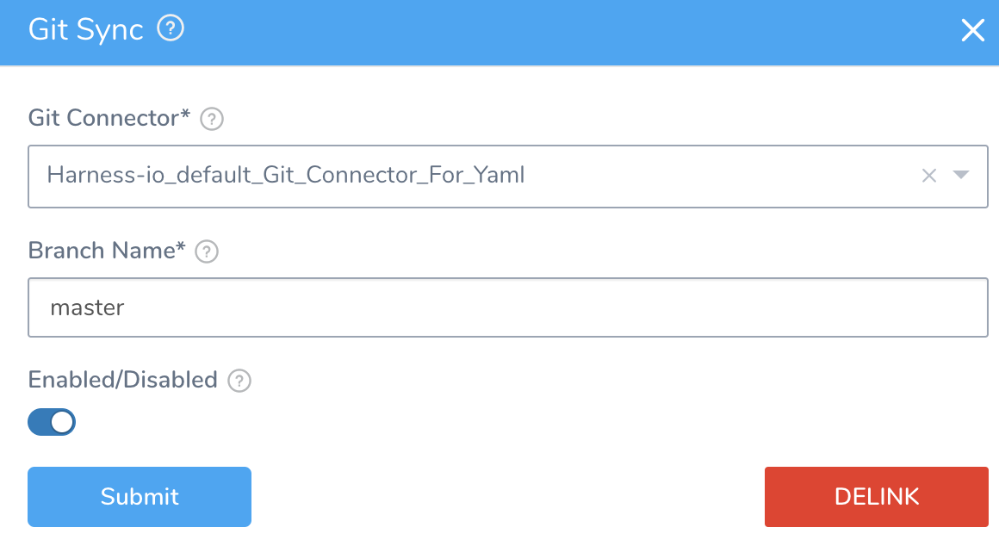
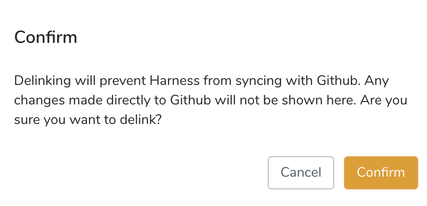

You can remove the Git sync connection between a Harness account or Application by delinking the connection. Delinking prevents Harness from syncing with your Git repo.

### Before You Begin

* [Configuration as Code](configuration-as-code.md)
* [Harness Account-Level Git Sync](harness-account-level-sync.md)
* [Harness Application-Level Git Sync](harness-application-level-sync.md)
* [Edit Harness Components as YAML](edit-the-code-in-harness.md)

### Step: Delink a Git Connection

To delink a Git connection, do the following:

1. In **Setup**, click **Configuration As Code**.
2. Select the Git Sync connection you want to delink.
	1. For an account-level connection, click the ellipsis next to the search field, and then click **Setup Git Sync**.
	2. For an application-level connection, hover over the Application's **Git Sync** icon, and then click the icon.
3. In **Git Sync**, click **DELINK**.

   

4. Click **Confirm** to delink the Git sync.

   

