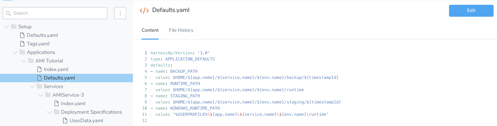
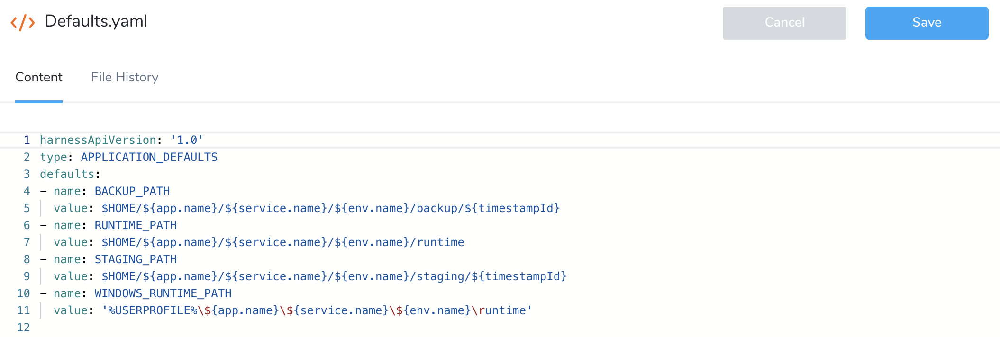

You can view or edit the code for any account or Application entity and its configuration.

Before you can edit account and Application YAML, you must have the correct User Group Account and Application Permissions. See [Using RBAC for YAML Files](configuration-as-code.md#using-rbac-for-yaml-files).

### Before You Begin

* [Configuration as Code](configuration-as-code.md)
* [Harness Account-Level Git Sync](harness-account-level-sync.md)
* [Harness Application-Level Git Sync](harness-application-level-sync.md)

### Step: Edit the Code

1. In **Setup,** click **Configuration As Code**.
2. Select the YAML file that you want to edit and click **Edit**.

3. Edit the YAML file and click **Save**.

You can configure any settings using YAML anywhere in Harness by clicking the **YAML** editor button.

### See Also

* [Harness YAML Code Reference](../techref-category/configuration-as-code-yaml/harness-yaml-code-reference.md)

### Notes

* **Do not change a variable type in YAML**—You are not prevented from changing a user variable type to `ENTITY` in YAML; however, this may lead problems as `ENTITY` is for internal settings, such as Application Environments, Workflows, etc.

