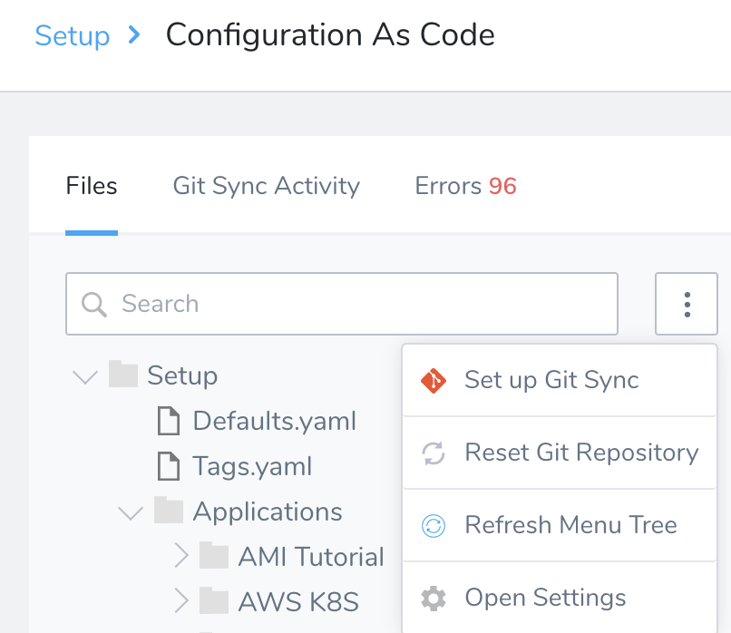
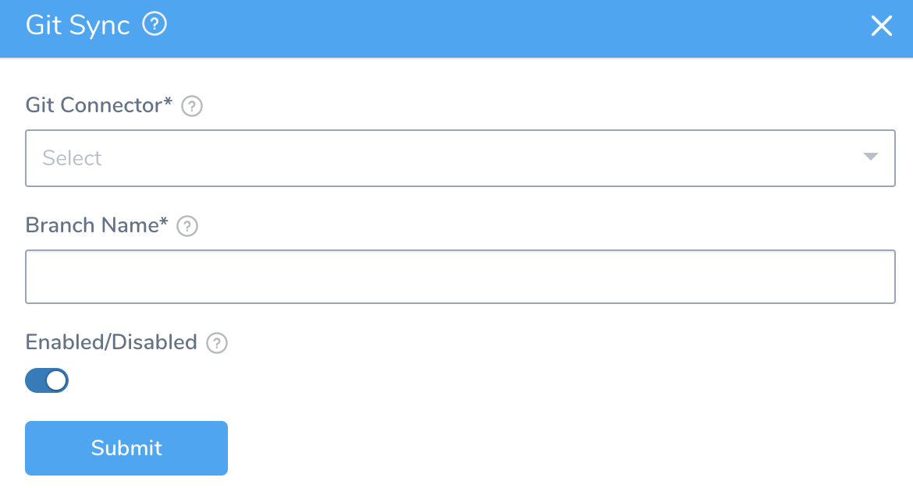
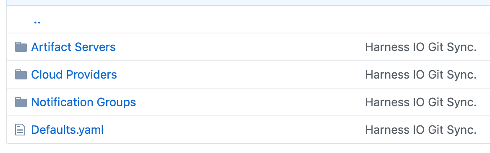
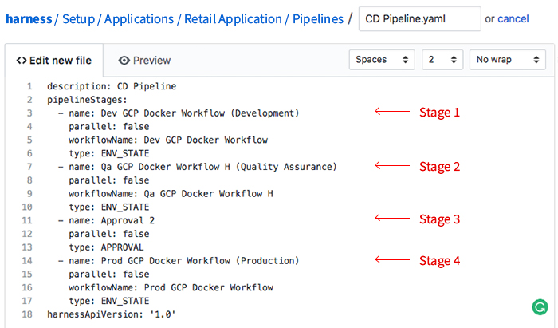
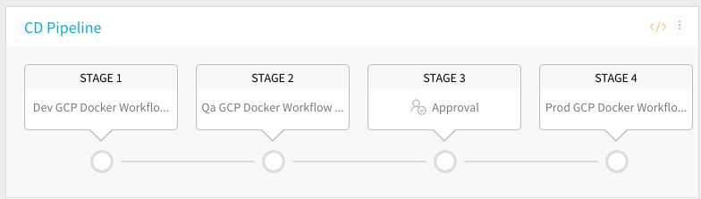
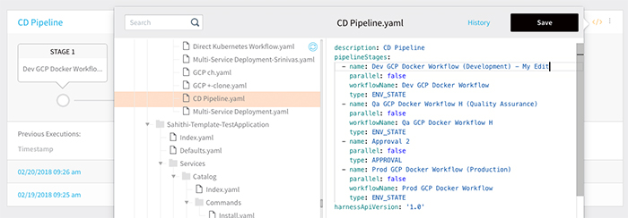
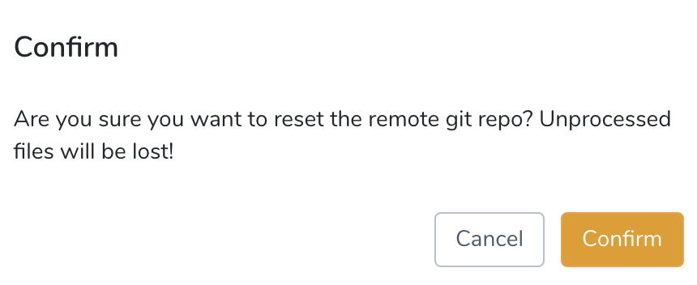
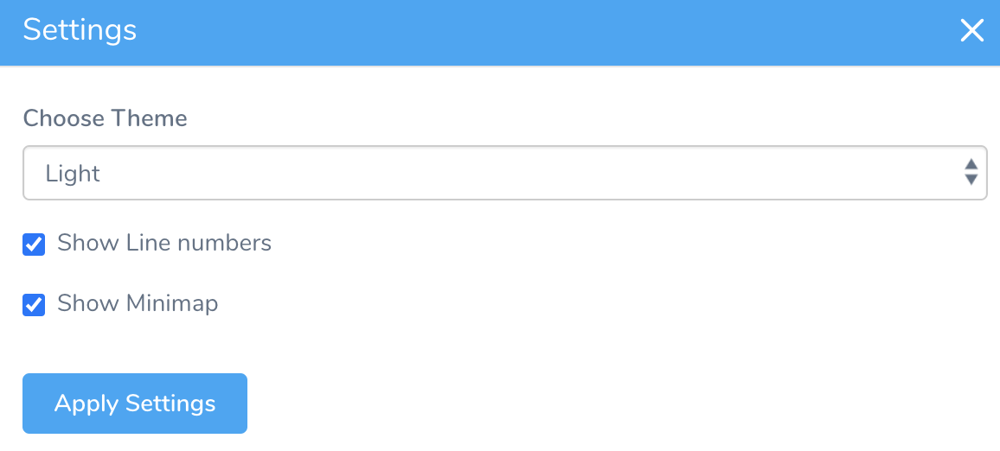
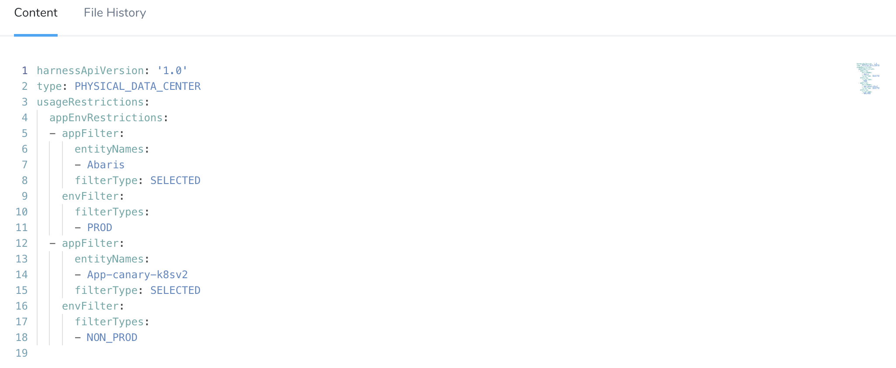

You can sync your Harness account with a Git repo. The Harness account information can be synced with one repo and the Applications in your account can be synced separately with other repos or branches.

:::note 
Before Harness syncs with your Git repo, it confirms that all Harness' settings are in a valid state. If a connection is not working, such as a connection to an Artifact Server or Cloud Provider, Harness does not sync with your Git repo.
:::

For Application-level sync, see [Harness Application-Level Git Sync](harness-application-level-sync.md).

### Before You Begin

* Review the [Sync Scenarios Overview](configuration-as-code.md#sync-scenarios-overview)
* [Add Source Repo Providers](../account/manage-connectors/add-source-repo-providers.md)

### Requirements

* Users must belong to a User Group with [Administer Other Account Functions](../security/access-management-howtos/users-and-permissions.md) selected to enable Git Sync at the account or Application level.
* Only Harness YAML files are allowed in the target repo. The repo you sync with Harness must not contain any non-Harness files. Also, non-Harness files ending in `.yaml` will cause sync to fail.

### Best Practices

When you sync Harness Accounts and Applications, no 3rd party account credentials are exposed. However, your Harness Applications might contain private information you added to their Services or Workflows. Only sync Harness Accounts and Applications with public repos if you are certain that your Harness Applications do not contain any private information.

As a best practice, only sync with private repos.

### Step: Sync Your Account With a Git Repo

To sync your Harness account with a Git repo, do the following:

1. Add your Git repo as a Source Repo Provider in Harness. For more information, see [Add Source Repo Providers](../account/manage-connectors/add-source-repo-providers.md).
2. In **Setup**, click **Configuration As Code**.
3. Click the ellipsis next to the **Search** field, and then click **Setup Git** **Sync**.

4. In **Git Connector**, select a Harness **Source Repo Provider**. For information on setting up a Source Repo Provider, see [Add Source Repo Providers](../account/manage-connectors/add-source-repo-providers.md).

5. In **Branch Name**, enter the name of the repo branch to sync with the Harness account. This can be the master branch or another branch where you want to keep the Harness account-level settings.Names may not contain characters from the Emoticons unicode block.
6. To enable sync between Harness and the repo in the Source Repo provider, ensure Git Sync is **Enabled**.  
  
Your Harness account is now synced with your Git repo. Open your Git repo to see the Harness account.

### Step: Two-Way Git Sync

1. Select the **Enable Git Sync** option and apply the generated Webhook to your repo as described in [Add Source Repo Providers](../account/manage-connectors/add-source-repo-providers.md). The changes you make in your repo are pushed to Harness.  
  
   Here is an example of a CD `pipeline.yaml` file within the folder `harness/Setup/Applications/RetailApplication/Pipelines`. The file contains a Pipeline with four deployment stages: Dev, QA, Approval, and Prod.
   
   
   
2. Commit your YAML file to the branch. Seconds after you commit the YAML file to the branch, Harness is fully synced, and the new Pipeline is available to view in the Harness Manager.

   
   
3. To view or make edits to the Pipeline YAML, click the config-as-code icon.

   

4. View or edit the YAML in the context of the Pipeline.

   

You can view or edit the Services, Environments, Workflows, and everything else in the Harness platform in the same way.

### Step: Reset Git Repository

The Reset Git repo option copies the state of the files from Harness to the specified Git repo.

* **For account-level reset:** Harness looks at its directory structure and creates a changeset to commit to the Git repo. During the commit, Harness deletes all the folders it is aware of in the Git repo and then adds all the files from Harness.
* **For application-level reset:** Harness deletes the application folder in Git and recreates everything that is in Harness.

To reset the remote Git repo, do the following:

1. Add your Git repo as a Source Repo Provider in Harness. For more information, see [Add Source Repo Providers](../account/manage-connectors/add-source-repo-providers.md).
2. In **Setup**, click **Configuration As Code**.
3. Click the ellipsis next to the **Search** field, and then click **Reset Git** **Repository**.

4. Click **Confirm** to reset the remote Git repo.

### Step: Refresh Menu Tree

To refresh the files in your menu tree, do the following:

1. Add your Git repo as a Source Repo Provider in Harness. For more information, see [Add Source Repo Providers](../account/manage-connectors/add-source-repo-providers.md).
2. In **Setup**, click **Configuration As Code**.
3. Click the ellipsis next to the **Search** field, and then click **Refresh Menu Tree**.

### Step: Open Settings

1. Add your Git repo as a Source Repo Provider in Harness. For more information, see [Add Source Repo Providers](../account/manage-connectors/add-source-repo-providers.md).
2. In **Setup**, click **Configuration As Code**.
3. Click the ellipsis next to the **Search** field, and then click **Open Settings**.

4. In **Settings**, do the following:

	 1. **Choose Theme** from the drop-down list. You can select, Light, Dark, or High Contrast Dark.
	 2. Select the checkbox **Show Line numbers** to show line numbers in your YAML files.
	 3. Select the checkbox **Show Minimap** to show the smaller map of your YAML file.
   
      
      
The line numbers and minimap are displayed as the following:

### Next Steps

* [Harness Application-Level Git Sync](harness-application-level-sync.md)
* [Edit Harness Components as YAML](edit-the-code-in-harness.md)
* [Delink Git Sync](delink-git-sync.md)

