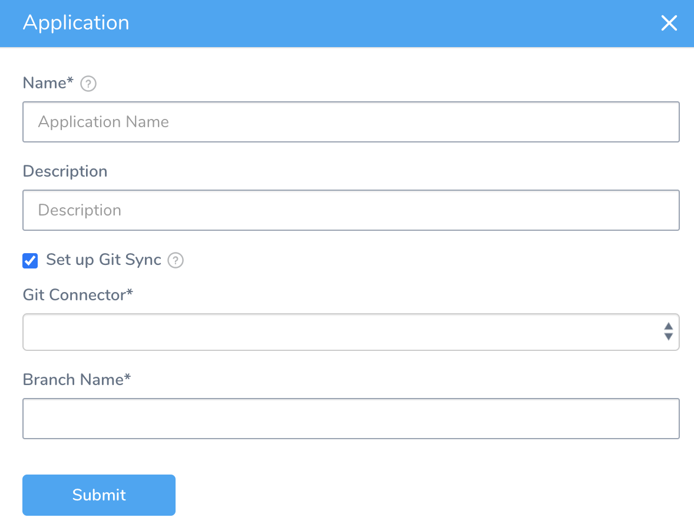
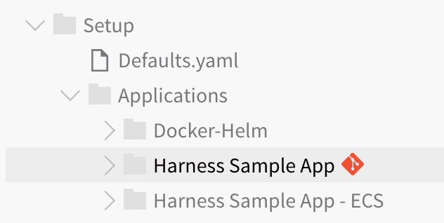
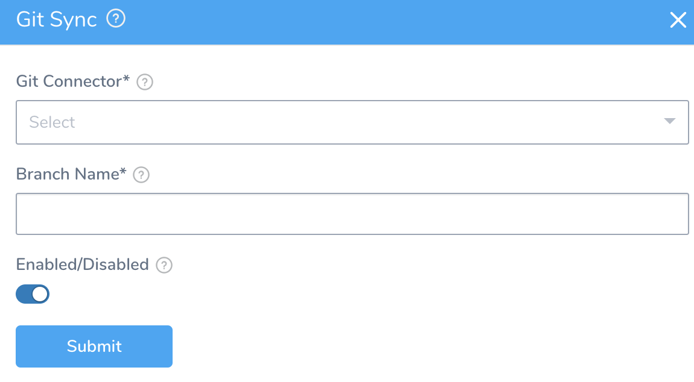
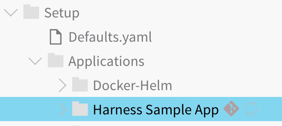
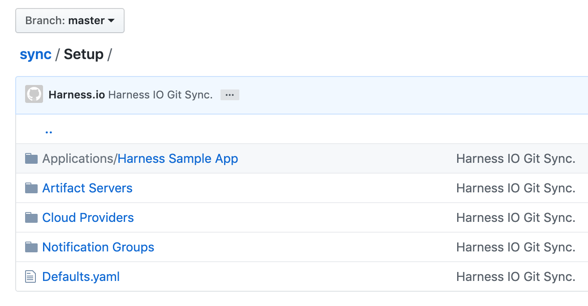

You can sync any of your Harness Applications with your Git repo. Harness Applications are set up and managed with Git separately from the Account-level sync.

For Account-level sync, see [Harness Account-Level Git Sync](harness-account-level-sync.md).

### Before You Begin

* [Configuration as Code](configuration-as-code.md)
* [Harness Account-Level Git Sync](harness-account-level-sync.md)
* [Add Source Repo Providers](../account/manage-connectors/add-source-repo-providers.md)

### Requirements

* Users must belong to a User Group with [Administer Other Account Functions](../security/access-management-howtos/users-and-permissions.md) selected to enable Git Sync at the account or Application level.
* Only Harness YAML files are allowed in the target repo. The repo you sync with Harness must not contain any non-Harness files. Also, non-Harness files ending in `.yaml` will cause sync to fail.

### Best Practices

When you sync Harness Accounts and Applications, no 3rd party account credentials are exposed. However, your Harness Applications might contain private information you added to their Services or Workflows. Only sync Harness Accounts and Applications with public repos if you are certain that your Harness Applications do not contain any private information.

As a best practice, only sync with private repos.

### Step: Sync Your Application With a Git Repo

You can sync your Application with a Git repo when you create it or sync an existing Application.

#### Option 1: Sync a New Application

To sync a new Application when you create it, do the following:

1. In **Setup**, in **Applications**, click **Add Application.**

  

2. Select the checkbox **Setup Git Sync**.
3. In **Git Connector**, select a Harness **Source Repo Provider**. For information on setting up a Source Repo Provider, see  [Add Source Repo Providers](../account/manage-connectors/add-source-repo-providers.md).
4. In **Branch Name**, enter the name of the repo branch to sync with the Harness Application. This can be the masterbranch or another branch where you want to keep the Harness application-level settings.Names may not contain characters from the Emoticons unicode block.
5. Click **Submit**.

#### Option 2: Sync an Existing Application

To sync an existing Harness Application with a Git repo, do the following:

1. Add your Git repo as a Source Repo Provider in Harness. For more information, see [Add Source Repo Providers](../account/manage-connectors/add-source-repo-providers.md).
2. In **Setup**, click **Configuration As Code**.
3. Hover your cursor over the name of the application you want to sync. A **Git Sync** icon is displayed.

   

4. Click the **Git Sync** icon.

5. In **Git Connector**, select a Harness **Source Repo Provider**. For information on setting up a Source Repo Provider, see [Add Source Repo Providers](../account/manage-connectors/add-source-repo-providers.md).
6. In **Branch Name**, enter the name of the repo branch to sync with the Harness application.
7. To enable sync between Harness and the repo in the Source Repo provider, ensure **Enable Git Sync** is enabled.
8. Click **Submit**. The **Git Sync** icon is next to the application.

   
   
To refresh a sync, click the **Refresh** icon.  
  
In your Git repo, the Harness Application is added.

Webhooks do not work with older versions of Bitbucket. You need to install the  [Post Webhooks for Bitbucket](https://marketplace.atlassian.com/apps/1215474/post-webhooks-for-bitbucket?hosting=server&tab=overview) plugin in Bitbucket to enable Harness to allow two-way sync with Bitbucket. For more information, see [Bitbucket Post Webhooks Plugin](../account/manage-connectors/add-source-repo-providers.md#bitbucket-post-webhooks-plugin).

### Next Steps

* [Edit Harness Components as YAML](edit-the-code-in-harness.md)
* [Delink Git Sync](delink-git-sync.md)

