Once you have synched your Harness account or Applications with your Git repo(s), you can view bi-directional activity between Harness and your repos using **Git Sync Activity**.

While Git repo providers include activity and webhook information, they do not provide a way to view Harness-specific activity, by account, Application, and YAML file history.

Git Sync Activity provides you with a granular, commit-by-commit audit of every change and ensures that you are fully aware of all Git activity with your Harness account and Applications.

For information on fixing Git sync errors, see [Diagnose Git Sync Errors](../../firstgen-troubleshooting/diagnose-git-errors.md).

### Before You Begin

Before you can view any Git activity in Harness, you must connect Harness with your Git repo(s).

Next, your Harness account or Applications must be synced with your Git repo using the webhook Harness provides.

To connect Harness with your Git repo and sync your Harness account and Applications, see the following topics:

1. Connect Harness with your Git repo(s).
	 See the following topics:
	 + [Add a GitHub Repo](../account/manage-connectors/add-github-repo.md)
	 + [Add a GitLab Repo](../account/manage-connectors/add-a-gitlab-repo.md)
	 + [Add a Bitbucket Repo](../account/manage-connectors/add-bitbucket-repo.md)
	 + [Add a CodeCommit Repo](../account/manage-connectors/add-a-code-commit-repo.md)

2. Sync your Harness account and/or Applications with your Git repo.
   See the following topic for an overview and steps on your Harness account and/or Application:
	 + [Configuration as Code](configuration-as-code.md)

### Visual Summary

For a visual overview of how Harness and Git sync works, see [Configuration as Code](configuration-as-code.md).

Here is an example of some of the information available in **Git Sync Activity**:

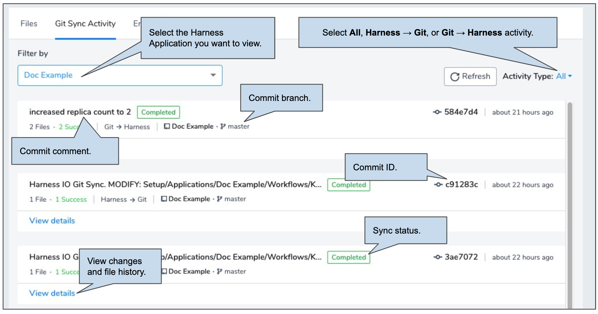
Here is some of the information available in each activity record:

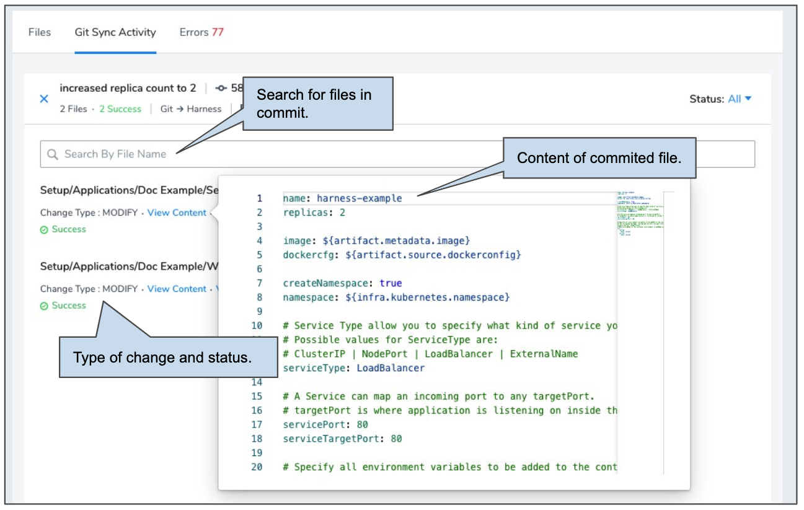

### Step 1: Open Git Sync Activity

1. In Harness, click **Setup**, and then click **Configuration as Code**.
2. Click **Git Sync Activity**.

If account-level synch has been set up, the default view shows all of the activity at the account level. Otherwise, the synced Applications are listed alphabetically.

Git sync activity is divided into Harness account-level activity and Application-level activity.

For a quick review of the difference between account and Application git syncing, see [Configuration as Code](configuration-as-code.md) and [Harness Key Concepts](../../starthere-firstgen/harness-key-concepts.md).

### Step 2: Select Account-level Activity (Setup)

The **Setup** filter option includes git sync activity at the Harness account level, as opposed to the Harness Application level. For your Git activity to show up here, your Harness account must be synced with a Git repo.

To view git activity for all Harness account-level components, do the following:

In **Git Sync Activity**, in **Filter by**, select **Setup**.

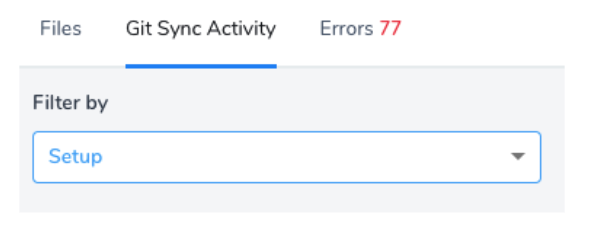

The **Setup** option is always at the top of the drop-down.The results are ordered by more recent to oldest.

You can sort the results by Activity Type, explained later in this topic.

### Step 3: Select Application-level Activity (App)

The Applications you see in **Filter by** depends on the permissions set in your Harness User Group.

You can view the Git activity for all Applications your User Group has read permissions for. See [Managing Users and Groups (RBAC)](../security/access-management-howtos/users-and-permissions.md).

To view Git activity for a Harness Application, do the following:

In **Git Sync Activity**, in **Filter by**, select the name of your Harness Application.

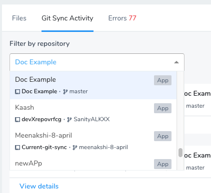

You can simply type in the name to locate the Application.

Harness displays the Application name, repo name, and repo branch name.

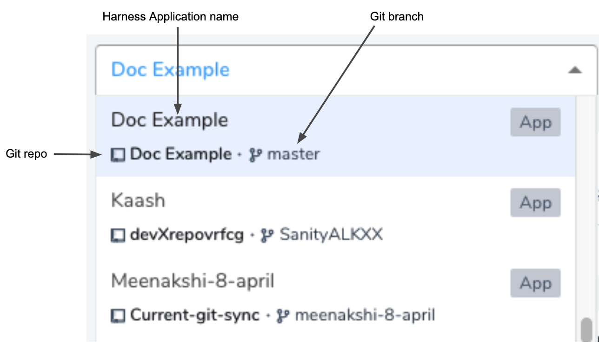

The results display all Harness-related Git activity.

If your Git webhook was incorrectly set up or changed in your repo and you committed a change in Git, the activity will not appear in Harness because the webhook failed to connect with Harness.

### Option 1: Select Activity to View

Use the Activity Type setting to select the Git activity you want to see. You can sort by **All**, **Git → Harness**, and **Harness → Git**.

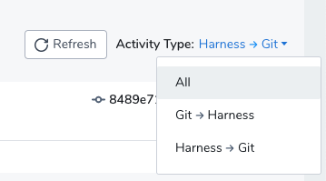

The sync direction is also displayed in every record.

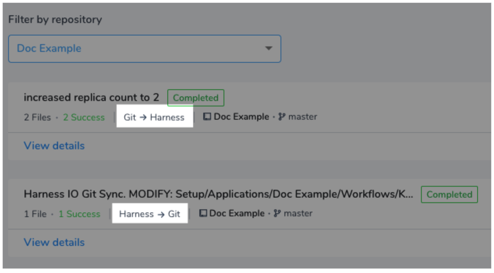

### Step 4: View Details

Click **View Details** on any record to see what happened.

Each record displays a number of useful details from your Git commit. Here is an example of Git → Harness activity. You can see the commit in Github and in Harness:

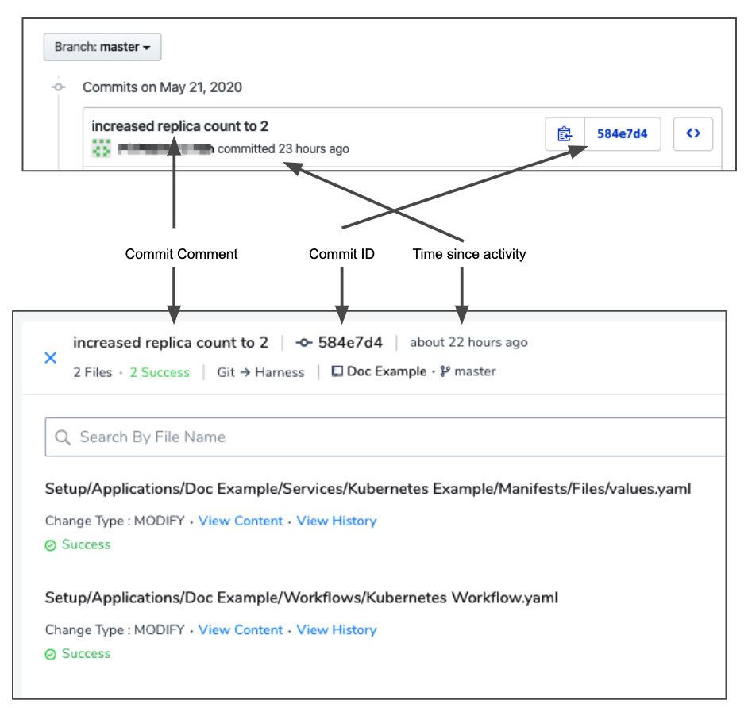

In the above example, you can see a difference in time since activity between Git and Harness records. This is because the initial Git → Harness activity failed due to an incorrect webhook. Once the webhook was fixed, the Git → Harness sync occurred.

### Step 5: Search by Status and Filename

If you have a large commit that involves many files, you can sort the activity by status:

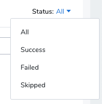

You can also search by filename. Wildcards are not supported. Simply type any letter in the name and see all matching files.

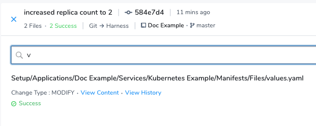

### Step 6: View File Content

To view the content of a change, click **View Content** on any file. The YAML of the file is displayed.

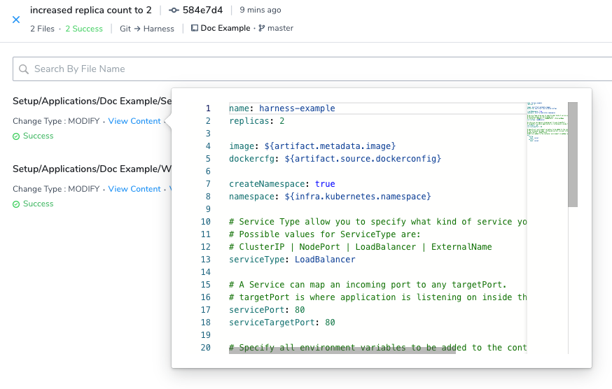

### Step 7: View File History

To view the history of all changes to the file, click **View History**.

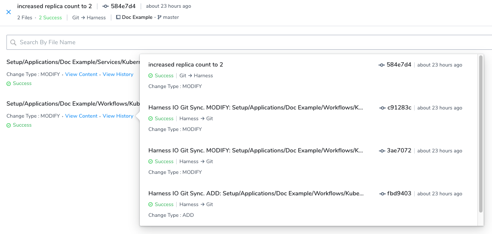

Each commit ID for the file is shown, along with its activity type, status, and change type.

### Review: Status and Error Messages

Each Git Sync Activity record contains status and error message content to help you understand the context of the activity.

In addition, for every record, the **Change Type** is listed. This is the type of change made in the Git activity, such as ADD or MODIFY.

#### Git Sync Process and Messages

The status and errors message will appear as part of the Git sync process. Below is the Git → Harness process and messages. The messages are the same for the Harness → Git process.

1. A commit is received via a webhook: `QUEUED`.
2. The commit is picked up by a Harness Delegate to be processed: `IN-PROGRESS`.
3. Post processing, the commit goes to a terminal state:
	1. No errors: `COMPLETED`.
	2. Some errors: `PROCESSED`.
	3. Nothing processed: `FAILED`.

####  Status Messages

The records displayed in Git Sync Activity have the following statuses:

* **Completed** — The sync completed in either direction.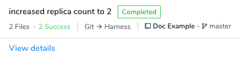

* **Processed** — Harness successfully pushed or pulled the Git change, but was unable to make the change because of a conflict. For this reason, the activity is marked as Processed instead of Completed.  
  For example, a change made to a file in Git made it incompatible with Harness configuration requirements. In the following example, a required value was missing:

  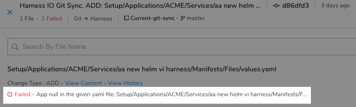

* **Success** — The number of successful file changes in the Git activity.

  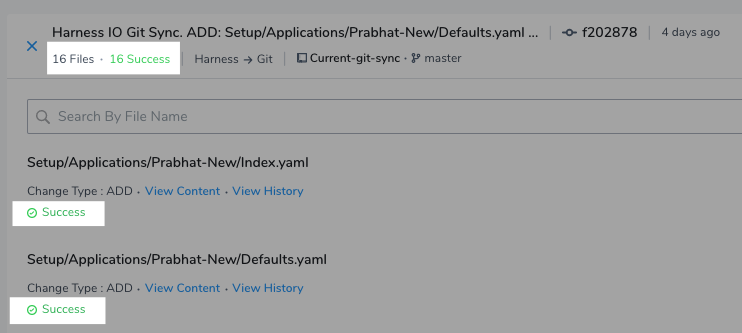

  Harness also provides details on activity that fixes errors: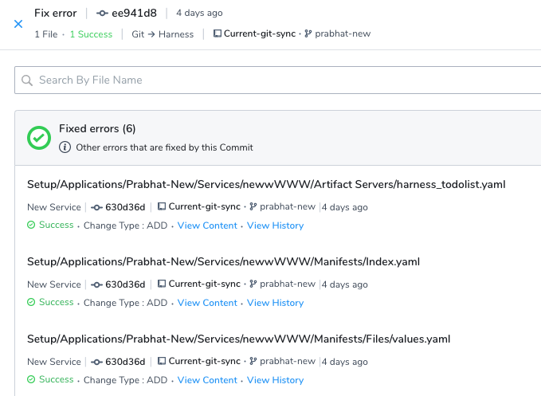

* **Failed** — The number of unsuccessful file changes in the Git activity.
* **Skipped** — If there are files in the commit that are not Harness files.

#### Error Messages

If an error occurs during sync, Harness marks the status as Failed and provides details.

In most cases, a sync is failed to prevent issues. For example, when changes to Harness YAML files are incompatible with Harness requirements and might cause your Harness account or Application to experience errors.

Here is an example of some errors:

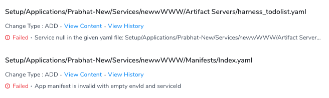

### Review: RBAC with Git Sync Activity

RBAC in Git Sync Activity follows permissions set on the User Group to which you are a member. It follows standard Harness RBAC as described in [Managing Users and Groups (RBAC)](../security/access-management-howtos/users-and-permissions.md).

Here are a few things to consider:

* If your User Group does not have permission to read a specific Application, then you are not able to view the Application in **Git Sync Activity**.
* Even if a Harness User Group has Read permissions on only one Application, its users can still read account-level settings. They simply cannot change them. Consequently, in Git Sync Activity, the user can view account-level Git activity using **Setup** in **Filter by**.
* The activity and errors of all account-level files are visible to all users, but a user can only see the content (**View Content**) of the files for which his User Group has permission.

### Notes

* Harness will maintain Git Sync activity records for 1 year.

### See Also

* [Configuration as Code](configuration-as-code.md)
* [Harness YAML Code Reference](../techref-category/configuration-as-code-yaml/harness-yaml-code-reference.md)

