You can add [Primary](primary-widgets.md) and [Custom](custom-widgets.md) Widgets to your Custom Dashboards. The Harness Primary Widget Library gets you started by offering the predefined visualizations of popular DevOps metrics.

### Before You Begin

* [Custom Dashboards](custom-dashboards.md)
* [Primary Widgets](primary-widgets.md)
* [Custom Widgets](custom-widgets.md)
* [Filters, Groups, and Tags in Primary and Custom Widgets](filters-groups-and-tags-in-custom-dashboard-widgets.md)

### Limitations

* **Data available in graphs limited to 50 Environments:** When you use **Group By** in your Widget and select **Environment**, Harness limits the data available to the graph to 50 Environments. You can apply filters on Environments and split the data into multiple reports to view the results.

### Step: Add Primary Widgets

To add Primary Widgets, perform the following steps:

1. Click **Add Widget** at the dashboard's upper right corner to populate or expand a Custom Dashboard.
   
   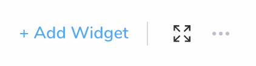

2. Select **Primary** **Widgets**.

   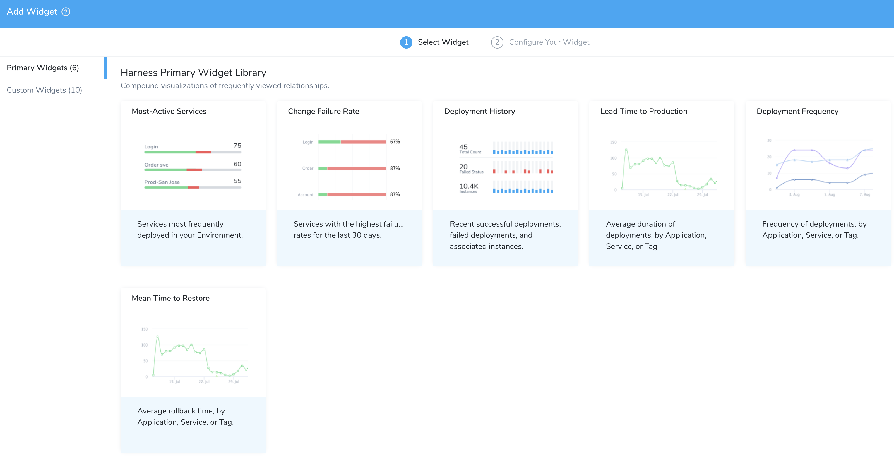

3. In **Select Widget**, select a visualization from the **Harness Primary Widget Library**.

:::note
The Widget and visualization that you select detemine the specific configuration fields, options, and previews available in the **Add**/**Edit Widget** wizard.
:::

### Option 1: Configure Most-Active Services

For this Widget, Harness Services are the only entity available for measurement and Applications are the only available filters.

1. In **Configure Your Widget**, in **Widget Title**, enter a title for your widget.

   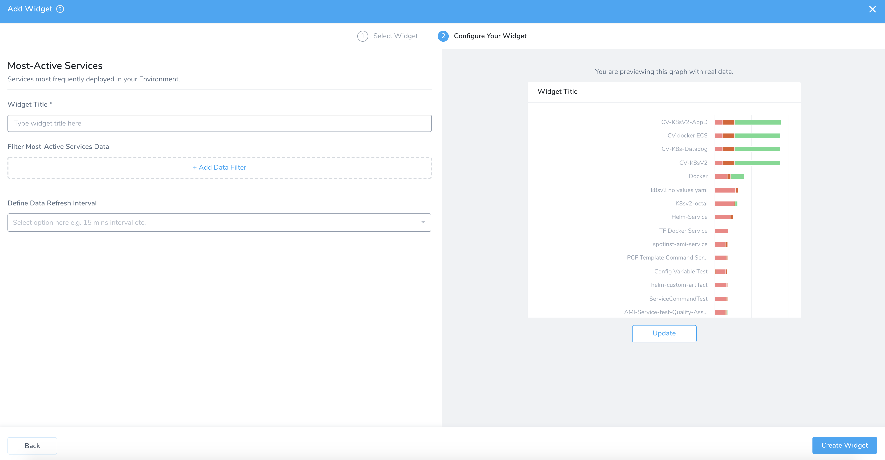
   
   The preview pane on the right indicates the data that your Widget will retrieve. It also displays warnings about missing data, with a reminder about possible causes. You can click this pane's **Update** button to refresh the data after each configuration change.  
  
   |  |  |
   | --- | --- |
   | 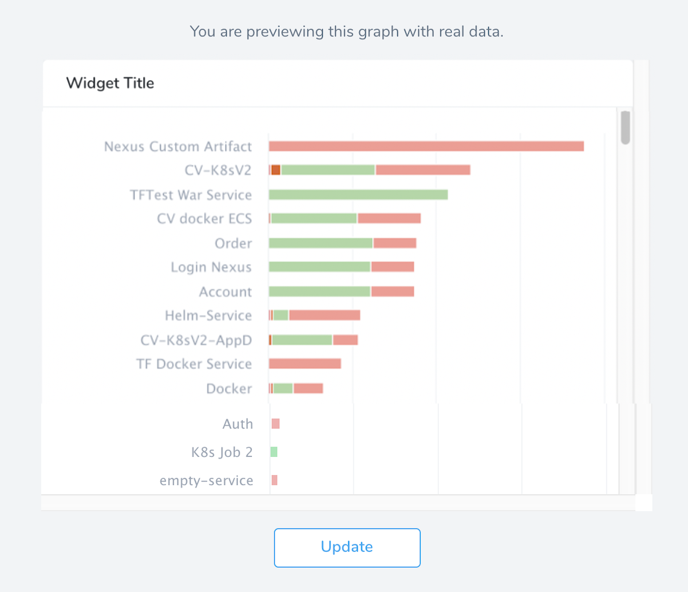 | 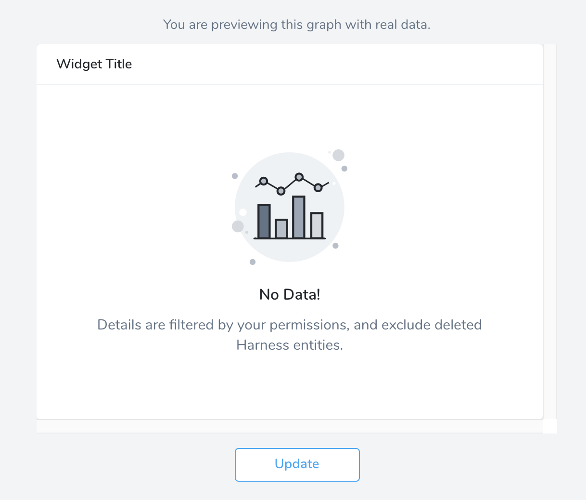 |
   
2. In **Filter Most-Active Services Data**, click **Add Data Filter**. For more information on filters, see [Filters, Groups, and Tags](filters-groups-and-tags-in-custom-dashboard-widgets.md).

   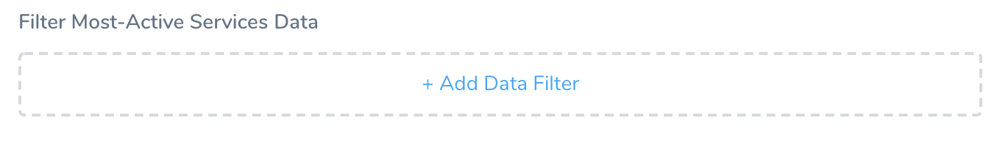

3. In **Filter Type**, select **Application**.
4. In **Select Filter Values**, select value for your filter type from the drop-down list.
5. In **Define Data Refresh Interval**, select the interval. The default value of **Define Data Refresh Interval** is **Never**.

   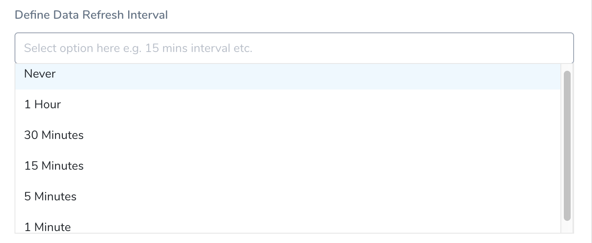

6. Once you have configured the Widget, click **Create Widget**.

### Option 2: Configure Change Failure Rate

For this Widget, Harness Services are the only entity available for measurement. You can filter on Applications, Environments, and Service Tags.

1. In **Configure Your Widget**, in **Widget Title**, enter a title for your widget.

   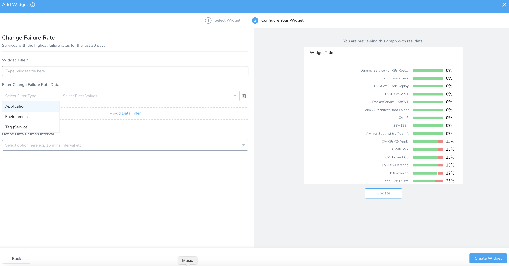

2. In **Filter Change Failure Rate Data**, click **Add Data Filter**. For more information on filters, see [Filters, Groups, and Tags](filters-groups-and-tags-in-custom-dashboard-widgets.md).
3. In **Filter Type**, select **Application**, **Environment**, or **Tag** (**Service**).You can add up to three data filters.
4. In **Select Filter Values**, select value for your filter type from the drop-down list.
5. In **Define Data Refresh Interval**, select the interval. The default value of **Define Data Refresh Interval** is **Never**.

   

5. Once you have configured the Widget, click **Create Widget**.

### Option 3: Configure Deployment History

:::note
The widgets with the **Time Filter** option can now show data for up to a year.  
Currently, this feature is behind a Feature Flag. Contact [Harness Support](mailto:support@harness.io) to enable the feature. Feature Flags can only be removed for Harness Professional and Essentials editions. Once the feature is released to a general audience, it is available for Trial and Community Editions.
:::

For this Widget, deployments are the only entity available for measurement, and time intervals are the only available filters. Deployment History displays data only for the terminal state, for example, failed, success, etc. The running executions are not filtered because the deployments that have ended in the selected time series are only fetched.

1. In **Configure Your Widget**, in **Widget Title**, enter a title for your widget.

   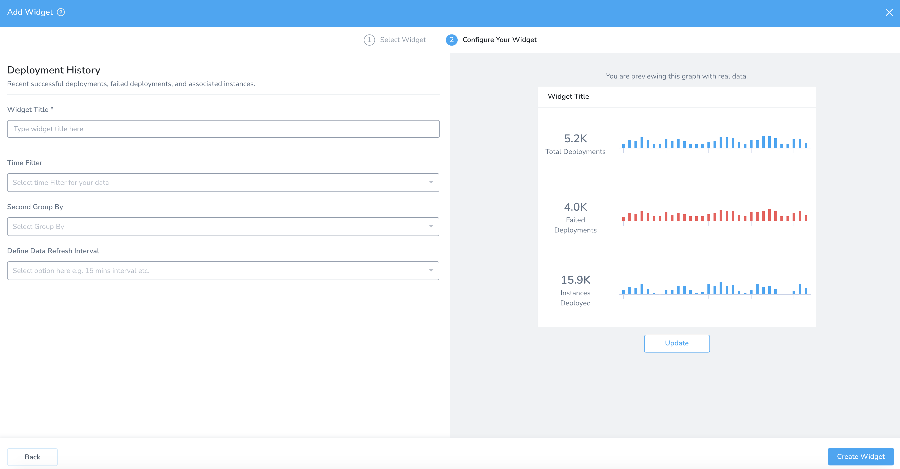

2. Select the **Time Filter**. You can select any of the following:  
  
  - Show Last 1 Hour Data  
  - Show Last 24 Hours Data  
  - Show Last 7 Days Data  
  - Show Last 30 Days Data  
  - Show Last 6 Months Data  
  - Show Last 1 Year Data
    
    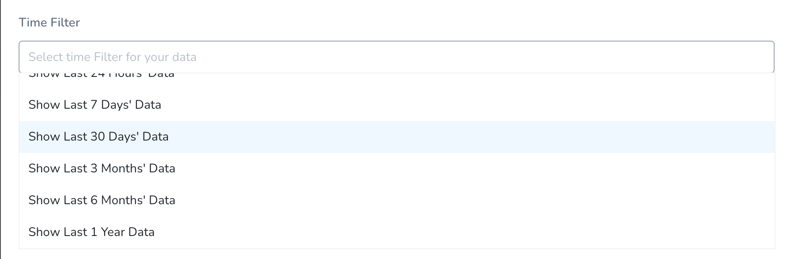

3. In **Second Group By**, select the second level for the time filter. The **Second Group By** option is listed based on your **Time Filter** selection.  
For example, if you have selected **Show Last 1 Year Data** in **Time Filter**, then the **Second Group By** lists only monthly. If you select **Show Last 7 Days Data** in **Time Filter**, then it lists daily and hourly.

   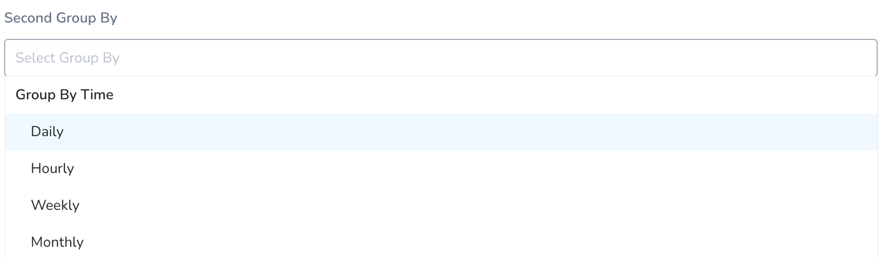

4. In **Define Data Refresh Interval**, select the interval. The default value of **Define Data Refresh Interval** is **Never**.

   

5. Once you have configured the Widget, click **Create Widget**.

### Option 4: Configure Lead Time to Production

For this Widget, deployments are the only entity available for measurement. You can filter on multiple Harness entities and Tags.

1. In **Configure Your Widget**, in **Widget Title**, enter a title for your widget.

   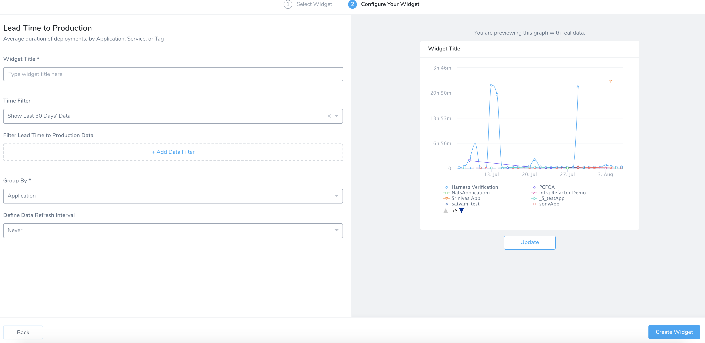

2. In **Time Filter**, select the time filter. You can select any of the following:  
  
    - Show Last 1 Hour Data  
    - Show Last 24 Hours Data  
    - Show Last 7 Days Data  
    - Show Last 30 Days Data  
    - Show Last 6 Months Data  
    - Show Last 1 Year Data
    
      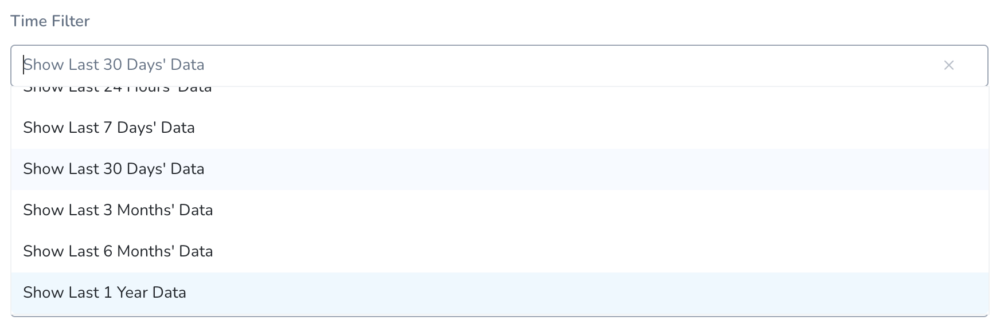

3. In **Filter Lead Time to Production Data**, click **Add Data Filter**. For more information on filters, see [Filters, Groups, and Tags](filters-groups-and-tags-in-custom-dashboard-widgets.md).
4. In **Select Filter Type**, select the filter. You can select **Application**, **Service**, **Environment**, **Cloud Providers,** **Status**, **Tag** (**Application**), **Tag** (**Service**), **Tag** (**Environment),** or **Tag** (**Deployment**). Filter values are listed based on your Filter type selection.

:::note
You can add up to nine data filters.
:::

#### Tags

Ensure you are familiar with Harness Tags and using variables expressions in Tag names and values. See [Use Expressions in Workflow and Pipeline Tags](../account/tags/use-expressions-in-workflow-and-pipeline-tags.md).

This can be a very powerful method for creating Custom Dashboards. For example, let's say you had a Workflow or Pipeline Tag named **commitID**. The value for it is passed in as an expression, such as `${workflow.variables.commitID}`. You could provide the value for the variable using [a Trigger that passes in a Git commit ID](../../continuous-delivery/model-cd-pipeline/expressions/passing-variable-into-workflows.md).

When you deploy, the expression is evaluated and the commit ID is displayed in **Deployments** like **commitID:521747298a3790fde1710f3aa2d03b55020575aa**.

Now, you can create a Custom Dashboard for the name **commitID** that filters or groups deployments by each commit ID.

* You can create a Harness Custom Dashboard that filters or groups using Tags that use expressions.
* You can use a Tag whose name or value uses an expression, but you can only filter or group by Tag *name*.
* You cannot use the expression itself to filter or group. You must use the evaluated expression displayed in Harness **Deployments**.
* You can use expression Tags in the following Widgets:
	+ Deployments
	+ Lead Time to Production
	+ Mean Time to Restore

#### Status

For **Status** the following terminal statuses are available:

* **Rejected**: Filters the rejected deployments.
* **Expired**: Filters the expired deployments.
* **Error**: Filters the deployments with errors. This status filters the deployments with unforeseen circumstances, for example, delegate not available, corrupted data, etc.
* **Failed**: Filters the failed deployments. The deployments could fail because of health check or configuration issues.
* **Success**: Filters the successful deployments.
* **Aborted**: Filters the aborted deployments.

  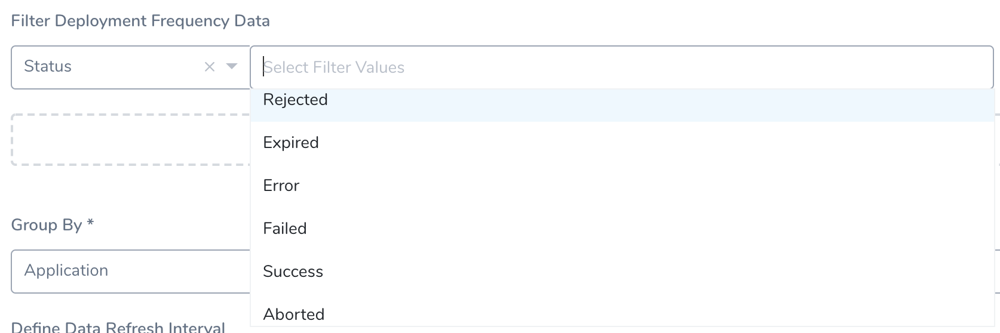

1. In **Group By** select, **Group by Entity** or **Group by Tag**.
	1. **Group by Entity**: Select **Application** or **Service**.
  
     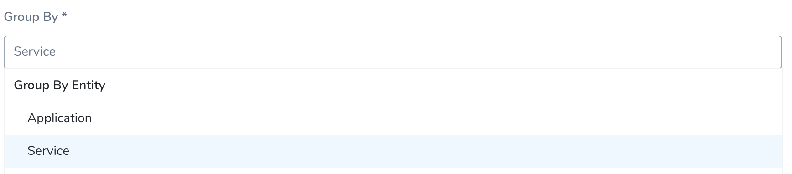

	2. **Group by Tag**: Select **Tag (in Application)**, **Tag (in Service)**, or **Tag (in Deployment)**.
  
     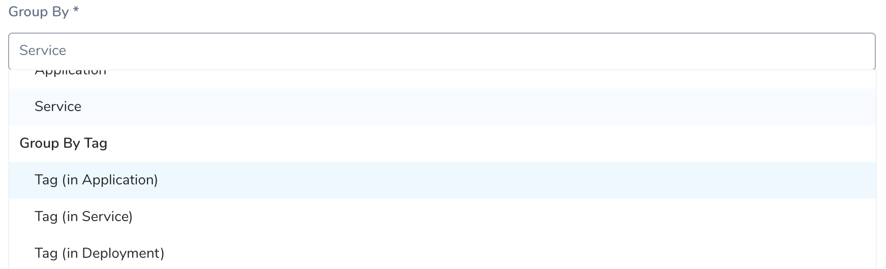

	3. Select the **Tag Name**.
  
     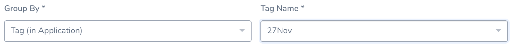

2. In **Define Data Refresh Interval**, select the interval. The default value of **Define Data Refresh Interval** is **Never**.

   

3. Once you have configured the Widget, click **Create Widget**.

### Option 5: Configure Deployment Frequency

This line chart shows the daily frequency of deployments by Application, Service, or Tag. You can customize the Time Filter (range) and can filter on multiple Harness entities and Tags.

The steps to configure **Deployment Frequency** is almost identical to [Lead Time to Production](add-and-configure-primary-widgets.md#option-4-configure-lead-time-to-production).

### Option 6: Configure Mean Time to Restore

This line chart shows the average rollback duration by Application, Service, or Tag. You can customize the Time Filter (range), and can filter on multiple Harness entities and Tags.

The steps to configure **Mean Time to Restore** is almost identical to [Lead Time to Production](add-and-configure-primary-widgets.md#option-4-configure-lead-time-to-production).

### View/Edit Primary Widgets

[Account Administrators](#administrators) can edit the existing Widgets.

1. Click Widget's More Options ••• .

  

2. Select **View/****Edit**. This reopens controls for [Add Primary Widgets](add-and-configure-primary-widgets.md#step-add-primary-widgets). You can follow the [Add Primary Widgets](add-and-configure-primary-widgets.md#step-add-primary-widgets) steps to edit the configurations.

3. Once you have configured the Widget, click **Update Widget**.

### Remove Primary Widgets

[Account Administrators](#administrators) can Remove the existing Widgets. **Remove** deletes the Widget from this Custom Dashboard.

:::danger
If you've customized the Widget's configuration, this also removes that configuration from your Harness account. This action cannot be undone. Consider first cloning a backup copy of the current dashboard.
:::

1. In Widget, click More Options •••.
 
  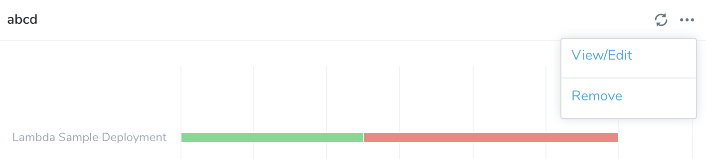

2. Select **Remove**.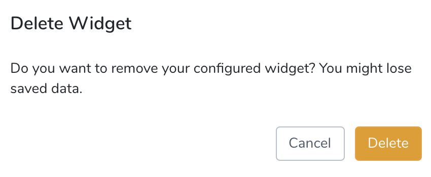

3. Click **Delete** to remove the Widget.

### Next Steps

* [Add and Configure Custom Widgets](configure-custom-widgets.md)

