You can add [Primary](primary-widgets.md) and [Custom](custom-widgets.md) Widgets to your Custom Dashboards. Custom Widgets offer less predefined structure than Primary Widgets but offers more flexibility.

## Before You Begin

* [Custom Dashboards](custom-dashboards.md)
* [Primary Widgets](primary-widgets.md)
* [Custom Widgets](custom-widgets.md)
* [Filters, Groups, and Tags in Primary and Custom Widgets](filters-groups-and-tags-in-custom-dashboard-widgets.md)

## Step: Add Custom Widgets

Ensure that you select entities that contain deployment data.

For example, if you select a Workflow with only **Pre-deployment** and **Post-deployment** steps but no deployment Phases, it will not have data on deploying a Service because no Service is used. Also, this Workflow might have an Environment in its setup, but that Environment won't be used because there is no deployment Phase. Hence, there will be no Environment data to display.

In such a case, the custom dashboard columns will be null.

To add Custom Widgets, perform the following steps:

1. Click **Add Widget** at the dashboard's upper right corner to populate or expand a Custom Dashboard. For more information, see [Edit a Dashboard](create-and-manage-dashboards.md#step-edit-or-clone-a-dashboard).

   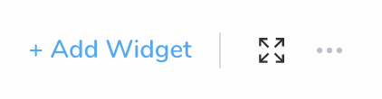

2. Select **Custom Widgets**.

   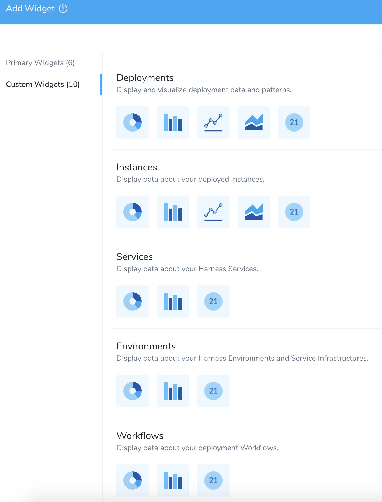

3. Select the [Custom Widget Types](custom-widgets.md#custom-widget-types).
4. Select a visualization type.

## Step: Configure Deployments Widget

Deployments widget display and visualize your deployment data and patterns.

First, you need to **Configure Your Widget** (required) and then **Format Graph Display** (optional).

:::note
* The available options will vary depending on your Widget Type selection.  
* This document uses **Deployment Widget Type** and **Donut Visualization Type** to demonstrate the steps required to configure the Widget.
:::

### Configure Your Widget

1. In **Configure Your Widget**, in **Widget Title**, enter a title for your widget.

   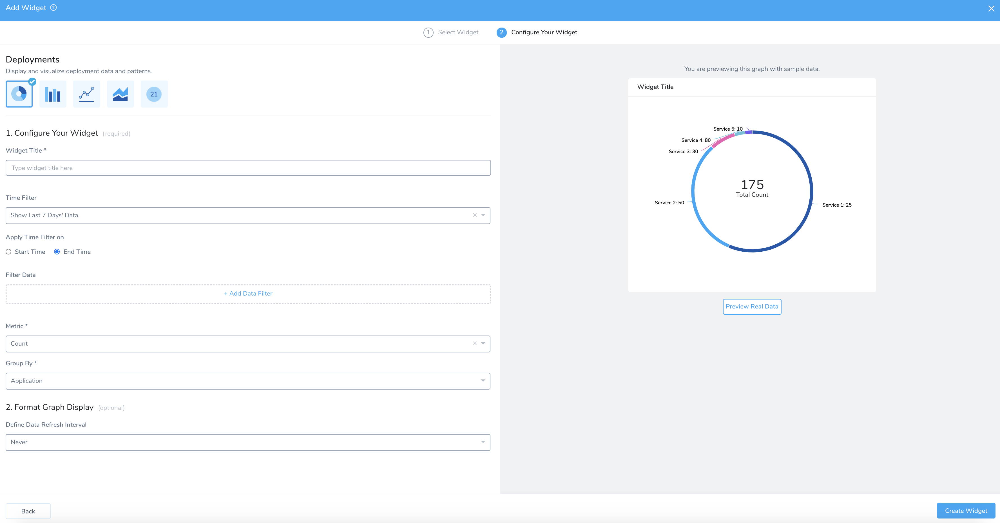

:::note
* The widgets with the **Time Filter** option can now show data for up to a year.    
* Currently, this feature is in Beta and behind a Feature Flag. Contact [Harness Support](https://mail.google.com/mail/?view=cm&fs=1&tf=1&to=support@harness.io) to enable the feature. Feature Flags can only be removed for Harness Professional and Essentials editions. Once the feature is released to a general audience, it is available for Trial and Community Editions.
:::

2. Select the **Time Filter**.  
  
  In **Deployments** and **Instances** Custom Widget type, for a bar chart, line chart, and area chart, you can select the following options in **Time Filter**:  
    
    - Show Last 1 Hour Data  
    - Show Last 24 Hours Data  
    - Show Last 7 Days Data  
    - Show Last 30 Days Data  
    - Show Last 6 Months Data  
    - Show Last 1 Year Data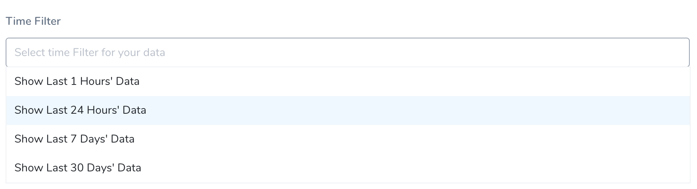

2. In **Apply Time Filter on**, select **Start Time** or **End Time**.  
  
   If you select **Start Time**, then you will have two additional intermediate [Status](configure-custom-widgets.md#status), **Running** and **Paused**.
   
   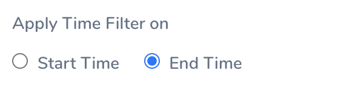

3. In **Filter Data**, **Add Data Filter**. For more information on filters, see [Filters, Groups, and Tags](filters-groups-and-tags-in-custom-dashboard-widgets.md).
4. In **Select Filter Type**, select the filter. You can select:

    * **Application**
    * **Service**
    * **Environment**
    * **Environment Type**
    * **Cloud Providers**
    * **Status**
    * **Tag** (**Application**)
    * **Tag** (**Service**)
    * **Tag** (**Environment)**
    * **Tag** (**Deployment**).

Filter values are listed based on your Filter type selection.

You can add up to nine data filters.

#### Tags

Ensure you are familiar with Harness Tags and using variables expressions in Tag names and values. See [Use Expressions in Workflow and Pipeline Tags](../account/tags/use-expressions-in-workflow-and-pipeline-tags.md).

This can be a very powerful method for creating Custom Dashboards. For example, let's say you had a Workflow or Pipeline Tag named **commitID**. The value for it is passed in as an expression, such as `${workflow.variables.commitID}`. You could provide the value for the variable using [a Trigger that passes in a Git commit ID](../../continuous-delivery/model-cd-pipeline/expressions/passing-variable-into-workflows.md).

When you deploy, the expression is evaluated and the commit ID is displayed in **Deployments** like **commitID:521747298a3790fde1710f3aa2d03b55020575aa**.

Now, you can create a Custom Dashboard for the name **commitID** that filters or groups deployments by each commit ID.

* You can create a Harness Custom Dashboard that filters or groups using Tags that use expressions.
* You can use a Tag whose name or value uses an expression, but you can only filter or group by Tag *name*.
* You cannot use the expression itself to filter or group. You must use the evaluated expression displayed in Harness **Deployments**.

#### Status

For **Status** the following terminal statuses are available:

* **Rejected**: Filters the rejected deployments.
* **Expired**: Filters the expired deployments.
* **Error**: Filters the deployments with errors. This status filters the deployments with unforeseen circumstances, for example, delegate not available, corrupted data, etc.
* **Failed**: Filters the failed deployments. This status filters the deployments that might have failed because of health check or configuration issues.
* **Success**: Filters the successful deployments.
* **Aborted**: Filters the aborted deployments.

  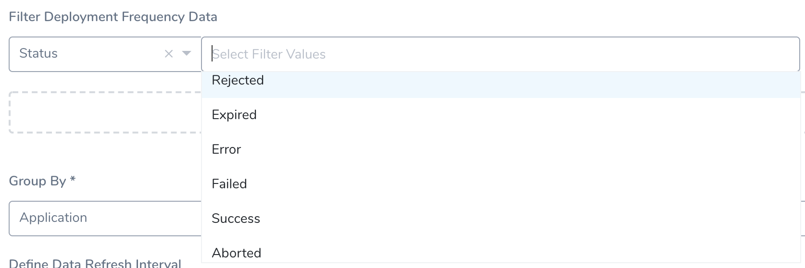

1. In **Metric**, select **Count**, **Time Taken**, or **Rollback Time Taken**.

   

2. In **Group By** select, **Group by Entity** or **Group by Tag**.
	1. **Group by Entity**: Select **Application**, **Environment**, **Environment Type**, **Service**, **Status**, or **Cloud Provider**.
  
     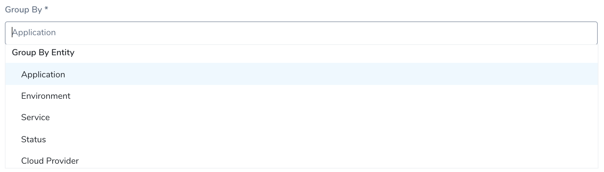

	2. **Group by Tag**: Select **Tag (in Application)**, **Tag (in Service)**, **Tag (in Environment),** or **Tag (in Deployment)**.
  
     

	3. Select the **Tag Name**.
  
     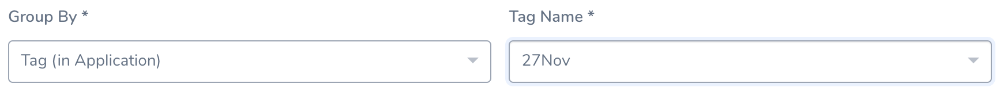

You can use the added **Second Group By** option for **Bar Chart**, **Line Chart** and **Area Chart** to display a time series, or you can plot an X/Y relationship among two entities or Tags.

For example, if you selected **Filter Data: Environment Type: Production, Non-Production** and **Group By: Application** you will see each Applications for Production and Non-Production Environments, but they are separated by Environment Type:

If you select **Second Group By: Environment Type**, you can see the same Applications grouped by Environment Type:

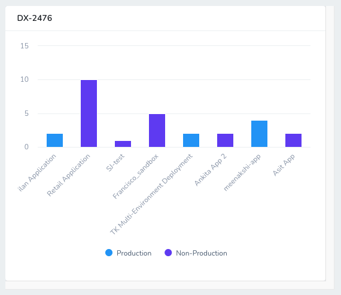

### Format Graph Display

1. In **Define Data Refresh Interval**, select the interval. The default value of **Define Data Refresh Interval** is **Never**.

   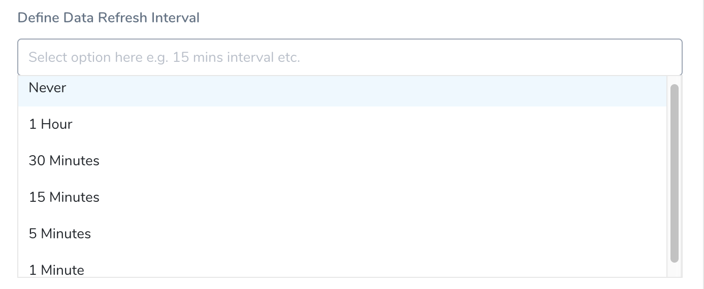

2. Once you have configured the Widget, click **Create Widget**.

## Step: Configure Applications Widget

The Applications widget displays data about your Harness Applications.

### Configure Your Widget

1. In **Widget Title**, enter a title for your widget.

   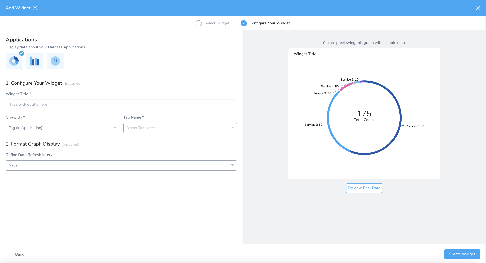

2. In **Group By**, select **Tag (in Application).** For more information on tags, see [Manage Tags](../account/tags/manage-tags.md).  
  
   **Tag (in Application)** is available for **Donut** and **Bar Chart** visualization types only.

   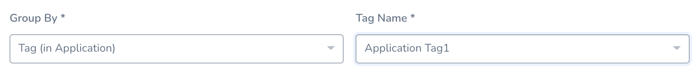

3. In **Tag Name**, select the name of the tag.

   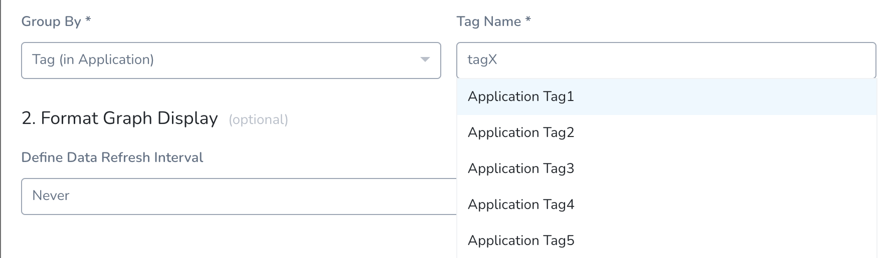

### Format Graph Display

1. In **Define Data Refresh Interval**, select the interval. The default value is **Never.**

   

2. Once you have configured the Widget, click **Create Widget**.

## Step: Configure Services Widget

The Services widget displays data about your Harness Services.

For example, you can filter by the Service deployment type:

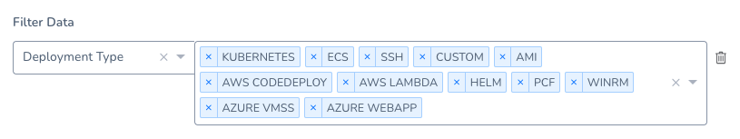

This filter will display all of the Harness Services by deployment type (this also uses **Second Group By: Deployment Type**):

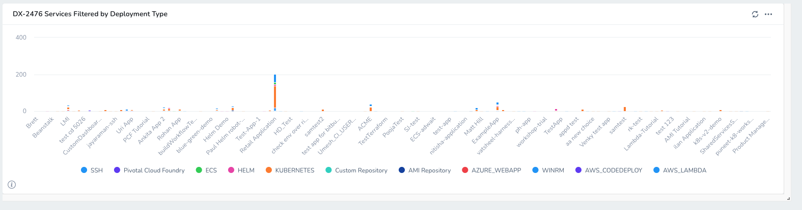

Clicking any of the bars will drill down to show the deployments of that type.

## Step: Configure Workflows Widget

This widget displays data about your deployment Workflows.

For example, you can filter by Workflow Type (strategy used by a Workflow):

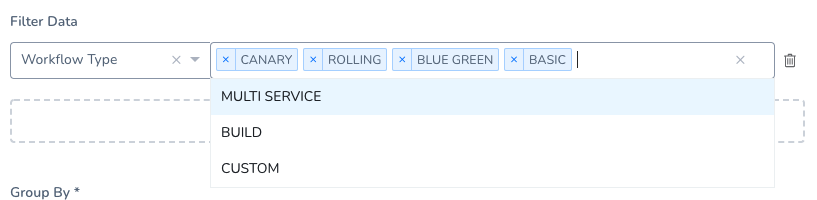

This filter will display all of the Harness Workflow by Workflow type (this also uses **Second Group By: Workflow Type**):

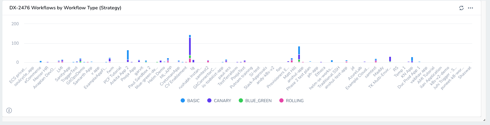

## View/Edit Widgets

[Account Administrators](#administrators) can edit the existing Widgets.

1. Click Widget's More Options •••.

   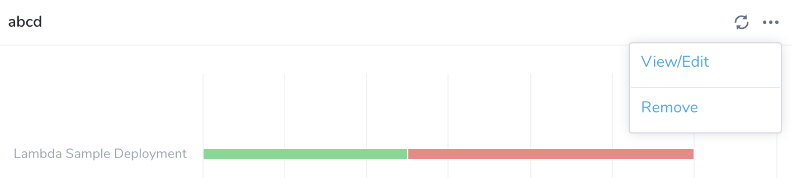

2. Select **View/****Edit**. This reopens controls for [Add Primary Widgets](add-and-configure-primary-widgets.md#step-add-primary-widgets). You can follow the [Add Primary Widgets](add-and-configure-primary-widgets.md#step-add-primary-widgets) steps to edit the configurations.

3. Once you have configured the Widget, click **Update Widget**.

## Remove Widgets

[Account Administrators](#administrators) can Remove the existing Widgets. **Remove** deletes the Widget from this Custom Dashboard.

If you've customized the Widget's configuration, this also removes that configuration from your Harness account. This action cannot be undone. Consider first cloning a backup copy of the current dashboard.

1. In Widget, click More Options •••.

  

2. Select **Remove**.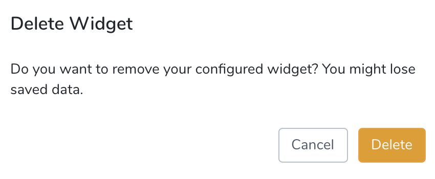

3. Click **Delete** to remove the Widget.

## Next Steps

* [Add and Configure Primary Widgets](add-and-configure-primary-widgets.md)

