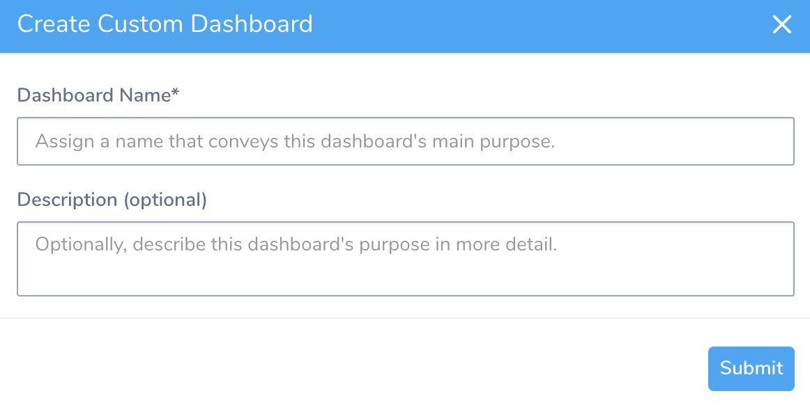
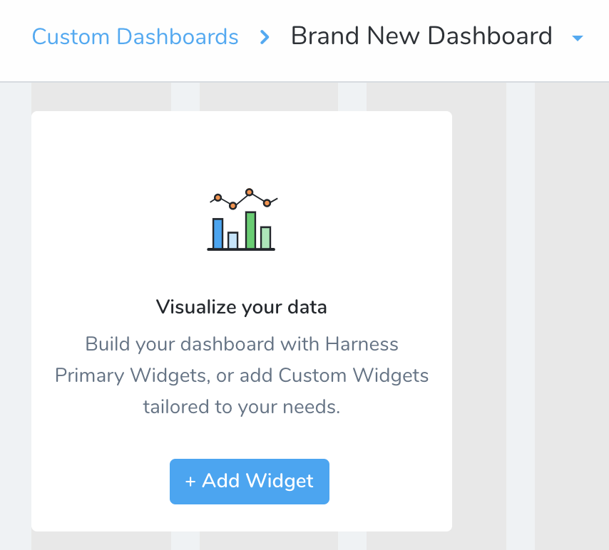
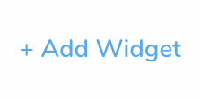
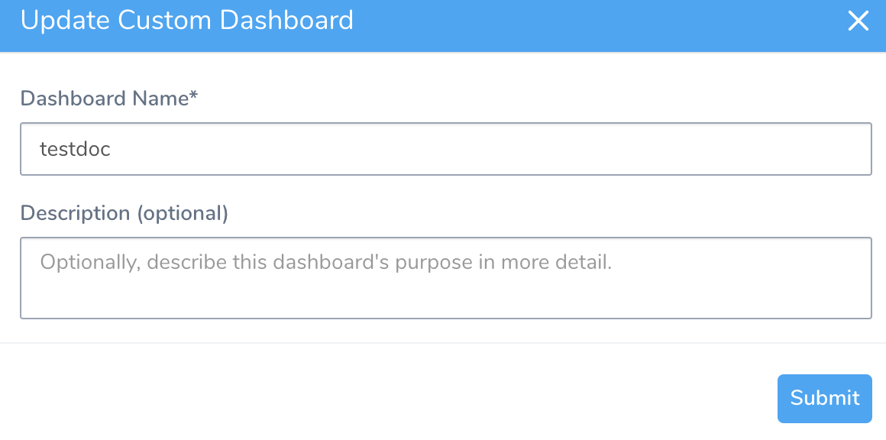
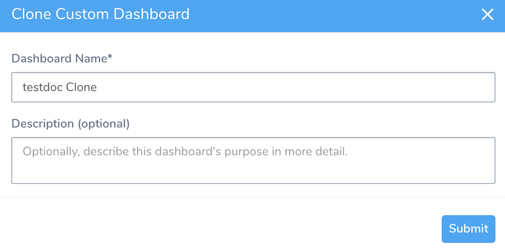
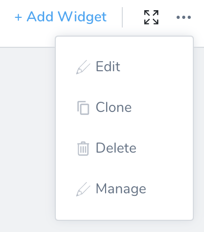
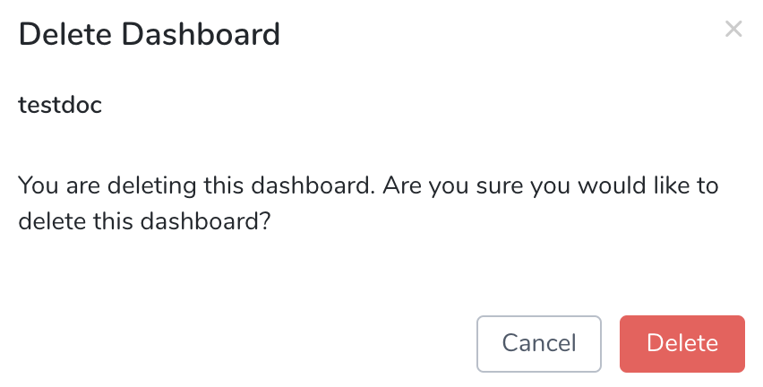

Custom Dashboards provide a toolbox for building your own visual interface around Harness data using flexible filtering and criteria. By creating and fine-tuning visualizations that slice and dice your data, you can identify and optimize:

* Development and deployment velocity
* Bottlenecks
* Rollback durations and other useful metrics

### Before You Begin

* [Custom Dashboards](custom-dashboards.md)
* [Primary Widgets](primary-widgets.md)
* [Custom Widgets](custom-widgets.md)
* Review [Manage Groups and Permissions](custom-dashboards.md#manage-groups-and-permissions-for-custom-dashboards)

### Review: Permissions

A Harness user's interaction with Custom Dashboards is role-based. Options depend on their membership in a Harness User Group with specific Account Permissions. 

To create and manage Custom Dashboards, your Harness User Group must have the following Account Permissions:

* Create Custom Dashboards
* Manage Custom Dashboards

Without these permissions, you can still view and operate on a dashboard that has been [shared with you](sharing.md).

For more information, see [Manage Groups and Permissions](custom-dashboards.md#manage-groups-and-permissions-for-custom-dashboards).

### Step: Create a Dashboard

To create a Custom Dashboard, perform the following steps:

1. In Harness click **Custom Dashboards** and then click **Create Custom Dashboard**.
2. Enter a **Dashboard Name**. This should be unique within your Harness account.

  

3. Optionally, enter a **Description**. This can be used to communicate the dashboard's purpose to other users.
4. Click **Submit**. Your new Custom Dashboard will open in the initial state as shown below.

### Step: Edit or Clone a Dashboard

At a Custom Dashboard's upper-right corner, [Account Administrators](#administrators) see these additional controls for modifying the dashboard as a whole. The following options are available:

##### Add a Widget

Click **Add Widget** to populate your Custom Dashboard with Widgets. For more information, see [Add and Configure Dashboard Widgets](add-and-configure-primary-widgets.md).

##### Expand or Collapse a Custom Dashboard

To enter/exit Full Screen display of your dashboard, click the Expand/Collapse toggle.

##### Edit a Custom Dashboard

1. Click the More Options ••• and select **Edit**.

   

2. In **Update Custom Dashboard**, enter the **Dashboard Name** and **Description** (optional).

   

3. Click **Submit**.

##### Clone a Custom Dashboard

1. Click the More Options ••• and select **Clone**.

   

2. In **Clone Custom Dashboard**, enter the **Dashboard Name** and **Description** (optional).

   

3. Click **Submit**.

##### Delete a Custom Dashboard

1. Click the More Options ••• and select **Delete**.

   

2. Click Delete.

  

Deleting a Custom Dashboard also permanently deletes any configurations you've applied to its Widgets. This action cannot be undone.

##### Manage a Custom Dashboard

Click the More Options ••• and select **Manage**. This option allows you to [Share a Custom Dashboard](sharing.md).

### Next Steps

* [Add and Configure Primary Widgets](add-and-configure-primary-widgets.md)
* [Add and Configure Custom Widgets](configure-custom-widgets.md)

