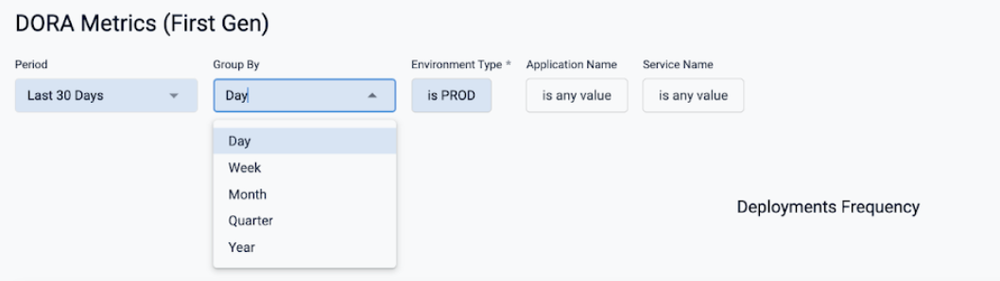
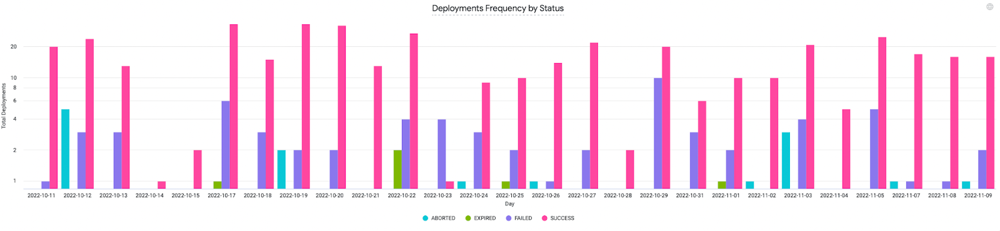
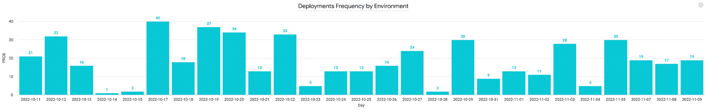
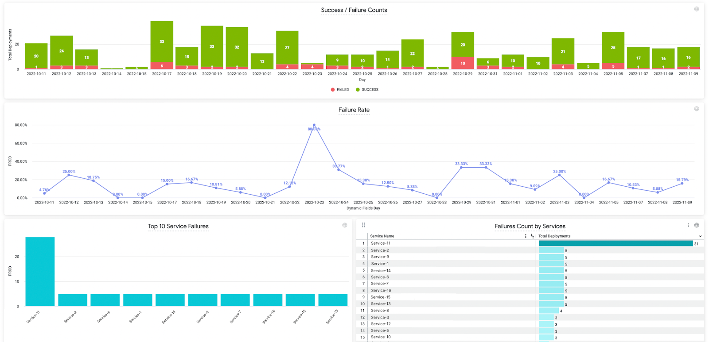
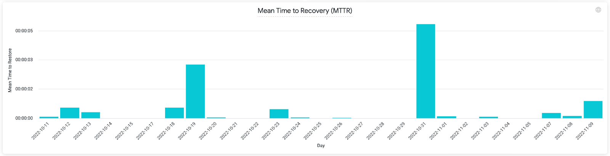
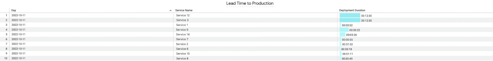
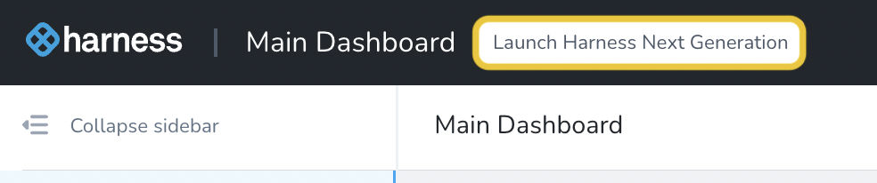

This topic describes DORA metrics if you are a Harness FirstGen customer. If you are using the NextGen Platform, go to DORA Metrics.You can view DevOps Research and Assessment (DORA) metrics using the DORA Dashboard on the Harness Platform. DORA metrics are key for understanding the performance of software development teams. By understanding these metrics, you’re empowered to iterate and make improvements for your business. 

The DORA dashboard is available only for some FirstGen customers. If you would like access to this dashboard, contact your sales representative. 

## Available DORA metrics

Using the DORA Dashboard, you can view the following metrics: 

* Deployments Frequency
* Success and Failures
* Mean Time to Recovery (MTTR)
* Lead Time to Production

For each of these metrics you can choose to visualize the data by:

* Day
* Week
* Month
* Quarter
* Year

### Deployments Frequency

This metric shows the frequency of deployments. The data is displayed visually in two ways:

#### By status

The data is displayed per the following status: 

* ABORTED
* EXPIRED
* FAILED
* SUCCESS

#### By environment

The data is displayed for production or non-production environments. 

### Success and failures

This metric shows the following data:

* Success versus failure rates for all your deployments.
* The percentage failure rate.
* The top 10 service failures within your production or non-production environments.
* The total failures count per each service.

### Mean Time to Recovery

This metric shows the duration of a rollback in seconds. 

### Lead Time to Production

This metric shows the mean duration of pipeline executions of your deployments. The data is displayed visually at a per service level within the timeframe you specified.

## How to view DORA metrics

DORA metrics are not available within the FirstGen platform, however, if you have been set up with access to them, you can view the DORA dashboard within the NextGen platform. To do this: 

1. Go to the Harness Platform.
2. On the top banner, select **Launch Harness Next Generation**.

   

3. On the left-hand navigation, select **Dashboards**.
4. Click the **DORA Metrics (First Gen)** tile.

