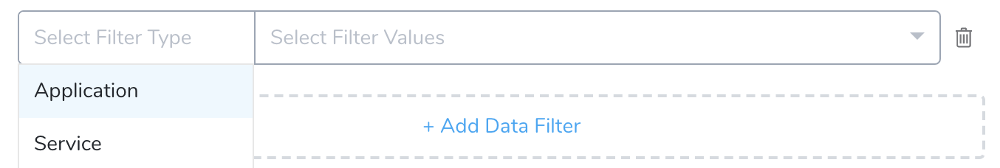
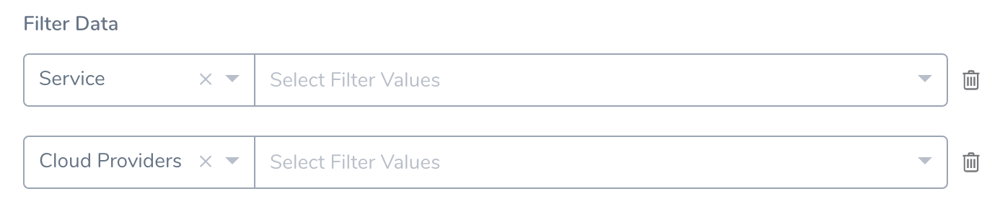
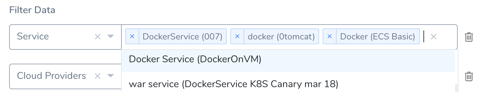
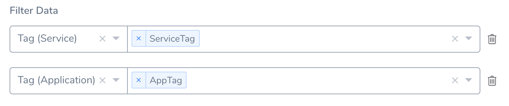
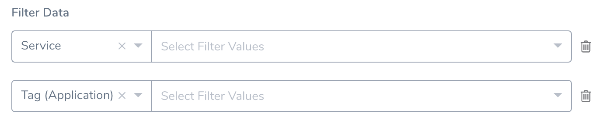

Many [Primary Widget](primary-widgets.md#next-steps) and [Custom Widget](custom-widgets.md#custom-widget-types) types offer you the option to filter and/or group by multiple Harness entities and [Tags](../account/tags/tags.md). This provides flexibility to define and display complex relationships among your data. However, sometimes because of over-filtering, the desired data gets hidden or an unwarranted **No Data!** error is returned. 

Filter conditions are not validated when you preview, create, or update a Widget. Therefore, as you add filter conditions and filter values, consider the points outlined in this topic.

### Before You Begin

* [Custom Dashboards](custom-dashboards.md)
* [Primary Widgets](primary-widgets.md)
* [Custom Widgets](custom-widgets.md)
* [Create and Manage Custom Dashboards](create-and-manage-dashboards.md)
* [Add and Configure Primary Widgets](add-and-configure-primary-widgets.md)
* [Add and Configure Custom Widgets](configure-custom-widgets.md)

### Add Data Filter

Click **Add Data Filter** to begin defining a filter. Use the resulting **Select Filter Type** drop-down to select which Harness entity or Tag to use as the filter.

In most Widgets, the **Add Data Filter** link remains available to add more filters. Multiple filter rows combine using AND search logic. Each filter that you add can further narrow the returned data.

The adjacent **Select Filter Values** drop-down allows multiple selections. Within a given filter, values combine using OR search logic. Each value that you add can broaden the data retrievable with this filter.

To remove a filter, click the trash-can icon at its right. 

### Tag Filters

Each Tag filter can target only a single entity type (**Application**, **Environment**, or **Service**). To filter on one or more Tags across *multiple* entities, add more filter rows.

Remember that the AND logic among the rows will further restrict your retrieved data.

### Tips

Here are some tips about how to avoid unintended filter results.

* Adding a filter target with *no* filter value doesn't restrict the Widget's data. The incomplete examples below don't actually function as filters.

  

* Do not filter on an entity name, or Tag value, that's not used on the Harness entity (**Metric**) you're charting. This will generate a **No Data!** error when you preview, create, or update the Widget.

  

