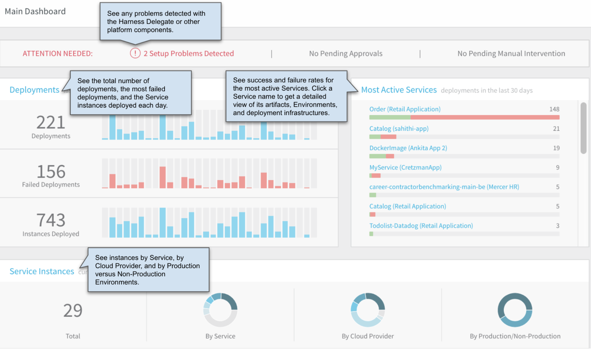
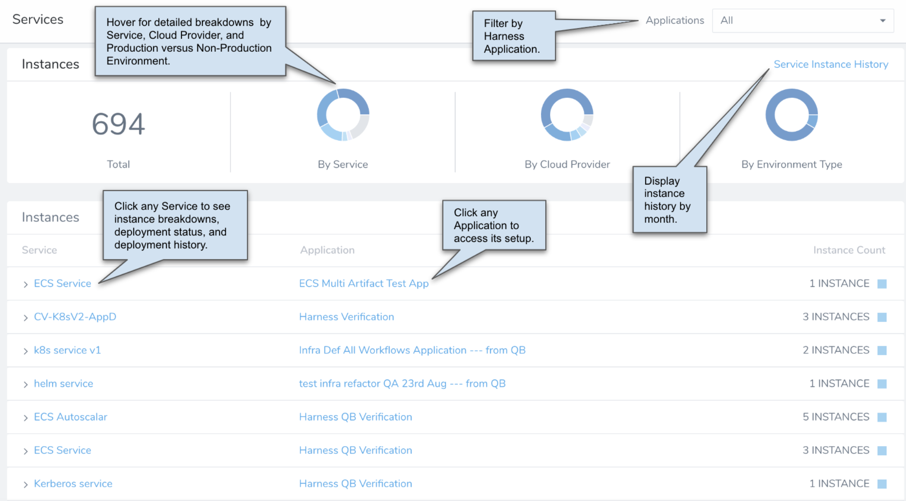
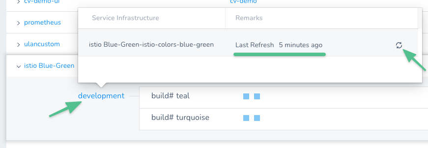
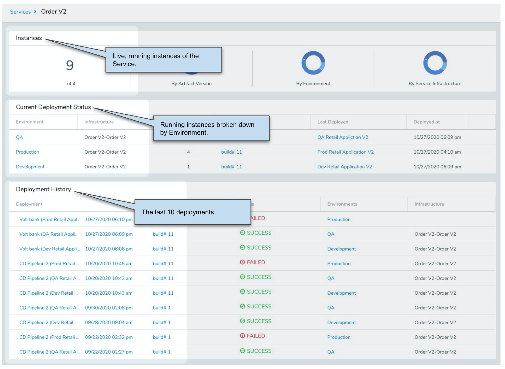
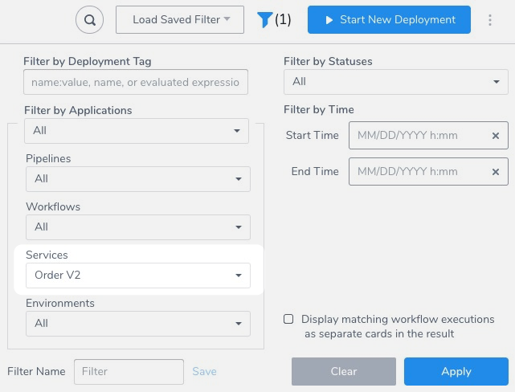
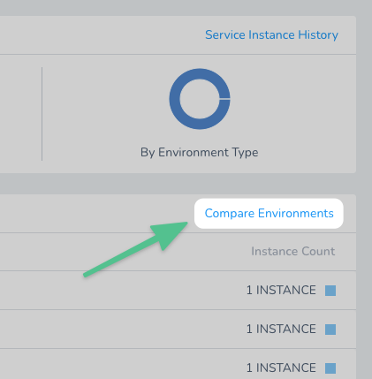
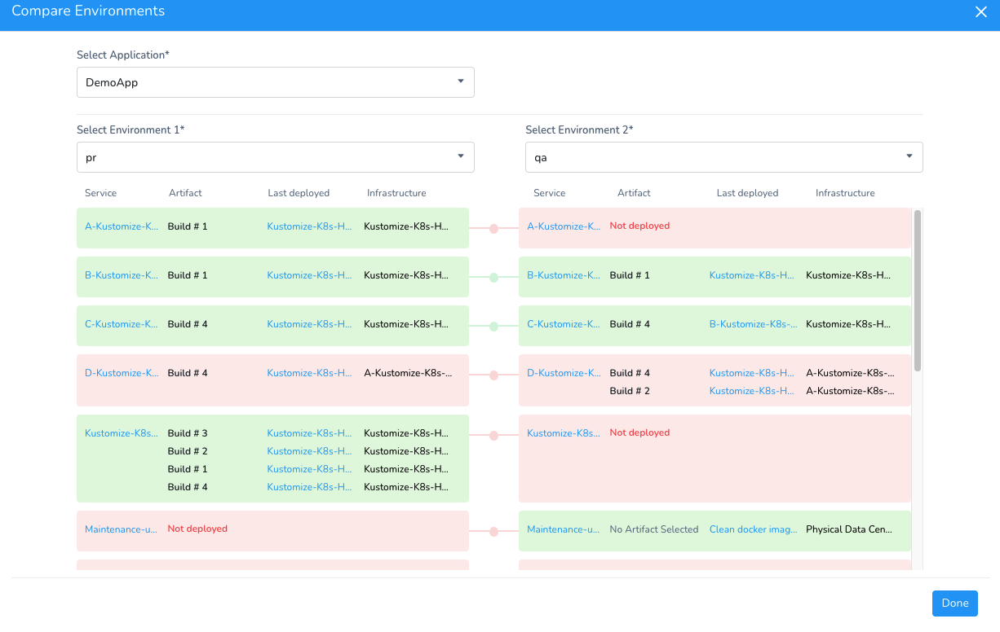

Harness Manager's Main Dashboard and Services Dashboard offer predefined views of your principal deployment data.

:::info
The following panels show only those service instances for which the user has `Read` permissions:
* Service Instances panel on the Overview screen.
* Instances panel on the Services screen.  

The required authorization information is obtained from the application permissions assigned to the user through their user group.

Permissions-based filtering of service instances is behind the feature flag `SPG_SERVICES_OVERVIEW_RBAC`. To enable the feature flag, contact Harness Support.
:::

### Main Dashboard

The Main Dashboard foregrounds deployment and instance activity. It includes breakdowns by successful versus failed deployment, by Harness Service, and by other factors.

### Services Dashboard

The Services Dashboard foregrounds data about **currently** deployed instances. Harness syncs every 10 minutes. The dashboard is a live snapshot of what is currently running.

It includes breakdowns by Harness Service, Cloud Provider, Production versus Non-Production Environment, and Harness Application.

Only active, running instances are reflected in the Services Dashboard's count and details.

#### How often does Harness Sync with my Deployed Service Instances?

Harness syncs just after the deployment and then it syncs every 10 minutes.

You can check the status using the **Instances** section of the **Services** dashboard by hovering over the Environment.

You can also sync on demand using the Refresh icon. You don't need to rerun the deployment.

#### Instances Drill Down

Click on any instance in **Instances** are a drill down of the instance's deployments is displayed.

To see older deployments, go to the **Deployments** dashboard and filter for the Service:

#### Environment Comparison

Currently, this feature is behind the Feature Flag `COMPARE_SERVICE_BY_ENV`. Contact [Harness Support](mailto:support@harness.io) to enable the feature. The Services dashboard contains a **Compare Environments** option.

Compare Environments shows you what artifacts have been deployed to each Environment.

You can see the Environments where each Service was deployed:

* Green: Services have the same versions deployed on both environments.
* Red only: Services have different versions deployed on both environments.
* Red and Not deployed: the Service was never deployed to that Environment.

### Next Steps

* Snap together Harness' flexible chart Widgets to design your own [Custom Dashboards](custom-dashboards.md).

