The Harness Primary Widget Library gets you started by offering the following predefined visualizations of popular DevOps metrics:

* Most-Active Services
* Change Failure Rate
* Deployment History
* Lead Time to Production
* Deployment Frequency
* Mean Time to Restore

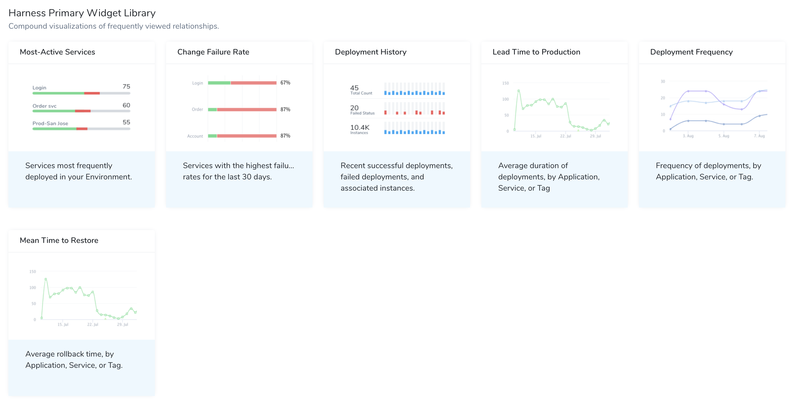

### Before You Begin

* [Custom Dashboards](custom-dashboards.md)
* [Custom Widgets](custom-widgets.md)
* [Filters, Groups, and Tags in Primary and Custom Widgets](filters-groups-and-tags-in-custom-dashboard-widgets.md)

On most Widgets, authorized users can click chart segments to access detailed underlying data.

### Most-Active Services

This Widget corresponds to the horizontal bar chart that appears on Harness'  [Main Dashboard](../../starthere-firstgen/meet-harness.md#main-dashboard). This Widget displays the Services that are most frequently deployed in your Environment. It graphs the deployment activity of your Harness Services, in descending order. This version is customizable by data refresh interval.

Each bar's length indicates the number of times each Service has been deployed. Colored bands show a breakdown by deployment status. (Scroll to the Widget's bottom to display a legend by color.)

For this Widget, Harness Services are the only entity available for measurement and Applications are the only available filters.

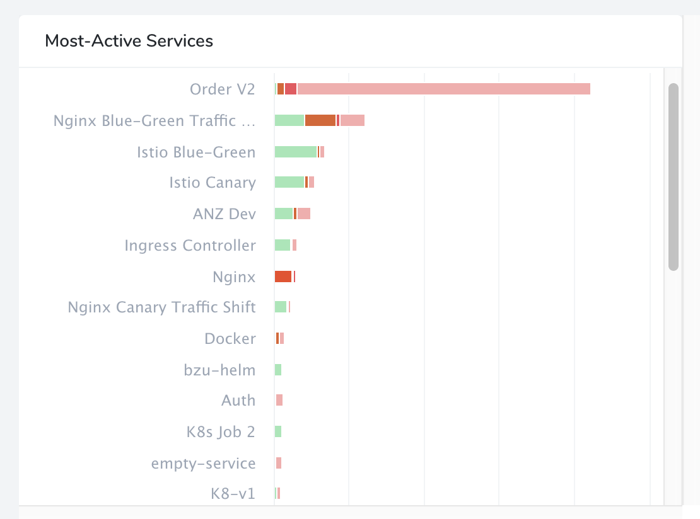

### Change Failure Rate

This Widget displays Services with the highest failure rates. It visually ranks your Harness Services by their consistency of deployment success, in descending order. You can customize the chart's data refresh interval.

For this Widget, Harness Services are the only entity available for measurement. You can filter on Applications, Environments, and Service Tags.

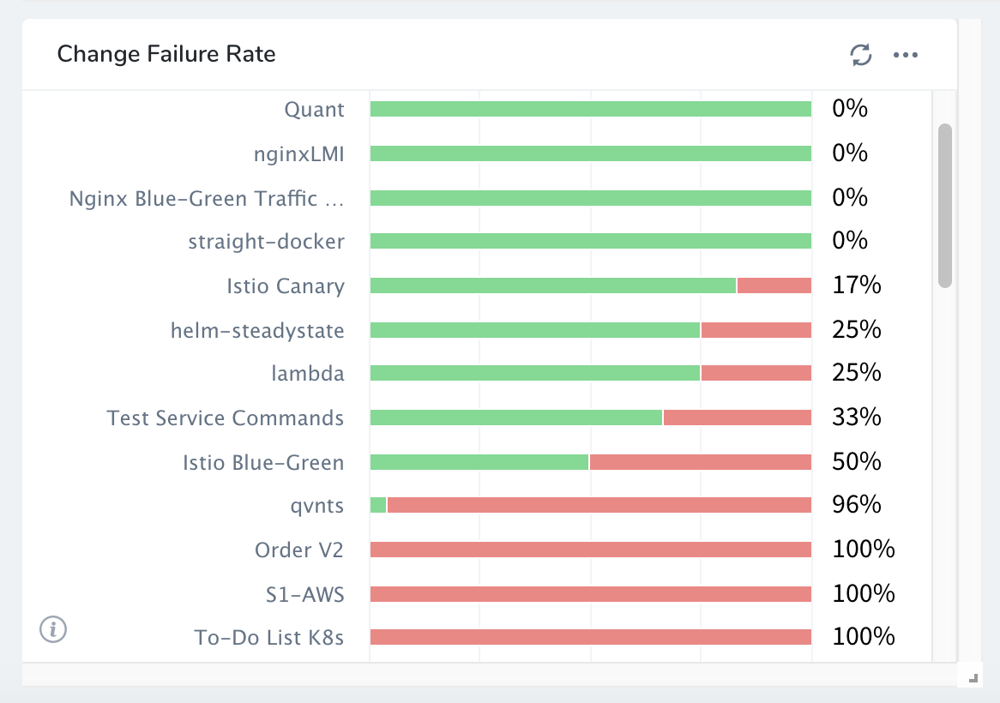

When you click on a Service, you get the deployments for that Service. When you hover over the FAILED status, you get the error for the first failed step in the Workflow or stage in the Pipeline.

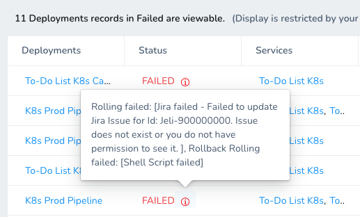

Clicking the failed deployment jumps you right to the failed step in the Workflow, with the first failure information displayed clearly:

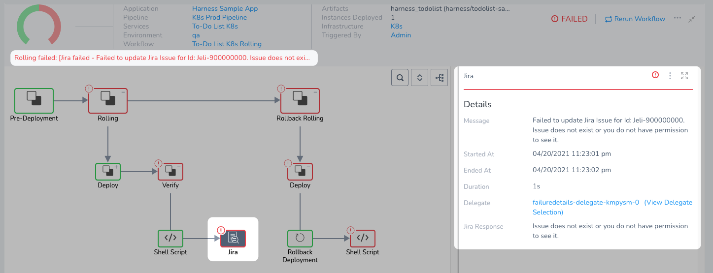

### Deployment History

This Widget displays the recent successful deployments, failed deployments, and associated instances. The Widget is a customizable (by time range) version of the Deployments bar chart that appears on Harness' [Main Dashboard](../../starthere-firstgen/meet-harness.md#main-dashboard).

For this Widget, deployments are the only entity available for measurement, and time intervals are the only available filters.

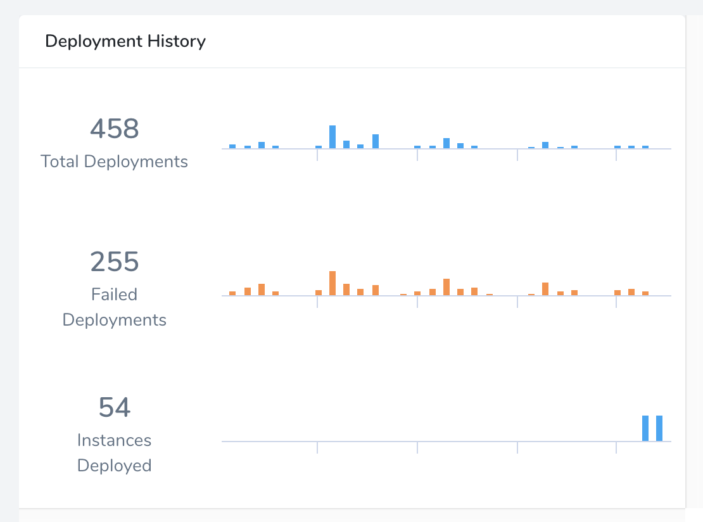

### Lead Time to Production

This Widget displays the average duration of deployments by Application, Service, or Tag over a selectable time range. The display shows one diamond node for each Application.

For this Widget, deployments are the only entity available for measurement. You can filter on multiple Harness entities and Tags.

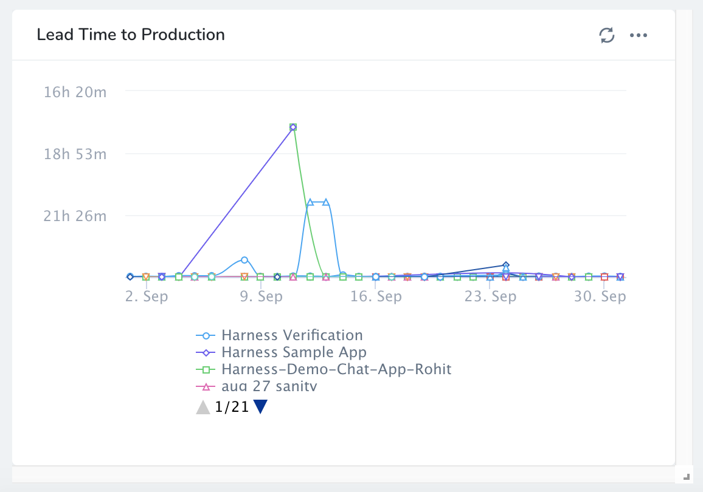

### Deployment Frequency

This line chart shows the daily frequency of deployments by Application, Service, or Tag. You can customize the Time Filter (range) and can filter on multiple Harness entities and Tags.

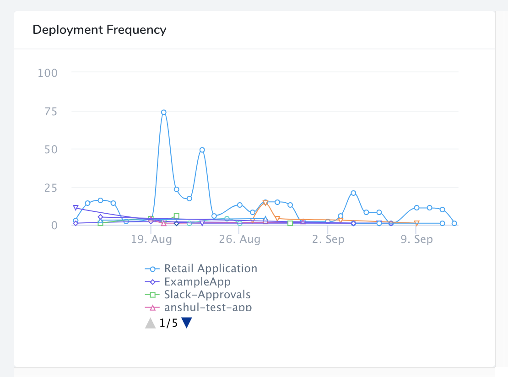

### Mean Time to Restore

This line chart shows the average rollback duration by Application, Service, or Tag. You can customize the Time Filter (range), and can filter on multiple Harness entities and Tags.

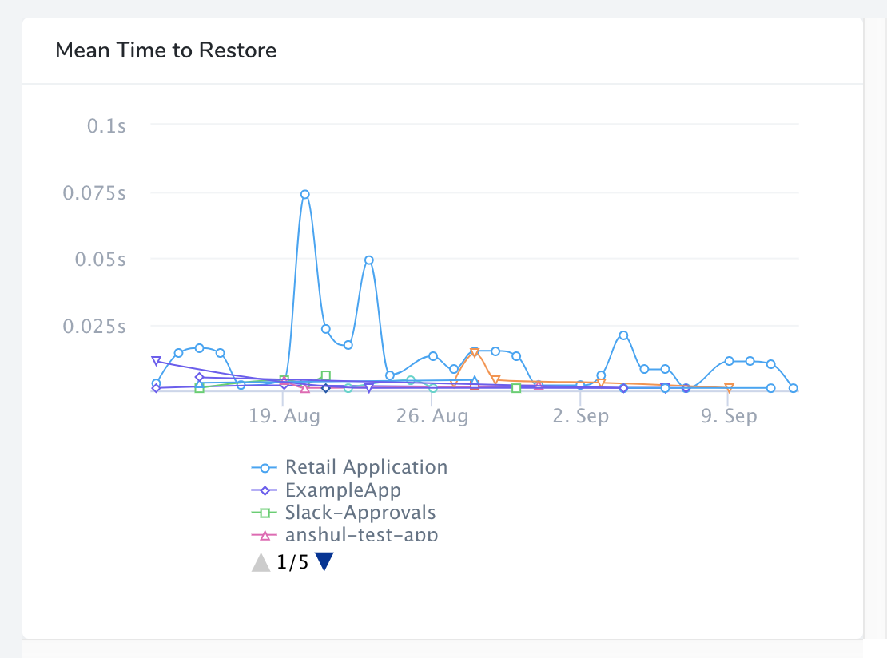

### Artifacts and Build Numbers

The dashboard that uses a Primary Widget has Artifact and Build Number in its detail view. For example, here is a Most Active Services dashboard:

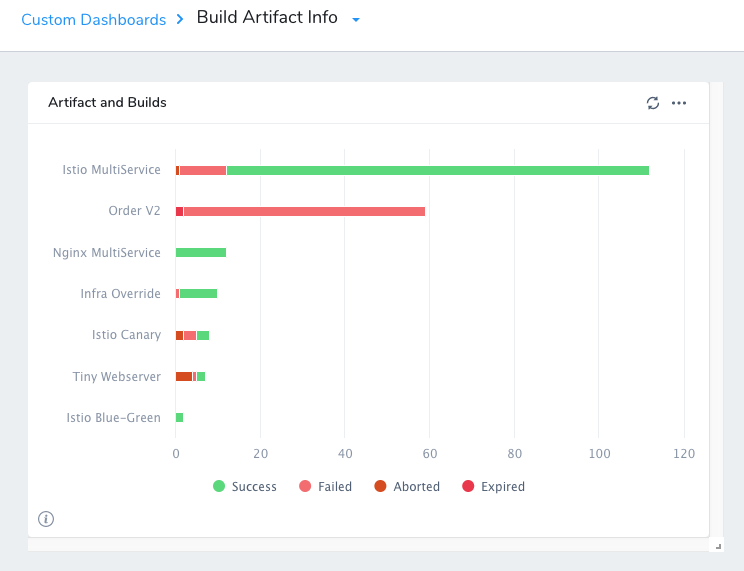

When you click the dashboard, you see the **Artifacts** details.

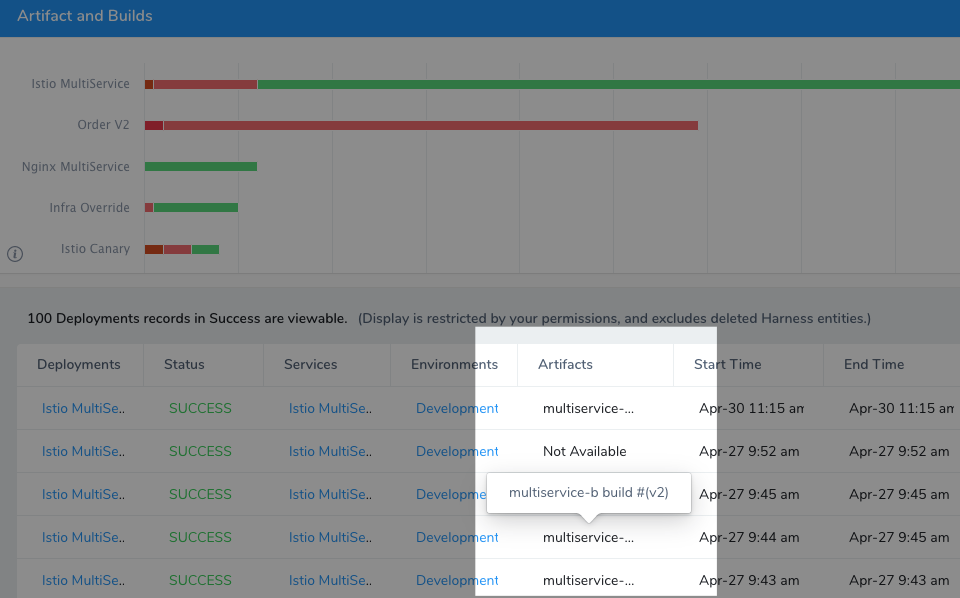

### Next Steps

* [Create and Manage Custom Dashboards](create-and-manage-dashboards.md)
* [Add and Configure Primary Widgets](add-and-configure-primary-widgets.md)
* [Add and Configure Custom Widgets](configure-custom-widgets.md)

