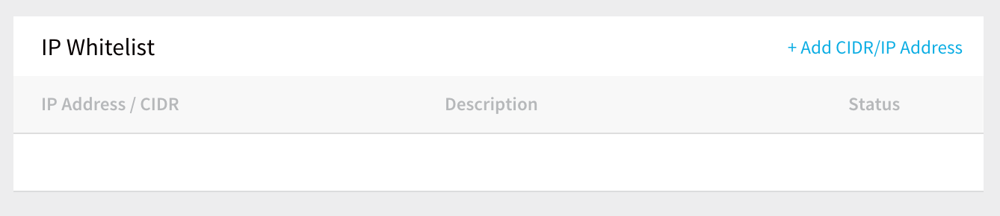
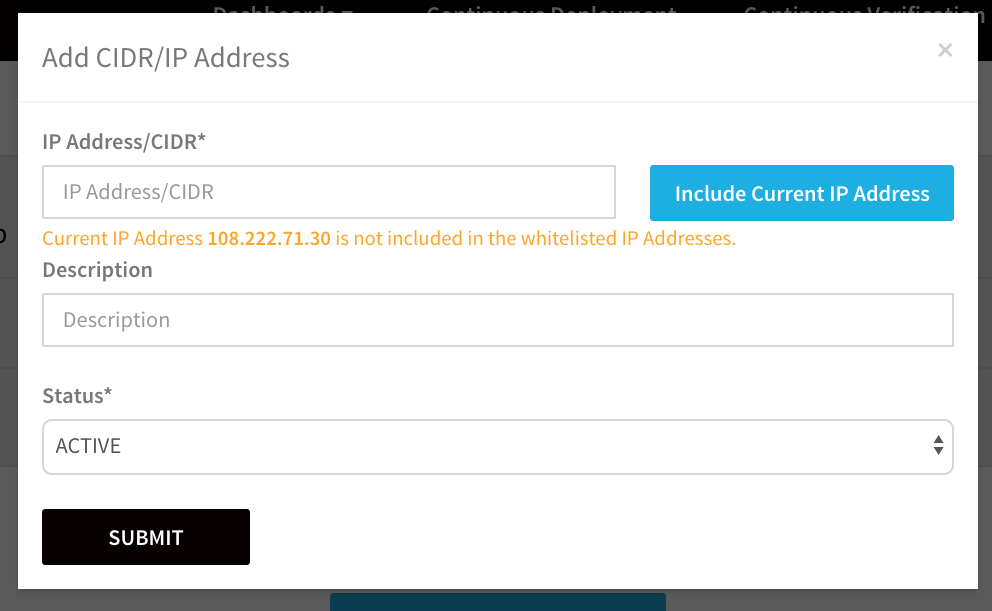
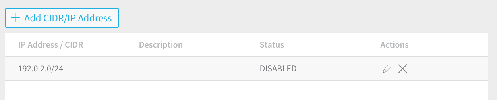

Whitelist the IP addresses that may access your Harness account. You can enter individual IP addresses or a CIDR (Classless Inter-Domain Routing) block.

Once you add and enable an IP Whitelist, only users connecting from the IP address/CIDR block may log into Harness.  
  
Harness IP Whitelisting is for user connections to a Harness account. It will not perform IP whitelisting for Harness Delegate connections.In this topic:

* [Review: What Does Whitelisting Apply To?](#review_what_does_whitelisting_apply_to)
* [Step 1: Set Up IP Whitelisting](access-management.md#step-1-set-up-ip-whitelisting)

### Review: What Does Whitelisting Apply To?

Harness IP Whitelisting applies to any Harness Manager change (such as user logins).

Harness IP Whitelisting does not apply to Webhooks and [Harness GraphQL](../../../firstgen-fa-qs/harness-graph-ql-api-faqs.md) API calls.

### Step 1: Set Up IP Whitelisting

The following procedure enables the IP Whitelisting feature using an example CIDR.

To set up an IP Whitelist, do the following:

1. Mouseover **Continuous Security**, and click **Access Management**. The **Access Management** page appears.
2. Click **IP Whitelist Management**. The current IP Whitelisting configuration appears

3. Click **Add CIDR/IP Address**. The **Add** **CIDR/IP Address** dialog appears.

4. In **IP Address/CIDR**, enter a CIDR or an individual IP address. You can click **Include Current IP Address** as a shortcut.
5. Set the **Status** of the Whitelist to **ACTIVE** or **DISABLED** and click **SUBMIT**. The Whitelist is created.

You can create multiple Whitelists and enable or disable them as needed.

