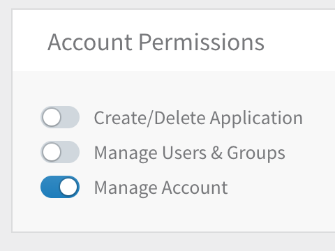
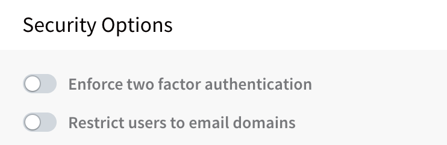
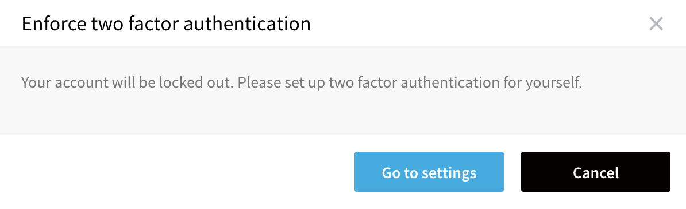
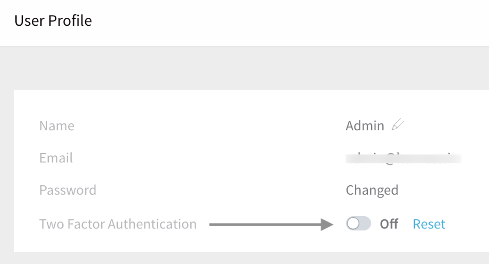
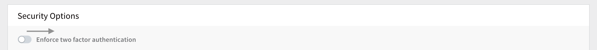
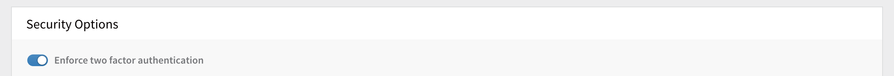
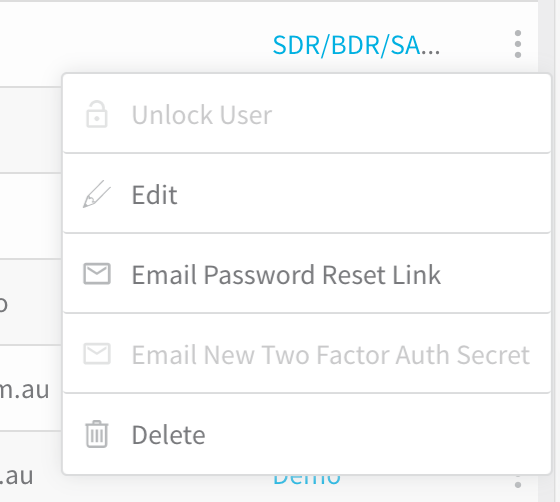

This content is for Harness [FirstGen](../../../../get-started/harness-first-gen-vs-harness-next-gen.md). Switch to [NextGen](../../../../platform/authentication/two-factor-authentication.md).Two-Factor Authentication (2FA) can be managed in two ways:

* **Individual user:** You can set up 2FA for your own **User Profile** without impacting other user accounts.
* **All account users:** If you have **Manage Account** permissions, you can enforce 2FA for all users in Harness. First, you set up 2FA for your own account, and then you can enforce 2FA account-wide in the Harness account's **Login Settings**.

If 2FA is disabled at the account level, you can still enable 2FA for your user account. If 2FA is enabled account-wide, you cannot turn it off for your user account.When you enforce 2FA, users receive an email where they can scan a QRCode using their smartphones and a token generator app. The next time they log in with their username and password, they are prompted to use 2FA to complete the log in.

When 2FA is turned off by an administrator (with **Manage Account** permissions), users can decide if they want to turn off 2FA for their account in their **User Profile**.

### Requirements

In order for a user to enforce **account-wide** 2FA, their user account must belong to a group with the **Manage Account** permission enabled.

For more information, see ​[Users and Permissions](users-and-permissions.md).

### Intended Audience

* DevOps

### Before You Begin

* [Users and Permissions](users-and-permissions.md)
* [Single Sign-On (SSO) with SAML](single-sign-on-sso-with-saml.md)
* [Google Authenticator](https://support.google.com/accounts/answer/1066447?co=GENIE.Platform%3DAndroid&hl=en) ([iPhone app](https://itunes.apple.com/us/app/google-authenticator/id388497605?mt=8))

### To Set Up 2FA for Your Profile

The following procedure enables 2FA for a single user account. This option is available to any user.

To enable 2FA for a single account, do the following:

1. Mouseover your **User Profile** icon, and then click **User Profile**.

   
   
   The **User Profile** page appears.
2. Toggle the **Two Factor Authentication** indicator. The **Two Factor Authentication** dialog appears.
3. Using your smartphone's 2FA token generator app, such as Google Authenticator, scan the QRCode and add it to the list in your app.  
**Harness Inc** is added to your 2FA token generator app, and begins to provide authentication codes.  
2FA token generator apps also include a method for adding a site using a Secret Key, in cases where you cannot scan the QRCode. The 2FA dialog includes a Secret Key for those cases.
4. Click **SUBMIT**. The next time you log in by entering your username and password, you are prompted to provide the 2FA authentication code.
5. Obtain the code from your 2FA token generator app, and enter it. You are then logged into your Harness account.

### Enforce 2FA Account-Wide

Once you have set up 2FA for your account, you can enforce it for all users and groups in the account. When 2FA is enforced, account users will experience the following changes:

* **New members** will need to set up 2FA during signup.
* **Existing members** who do not have 2FA enabled will receive an email with a QRCode, and instructions on how to set up 2FA.

To require that all account users and groups use 2FA, do the following:

1. Enable 2FA for your account as described in [To Set Up 2FA for Your Profile](#to_set_up_2fa_for_your_profile).

2. Select **Continuous Security** > **Access Management**.

3. Click **Authentication Settings**, and scroll down to the **Security Options** section.

4. Slide the **Enforce Two Factor Authentication** setting on.  
  
   If you have not yet [set up 2FA for your own profile](#to_set_up_2fa_for_your_profile), this prompt reminds you to protect your own login before proceeding:

   

5. Click **Go to settings** to display a QRCode and secret key that you can store to ensure your own ability to log in:

   

6. You can then enable 2FA for your own login:

   

7. Return to **Continuous Security** > **Access Management** > **Authentication Settings** to enable two-factor authentication across your organization's Harness account:

   
   
8. Confirm that you want to proceed. 2FA is now enforced across your Harness account.

   

### Resetting 2FA

If a user loses the QRCode, an Admin-level User can email them a new 2FA QRCode and secret key, by clicking the **Email New Two Factor Auth Secret** link in the **Users** page.

