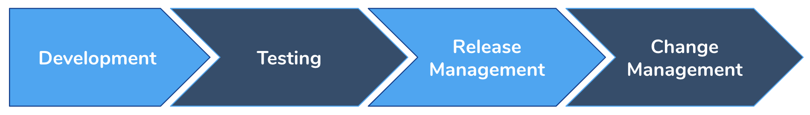
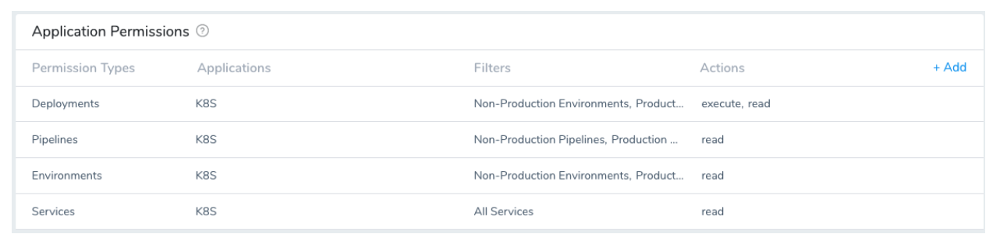
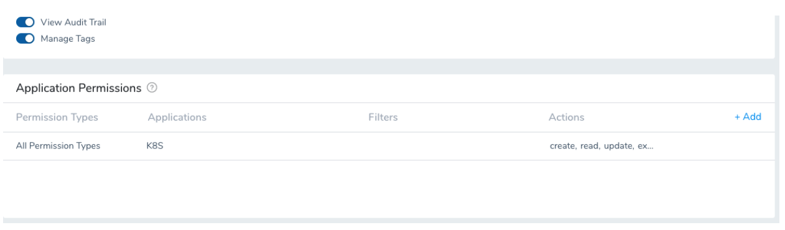
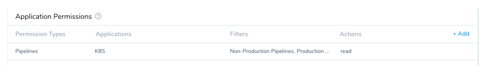

This topic describes how to use Harness flexible RBAC for the very common Application Release Process scenario.

In this topic:

* [Before You Begin](#before_you_begin)
* [Review: Application Release Process and Roles](#review_application_release_process_and_roles)
* [Step 1: Create the User Groups](#step_1_create_the_user_groups)
* [Step 2: Add Members to the Groups](#step_2_add_members_to_the_groups)
* [Next Steps](#next_steps)

### Before You Begin

* Review [Managing Users and Groups (RBAC)](users-and-permissions.md).
* Review [application deployment and release process](https://en.wikipedia.org/wiki/Release_management#Relationship_with_Continuous_Delivery,_DevOps,_and_Agile_software_development).
* Make sure you are member of the Harness Administrator Group.

### Review: Application Release Process and Roles

Many organizations depend on RBAC to ensure compliance and consistency with application deployment. This topic describes a simplistic (minimal) approach by defining three groups associated with each application as follows:

|  |  |  |
| --- | --- | --- |
| **User Group** | **Role** | **Responsibility** |
| K8S\_Deployer  | Application Developer | Deploy Pipeline |
| K8S\_DevOps | DevOps Engineer | Design and Implement Pipeline |
| K8S\_Approver | Approver | Approve Pipeline stages |

This example uses a sample Harness Application named **K8S** to configure RBAC. The example suggests the creation of three user groups based on the roles and responsibilities of the users involved in the process.

* Users in the Deployer group are allowed to only deploy but not to create or delete any Workflows or Pipeline.
* DevOps users design and implement Workflows and Pipelines. Usually, a centralized team is responsible to create a reference Pipeline and Workflow that is compliant with the desired release process. DevOps engineers start with the **clone** of the reference Workflow and Pipeline and then adapt it to the application-specific requirements. For example, there are many steps that are skipped in a lower environment but mandatory in staging or production such as integrating with a change management system.
* Users in the Approver group are usually Release managers or Application managers who approve or reject a Pipeline stage when promoting an application from the lower environment to staging or production.

The required permissions for the roles are as follows.

|  |  |  |
| --- | --- | --- |
| **Role** | **Resource** | **Permissions** |
| Deployer | Pipeline | Read, Execute Pipeline, Execute Workflow |
| DevOps | All resources | Create, Read, Update, Execute Pipeline, Execute Workflow |
| Approver | Pipeline | Read |

### Step 1: Create the User Groups

Create the three user groups as identified and defined already.

#### Create the K8S\_Deployer Group

Add a User Group with the name **K8S\_Deployer** group. See [Add a User Group](users-and-permissions.md#to-add-a-user-group) for specific instructions.

The members of this Deployer Group need read access to the Environment, Services and Pipeline to allow Pipeline execution for the specific application—K8S. Set Account Permissions and Application Permissions to this user group as needed while adding the User Group.

This example shows that the Deployer Group is allowed access to both Non-Production and Production Environments. But, you can restrict access to the Production Environments by providing permission to only Non-Production Environments. This may be necessary in some organizations where the access to Production Environments is given only to a certain group/team.

The Deployer role does not have read access to Workflow. Users with this role can execute the Pipeline with just read access, but the users will not have access to view the Workflow steps.#### Create the K8S\_DevOps Group

Add a User Group with the name **K8S\_DevOps** group. See [Add a User Group](users-and-permissions.md#to-add-a-user-group) for specific instructions.

Assign the following permissions for full access to members of K8S\_DevOps group for the K8S application except the **Delete** Application Permission.

DevOps users do not need full access like the Harness Administrator because they are only responsible for specific Applications. For example, it is a good practice not to assign the **Delete** Application Permission for this role. This allows Harness Administrators to be responsible for setting up the Application pre-configured with reference Workflows and Pipelines including RBAC setup. Users in the DevOps group can update/create new Services but cannot delete the Application. If the Application has to be deleted (if it is a sandbox application), the Harness Administrator should delete it.

#### Create the K8S\_Approver Group

Add a User Group with the name **K8S\_Approver** group. See [Add a User Group](users-and-permissions.md#to-add-a-user-group) for specific instructions.

Assign the following Permissions to the members of the K8S\_Approver group to allow them to approve or reject a Pipeline execution. The assumption is that these users log in into Harness to approve or reject. In many organizations, the decision to approve or reject is done externally via JIRA or a change management system such as Service Now. In such cases, this group is optional.

### Step 2: Add Members to the Groups

Add members to the three groups—K8S\_Deployer, K8S\_DevOps and K8S\_Approver. See [Add a User Group](users-and-permissions.md#to-add-a-user-group) for specific instructions to add members to User Groups.

You can further refine the type of Permissions based on your organization roles and team structure to add additional groups or restrict access based on the Environment.

### Next Steps

* [Automate using Harness API](../../techref-category/api/harness-api.md)

