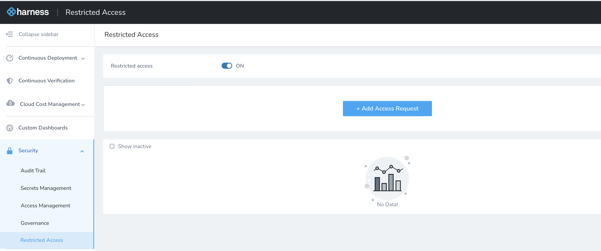

Currently, this feature is behind the Feature Flag `LIMITED_ACCESS_FOR_HARNESS_USER_GROUP`. Contact [Harness Support](mailto:support@harness.io) to enable the feature.The Restricted Access setting in Harness allows you to control when Harness support and engineering may access your account for troubleshooting. You can turn off this setting anytime, thus preventing Harness from viewing your account.

### Limitations

This feature is only available for the below [Editions](../../../starthere-firstgen/harness-editions.md):

* **Harness Professional Accounts**
* **Harness Essentials Accounts**

### Review: Restricted Access

Harness offers industry-leading controls to prevent unauthorized access to your account by Harness support and engineering teams.

In some cases, you might need authorized Harness personnel to access your account to troubleshoot a problem.

You can provide read-only access to authorized Harness personnel using the **Restricted Access** setting. You can turn it on or off anytime.

### Step: Give Harness Access to Your Account

1. In Harness, click **Security**.
2. Click **Restricted Access**.
3. Click on the toggle to turn it on.

4. Click **Add Access Request**. The Restricted Access settings appear.
5. Enter the email addresses of the people you would like to give access.
6. Enter **Number of hours** to grant access.
7. Click **Submit**. The user(s) is now listed under Active users.

Click **Show inactive** to see the list of inactive users.

