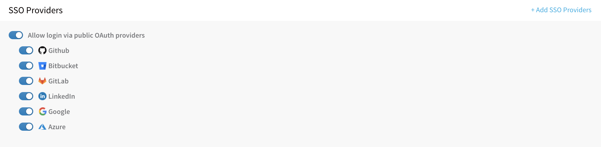
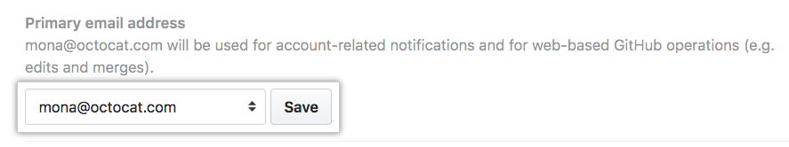
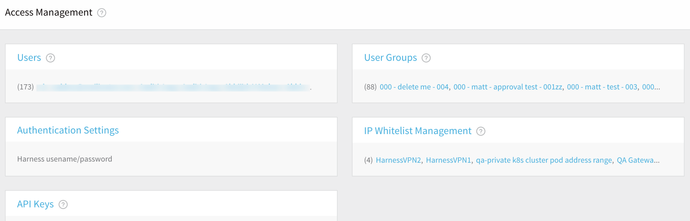
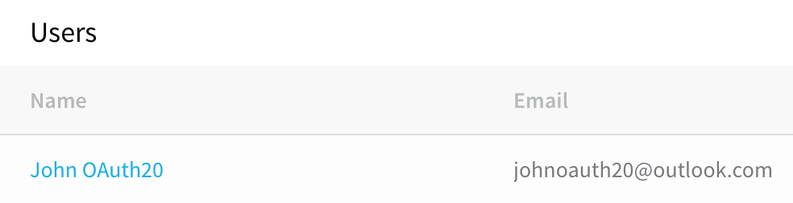
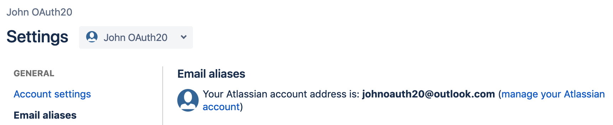
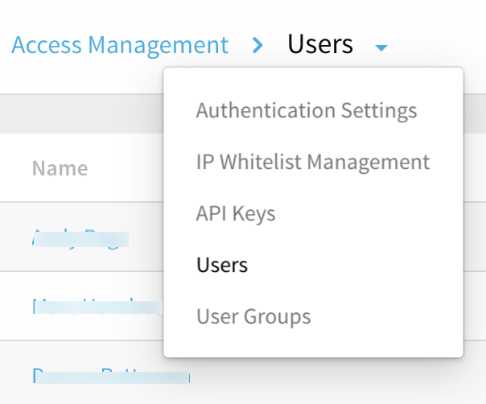
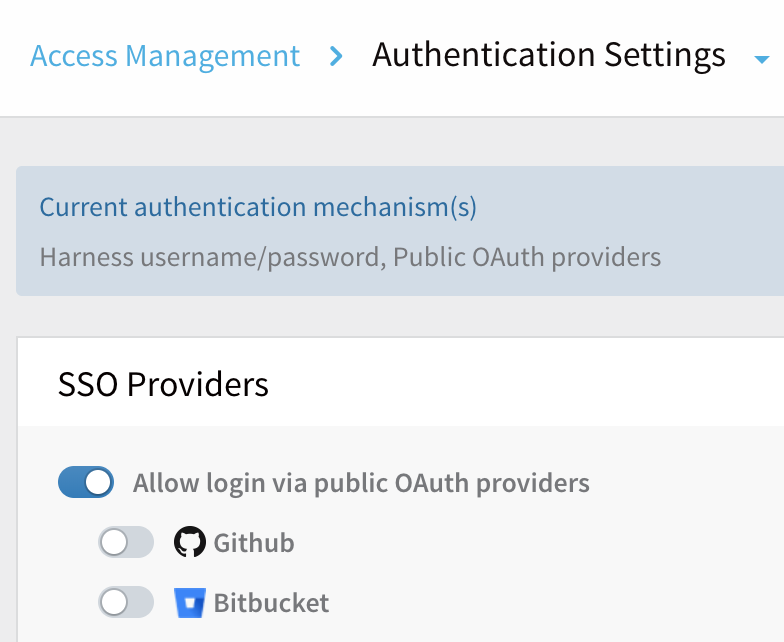
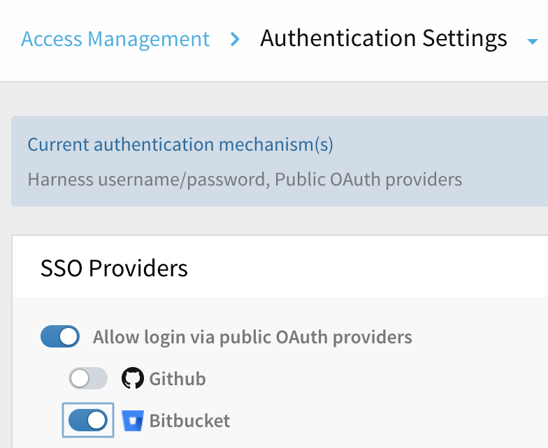
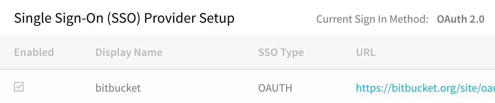
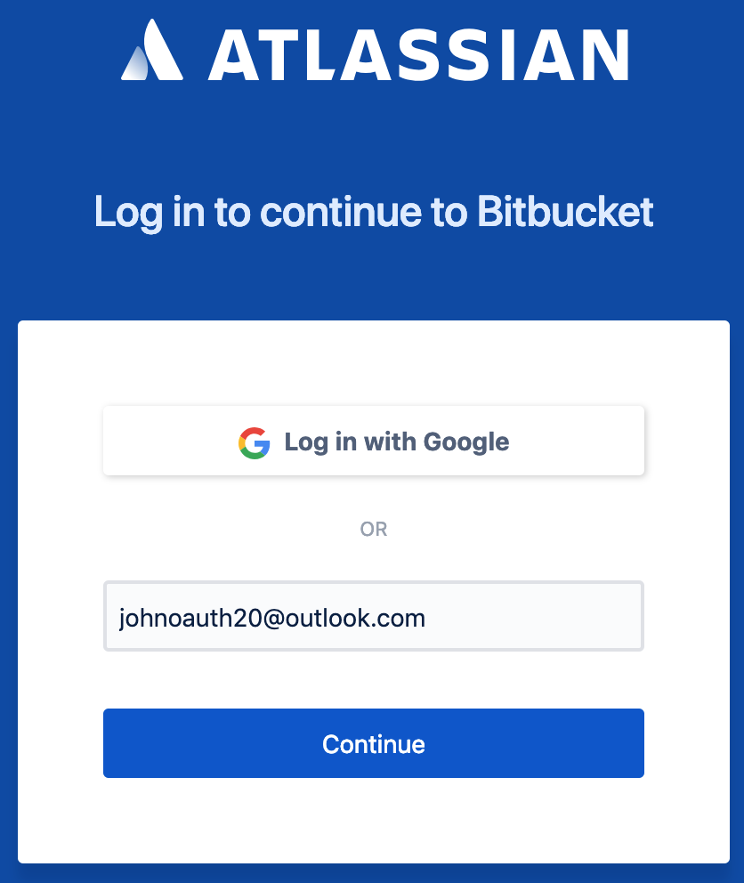

This content is for Harness [FirstGen](../../../../get-started/harness-first-gen-vs-harness-next-gen.md). Switch to [NextGen](../../../../platform/3_Authentication/4-single-sign-on-sso-with-oauth.md).Harness supports Single Sign-On (SSO) with OAuth 2.0 identity providers, such as GitHub, Bitbucket, GitLab, LinkedIn, Google, and Azure. This integration allows you to use an OAuth 2.0 provider to authenticate your Harness Users.

Once OAuth 2.0 SSO is enabled, Harness Users can simply log into Harness using their GitHub, Google, or other provider's email address.

For information on Harness RBAC, see [Managing Users and Groups (RBAC)](users-and-permissions.md).In this topic:

* [Intended Audience](single-sign-on-sso-with-oauth-2-0.md#intended-audience)
* [Before You Begin](single-sign-on-sso-with-oauth-2-0.md#before-you-begin)
* [Requirements](single-sign-on-sso-with-oauth-2-0.md#requirements)
* [Setup Overview](single-sign-on-sso-with-oauth-2-0.md#setup-overview)
	+ [How Do I Prevent Lockouts?](single-sign-on-sso-with-oauth-2-0.md#how-do-i-prevent-lockouts)
* [Set Up OAuth 2.0 SSO](single-sign-on-sso-with-oauth-2-0.md#set-up-o-auth-2-0-sso)
* [Log in with an OAuth 2.0 Provider](single-sign-on-sso-with-oauth-2-0.md#log-in-with-an-o-auth-2-0-provider)
* [Limit OAuth 2.0 SSO Domain Names](single-sign-on-sso-with-oauth-2-0.md#limit-o-auth-2-0-sso-domain-names)
* [Next Steps](single-sign-on-sso-with-oauth-2-0.md#next-steps)

### Intended Audience

* Developers
* DevOps
* Identity Management Engineers

### Before You Begin

* If you are new to OAuth 2.0, read [OAuth 2 Simplified](https://aaronparecki.com/oauth-2-simplified/) from Aaron Parecki.
* To learn about all Harness options governing SSO logins, see [Authentication Settings](authentication-settings.md).

### Requirements

To set up OAuth 2.0 successfully, the following requirements should be met:

* Each Harness User should be registered with Harness using their email address. Users are registered once they have logged into Harness. Harness Users are required to register the first time they log into Harness.
* A Harness User's email address should also be used to authenticate with the OAuth 2.0 provider you plan to enable in Harness for SSO.

For example, if a Harness User is registered with Harness using the email address **JohnOAuth20@outlook.com**, and OAuth SSO is enabled in Harness using Bitbucket as the provider, then the user must also be registered with Bitbucket using **JohnOAuth20@outlook.com**.

#### GitHub Primary Email Required for Harness Login

GitHub supports [primary](https://help.github.com/en/github/setting-up-and-managing-your-github-user-account/changing-your-primary-email-address) and secondary email addresses:

If you use GitHub for Harness OAuth 2.0 SSO with Harness, the primary email must be used for the Harness account and login.

### Setup Overview

Only Harness Users that are members of the Harness Administrators group have permission to set up and enable OAuth 2.0 SSO.Setting up Harness OAuth 2.0 SSO involves the following high-level steps:

1. Ensure that the email addresses of registered Harness Users are also registered with the OAuth 2.0 provider you will use for Harness OAuth 2.0 SSO. This holds true for users you plan to invite to Harness after you enable Harness OAuth 2.0 SSO.
2. Enable Harness OAuth 2.0 SSO, and select the OAuth 2.0 providers to use for SSO.
3. Test SSO by having a user log into Harness using each enabled OAuth 2.0 provider.

#### How Do I Prevent Lockouts?

The following steps can help you prevents lockouts when setting up SSO in Harness:

* When you enable OAuth 2.0 SSO, using a Harness User account that is a member of the Administrator Group, remain logged in until you have tested SSO using a separate User account. If there is any error, you can disable OAuth 2.0 SSO.
* Ensure that one or more Harness Users in the Administrators Group are registered with Harness using the same email address they use to log into the OAuth 2.0 provider you plan to use for SSO. Repeat this test for each enabled OAuth 2.0 provider.

If you accidentally get locked out of Harness, email [support@harness.io](mailto:support@harness.io), call 855-879-7727, or contact [Harness Sales](https://harness.io/company/contact-sales).

#### Harness Local Login

To prevent lockouts or in the event of OAuth downtime, a User in the Harness Administrators Group can use the [**Local Login**](http://app.harness.io/auth/#/local-login) URL (http://app.harness.io/auth/#/local-login) to log in and update the OAuth settings.

1. Log in using **Harness Local Login**.
2. Change the settings to enable users to log in.

### Set Up OAuth 2.0 SSO

To set up OAuth 2.0 SSO, do the following:

1. Log into Harness using a Harness User account that is a member of the Administrator User Group. For information on Harness RBAC, see [Managing Users and Groups (RBAC)](users-and-permissions.md).  
  
   The email address used to log into Harness should also be registered with the OAuth 2.0 providers you intend to enable for Harness SSO.

2. Click **Continuous Security**, and then click **Access Management**. The **Access Management** page appears.

3. Click **Users**. The **Users** page appears.
Here we see that the user we want to log in using OAuth 2.0 SSO, **johnoauth20@outlook.com**, has an Outlook.com email address.
4. Before you set up SSO, confirm that your users' email addresses registered with Harness are the same email addresses they use to log into the OAuth 2.0 provider you're enabling for Harness SSO.  
  
In this case, we are going to use Bitbucket for SSO, so let's confirm that the **johnoauth20@outlook.com** email address is used to log into Bitbucket.
Email address confirmed. Now you are all set to add and enable Harness OAuth 2.0 SSO.
5. In **Harness Manager**, click the drop-down menu next to the **Users** breadcrumb and select **Authentication Settings**.
The **Authentication Settings** page appears.
Now we will add Bitbucket as the OAuth 2.0 SSO provider.
6. If it's not already enabled, enable **Allow login via public OAuth providers**.
7. Enable each public OAuth 2.0 provider you want to use for SSO. In this example, you would enable **BitBucket**.
The OAuth 2.0 provider is now enabled as an SSO option. The **Current authentication mechanism(s)** header confirms that **Public OAuth providers** is enabled.
8. Before you log out of Harness, test the OAuth 2.0 SSO using a Harness User account. This will confirm that Harness Users can now log in from the Harness login page.

### Log in with an OAuth 2.0 Provider

The first time a user logs into Harness using OAuth 2.0 SSO, they will be redirected to the OAuth 2.0 provider. The user will enter the same email address they used for Harness, along with the OAuth 2.0 provider–specific password. Next, they are redirected back to Harness and automatically logged in.

For all future logins, if the user is already logged into their OAuth 2.0 provider in the same browser as Harness, they will simply enter their email address in Harness and log in automatically.

Let's look at an example:

The Harness user **John OAuth20** is registered in Harness with the email address **johnoauth20@outlook.com**:

The email address **johnoauth20@outlook.com** is also registered with Bitbucket:

And Bitbucket is enabled as the Harness SSO Provider:

John OAuth20 logs into Harness with the email address **johnoauth20@outlook.com**:

When he clicks **NEXT**, the browser is redirected to the Bitbucket website:

John enters in his **johnoauth20@outlook.com** email address and clicks **Continue**. Next, he enters in his Bitbucket password and clicks **Continue**.

Bitbucket verifies the email address and password and returns the browser to Harness, where John OAuth20 is logged in automatically.

Harness OAuth 2.0 login successful!

Each time you use the OAuth provider to log into Harness, you will be required to log into the OAuth provider first. This is the standard OAuth process.

### Limit OAuth 2.0 SSO Domain Names

By default, any member invited to Harness by a Harness Administrator can log in using an OAuth 2.0 SSO identity provider that's enabled on Harness. However, you can limit which email domain names can be used to log into Harness.

For example, you might set up Google as a Harness OAuth 2.0 SSO provider, but you want only users who have **example.io** in their (login) email address to be able to log in via Google.

To filter domain names in this way, see our [Authentication Settings](authentication-settings.md) topic's section on [Restricting Email Domains](authentication-settings.md#restricting-email-domains).

### Next Steps

* [Two Factor Authentication](login-settings.md).
* [IP Whitelist Management](access-management.md).
* [API Keys](api-keys.md)

