This content is for Harness [FirstGen](../../../../getting-started/harness-first-gen-vs-harness-next-gen.md). Switch to [NextGen](../../../../platform/3_Authentication/3-single-sign-on-saml.md). Harness supports Single Sign-On (SSO) with SAML, integrating with your SAML SSO provider to enable you to log your users into Harness as part of your SSO infrastructure.

If the [Harness On-Prem](../../../starthere-firstgen/harness-on-premise-versions.md) version is not accessed using HTTPS load balancer, SAML authentication will fail. Make sure you access the Harness On-Prem version using a HTTPS load balancer, and not a HTTP load balancer. This document explains how to set up SAML authentication and authorization.

### Support Formats

The XML SAML file used with Harness must use UTF-8.

UTF-8 BOM is not supported. Some text editors like Notepad++ save in UTF-8 BOM by default.

### SAML SSO with Harness Overview

To set up SAML SSO with Harness, you add a SAML SSO provider to your Harness account, and enable it as the default authentication method.

Harness SAML SSO involves the following:

* **Harness User email addresses:** Users are invited to Harness using their email addresses. Once they log into Harness, their email addresses are registered with Harness as Harness Users. To use SAML SSO, Harness Users must use the same email addresses to register in Harness and the SAML provider.

   Ensure that you have at least two corresponding user accounts when setting up and testing SAML SSO in Harness. This allows you to set up the account with a Harness Administrator account and test it with a Harness user account.
* **SAML provider user email addresses:** To use the SAML provider to verify Harness Users, the email addresses used in the SAML provider must match the email addresses for the registered Harness Users you want to verify.
* **Harness SAML Endpoint URL:** This URL is where the SAML provider will post the SAML authentication response to your Harness account. This URL is provided by Harness in the **Single Sign-On (SSO) Provider** dialog. You enter this URL in your SAML SSO provider app to integrate it with Harness.
* **SAML metadata file:** This file is provided by your SAML provider app. You upload this file into the Harness **Single Sign-On (SSO) Provider** dialog to integrate the app with Harness.

Using Okta as an example, here are the Harness Manager settings on the left and their corresponding SAML provider settings on the right:


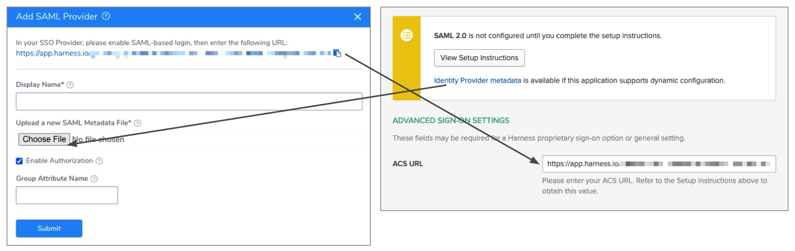

### SAML SSO with Okta Overview

To set up Harness with Okta as a SAML SSO provider, you exchange the necessary information between your Okta app and Harness.

Users are not created as part of the SAML SSO integration. Users are invited to Harness using their email addresses. Once they log into Harness, their email addresses are registered as Harness Users. For more information, go to [SAML SSO with Harness Overview](#saml_sso_with_harness_overview).The section describes the Okta-specific steps you must perform to use an Okta app for Harness SAML SSO:

* [Okta ​User Accounts​](#okta_user_accounts)
* [​SAML Endpoint URL​ for Okta](#endpoint_url_for_okta)
* [Okta ​SAML Metadata File​](#okta_saml_metadata_file)
* [​Enable and Test Okta SSO](#enable_and_test_sso_with_okta)
* [SAML Authorization with Okta](#saml_authorization_with_okta)

## Okta User Accounts

To set up an SAML support in your Okta Harness app, ensure that the app has corresponding Users in Harness:

1. In Harness, add the users you want to set up for SAML SSO by inviting them to Harness using the same email addresses that they use in your SAML provider.
2. Using your Harness Users email addresses, add the Harness Users to the SAML provider account and assign them to your SAML provider app. Here is an example of two Harness Users added to an Okta app using the same email addresses.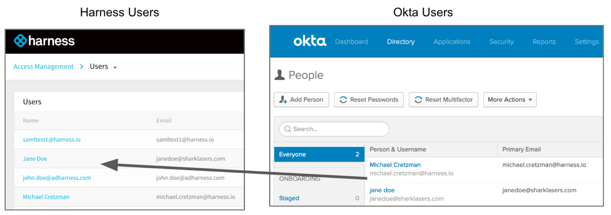


The only user property that must match between a Harness User and its corresponding SAML provider user account is its **email address**.  
  
Sometimes users might have mixed case email addresses in Okta. In these situations, Harness converts the email address to lowercase when adding them to Harness.

### Configure SAML 2.0 for Harness

As described above, you will enter the Harness **SAML Endpoint URL** as your Okta app's **ACS URL**. You will first copy the URL out of Harness Manager, and then enter it into your Okta app.

For details about the Harness side of the information exchanges described throughout this topic, go to [Authentication Settings](authentication-settings.md).The first step is to add the Harness app to your Okta account.

1. In your Okta administrator account, click **Applications**.
2. In **Add Application**, search for **Harness** and select it.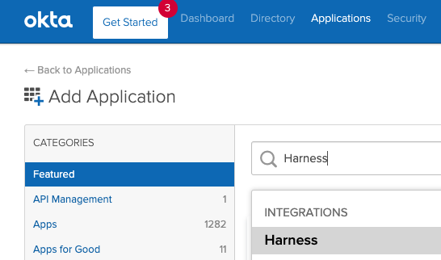

3. On the Harness app page, click **Add**.
4. In **General Settings**, click **Done**.

The Harness app is for the Harness SaaS edition. For Harness On-Prem editions, contact [Harness Support](mailto:support@harness.io).

##### Add the Harness SAML Endpoint URL to Harness Okta App

1. In the Harness Okta app, click the **Sign On** tab, and then click **Edit**.
2. In **ACS URL** field, paste the Harness SAML Endpoint URL you copied.

3. In your SAML provider app's **Audience URI** field (or similar name), enter `app.harness.io`. The SAML application identifier should be always `app.harness.io`.

For Harness [On-Prem](../../../starthere-firstgen/harness-on-premise-versions.md), replace **app.harness.io** with your custom URL.  
If you use a custom Harness subdomain in any Harness version, like **example.harness.io**, use that URL.

#### Okta SAML Metadata File

You must download the **Identity Provider metadata** XML from your Okta app and upload the file into Harness.

1. Download the **SAML metadata file** from your Okta provider app.  
  
   For example, here is what the SAML metadata file section looks like in an Okta application's **Sign On** tab (only available in Classic UI view):
   
   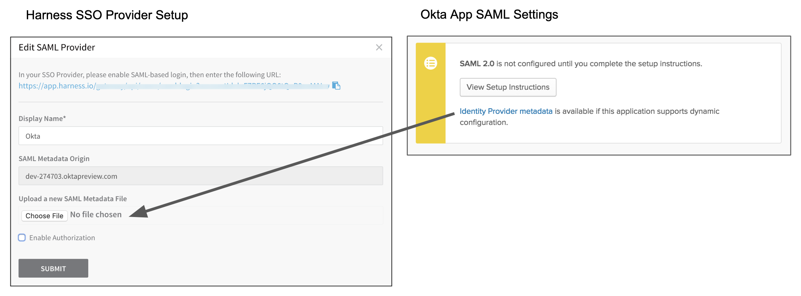

2. In Harness' **Add SAML Provider** dialog, under **Upload a new SAML Metadata File**, click **Choose File** and add the SAML metadata file you downloaded.

   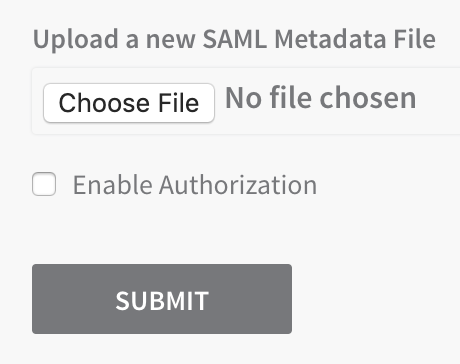

3. In **Display Name**, enter a name for your SAML SSO provider, and click **SUBMIT**. The new SSO provider is displayed.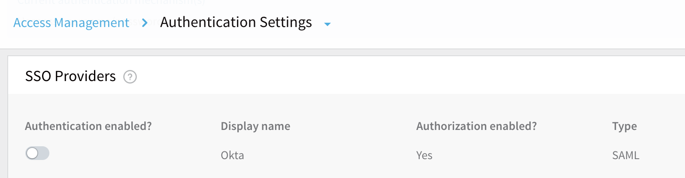

#### Enable and Test SSO with Okta

Now that Okta is set up in Harness as a SAML SSO provider, you can enable and test it.

1. To enable the SSO provider, drag the slider under **Authentication** **Enabled?**

   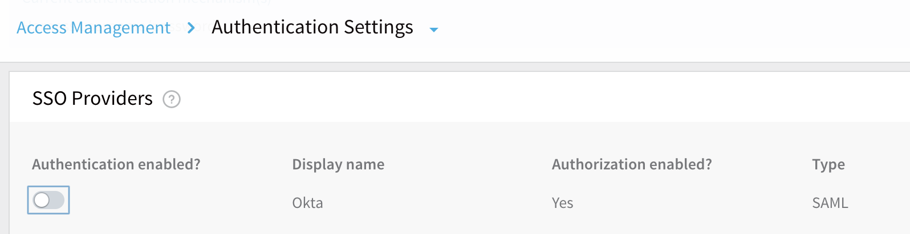

2. In the resulting **Enable SSO Provider** dialog, click **TEST** to verify the SAML connection you've configured.

   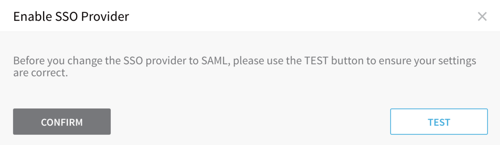
   
   A new browser tab will prompt you to log into your SAML provider.

:::danger
If you do not see a new tab, your browser might have blocked it with a pop-up blocker. Please disable the blocker temporarily and retry the TEST button.
:::

3. Upon a successful test, Harness will display the **SAML test successful** banner below.

   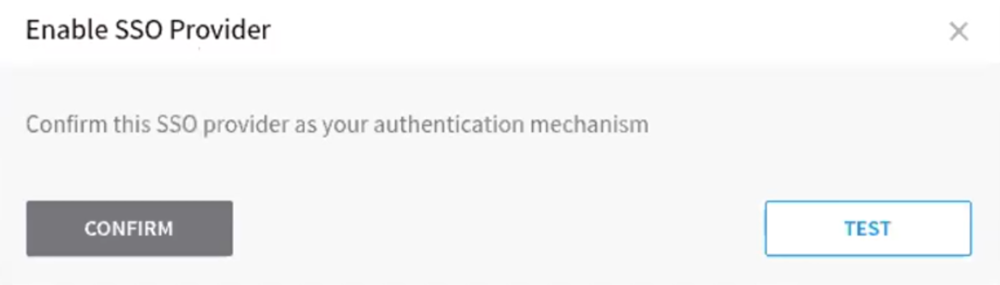
   
    When you see this banner, it is safe to click **CONFIRM** to enable SAML SSO in Harness.  

:::danger
If you become locked out of Harness because of an SSO issue, you must [contact Harness](mailto:support@harness.io) to have the SSO Provider disabled.
:::

4. Test the SSO Provider as a Harness User.  
  
   To fully test SSO, you will log into Harness using another User account. You should use a Chrome Incognito window to test SSO so that you can disable SSO back in your Harness Administrator account if there are any errors.
   
  	1. Open an Incognito window in Chrome.
  	2. Log into Harness using a Harness User account that has a corresponding user account email address in the SAML SSO provider. You will be redirected to your SAML SSO provider's login page.
  	3. Log into your SSO Provider using an email address for a Harness User. The password does not have to be the same.  
  	
    You are automatically returned to the Harness Manager, and logged into the dashboard using your SSO credentials.

#### SAML Authorization with Okta

Once you have enabled Harness SSO with your Okta app, you can set up and enable SAML authorization in Harness using Okta.

To set up SAML authorization in Harness, you link a Harness User Group to a user group in Okta. When a user from Okta logs into Harness, they are automatically added to the linked Harness User Group, and inherit all the RBAC settings for that User Group.

There are two Okta components you need to set up SAML authorization in Harness:

* **Group Name** - The name of the Okta group containing the users you want to authorize in Harness. The email addresses registered in this group must be the same as the email addresses these users have registered in Harness.
* **Group Attribute Name** - The Group Attribute Name associated with the Okta app you use for authentication. The Group Attribute Name is different from the Okta group name. Your company might have many groups set up in Okta. The Group Attribute Name is used to filter groups.

In Harness, you will enter the Group Attribute Name in the SAML SSO provider settings, and then you will enter the group name in the Harness User Group to link it to the Okta group.

Here are the Harness Manager settings on the left and their corresponding Okta settings on the right:

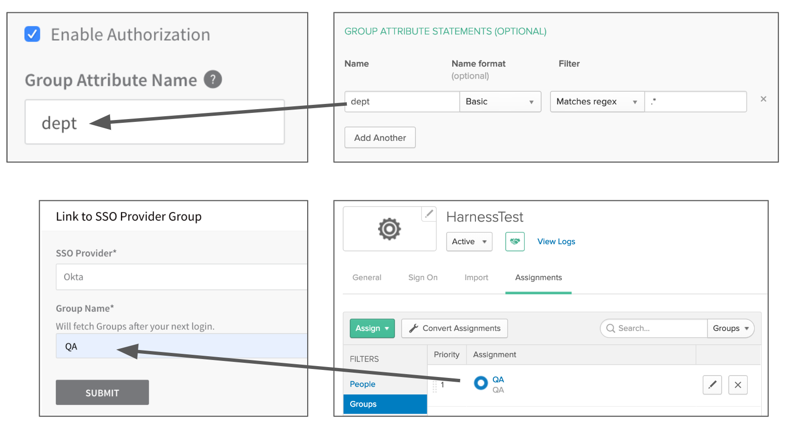
Remember that email addresses are how Harness identifies Users. Always ensure that the email addresses of your registered Harness Users match the Okta users you want to authenticate and authorize.To set up SAML Authorization with Okta, do the following:

1. Set up SAML SSO in Harness as described in [SAML SSO with Okta](#saml_sso_with_okta).  
  
   You will be authorizing the same Harness Users that are authenticated using your SAML provider, so ensure that the email addresses registered in Harness are the same email addresses registered in your SAML provider.
2. Add a user group to your SAML provider, and then add users to the group. The group name will be used to link the Harness User Group later.  
  
   In Okta, here is a user group named **QA** with two members:

   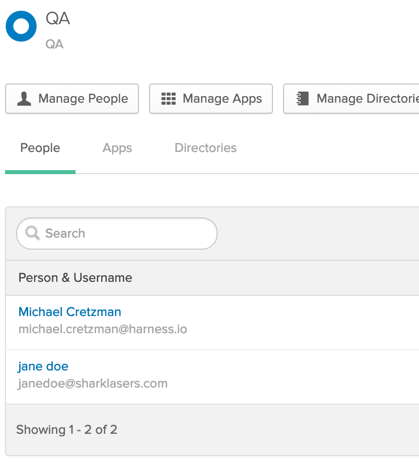

   Both members are already registered in Harness using the same email addresses in both Harness and the SAML provider.

   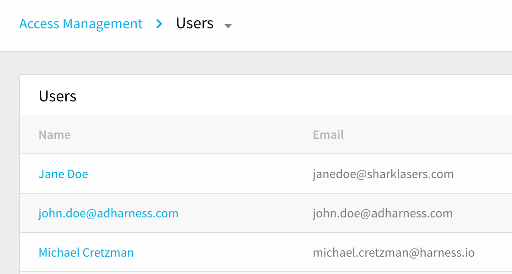

3. Ensure that the SAML provider group is assigned to the same SAML provider app you use for Harness SAML SSO. Here is the same SAML provider group assigned to an app in Okta: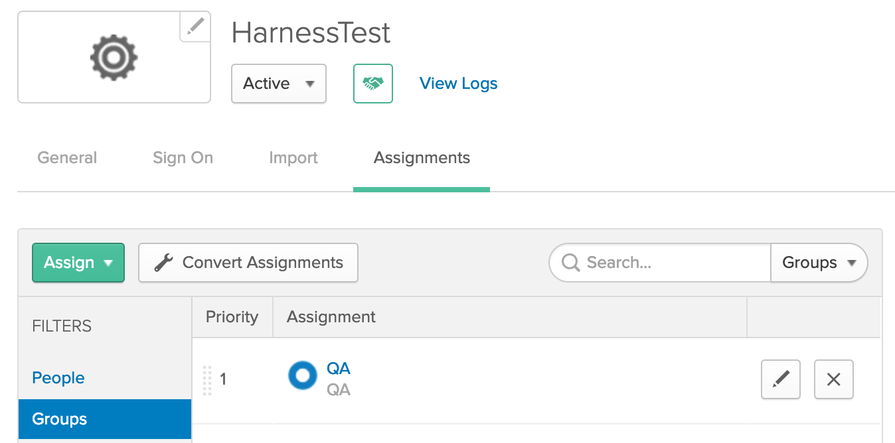

4. Configure the **Group Attribute Name** in your SAML app. You will use the Group Attribute Name later in Harness when you enable SAML authorization.  
  
Here are the steps for adding a Group Attribute Name in Okta:

	1. In **Okta**, click **Applications**, and then click the name of the app you use for Harness SAML SSO to open its settings.
	2. In the app, click the **General** tab.
	3. For **SAML Settings**, click **Edit**.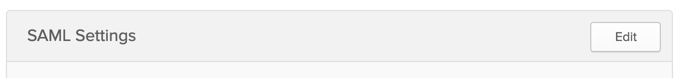

	4. In **General Settings**, click **Next**.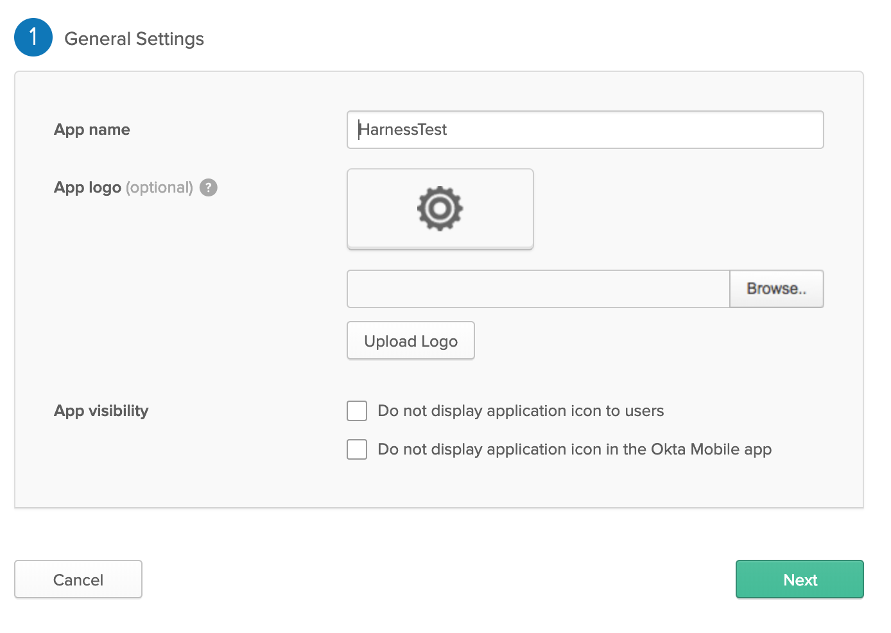

	5. In **GROUP ATTRIBUTE STATEMENTS (OPTIONAL)**, in **Name**, enter the Group Attribute Name you want to use, such as **dept**.
	6. In **Filter**, select **Matches regex** and enter period asterisk (**.\***) in the field. When you are done, it will something like this: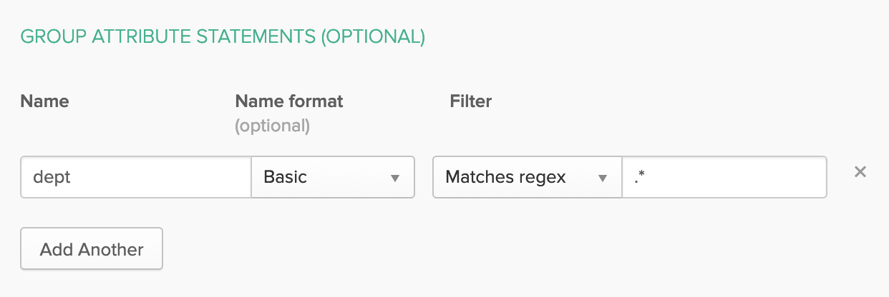

	7. Click **Next**.
	8. Click **Finish**.
5. Enable Authorization in Harness. Now that you have assigned a group to your SAML app and added a Group Attribute Name, you can enable authorization in Harness.
	1. In **Harness**, select **Continuous Security** > **Access Management** > **Authentication Settings**.
	2. Click **SSO Providers**.
	3. In **SSO Providers**, click the vertical ellipsis (**︙**) next to the SSO Provider you have set up for SSO authentication, and click **Edit**.  
	  
	   (Remember, we are simply adding authorization to a SAML SSO provider that is already configured for authentication and **enabled**, as described in [To Set Up SAML SSO](#to_set_up_saml_sso).)
  
       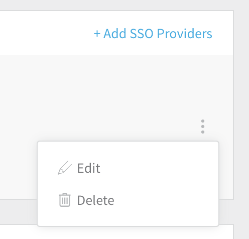

	4. In the **Edit SAML Provider** dialog, enable **Enable Authorization**.
	5. In **Group Attribute Name**, enter the Group Attribute Name you earlier added to your SAML app in your SAML provider.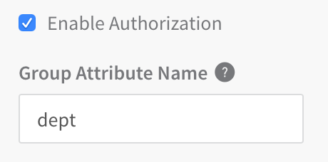

6. Select **Add Entity ID** and enter your custom Entity ID. The default Entity ID is **app.harness.io**. The value you enter here will override the default Entity ID.
7. Click **SUBMIT**. The SAML SSO Provider is now set up to use the Group Attribute Name for authorization.
8. Link the SAML SSO Provider to the Harness User Group. We will create a new Harness User Group, but you can use an existing Group so long as your Harness User account is a member and that User account is registered using the same email address you used to register with your SAML provider.

:::important
SSO should not be linked to the default **Account Administrator** group because this puts the group at risk of deletion.
:::

	1. Click the **Access Management** breadcrumb.
	2. Click **User Groups**.
	3. Click **Add User Group**.
	4. In **Add User Group**, enter a name for the User Group and click **SUBMIT**. In this example, we use the name **QA**.
	5. In the new User Group, click **Member Users**.
	6. In **Add Members**, add your own User account as a member. Also, ensure your Harness account is registered using the same email address you used to register with your SAML provider.  
	  
	Do not add any other Harness Users at this point. When the other users log into Harness using the same email address as they use in the SAML provider, Harness will verify their email addresses with the SAML provider and add them to this linked Harness User Group automatically.
	7. Click **SUBMIT**.
	8. In the **User Group** page, in **Member Users**, click **Link to SSO Provider Group**.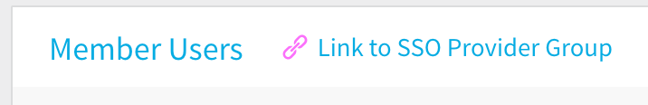

	9. In the **Link to SSO Provider Group** dialog, in **SSO Provider**, select the SAML SSO Provider you have set up.
	10. In **Group Name**, enter the name of the group you assigned to your app in your SAML provider. When you are done, it will look something like this: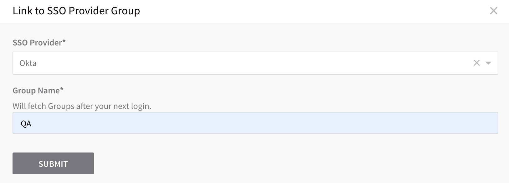

	11. Click **SUBMIT**.
9. Test the SAML Authorization using another user account. We will test the SAML authorization using an email address for a user in Harness and the SAML provider.  
  
Do not log out of Harness. Use a different Harness User account in a Chrome Incognito window to ensure that you can disable SSO if needed.
	1. In Chrome, open an Incognito window, and navigate to Harness.
	2. Log into Harness using the email address of a Harness User that is also used in the SAML provider group linked to the Harness User Group.  
	  
	When the user submits their email address in Harness Manager, the user is redirected to the SAML provider to log in. For example, here is the Okta prompt:

	3. Log into the SAML provider using the same email that the user is registered with in Harness.  
	  
	Once the user logs in, the user is redirected to Harness and logged into Harness using the SAML credentials.
	4. In your Harness account in the other browser window, check the User Group you linked with your SAML provider. The user that logged in is now added to the User Group, receiving the authorization associated with that User Group.

You can link multiple Harness User Groups with the SAML SSO Provider you set up in Harness.

You can also remove a link between a Harness User Group and a Harness SAML SSO Provider without losing the User Group members. In the Harness User Group, simply click **Delink Group**:

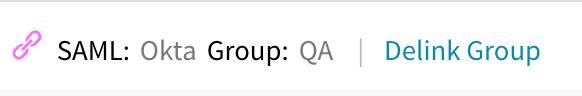

The **Delink External SSO Provider Group** dialog appears.

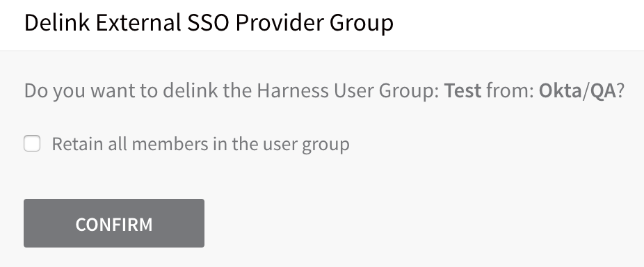

Click **Retain all members in the user group** and click **Confirm**. The link to the SAML SSO Provider is removed and the Users are still members of the User Group.

You cannot delete a SAML SSO Provider from Harness that is linked to a Harness Group. You must first remove the link to the SSO Provider from the Group.

### SAML SSO with Azure

The section describes the Azure-specific steps you must perform to use an Azure app for Harness SAML SSO:

* [Azure User Accounts](#azure-user-accounts)
* [Endpoint URL for Azure](#endpoint-url-for-azure)
* [User Attributes Claims](#user-attributes-claims)
* [Azure SAML Metadata File](#azure-saml-metadata-file)
* [Enable and Test SSO with Azure](#enable-and-test-sso-with-azure)
* [SAML Authorization with Azure](#saml-authorization-with-azure)

Make sure the email address used in Harness matches with the email address in the Azure app for every user.Users are not created as part of the SAML SSO integration. Users are invited to Harness using their email addresses. Once they log into Harness, their email addresses are registered as Harness Users. For more information, go to [SAML SSO with Harness Overview](#saml-sso-with-harness-overview). The following image shows the basic exchange of information between Harness and your Azure app's Single sign-on settings:

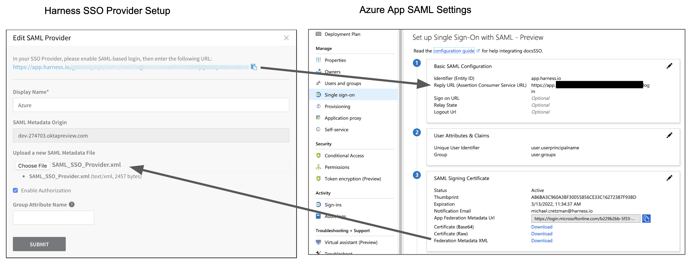

#### Required permissions

When the user authenticating SAML is part of more than 150 groups in Azure active directory, you must set `User.Read.All` access for the application if you want to configure the optional `client-id` and `client-secret`. For more information on Azure application permissions, go to [Application permissions](https://learn.microsoft.com/en-us/graph/permissions-reference#application-permissions-93) in the Azure documentation.

To set `User.Read.All` access for the application, do the following:

1. In Azure, go to **Manage**, and then select **API Permissions**.
2. Select **Add a permission**.
3. Under **Microsoft APIs**, select Microsoft Graph, and then select **Application permissions**.
4. Add the `User.Read.All` permission.

The following App registration permissions are required to configure the optional `client-id` and `client-secret` for Harness SAML SSO with the Azure app:

- `Directory.ReadWrite.All`
- `Group.ReadWrite.All`
- `GroupMember.ReadWrite.All`
- `User.ReadWrite.All`

:::info note
You must set the above for both Delegated permissions and Application permissions.
:::

#### Azure User Accounts

The Harness User accounts and their corresponding Azure user accounts must have the same email addresses.

Ensure that you have at least two corresponding user accounts in both Harness and your Azure app when setting up and testing SAML SSO. This allows you to set up the account with a Harness Administrator account and test it with a Harness user account.

The following image shows a Harness User Group containing two users and their corresponding accounts in the Azure app that will be used for SAML SSO. As you can see, the email addresses are the same.

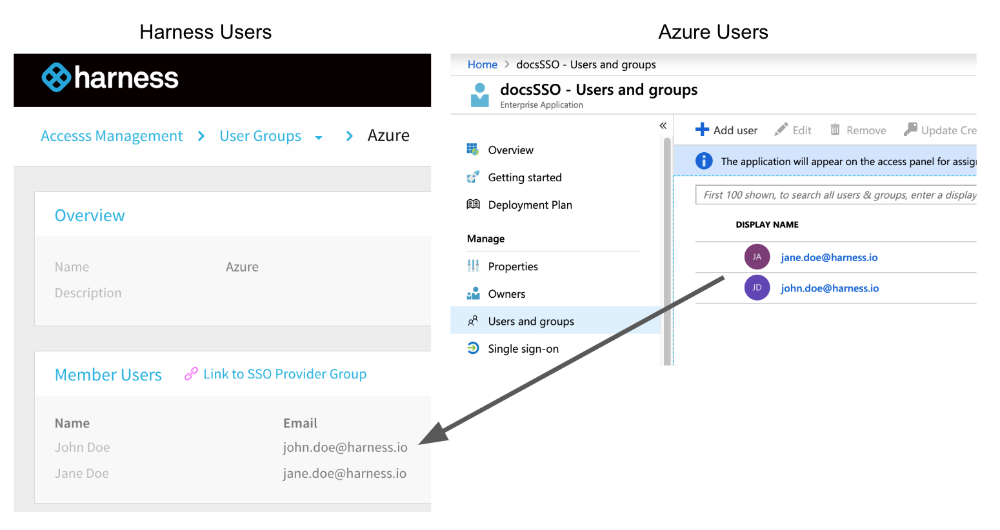


#### Endpoint URL for Azure

You must enter the **Harness SAML Endpoint URL** from Harness in your Azure app **Reply URL**:

1. In your Azure app, click **Single sign-on**. The SSO settings for the Azure app are displayed.

   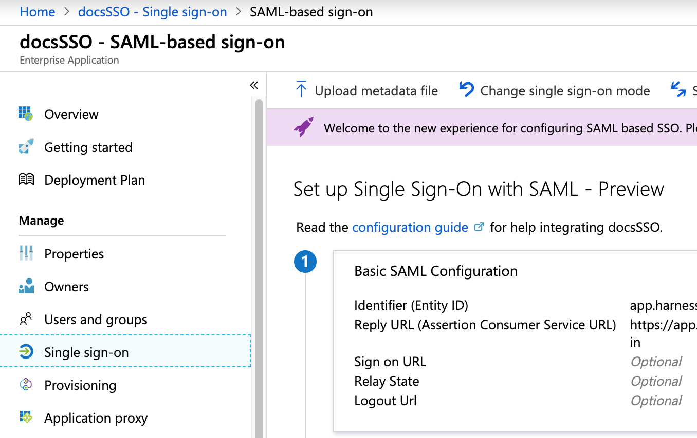

2. In **Basic SAML Configuration**, click the edit icon (pencil).
3. Enter **app.harness.io** in the **Identifier (Entity ID)** field.

   

    Next, you will use the **SAML SSO Provider** settings in Harness to set up your Azure app **Single sign-on**.

    For [Harness On-Prem](../../../starthere-firstgen/harness-on-premise-versions.md), replace **app.harness.io** with your custom URL.  
    If you use a custom Harness subdomain in any Harness version, like **example.harness.io**, use that URL.

4. In Harness, click **Continuous Security**, and then click **Access Management**.
5. Click **SSO Providers**, and then click **Add SSO Provider** and choose **SAML**. 

  The **Add SAML Provider** dialog appears.
  
  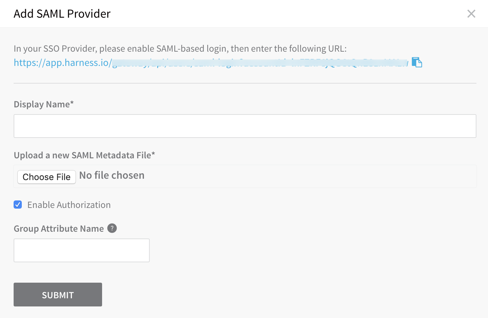

6. In **Display Name**, enter a name for the SAML SSO Provider, such as **Azure**.

7. Copy the **Harness SAML Endpoint URL** from the **Add SAML Provider** dialog, and paste it in the **Reply URL** in your Azure app.

   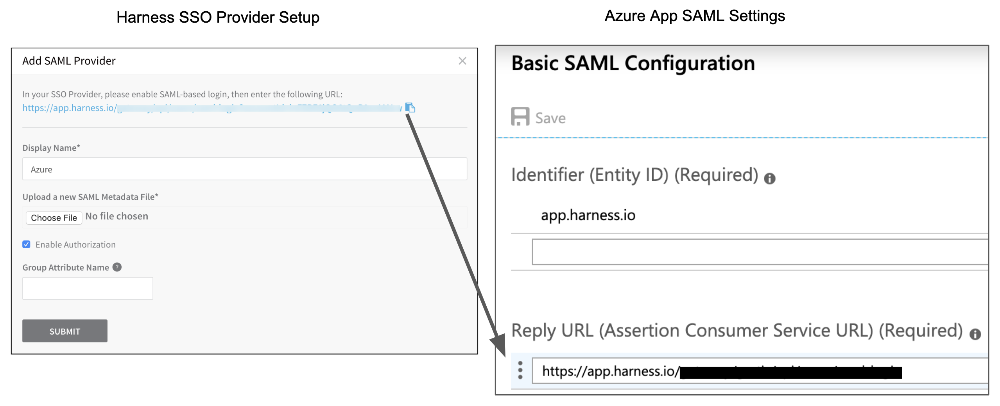

8. Click **Save**. The Basic SAML Configuration now looks like this:

   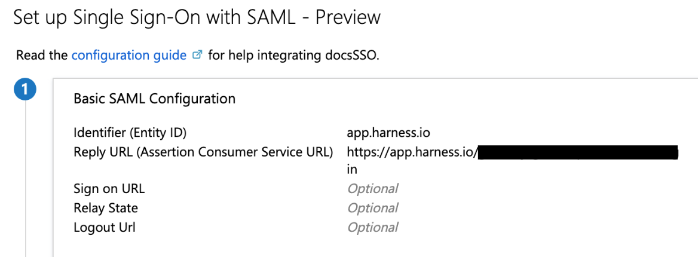


#### User Attributes & Claims

Next, you need to ensure that Harness Users email addresses will identify them when they log in via Azure. To do this, you set up the **Single sign-on** section of your Azure app to use the **User name** email address as the method to identify users.

The Azure users that are added to your Azure app must have their email addresses listed as their **User name**, for example:

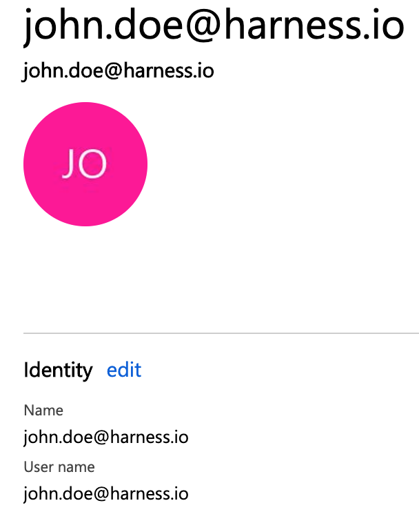

To set this **User name** email address as the method for identifying users, in the Azure app **Single sign-on** section, the Azure app must use the **user.userprincipalname** as the **Unique User Identifier**, and **user.userprincipalname** must use **Email address** as the **name identifier format**.

To set this up in your Azure app, do the following:

1. In your Azure app, in the **Single sign-on** blade, in **User Attributes & Claims**, click the edit icon (pencil). The **User Attributes & Claims** settings appear.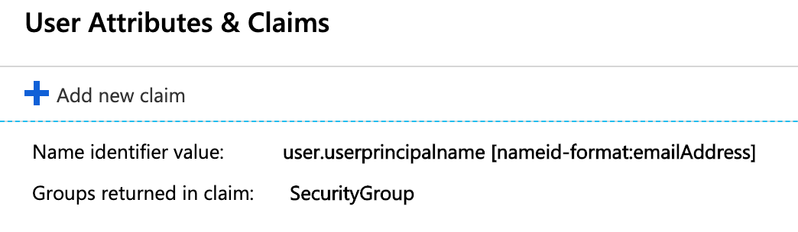

2. For **Name identifier value**, click the edit icon. The **Manage user claims** settings appear.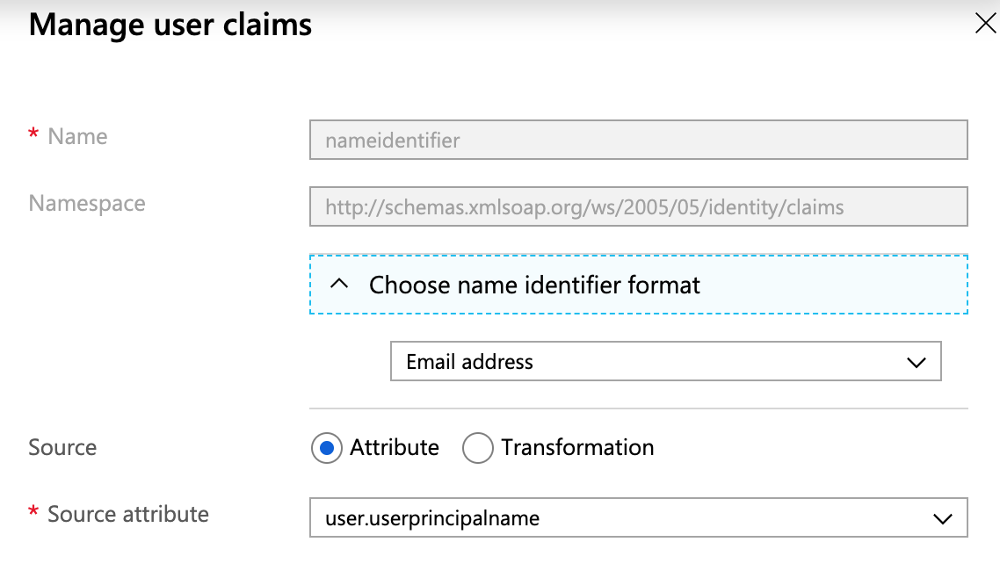

3. Click **Choose name identifier format**, and select **Email address**.
4. In **Source attribute**, select **user.userprincipalname**.
5. Click **Save**, and then close **User Attributes & Claims**. When you are finished, the **User Attributes & Claims** section of **Single sign-on** will look like this:

   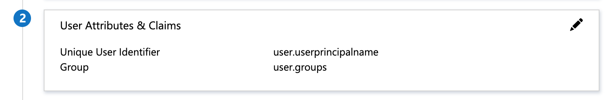

   If your Azure users are set up with their email addresses in some field other than **User name**, just ensure that the field is mapped to the **Unique User Identifier** in the Azure app and the **name identifier format** is **Email address**.

#### Azure SAML Metadata File

You must download the **Federation Metadata XML** from your Azure app and upload the file into Harness.

1. Download the **Federation Metadata XML** from your Azure app and upload it using **Upload a new SAML Metadata File** in the **Add SAML Provider** dialog in Harness.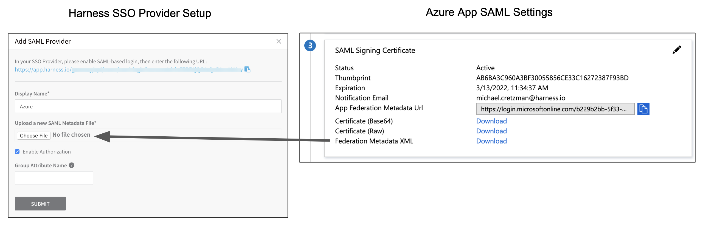

2. In Harness' **Add SAML Provider** dialog, click **SUBMIT**. The new Azure SAML Provider is added.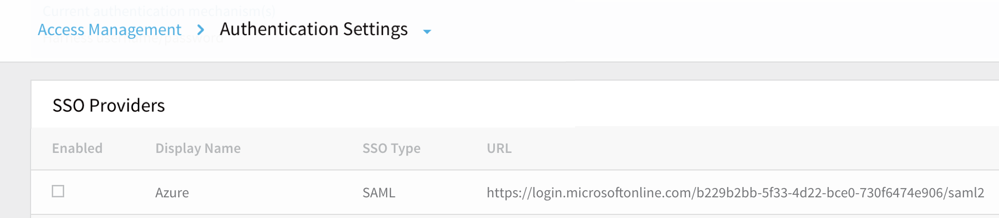


#### Enable and Test SSO with Azure

Now that Azure is set up in Harness as a SAML SSO provider, you can enable and test it.

You can test the Azure app SSO from within Azure if you are logged into Azure using a Azure user account that has the following:

* A corresponding Harness User account with the same email address.
* The Azure user account is in the Azure app **Users and groups** settings.
* The Azure user account has the Global Administrator Directory role in Azure.

To test Azure SSO using Azure, do the following:

1. In the Azure app, click **Single sign-on**, and then at the bottom of the **Single sign-on** settings, click **Test**.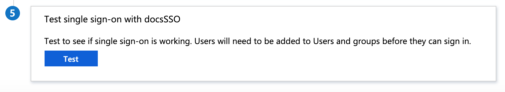

2. In the **Test** panel, click **Sign in as current user**. If the settings are correct, you are logged into Harness. If you cannot log into Harness, the **Test** panel will provide debugging information. For more information, go to [Debug SAML-based single sign-on to applications in Azure Active Directory](https://docs.microsoft.com/en-us/azure/active-directory/develop/howto-v1-debug-saml-sso-issues?WT.mc_id=UI_AAD_Enterprise_Apps_Testing_Experience) from Azure.

To test Azure SSO using Harness, do the following:

1. In **Harness**, in **SSO Providers**, click the **Enabled** checkbox to enable SAML SSO using the Azure provider.
2. Open a new Chrome Incognito window to test the SSO login using a Harness User account other than the one you are currently logged in with.
3. Using one of the user account email addresses that is shared by Harness and Azure, log into Harness. When you log into Harness, you are prompted with the Microsoft Sign in dialog.
4. Enter the Azure user name for the user (most often, the email address), enter the Azure password, and click **Sign in**.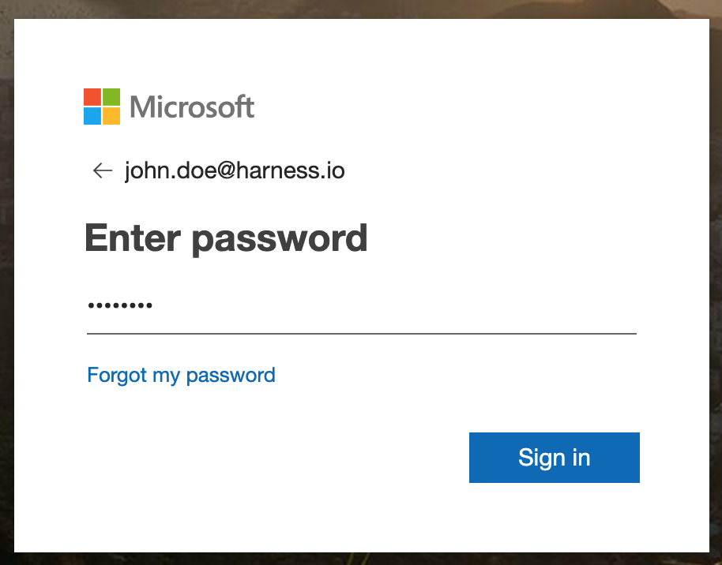


#### SAML Authorization with Azure

Once you have enabled Harness SSO with your Azure app, you can set up and enable SAML authorization in Harness using Azure.

To set up SAML authorization in Harness, you link a Harness User Group to a user group assigned to your Azure app. When a user from your Azure app logs into Harness, they are automatically added to the linked Harness User Group, and inherit all the RBAC settings for that Harness User Group.

There are two Harness SAML settings you need from Azure to set up SAML authorization in Harness:

* **Group Attribute Name** - In Azure, this value is obtained from the **Group Claims** in the Azure app **User Attributes & Claims** settings.
* **Group Name** - The Object ID of the Azure group containing the Azure users you want to authorize in Harness. The email addresses registered in this Azure group must be the same as the email addresses these users have registered in Harness.

For Harness **Group Attribute Name**, here is the Harness **SAML Provider** setting on the left and their corresponding Azure **Group Claims** settings on the right:

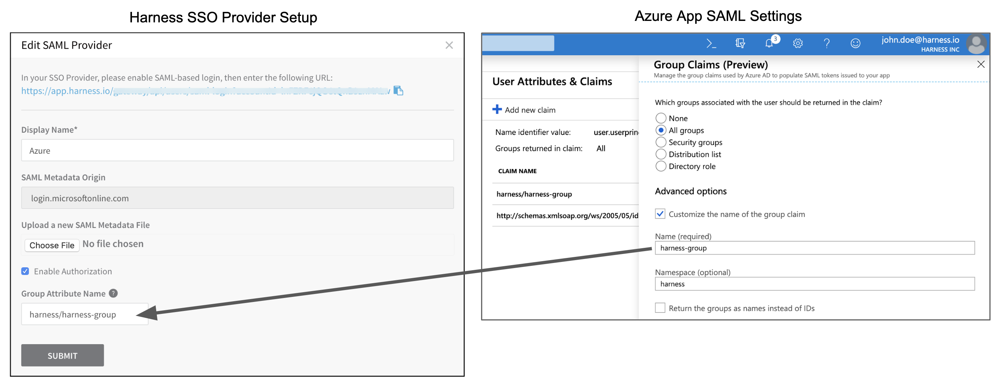
For Harness **Group Name**, here is the Harness User Group link setting on the left and the Azure group Object ID on the right.

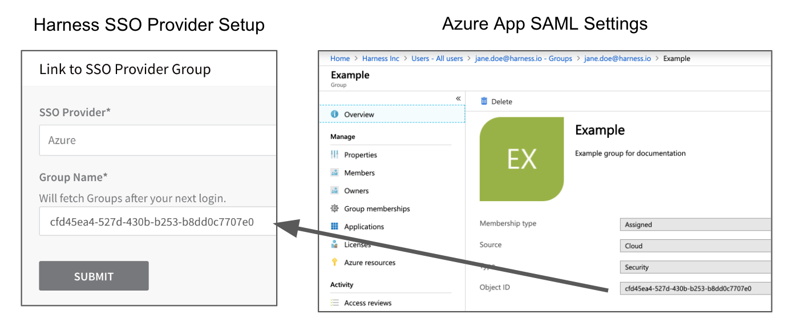
To set up Azure Authorization in Harness, do the following:

1. In Azure, add the **Group Claim** (Name and Namespace) to the Azure app.
	1. In your Azure app, click **Single sign-on**, and then in **User Attributes & Claims**, click edit (pencil icon).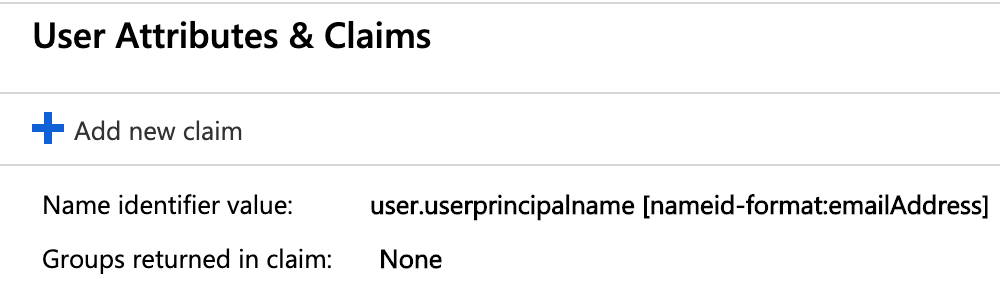

	2. In **User Attributes & Claims**, edit the **Groups returned in claim**. The **Group Claims** settings appear.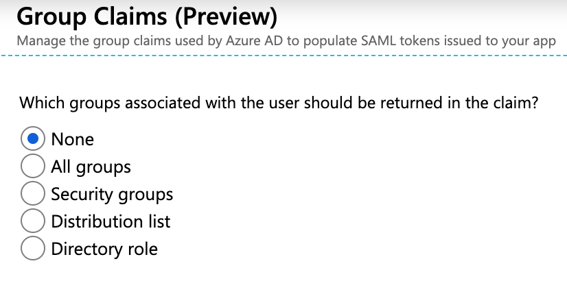

	3. Click the **All groups** option and then enable **Customize the name of the group claim**.
	4. In **Name**, enter a name to use to identify the Harness Group Attribute Name.
	5. In **Namespace**, enter a namespace name. When you are done, **Group Claims** will look something like this: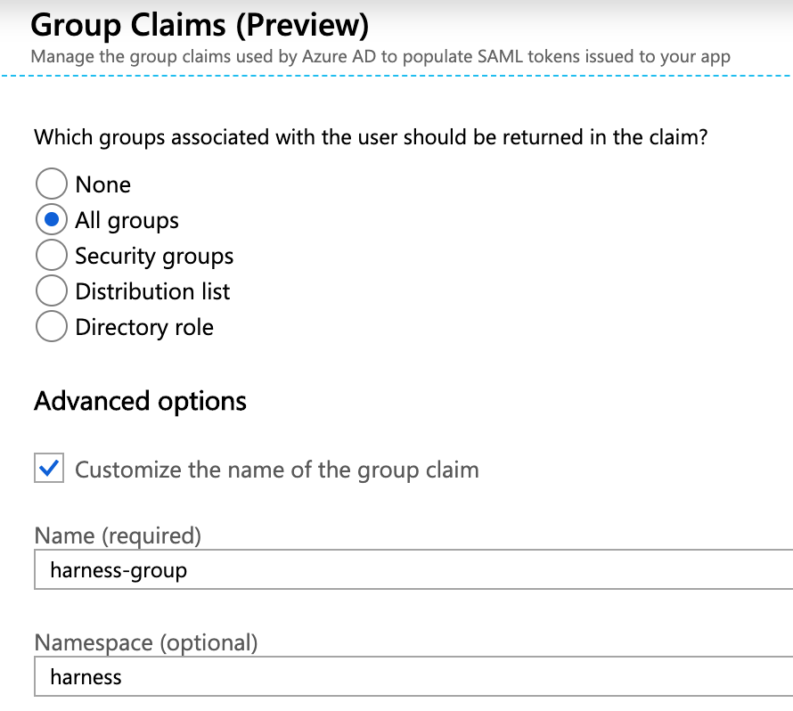

	6. Click **Save**. **User Attributes & Groups** now displays the group claim you created.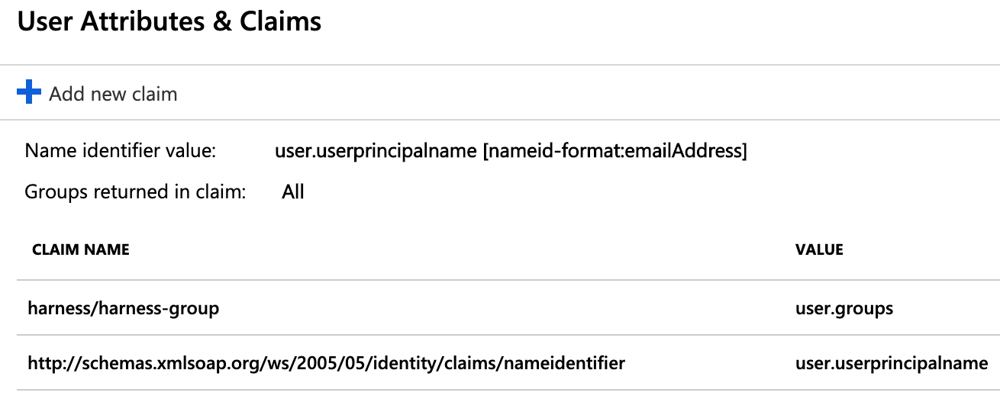

	7. Close **User Attributes & Groups**.
2. In Harness, enter the Group Claim name and namespace in the SAML SSO Provider **Group Attribute Name** field.
	1. Open the SAML SSO Provider dialog, and enable the **Enable Authorization** setting. You need to enable **Enable Authorization** in order to select this SSO Provider when you link a Harness User Group for authorization.
	2. Enter the Group Claim name and namespace in the **Group Attribute Name** field in the same format as a Claim Name (`namespace/name`). The SAML SSO Provider dialog will look something like this: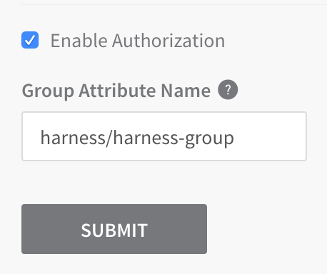

3. Select **Add Entity ID** and enter your custom Entity ID. The default Entity ID is **app.harness.io**. The value you enter here will override the default Entity ID. The Entity ID for your Azure app must match the Entity ID in your Harness SAML settings. To check this in your Azure app, see Step 3 [Endpoint URL for Azure](#endpoint_url_for_azure).
4. Click **SUBMIT**. Authorization and the Group Attribute Name are set up. Next, you need to set up your Azure and Harness groups.
5. In Azure, ensure the Azure users with corresponding Harness accounts belong to an Azure group. Here is an Azure group named **Example** with two members: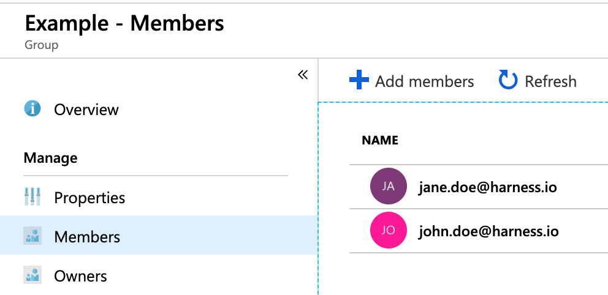

6. Ensure that the Azure group is assigned to the Azure app. Here you can see the **Example** group in the Azure app's **Users and groups**: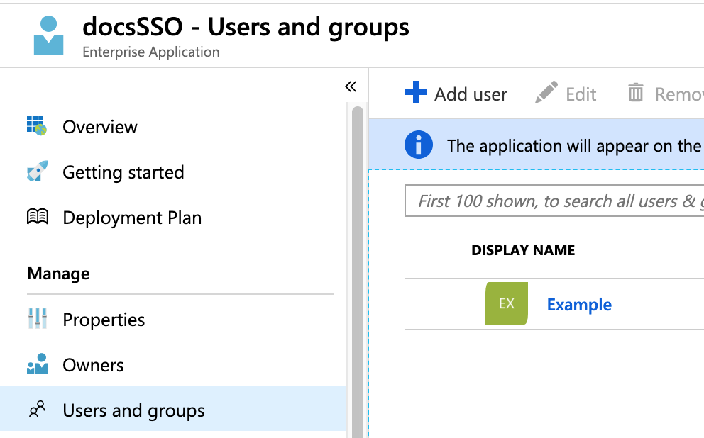

7. Link the Harness User Group to the Azure group using the Azure group Object ID.
	1. In Azure, copy the Azure group **Object ID**.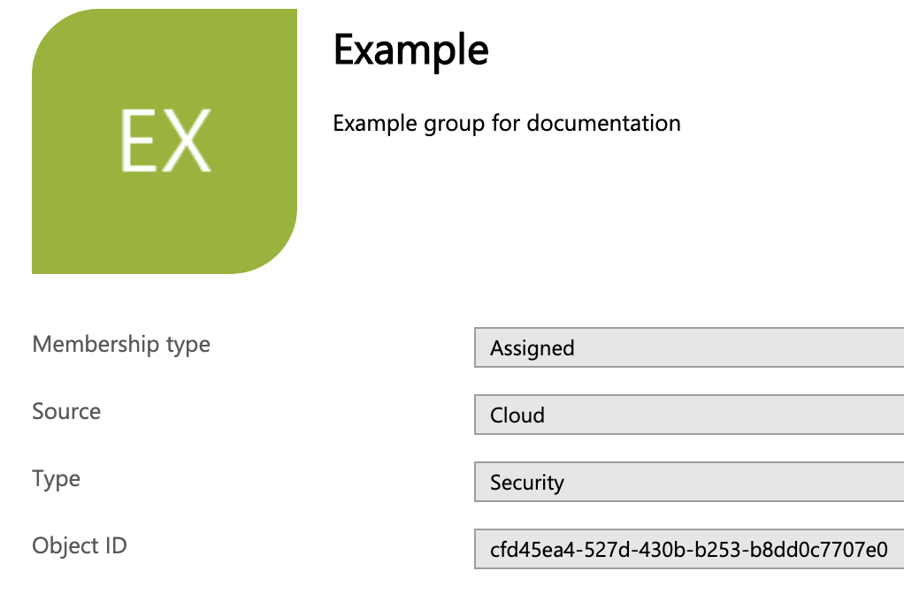

	2. In Harness, create a new User Group or open an existing User Group.
	3. In the **Member Users** section, click **Link to SSO Provider Group**.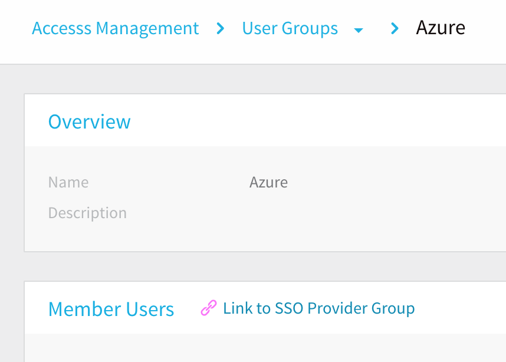

	4. In the **Link to SSO Provider Group** dialog, in **SSO Provider**, select the Azure SSO Provider you set up, and in **Group Name**, paste the Object ID you copied from Azure. When you are done, the dialog will look something like this: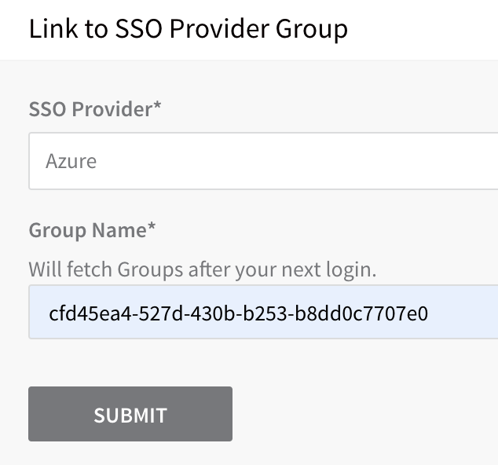

	5. Click **SUBMIT**. The User Group is now linked to the SAML SSO Provider and Azure group Object ID.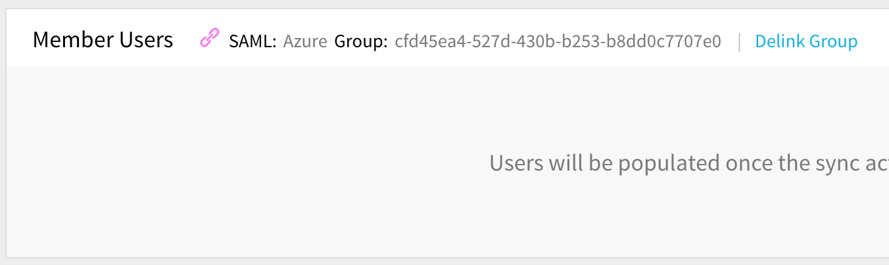

8. Test Authorization.
	1. Open a new Chrome Incognito window to test the authorization using a Harness User account other than the one you are currently logged in with.
	2. Log into Harness using the user email address, and sign in using the Azure username and password. If you are already logged into Azure in Chrome, you might be logged into Harness automatically.
	3. In the linked Harness User Group, ensure that the Harness User account you logged in with was added.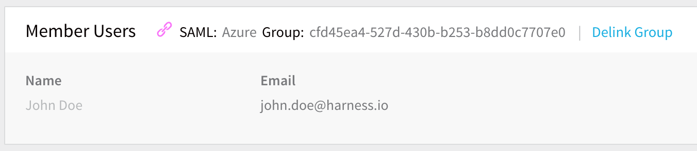
The Harness User is now added and the RBAC settings for the Harness User Group are applied to its account. For more information, go to [Managing Users and Groups (RBAC)](users-and-permissions.md).

### SAML SSO with Azure Active Directory

You can use Azure Active Directory (AD) for SAML SSO with Harness, enabling AD users to log into Harness using their AD credentials.

For detailed steps on adding SAML SSO with Active Directory, follow the steps in the tutorial [Azure Active Directory single sign-on (SSO) integration with Harness](https://docs.microsoft.com/en-us/azure/active-directory/saas-apps/harness-tutorial) from Microsoft.

Users are not created as part of the SAML SSO integration. Users are invited to Harness using their email addresses. Once they log into Harness, their email addresses are registered as Harness Users. For more information, go to [SAML SSO with Harness Overview](#saml_sso_with_harness_overview).

#### Users in over 150 Groups

When users have large numbers of group memberships, the number of groups listed in the token can grow the token size. Azure Active Directory limits the number of groups it will emit in a token to 150 for SAML assertions.

If a user is a member of a larger number of groups, the groups are omitted and a link to the Graph endpoint to obtain group information is included instead.

To invoke the API Harness will need **Client ID** and **Client Secret** for your registered app.

To get this information, perform the following steps:

1. In your Azure account, go to **App registrations**.
2. Click on your app. Copy the Application (client) ID and paste it in Client ID in your Harness account.
3. In your Azure account, go to **App registrations**. Click **Certificates and Secrets**.
4. Click New Client Secret.
5. Add a description and click Add.
6. Make sure to copy this secret and save it as an encrypted text secret. For detailed steps to create an encrypted text in Harness, go to [Use Encrypted text Secrets](../secrets-management/use-encrypted-text-secrets.md).
7. Select the above secret reference in the Client Secret field in your Harness account.
8. Select **Add Entity ID** and enter your custom Entity ID. The default Entity ID is **app.harness.io**. The value you enter here will override the default Entity ID.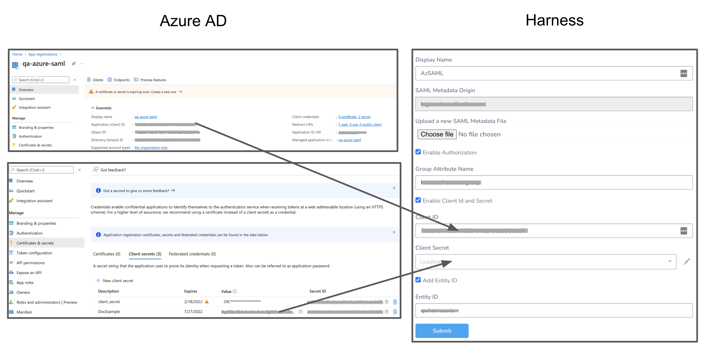


### SAML SSO with Google G Suite

Harness supports SAML integration with Google G Suite to enable your employees to use their Google account credentials to sign into the Harness platform.

Google G Suite supports authentication, but not authorization.Users are not created as part of the SAML SSO integration. Users are invited to Harness using their email addresses. Once they log into Harness, their email addresses are registered as Harness Users. For more information, go to [SAML SSO with Harness Overview](#saml_sso_with_harness_overview).For information about G Suite and SAML, go to [Service provider SSO set up](https://support.google.com/a/answer/6349809?hl=en&ref_topic=6348126) from Google.

To set up SAML with Google, you must be a G Suite administrator. To integrate G Suite SAML with Harness, your Harness account must be a member of the Account Administrator group. For more information, go to [Users and Permissions](users-and-permissions.md).First, we will set up Harness as a SSO SAML app with Google G Suite, and then we will configure Harness to use Google G Suite for SSO.

If you become locked out of Harness because of a SSO issue, you must contact Harness to have the SSO Provider disabled.

#### Add Harness as G Suite SSO App

To set up SAML with Google G Suite, do the following:

1. Log into your G Suite Admin console.
2. From the Admin console Home page, go to **SAML apps**.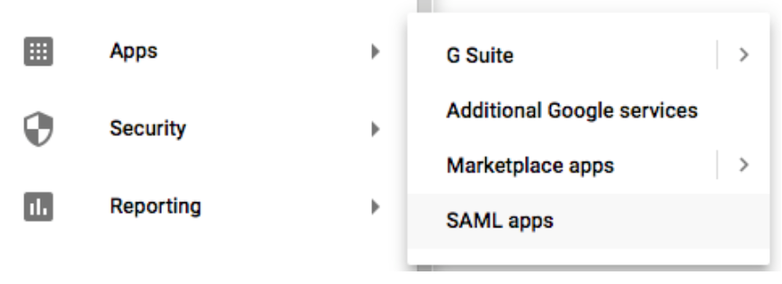

3. Click the plus sign next to **Enable SSO for a SAML Application**.

4. In **Step 1**, at the bottom, click **SETUP MY OWN CUSTOM APP**.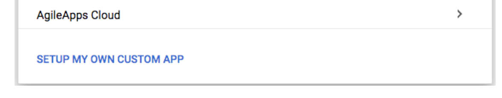

5. In **Step 2**, the **Google IdP Information** appears, including the **SSO URL** and **Entity ID** URLs.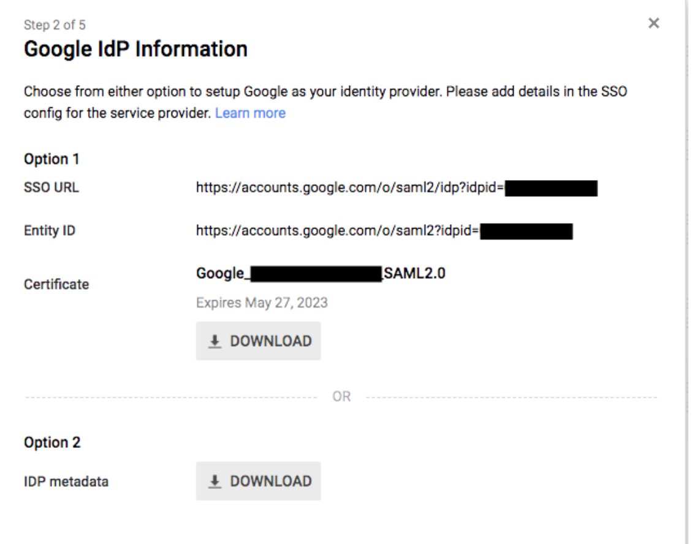

	1. In **Option 2**, click **DOWNLOAD** to download the **IDP metadata** to your computer. The IDP metadata file will be used to set up G Suite SSO in Harness.
	2. Click **NEXT**.
6. In **Step 3**, in **Application Name**, enter a name for the application. Make sure that the name does not include spaces or special characters.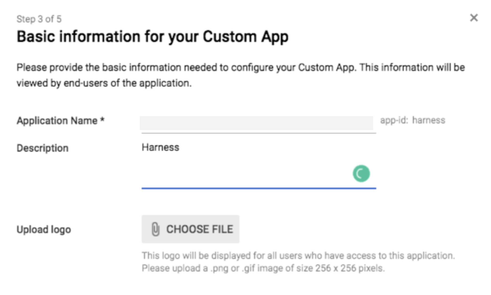

	1. Now you will get the Harness logo so your employees will easily identify Harness in their G Suite apps. In another browser tab, download the [Harness logo](https://github.com/wings-software/harness-docs/blob/main/harness_logo.png)
.
	2. Back in **Step 3**, in **Upload logo**, click **CHOOSE FILE**, and upload the Harness logo.
	3. Click **NEXT**.
7. In **Step 4**, provide the Harness provider details.
	1. In **ACS URL**, enter the **Harness SAML Endpoint URL** from the Harness **Single Sign-on (SSO) Provider** dialog. To obtain this URL, in Harness, select **Continuous Security** > **Access Management** > **Authentication Settings**.
	2. On the resulting **Authentication Settings** page, click **Add SSO Provider**, and click **SAML**.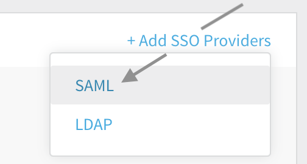
The **Single Sign-on (SSO) Provider** dialog appears.
	3. Copy the **Harness SAML Endpoint URL** from the dialog and enter it in **ACS URL** in G Suite.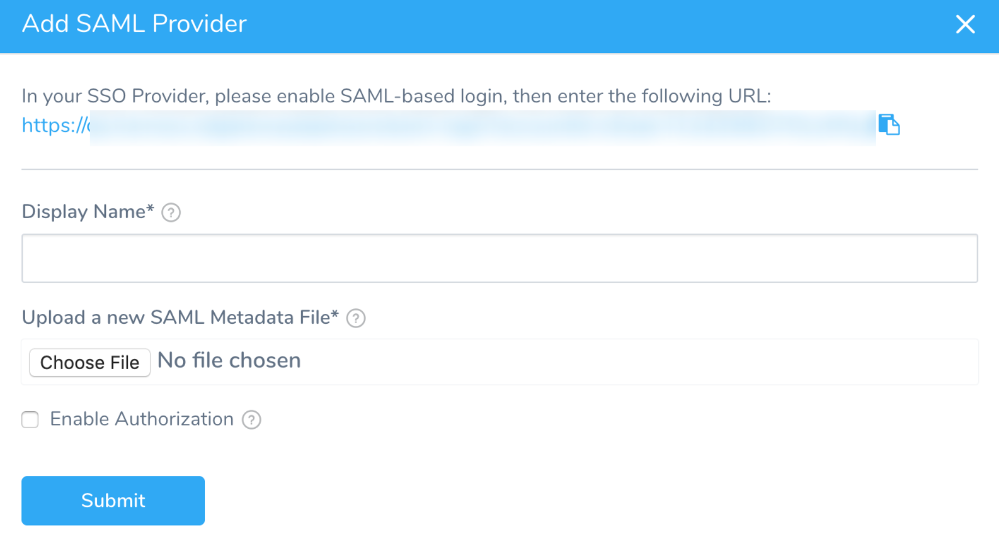

	4. In **Entity ID**, enter **app.harness.io**.For Harness [On-Prem](../../../starthere-firstgen/harness-on-premise-versions.md), replace **app.harness.io** with your custom URL.  
If you use a custom Harness subdomain in any Harness version, like **example.harness.io**, use that URL.
	1. In **Start URL**, enter the same URL you entered for **ACS URL**.
	2. Leave **Signed Response** unchecked, and click **NEXT**.
8. In **Step 5**, click **FINISH**.
9. In the Harness service provider page, click the **pencil icon** to turn on the new Harness SSO app.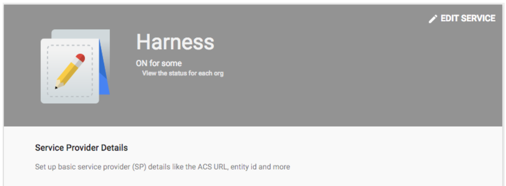

10. In the **Status** setting, click **Settings for all organizational units**.

    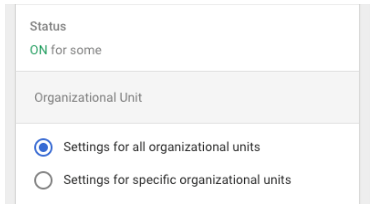

    Make sure you select this option. You'll get an error saying that the service is not enabled for the user while testing the SAML connection if you don't select this option.
11. In the **Service Status** settings, click **ON for everyone**, and then click **SAVE**.

Next, add G Suite as a Harness SSO provider for your Harness account.

#### Add G Suite as a Harness SSO Provider

To add the Harness SSO G Suite App you created as a Harness SSO Provider, do the following:

1. Log into Harness with an account that is in the Harness **Account Administrator** group.
2. In **Harness**, select **Continuous Security** > **Access Management**. > **Authorization Settings**.
3. Click **Add SSO Provider**. The **Single Sign-on (SSO) Provider** dialog appears.

4. Click **Choose File**, and upload the **IDP metadata** file you downloaded from Google.
5. In **Display Name**, enter a name to identify this SSO account, such as **Google**, and click **SUBMIT**.
6. Back in the **Single Sign-on(SSO) Provider Setup** list, enable the new SSO provider.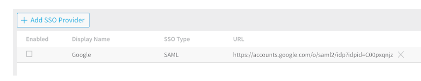

7. You are finished. To test the provider, log out of Harness.
8. Open a G Suite app, such as **Mail**, and locate the Harness app you added by clicking the Google Apps icon.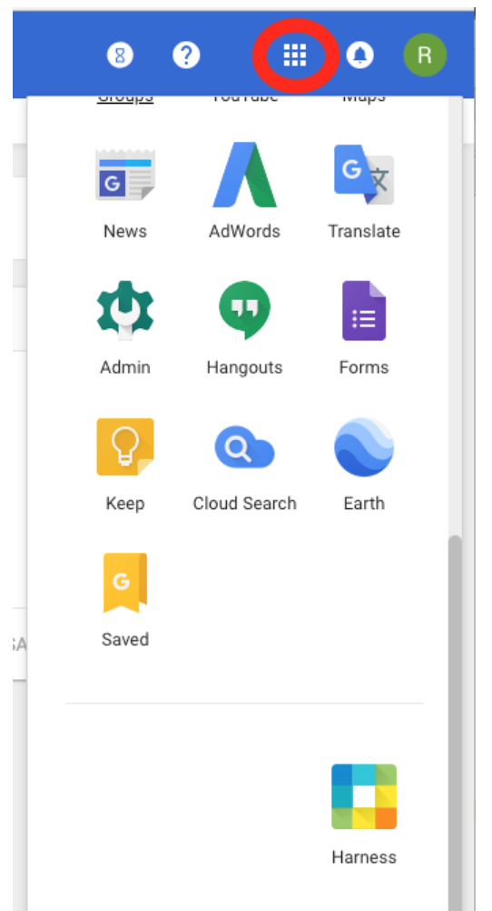

9. Click the **Harness** app icon and you will be redirected to **app.Harness.io**, and logged in.

For Harness [On-Prem](../../../starthere-firstgen/harness-on-premise-versions.md), you will be directed to your custom URL.  
If you use a custom Harness subdomain in any Harness version, like **example.harness.io**, it will be that URL.

### SAML SSO with OneLogin

To set up OneLogin as a SAML SSO provider on Harness, you exchange the necessary information between the OneLogin Harness application and Harness. The following sections cover [Authentication](#onelogin_authentication) steps, followed by [Authorization](#onelogin_authorization) steps.

Users are not created as part of the SAML SSO integration. Users are invited to Harness using their email addresses. Once they log into Harness, their email addresses are registered as Harness Users. For more information, go to [SAML SSO with Harness Overview](#saml_sso_with_harness_overview).

#### OneLogin Authentication on Harness

Enabling OneLogin authentication on Harness requires configuration on both platforms, as described in these sections:

##### Exchange Harness Consumer URL and OneLogin Metadata

1. In Harness Manager, select **Security** > **Access Management** > **Add SSO Providers**. From the resulting drop-down, select **SAML**.
2. In the resulting **Add SAML Provider** dialog, copy the provided URL to the clipboard.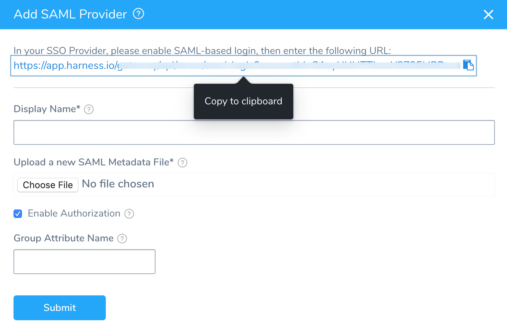

3. In OneLogin, add the **Harness** app (for SaaS setup) or **Harness (On Prem)** app for On-Prem setup. To do so, perform the following steps:
	1. Log in to OneLogin.
	2. Click **Administration**.
	3. Under the **Applications** tab, click **Applications**.
	4. Click **Add App**.
	5. Find **Harness** or **Harness (On Prem)** based on your setup, and then click the app.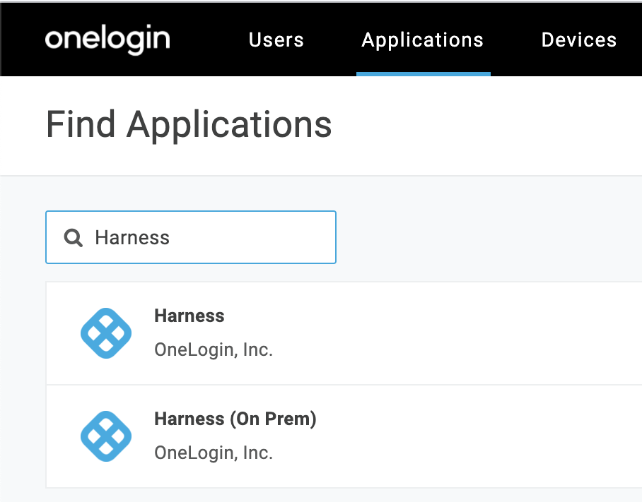

4. In **Configuration**, paste this URL into the **SCIM Base URL** field.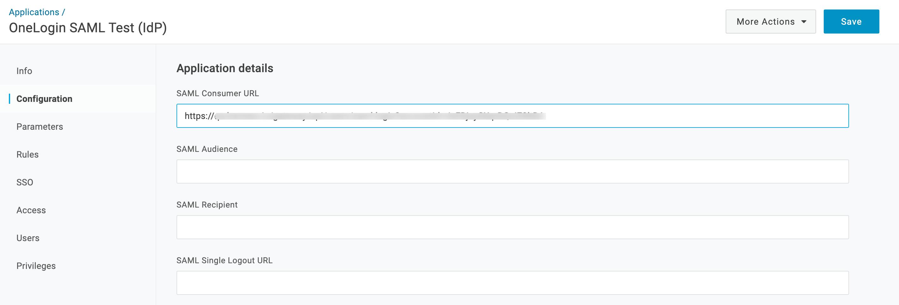

5. Skip all other **Application Details** fields, and click **Save**.
6. Navigate to OneLogin's **Applications** > **SSO** tab. At the upper right, select **More Actions** > **SSO Metadata**.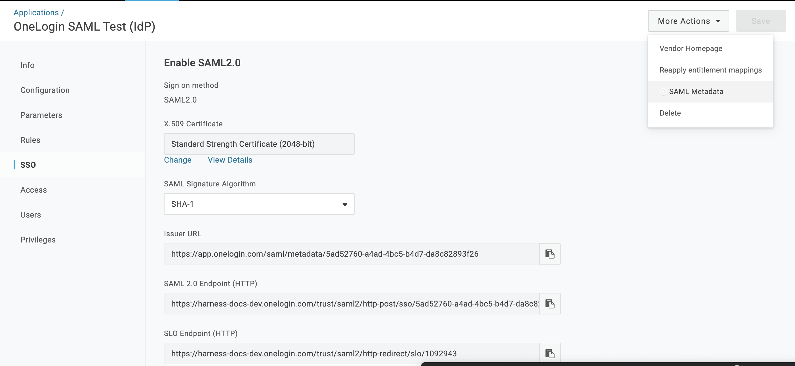

7. From the resulting dialog, download the .xml authentication file that you'll need to upload to Harness.

 

##### Assign Users to Roles

1. In OneLogin, select **Users** > **Users**.  
If you prefer to assign *groups* to roles, instead start at **Users** > **Groups**, and modify the following instructions accordingly.
2. Search for a user that you want to add to Harness.

3. Click to select the user.
4. On the resulting **Users** page, select the **Applications** tab at left.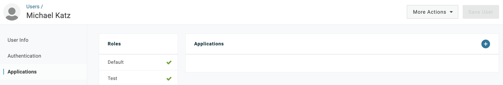

5. Click the **+** button at upper right to assign an Application.
6. Find and select the Application, then click **Continue**.

   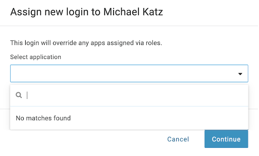

7. Repeat this section for other users (or groups) that you want to add to Harness.

##### Enable OneLogin as a Harness SSO Provider

1. In Harness Manager, select **Continuous Security** > **Access Management > Authentication Settings**.
2. Beside **SSO Providers**, click the More Options ⋮ menu to open the **Edit SAML Provider** dialog.
3. Use **Choose File** to upload the .xml file that you obtained from OneLogin.
4. Change the **Display Name** to a simple entry, like **SAML**.
5. Deselect **Enable Authorization**.
6. Select **Add Entity ID** and enter your custom Entity ID. The default Entity ID is **app.harness.io**. The value you enter here will override the default Entity ID.
7. Select **Submit**.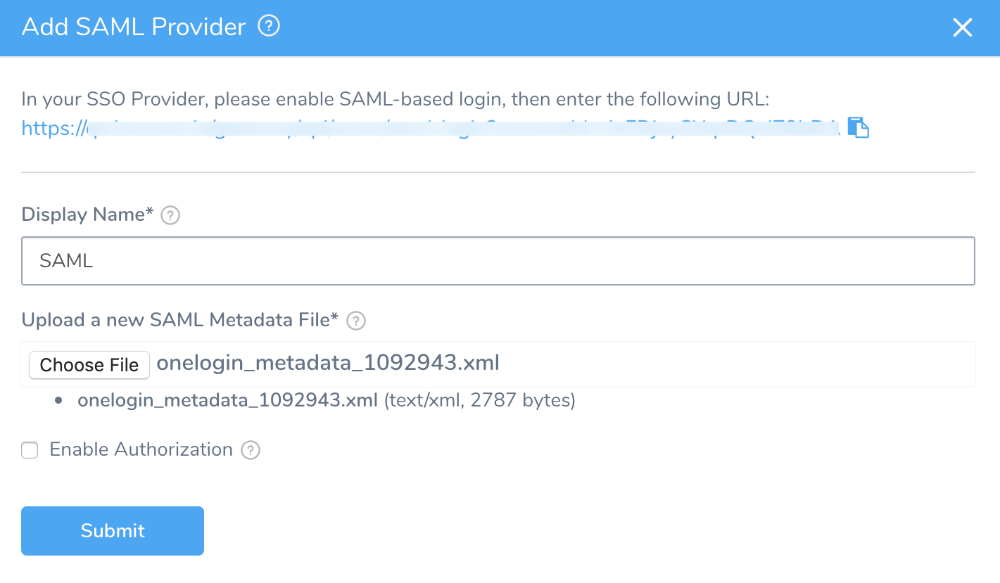
This adds OneLogin as a SSO Provider, and returns you to Harness **Authentication Settings**,
8. Slide the **Authentication enabled?** slider right, to enable your new provider.
9. In the resulting **Enable SSO Provider** dialog, click **Test**.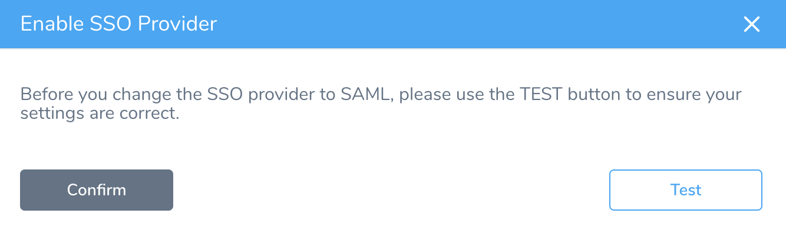

10. Once the test is successful, click **Submit** to finish setting up OneLogin authentication.

#### OneLogin Authorization on Harness

Once you've enabled OneLogin authentication on Harness, the following sections outline how to enable authorization between the two platforms:

##### Assign Roles to Users

Harness’ SAML authorization replicates OneLogin Roles as Harness User Groups. Here is how to begin mapping between these entities.

1. From OneLogin's, menu, select **Users** > **Users**.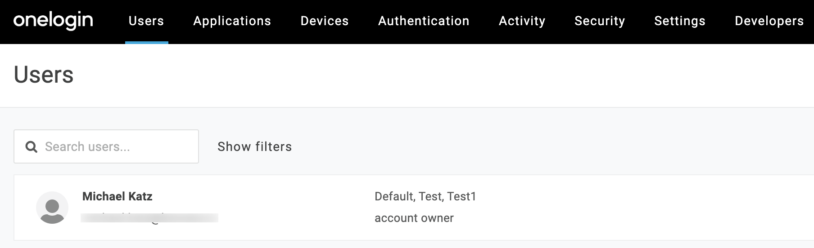

2. Click to select a user, assigned to Harness, whom we want to assign to appropriate OneLogin Roles.
3. Select the **Applications** tab at left.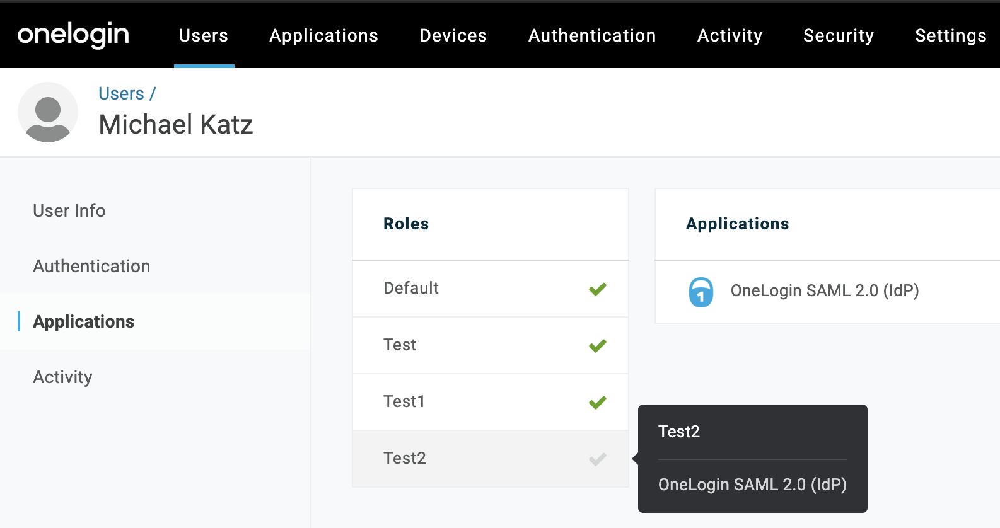

4. As shown above, click each Role that you want to assign to this user.
5. Click **Save User** at upper right.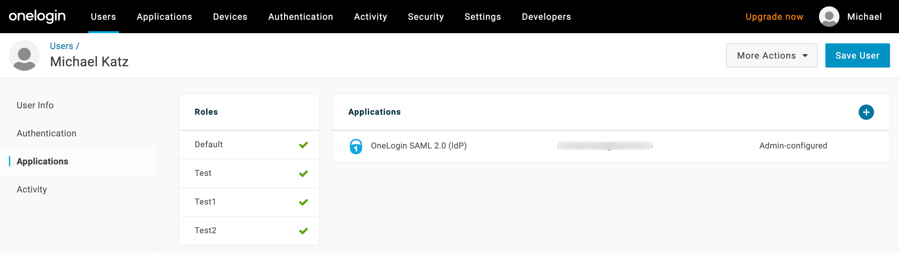

6. Repeat this section for other users to whom you want to assign Roles.

##### Define Parameters

1. Select **Applications** > **Parameters**, then select the `+` button to add a new Parameter.
2. In the resulting **New Field** dialog, assign a **Field name** (for example **Groups**).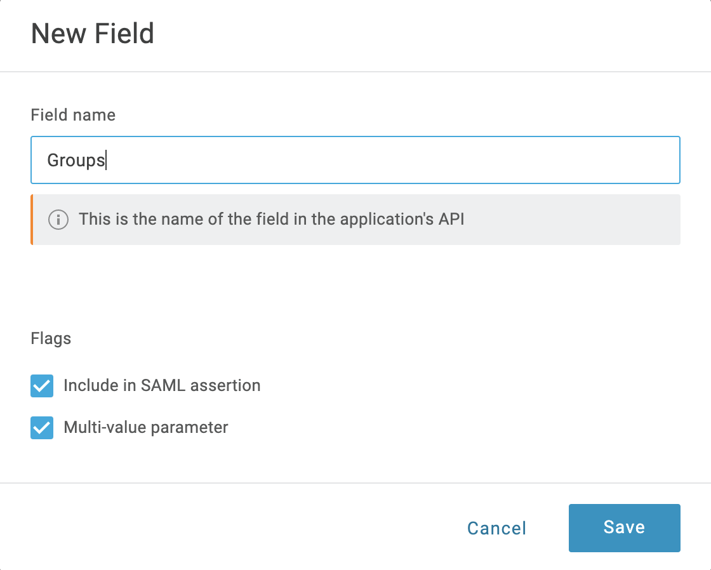

3. Select **Include in SAML assertion** and **Multi-value parameter**. Then click **Save**.
4. Back on the **Parameters** tab, select your new **Groups** field.
5. In the resulting **Edit Field Groups** dialog, set **Default if no value selected** to **User Roles**. Below that, select **Semicolon Delimited input (Multi-value output)**. Then select **Save**.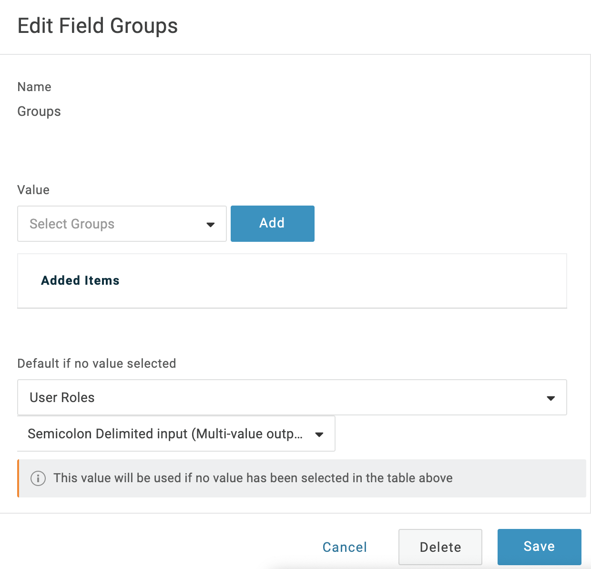

6. Select **Save** again at the **Parameters** page's upper right.

 

##### Sync Users in Harness

1. In Harness Manager, select **Continuous Security** > **Access Management > Authentication Settings**.
2. Beside **SSO Providers**, click the More Options ⋮ menu to open the **Edit SAML Provider** dialog.
3. Select **Enable Authorization**
4. In **Group Attribute Name**, type paste in the name of your the [Field Group](#group_parameters) you configured in OneLogin.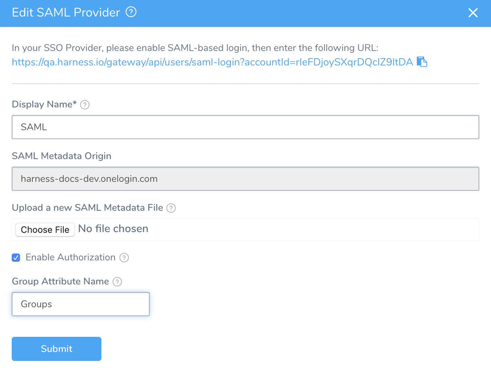

5. Click **Submit**. This returns you to the **Authentication Settings** page.  
Navigate to **Continuous Security** > **Access Management** > **User Groups**.
6. Select the User Group to sync.
7. On the Member Users card, select **Link to SSO Provider Group**.
8. In the resulting dialog, set the SSO Provider drop-down to **SAML**.
9. In **Group Name**, type or paste the name of the [Field Group](#group_parameters) you configured in OneLogin.
10. Click **SUBMIT.**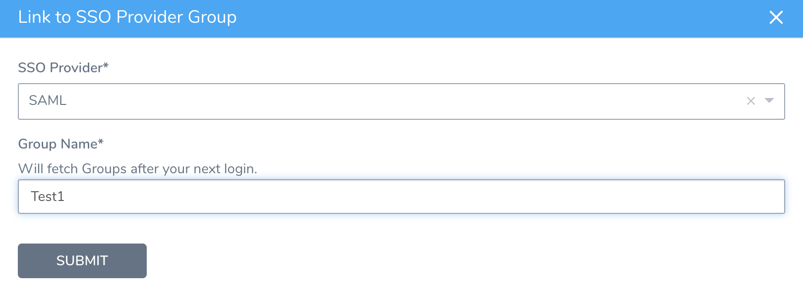
The link now appears on the User Group's **Member Users** record.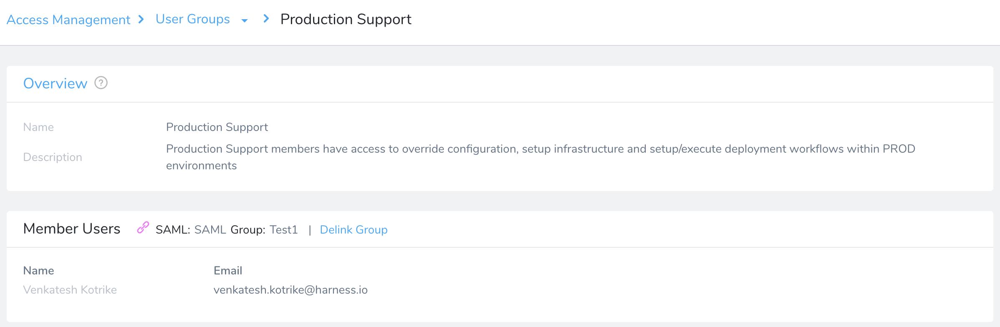

##### Test the Integration

After you've [synced](#sync_groups) Users between OneLogin and Harness, users will be assigned to the designated Harness User Group upon your *next* login to Harness. To test whether OneLogin authentication and authorization on Harness are fully functional:

1. Log out of Harness.
2. Log back into Harness.  
For an ideal test, use an Incognito browser window.
3. If you see a OneLogin prompt for credentials, this indicates that authentication is set up.  
  
Log in with the credentials you set up in OneLogin, and confirm that doing so logs you into your Harness account.
4. In Harness Manager, navigate to **Continuous Security** > **Access Management** > **User Groups**.
5. Click the Group you [synced](#sync_groups) earlier.
6. Verify that users from the synced OneLogin group should now appear within this Harness User Group. If so, this confirms successful authorization.

You cannot delete a SAML SSO Provider from Harness that is linked to a Harness Group. You must first remove the link to the SSO Provider from the Group.

### SAML SSO FAQs

Here's the list of common questions about Harness' SAML SSO.

**Which SAML binding methods/profiles does Harness support? (POST, Redirect, Artifact, and so on.)**

POST method is supported.

**Does Harness support signed SAML assertions?**

Yes.

**Does Harness support SSL for transit of the SAML exchange?**

Yes.

**Does Harness support encrypted SAML assertion queries/responses for handling sensitive data?**

No.

**Which SAML flows does Harness support? (For example, IDP initiated, SP initiated, or both)?**

Both IDP initiated and SP initiated flows are supported.

**Does Harness support any non-SAML SSO methods such as OpenID, OAuth, WS-Federation, HTTP get request header tokens, HTTP query string tokens?**

No. Harness does not support any of these mechanisms. Harness supports LDAP and integration is available for Google, Azure, Github, Gitlab, Linkedin, and Bitbucket.

**What user attributes does Harness application need?**

For authentication: Harness needs the email address.

If you want to set up authorization, you need to send the group information in the Assertion.

**What is the expected SAML name-id format of this attribute? Is any customization required?**


```
<md:NameIDFormat>  
urn:oasis:names:tc:SAML:1.1:nameid-format:emailAddress  
</md:NameIDFormat>
```
No customization is required.

#### SAML2.0 Questionnaire

**Does Harness support SAML 2.0 SSO?**

Yes.

**Does Harness support IdP-initiated Single Sign-on?**

Yes.

**Does Harness support SP-initiated Single Sign-on?**

Yes.

**Does Harness require SP-initiated Single Sign-on?**

No.

**Does Harness support SAML 2.0 HTTP-POST Bindings?**

Yes.

**Does Harness accept a digital signature with the SAML Assertion?**

Yes.

**Does Harness require that the signing certificate be an externally hosted and trusted Certificate Authority (CA)?**

No.

**Does Harness support encrypting the Assertion message?**

No.

**Does Harness require encrypting the Assertion message?**

No.

**Does Harness support Single Sign-OFF?**

No.

**Does Harness support simple URL redirection for Single Sign-OFF?**

No.

**Will Harness have a test/development environment accessible?**

No.

**Will Harness have a staging environment accessible?**

No.

**If Harness does have additional accessible environments (Yes on earlier two questions), will the environments still be available and supported after the production SSO configuration?**

NA

**Provide an IdP-initiated SAML assertion example for the vendor below.**


```
<?xml version="1.0" encoding="UTF-8"?>  
<saml2p:Response Destination="https://app.harness.io/gateway/api/users/saml-login?accountId=UtTa95tnQqWxGByLkXlp6Q"  
                 ID="id12449674142140840515360365"  
                 InResponseTo="z4de3af65-f858-4471-b9a3-6d4e92624f8c"  
                 IssueInstant="2020-08-03T16:41:31.327Z"  
   	             Version="2.0"  
                 xmlns:saml2p="urn:oasis:names:tc:SAML:2.0:protocol"  
                 xmlns:xs="http://www.w3.org/2001/XMLSchema">  
  <saml2:Issuer Format="urn:oasis:names:tc:SAML:2.0:nameid-format:entity"  
                xmlns:saml2="urn:oasis:names:tc:SAML:2.0:assertion">http://www.okta.com/exksvbhw6anv5pTpy0h7</saml2:Issuer>  
  
<ds:Signature xmlns:ds="http://www.w3.org/2000/09/xmldsig#">  
    <ds:SignedInfo>  
      <ds:CanonicalizationMethod Algorithm="http://www.w3.org/2001/10/xml-exc-c14n#" />  
      <ds:SignatureMethod Algorithm="http://www.w3.org/2001/04/xmldsig-more#rsa-sha256" />  
      <ds:Reference URI="#id12449674142140840515360365">  
        <ds:Transforms>  
          <ds:Transform Algorithm="http://www.w3.org/2000/09/xmldsig#enveloped-signature" />  
          <ds:Transform Algorithm="http://www.w3.org/2001/10/xml-exc-c14n#">  
            <ec:InclusiveNamespaces PrefixList="xs"  
                                    xmlns:ec="http://www.w3.org/2001/10/xml-exc-c14n#" />  
          </ds:Transform>  
        </ds:Transforms>  
  
        <ds:DigestMethod Algorithm="http://www.w3.org/2001/04/xmlenc#sha256" />  
        <ds:DigestValue>1gbNeG1uo2HkfpC11QT25aooQ5JQQvsJGax3BbldwO8=</ds:DigestValue>  
      </ds:Reference>  
    </ds:SignedInfo>  
    <ds:SignatureValue>  
<redacted></ds:SignatureValue>  
  
    <ds:KeyInfo>  
      <ds:X509Data>  
        <ds:X509Certificate>  
redacted          
</ds:X509Certificate>  
      </ds:X509Data>  
    </ds:KeyInfo>  
  </ds:Signature>  
  
  <saml2p:Status xmlns:saml2p="urn:oasis:names:tc:SAML:2.0:protocol">  
    <saml2p:StatusCode Value="urn:oasis:names:tc:SAML:2.0:status:Success" /></saml2p:Status>  
  
  <saml2:Assertion ID="id124496741422157271397253292"  
                   IssueInstant="2020-08-03T16:41:31.327Z"  
                   Version="2.0"  
                   xmlns:saml2="urn:oasis:names:tc:SAML:2.0:assertion"  
                   xmlns:xs="http://www.w3.org/2001/XMLSchema">  
  
    <saml2:Issuer Format="urn:oasis:names:tc:SAML:2.0:nameid-format:entity"  
                  xmlns:saml2="urn:oasis:names:tc:SAML:2.0:assertion">http://www.okta.com/exksvbhw6anv5pTpy0h7</saml2:Issuer>  
  
    <ds:Signature xmlns:ds="http://www.w3.org/2000/09/xmldsig#">  
      <ds:SignedInfo>  
        <ds:CanonicalizationMethod Algorithm="http://www.w3.org/2001/10/xml-exc-c14n#" />  
        <ds:SignatureMethod Algorithm="http://www.w3.org/2001/04/xmldsig-more#rsa-sha256" />  
        <ds:Reference URI="#id124496741422157271397253292">  
          <ds:Transforms>  
            <ds:Transform Algorithm="http://www.w3.org/2000/09/xmldsig#enveloped-signature" />  
            <ds:Transform Algorithm="http://www.w3.org/2001/10/xml-exc-c14n#">  
              <ec:InclusiveNamespaces PrefixList="xs"  
                                      xmlns:ec="http://www.w3.org/2001/10/xml-exc-c14n#" />  
  
            </ds:Transform>  
          </ds:Transforms>  
          <ds:DigestMethod Algorithm="http://www.w3.org/2001/04/xmlenc#sha256" />  
          <ds:DigestValue>redacted</ds:DigestValue>  
        </ds:Reference>  
      </ds:SignedInfo>  
      <ds:SignatureValue>  
redacted  
</ds:SignatureValue>  
  
      <ds:KeyInfo>  
        <ds:X509Data>  
          <ds:X509Certificate>  
</ds:X509Certificate>  
        </ds:X509Data>  
      </ds:KeyInfo>  
    </ds:Signature>  
  
    <saml2:Subject xmlns:saml2="urn:oasis:names:tc:SAML:2.0:assertion">  
      <saml2:NameID Format="urn:oasis:names:tc:SAML:1.1:nameid-format:unspecified">redacted</saml2:NameID>  
      <saml2:SubjectConfirmation Method="urn:oasis:names:tc:SAML:2.0:cm:bearer">  
        <saml2:SubjectConfirmationData InResponseTo="z4de3af65-f858-4471-b9a3-6d4e92624f8c"  
                                       NotOnOrAfter="2020-08-03T16:46:31.328Z"  
                                       Recipient="https://app.harness.io/gateway/api/users/saml-login?accountId=UtTa95tnQqWxGByLkXlp6Q" /></saml2:SubjectConfirmation>  
    </saml2:Subject>  
  
    <saml2:Conditions NotBefore="2020-08-03T16:36:31.328Z"  
                      NotOnOrAfter="2020-08-03T16:46:31.328Z"  
                      xmlns:saml2="urn:oasis:names:tc:SAML:2.0:assertion">  
  
      <saml2:AudienceRestriction>  
        <saml2:Audience>app.harness.io</saml2:Audience>  
      </saml2:AudienceRestriction>  
    </saml2:Conditions>  
  
    <saml2:AuthnStatement AuthnInstant="2020-08-03T16:41:31.327Z"  
                          SessionIndex="z4de3af65-f858-4471-b9a3-6d4e92624f8c"  
                          xmlns:saml2="urn:oasis:names:tc:SAML:2.0:assertion">  
  
      <saml2:AuthnContext>  
        <saml2:AuthnContextClassRef>urn:oasis:names:tc:SAML:2.0:ac:classes:PasswordProtectedTransport</saml2:AuthnContextClassRef>  
  
      </saml2:AuthnContext>  
    </saml2:AuthnStatement>  
  
    <saml2:AttributeStatement xmlns:saml2="urn:oasis:names:tc:SAML:2.0:assertion">  
      <saml2:Attribute Name="groups"  
                       NameFormat="urn:oasis:names:tc:SAML:2.0:attrname-format:basic">  
  
        <saml2:AttributeValue xmlns:xs="http://www.w3.org/2001/XMLSchema"  
                              xmlns:xsi="http://www.w3.org/2001/XMLSchema-instance"  
                              xsi:type="xs:string">redacted</saml2:AttributeValue>  
        <saml2:AttributeValue xmlns:xs="http://www.w3.org/2001/XMLSchema"  
                              xmlns:xsi="http://www.w3.org/2001/XMLSchema-instance"  
                              xsi:type="xs:string">redacted</saml2:AttributeValue>  
  
      </saml2:Attribute>  
    </saml2:AttributeStatement>  
  </saml2:Assertion>  
</saml2p:Response>
```
**Provide an SP-initiated SAML assertion example for the vendor below.**


```
<?xml version="1.0" encoding="UTF-8"?>  
<saml2p:AuthnRequest AssertionConsumerServiceURL="https://dev-274703.oktapreview.com/app/harnessiodev274703_admin_1/exksvbhw6anv5pTpy0h7/sso/saml" ID="zc89e6fa4-96b9-4149-91e8-0e026d318116"   
IssueInstant="2020-08-27T16:54:30.976Z"   
ProtocolBinding="urn:oasis:names:tc:SAML:2.0:bindings:HTTP-POST" Version="2.0"   
xmlns:saml2p="urn:oasis:names:tc:SAML:2.0:protocol">  
<saml2:Issuer xmlns:saml2="urn:oasis:names:tc:SAML:2.0:assertion">app.harness.io  
</saml2:Issuer>  
<saml2p:NameIDPolicy Format="urn:oasis:names:tc:SAML:1.1:nameid-format:unspecified"/></saml2p:AuthnRequest>
```
#### SAML Attributes Questionnaire

**What attribute will be used as the Unique Identifier (Name ID) for the SAML assertion? (options are KXI, EMAIL, KASH, or CALCULATED)**

Email.

**If CALCULATED for the previous question, describe how the entity ID will be created.**

NA

**What additional SiteMinder headers will need to be used or included with the SAML assertion?**

None.

**Will there be any calculated attributes that will be used in the SAML assertion?**

Yes.

**If Yes for the previous question, describe what attributes will be calculated and how.**

Group Attribute and Group Claims

#### Provisioning Questionnaire

**Can Harness support using JIT provisioning?**

No.

**If Yes for the previous question, can Harness support automatic de-provisioning with user inactivity?**

NA

**Can Harness support using a flat-file provisioning method?**

No.

**Can Harness support using an API Service provisioning method?**

No.

**Briefly describe how the provisioning process will operate.**

SCIM.

**Briefly describe how the DE-provisioning process will operate.**

SCIM.

### Ping Identity

When setting up SAML SSO using Ping Identity ( [PingFederate](https://docs.pingidentity.com/)), the metadata file has the following requirements:

* AuthnRequest flag is turned off in your metadata.
* Your metadata contains tags:


```
<SingleSignOnService Binding="urn:oasis:names:tc:SAML:2.0:bindings:HTTP-Redirect" Location="location"/>  
  
<SingleSignOnService Binding="urn:oasis:names:tc:SAML:2.0:bindings:HTTP-POST" Location="location"/>
```

Go to the following docs from PingFederate:

* [Metadata export](https://docs.pingidentity.com/bundle/pingfederate-100/page/bdx1564002975039.html)
* [Exporting SAML metadata from PingFederate](https://docs.pingidentity.com/bundle/integrations/page/dit1563994989559.html)

### Harness Local Login

To prevent lockouts or in the event of OAuth downtime, a User in the Harness Administrators Group can use the [**Local Login**](https://app.harness.io/auth/#/local-login) URL (https://app.harness.io/auth/#/local-login) to log in and update the OAuth settings.


1. Log in using **Harness Local Login**.
2. Change the settings to enable users to log in.

### Notes

* For **Okta**, please use the Okta Administrator **Classic UI** Dashboard to add an application and configure SAML settings. For more information, go to [Setting Up a SAML Application in Okta](https://developer.okta.com/standards/SAML/setting_up_a_saml_application_in_okta).
* To migrate from Okta SAML to Okta SCIM integration with Harness, go to [Migrating to Okta SCIM from Okta SAML](scim-okta.md#migrating-to-okta-scim-from-okta-saml).

