Harness supports Single Sign-On (SSO) with LDAP implementations, including Active Directory and OpenLDAP. Integrating Harness with your LDAP directory enables you to log your LDAP users into Harness as part of Harness' SSO infrastructure.

Once you integrate your Harness account with LDAP, you can create a Harness User Group and sync it with your LDAP directory users and groups. Then the users in your LDAP directory can log into Harness using their LDAP emails and passwords.

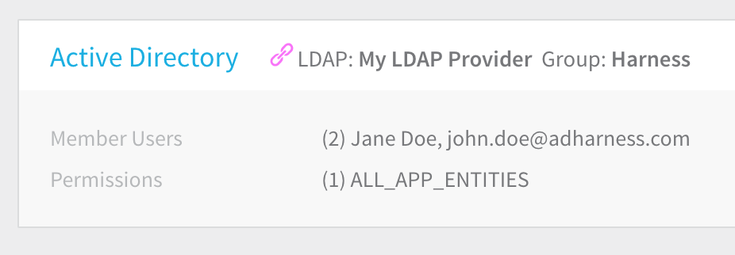


### Video Demonstration

* [Sync](sso-ldap.md#log-in-using-synched-user)

For a quick run through the Harness LDAP SSO functionality, watch the following video.

<docvideo src="https://fast.wistia.net/embed/iframe/3uhtxudd4q" />

### Limitations

* Nested LDAP groups are not supported.

### Before You Begin

* [Authentication Settings](authentication-settings.md) provides an overview of Harness' broader login-management options.

### Setup Overview

Here are the steps for setting up Harness SSO with LDAP:

1. Add LDAP as a SSO Provider in Harness. This step involves authenticating with your LDAP server and defining how Harness will query it for users and groups.
2. Add a Harness administrator using a user from your LDAP directory. This administrator will manage your LDAP-linked Harness user groups.
3. Add a Harness User Group and link it to your LDAP directory. Harness syncs all the users in that LDAP user group automatically and manages user authorization.
4. ​Enable the LDAP Provider you set up in Harness as the Harness SSO provider. Simply click the **Enable** button next to your new LDAP SSO provider in Harness.
5. To verify the LDAP SSO, log into Harness using one of the synchronized LDAP users.

Users provisioned with LDAP are sent an email invitation to log into Harness. They must use the invitation to log in. If SAML is also set up with Harness, then can log in via SAML. See [Single Sign-On (SSO) with SAML](single-sign-on-sso-with-saml.md).

#### Harness Local Login

To prevent lockouts or in the event of OAuth downtime, a User in the Harness Administrators Group or with **Administer Other Account Functions** permissions can use the [**Local Login**](http://app.harness.io/auth/#/local-login) URL (http://app.harness.io/auth/#/local-login) to log in and update the OAuth settings.


1. Log in using **Harness Local Login**.
2. Change the settings to enable users to log in.

### Ports and Permissions

The following ports and permissions are required to add LDAP as a Harness SSO provider.

#### Ports

The Harness LDAP connection is between the Harness delegate and your LDAP server. The delegate uses the following ports:

* HTTPS: 443.
* LDAP without SSL: 389.
* Secure LDAP (LDAPS): 636. By default, LDAP traffic is transmitted unsecured. For Windows Active Directory, you can make LDAP traffic confidential and secure by using SSL/TLS. You can enable LDAP over SSL by installing a certificate from a Microsoft certification authority (CA) or a non-Microsoft CA.

#### Permissions

Authentication with an LDAP server is called the Bind operation. The Bind operation exchanges authentication information between the LDAP client (Harness delegate) and your LDAP server. The security-related semantics of this operation are in RFC4513.

When you configure Harness with LDAP, you will enter a Bind DN (distinguished name) for the LDAP directory user account used to authenticate.

The specific permissions needed by Harness depend on the LDAP directory service you are using.

* **Windows Active Directory:** By default, all Active Directory users in the **Authenticated Users** group have Read permissions to the entire Active Directory infrastructure. If you have limited this, ensure that the account used to connect Harness may enumerate the Active Directory LDAP users and groups by assigning it **Read MemberOf** rights to **User** objects. Changing the default is not a trivial task and requires you to change the basic authorization settings of your Active Directory. For more information, see [Configure User Access Control and Permissions](https://docs.microsoft.com/en-us/windows-server/manage/windows-admin-center/configure/user-access-control) from Microsoft.
* **OpenLDAP:** The default access control policy is allow read by all clients. If you change this default, ensure that the account used to connect Harness to OpenLDAP is granted the **Authenticated users** entity. For more information, see [Access Control](https://www.openldap.org/doc/admin24/access-control.html) from OpenLDAP.

### Add LDAP SSO Provider

Adding your LDAP Provider to Harness initially involves establishing a connection from Harness (specifically, the Harness delegate) and querying your LDAP directory for the users and groups you want to sync with Harness for SSO.

#### Querying Your LDAP Directory

If you need to query your LDAP server before or during the Harness LDAP SSO setup, use the **ldapsearch** CLI tool (Linux/Mac), [LDAP Admin](http://www.ldapadmin.org/) (Windows), the **dsquery** CLI tool (Windows), **Active Directory Users and Computers** (Windows), or [Windows PowerShell](https://docs.microsoft.com/en-us/previous-versions/windows/it-pro/windows-server-2008-R2-and-2008/ee617195(v=technet.10)).

For example, the following ldapsearch will query an Active Directory LDAP directory running on a AWS EC2 instance and return LDAP Data Interchange Format (LDIF) output, which you can pipe to a file if needed:


```
ldapsearch -h example.com -p 389 -x -b "DC=example,DC=com"
```
The output will include the distinguished names, objectClass, and canonical names for the objects in the LDAP directory.

The same query using dsquery to query Active Directory is:


```
dsquery * -limit 0 >>all-objects.txt
```
To query for all users using dsquery:


```
dsquery * -limit 0 -filter "&(objectClass=User)(objectCategory=Person)" -attr * >>all-users.txt
```
#### Enabling LDAP for Harness SSO

To add your LDAP directory as a Harness SSO provider, use the following procedure.

Once LDAP is set up and enabled in Harness, you cannot add a second LDAP SSO entry in Harness. The UI for adding LDAP will be disabled.

1. Log into **Harness**, mouseover **Continuous Security**, and then click **Access Management**.

   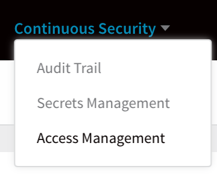

2. From the resulting **Access Management** page, click **Authentication Settings**.

   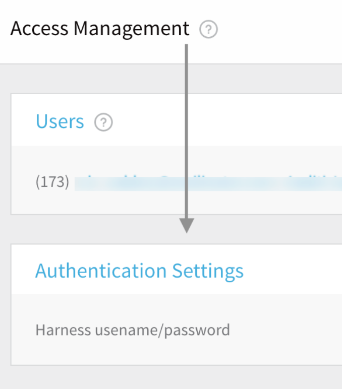

3. From the **Authentication Settings** page, click **Add SSO Providers**, then click **LDAP**.

   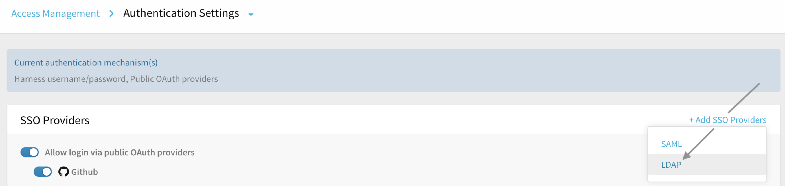

4. If prompted, disable the **Allow login via public OAuth providers** slider.

   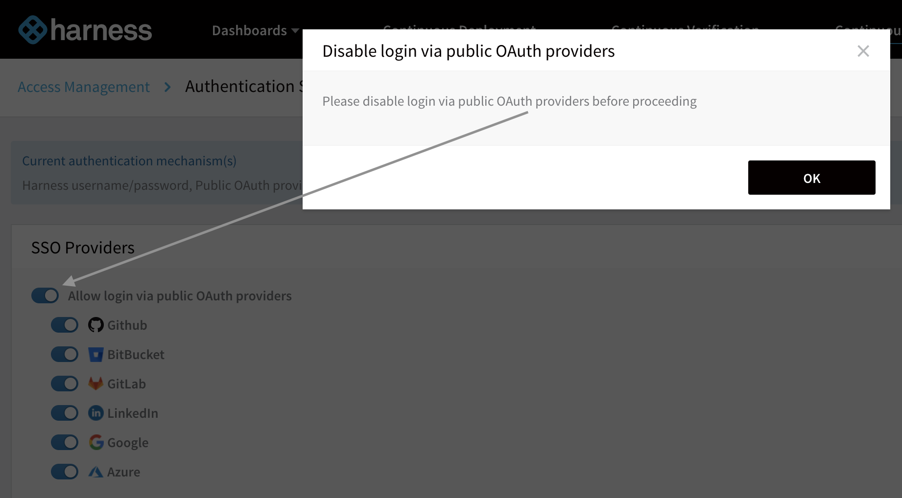

   Then again select **Add SSO Providers > LDAP**. The **Add** **LDAP Provider** dialog appears.
	 
	 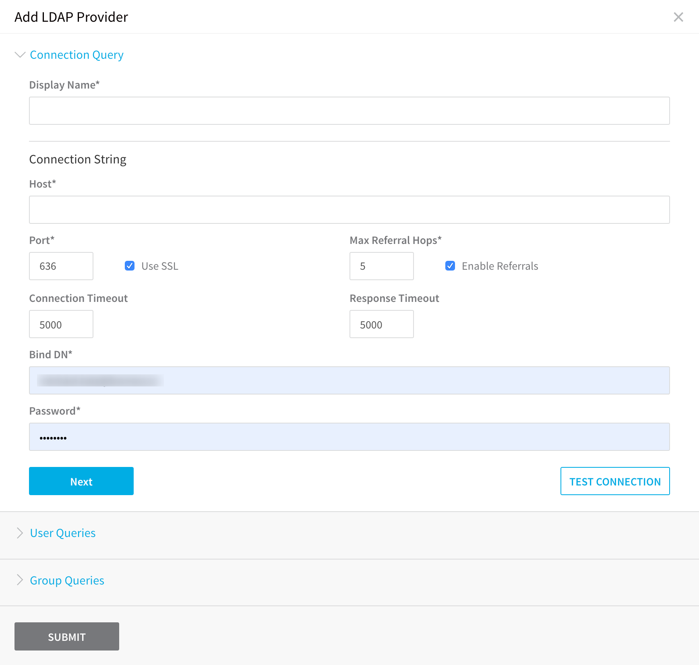

	In this **Add** **LDAP Provider** dialog, you will authenticate with your LDAP server, and then perform user and group LDAP queries to ensure that Harness can sync your LDAP users and groups when you enable LDAP SSO.

5. Configure the **Connection Query**.  

		The **Connection Query** section has the following fields and settings.

		|  |  |
		| --- | --- |
		| **Field** | **Description** |
		| **Display Name** | Enter a name for the LDAP SSO provider in Harness. |
		| **Host** | Enter the hostname for the LDAP server. Harness uses DNS to resolve the hostname. You can also use the public IP address of the host. |
		| **Port** | Enter 389 for standard LDAP. If you want to connect over Secure LDAP (LDAPS), use port 636, and enable the **Use SSL** setting. |
		| **Use SSL** | Enable this setting if you entered port 636 in **Port** and are connecting over Secure LDAP (LDAPS). |
		| **Max Referral Hops** | If you have referrals configured for your LDAP authentication, select the adjacent **Enable Referrals** check box and enter the number of referrals here. For information on LDAP referrals, see [Referral](https://tools.ietf.org/html/rfc4511#section-4.1.10) in RFC 4511 or [Referrals](https://docs.microsoft.com/en-us/windows/desktop/ad/referrals) from Microsoft. |
		| **Connection Timeout** | Enter the number of milliseconds to wait for an LDAP connection before timing out. For example, `5000` is equal to 5 seconds. |
		| **Recursive Membership Search** | Enable/disable nested LDAP queries to optimize LDAP Group Sync performance. If you uncheck the **Recursive Membership Search** setting Harness will not run nested LDAP query and only do a flat group search. |
		| **Response Timeout** | Enter the number of milliseconds to wait for an LDAP response before timing out. For example, `5000` is equal to 5 seconds. |
		| **Bind DN** | The distinguished name of the directory object used for the Bind operation. The Bind operation is the authentication exchange between Harness and the LDAP server. Typically, this is the user object for the administrator. For example:**cn=Administrator,CN=Users,DC=example,DC=com**This user will be used for all LDAP queries performed by Harness. |
		| **Password** | The password to log into the LDAP host. This is the password associated with the user identified in **Bind DN**. |

5. When you have filled in the **Connection Query**, click **TEST CONNECTION**. You are notified when the connection is successful. 
	  
	 If the test is unsuccessful, please see [Troubleshooting](#troubleshooting).
	 
6. Click **Next**.
	 
7. Configure the **User Queries**. The **User Queries** section is used to search the LDAP directory for users that Harness will add as Harness users. When you set the **User Queries** here, you are setting the scope within which any searches for LDAP users will be performed by Harness. Later, when LDAP SSO is enabled, the settings is the **User Queries** section will be used to search for any user logging into Harness.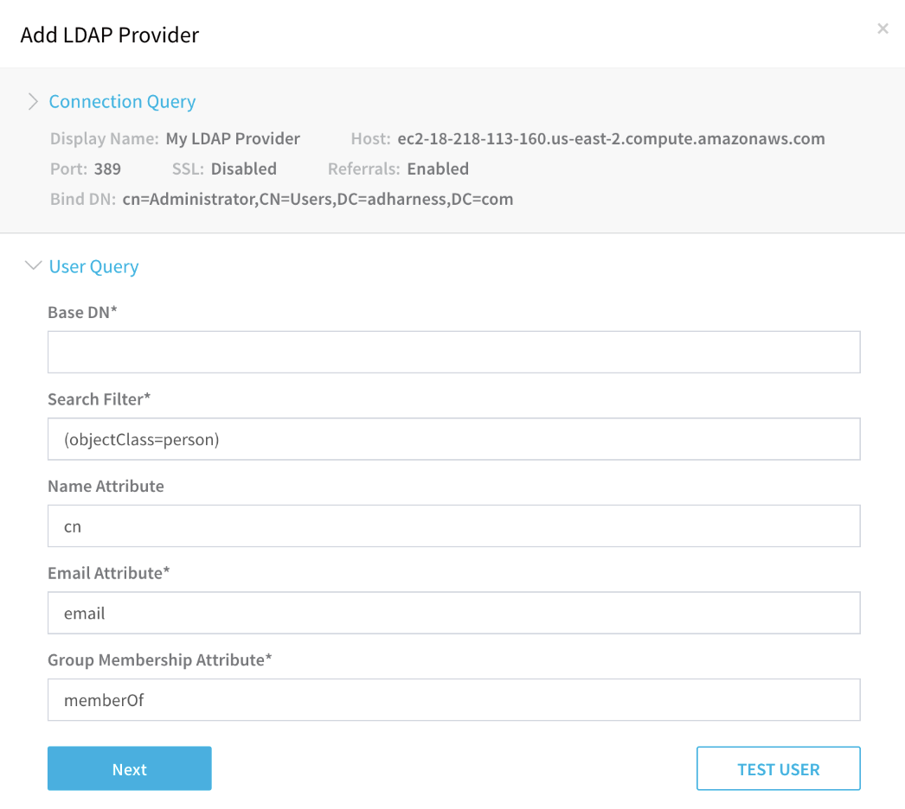

	The **User Queries** section has the following fields and settings.

	|  |  |
	| --- | --- |
	| **Field** | **Description** |
	| **Base DN** | Enter the relative distinguished name (RDN) for the Users object in the directory.If you are logged into the Active Directory server, you can enter **dsquery user** at the command line and you will see a distinguished name for a user object, such as:**CN=John Doe,CN=Users,DC=mycompany,DC=com**The **Base DN** is the relative distinguished name (RDN) following the user common name (CN). Typically, this is the Base DN you should enter:**CN=Users,DC=mycompany,DC=com**Once you have the Base DN, you can ensure that it provides all of the attributes for your LDAP users with the **dsquery** command piped to **dsget user**:**dsquery user dc=mycompany,dc=com | dsget user -samid -fn -ln -dn**The result will include all of the users and help you with setting up your query. |
	| **Search Filter** | The filter defines the conditions that must be fulfilled for the LDAP search using the entry in **Base DN**. Enter the search filter for the attribute to use when looking for users belonging to the **Base DN**. Typically, **Search Filter** is either:**(objectClass=user)** or **(objectClass=person)**In dsquery, if the command **dsquery \* -filter "(objectClass=user)"** returns the LDAP users then **(objectClass=user)** is the correct filter. |
	| **Name Attribute** | Enter the common name attribute for the users in your LDAP directory. Typically, this is **cn**. To list all attributes for a user, enter the following dsquery:**dsquery \* "CN=users,DC=mycompany,DC=com" -filter "(samaccountname=*****user\_name*****)" -attr \*** |
	| **Email Attribute** | Enter the LDAP user attribute that contains the users' email address. Harness uses email addresses to identify users. Typically, the attribute name is **userPrincipalName** (most common), **email** or **mail**. |
	| **Group Membership Attribute** | Enter **memberOf** to return a list of all of the groups of which each user is a member. The dsquery for all groups the user John Doe (john.doe) is a member of would be:**dsquery user -samid john.doe | dsget user -memberof | dsget group -samid** |

8. When you have filled in the **User Queries**, click **TEST USER**. You are notified when the search is successful.

9. Click **Next**.

10. Configure the **Group Query**. The **Group Query** section is used to search the LDAP directory for user groups that Harness will sync with to create Harness user groups. When you set the **Group Query** here, you are setting the scope wherein any searches for LDAP groups will be performed.

   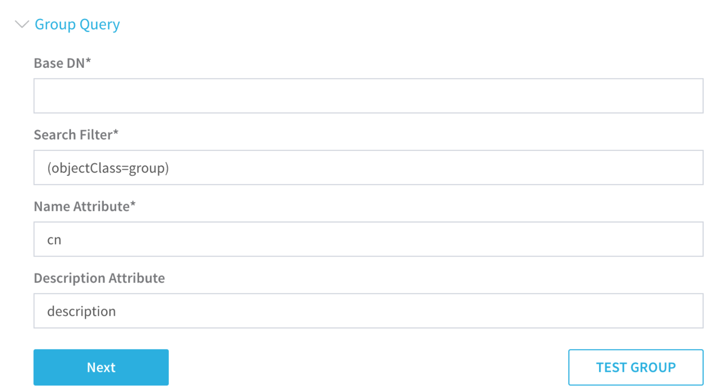

	The **Group Query** section has the following fields.  

	|  |  |
	| --- | --- |
	| **Field** | **Description** |
	| **Base DN** | Enter the distinguished name of the LDAP group you want to add. This should be the LDAP group containing the users you searched for in **User Queries**. To see a list of all the groups in your LDAP directory, use this dsquery command:**dsquery group -o dn DC=mycompany,DC=com**To ensure that the group contains the members you want, use the dsget command:**dsget group "CN=*****Group\_Name*****,CN=Users,DC=mycompnay,DC=com" -members | dsget user -samid -upn -desc**Typically, you will want to pick the Users group that gives future searches for groups a wide scope. For example:**CN=Users,DC=mycompany,DC=com**Later, when you search for LDAP groups as part of adding group members to Harness, your search will be performed within the scope of the group you set in **Base DN**. |
	| **Search Filter** | Enter **(objectClass=group)** because you are searching for an LDAP group. |
	| **Name Attribute** | Enter **cn** for the name attribute. |
	| **Description Attribute** | Enter **description** to sync the LDAP group description. To see the description in your LDAP directory, use dsquery:**dsquery \* -Filter "(objectCategory=group)" -attr sAMAccountName description** |


11. When you have filled in the **Group Query**, click **TEST GROUP**. You are notified when the search is successful.

12. Click **SUBMIT**. The new **LDAP Provider** is listed in the SSO Providers.  
    Before you enable LDAP SSO for Harness, you will create a Harness Administrator using a user from your LDAP directory, and add the users from an LDAP group to a Harness user group.

### Schedule LDAP Group Sync

Currently, this feature is behind the Feature Flag `LDAP_GROUP_SYNC_JOB_ITERATOR`. Contact [Harness Support](mailto:support@harness.io) to enable the feature.By default, Harness syncs with your server every 15 minutes. If your LDAP server is slow in responding to queries it can cause a ripple effect on other systems.

The **Schedule LDAP Group Sync** setting provides scheduling using a Cron expression. This allows you to run the sync outside of business hours when your LDAP server is less likely to be under heavy load.

In **Cron Expression**, enter the schedule for the sync as a Cron expression.

For example, `0 0 5 ? * * *` will result in `At 05:00:00am every day`.

You can find [Cron expression editors online](https://www.freeformatter.com/cron-expression-generator-quartz.html).

Click **Execution Time**.

The first 5 iterations appear as a sample.


```
Iteration 1 : 2021-09-24T02:00:00-07:00  
  
Iteration 2 : 2021-09-25T02:00:00-07:00  
  
Iteration 3 : 2021-09-26T02:00:00-07:00  
  
Iteration 4 : 2021-09-27T02:00:00-07:00  
  
Iteration 5 : 2021-09-28T02:00:00-07:00
```
### Add a Harness Admin for LDAP Users

Before LDAP SSO is enabled for Harness, create a Harness administrator for the LDAP users you will be adding. The new administrator is defined using a specific LDAP user's email address. For example, a **User logon name** and **Active Directory domain name**: john.doe@mycompany.com.

At least one LDAP user account should be a member of the Harness Administrators group, or have full **Account Permissions**. This will ensure that you can fully manage Harness once you enable LDAP SSO in Harness.To create a Harness administrator for your LDAP users, do the following:

1. In **Harness**, mouseover **Continuous Security**, and click **Access Management**.
2. Click **Users**.
3. Click **Add User**. The **Add User** dialog appears.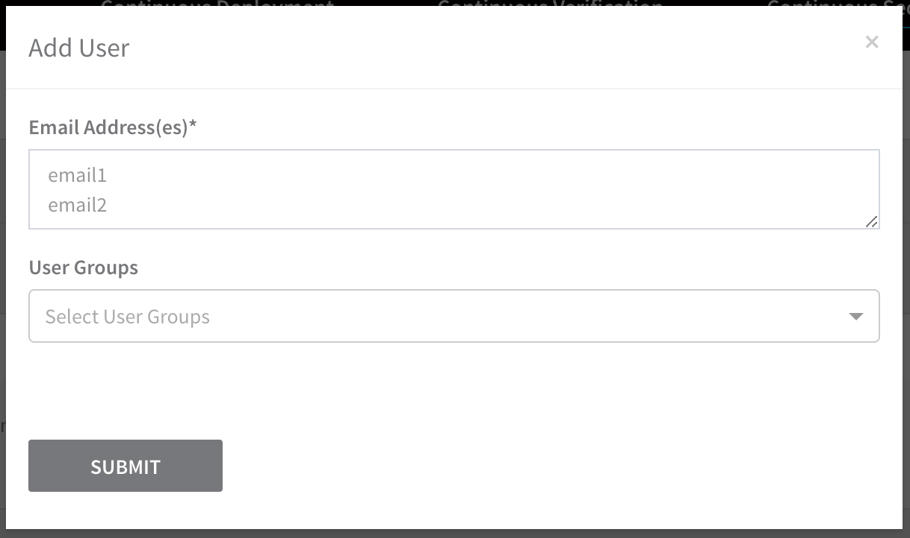

4. In **Email Address(es)**, enter the email address of a user from the LDAP user group you plan to sync with Harness. For Active Directory, this is the email address in the **Account** tab for the user, under **User logon name**.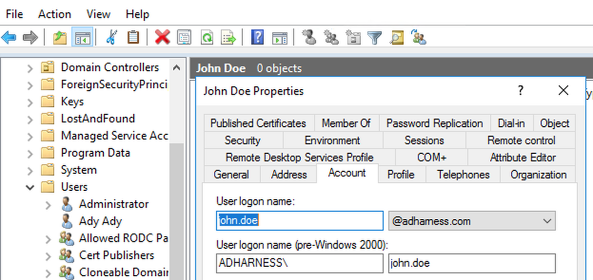

5. In the **Add User** dialog, click **User Groups**, and select **Account Administrator**.

6. Click **SUBMIT**. An email will be sent to the email address you entered, inviting you to log into Harness and create a password. You do not need to use the email because later, once you have enabled LDAP SSO in Harness, you can use the email and password from Active Directory.
7. **Do not log out of Harness**. Later, after you have added LDAP users to Harness, you can log out and back in with the LDAP email address and the password you use for your LDAP directory.  
Now you can add a new Harness user group for your LDAP users and sync it with your LDAP provider.


### Add a Harness User Group with LDAP Users

After you have configured an LDAP SSO Provider for Harness, you can create a Harness user group and sync it to your LDAP directory. Do not configure SSO with the default Harness user group **Account Administrator**. Harness uses its connection to the LDAP provider to verify email addresses and passwords when LDAP SSO is enabled in Harness.```

Harness treats LDAP group names as case-sensitive. QA, Qa, qA, will all create new groups.

If there are duplicate names synced with Harness, Harness adds an `_1` suffix.

Users added to the LDAP-linked Harness User Group are also added as Harness Users. If the Harness User Group is removed, the User account remains, and when the User logs into Harness, its email address and password are verified by the LDAP provider. The User can also be added to any other Harness User Group.

Harness syncs with the LDAP server every 15 minutes. Consequently, if a user is removed from the LDAP server, it will take up to 15 minutes before the user is removed from Harness User Group automatically. You must remove the corresponding Harness User account separately. Look for users with **user not registered** in their **Name** column or **None** in their **User Groups** column.To sync your LDAP users with a Harness user group, do the following:

1. In **Harness**, mouseover **Continuous Security**, and click **Access Management**.
2. Click **User Groups**.
3. Click **Add User Group**. The **Add User Group** dialog appears.

   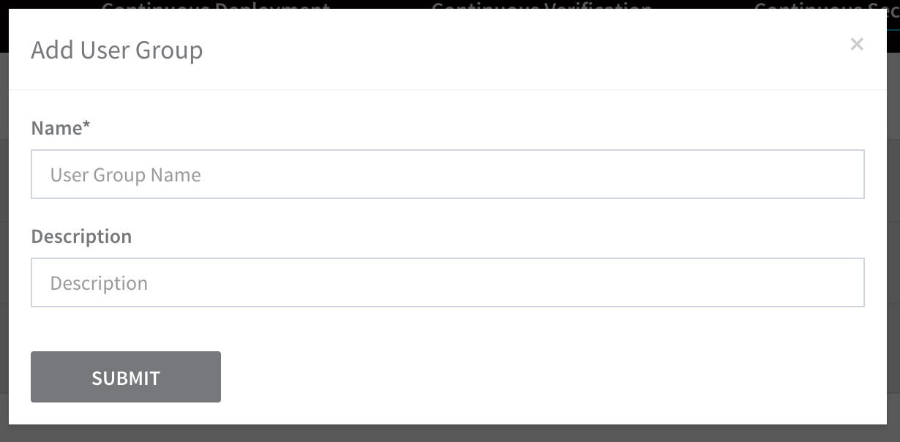

4. In **Name**, enter a name for your LDAP users, such as **Active Directory**.

5. Click **SUBMIT**. The new group page appears.

6. In **Member Users**, click **Link to External Directory**. The **Link External LDAP Group** dialog appears. You will use this dialog to query the LDAP Provider you added to Harness for the LDAP users to add to this Harness user group.

7. In **LDAP Group Search Query**, enter the common name of the LDAP user group, such as **Harness**, and click **SEARCH**. The search results display matching groups.
  
   Remember, the scope of the LDAP group search in the **Link External LDAP Group** dialog is limited by the **Connection**, **User**, and **Group Query** search you defined in your **LDAP Provide**r in Harness:
	 
	 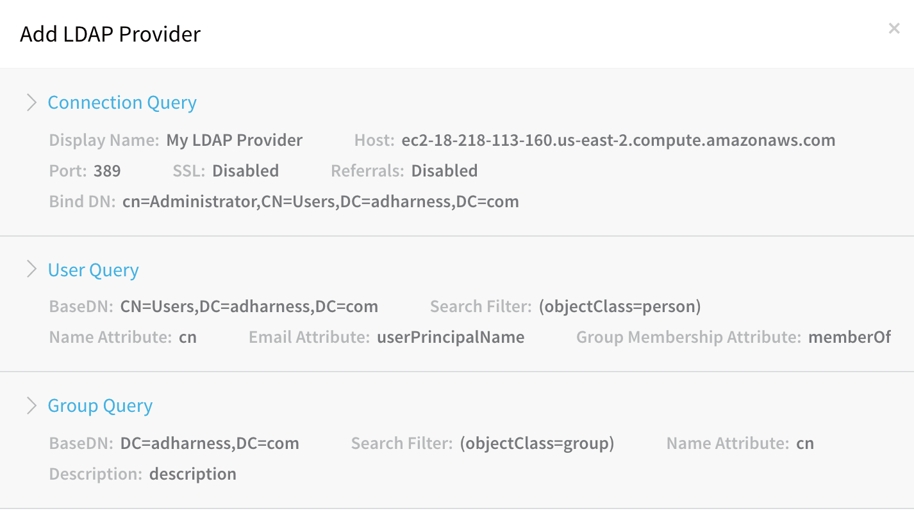
	 
    The search results in the **Link External LDAP Group** dialog display the groups that fall within the scope of the queries you defined in your LDAP Provider **and** match the name you enter. For example, here are the search results for the LDAP user group named **Harness**. You can see that the group in Active Directory and in the **Link External LDAP Group** dialog search results has two members.

	 |  |
	 | --- |
	 | **Group in Active Directory** |
	 | 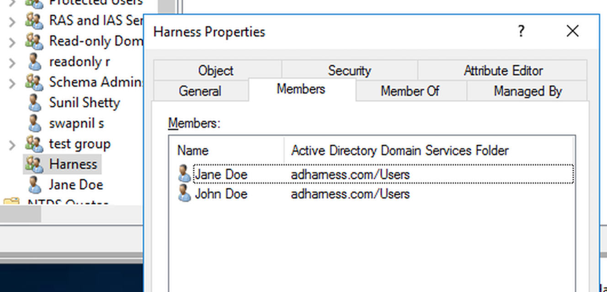 |
	 | **Search Results in Harness** |
	 | 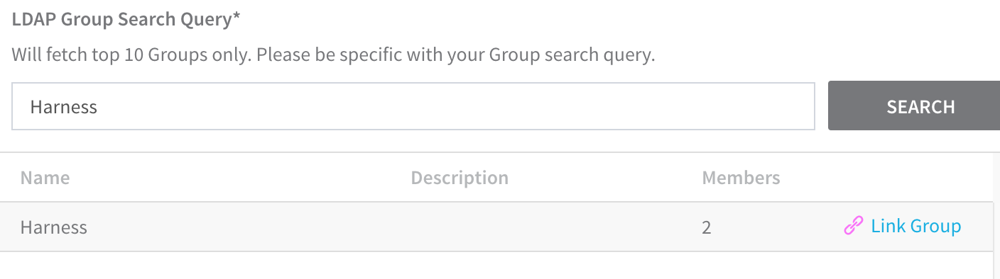 |

8. For the group you want to sync, click **Link Group**. The group is linked and the dialog closes. The **Member Users** section of the Harness group page displays the new link.

   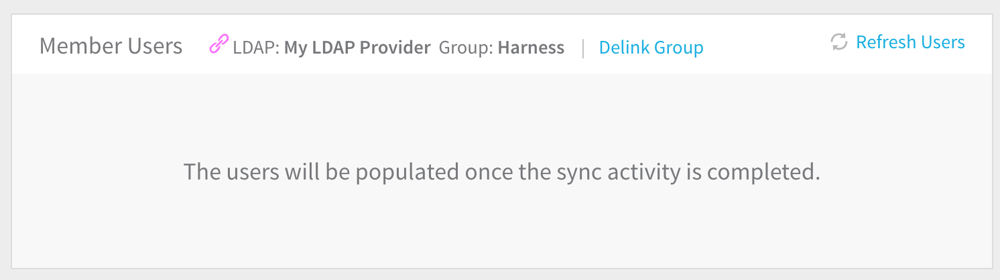
	 
   It will take a few minutes to sync the LDAP group users with the Harness group. Harness syncs with the LDAP server every 10 minutes. If you add users in your LDAP directory you will not see it immediately in Harness. Once Harness syncs with your LDAP directory, the users are added to the Harness group.

  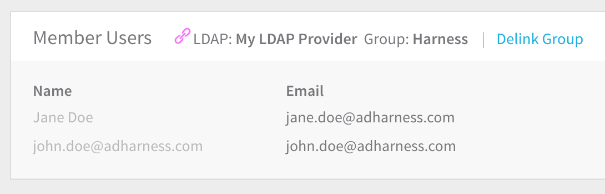

9. Set any **Account Permissions** and **Application Permissions** for the user group. Without **Account Permissions** configured, the users will not be able to perform operations in Harness. For more information, see [Users and Permissions](users-and-permissions.md#permissions).

:::note 
LDAP users that do not have the user attribute for email are not displayed because Harness uses email addresses as the user login.Now that you have a Harness user group containing your LDAP users, you can safely enable LDAP SSO in Harness.
:::

### Enable LDAP for SSO

You can enable the LDAP SSO Provider you configured in Harness and begin using LDAP as the login method for Harness users.

Before you enable LDAP for SSO and log out of Harness to test it, ensure that your LDAP users have the passwords associated with their email addresses. If they do not have the passwords, they will be locked out of Harness. Remember, Active Directory passwords are stored using non-reversible encryption.You can also add a new user to your LDAP group, record its password, wait 15 minutes for the corresponding Harness group to refresh, and then log into Harness using the new user. If any lockout problem occurs, contact Harness Support at [support@harness.io](mailto:support@harness.io).To enable the LDAP Provider, do the following:

1. In Harness, mouseover **Continuous Security**, and then click **Access Management**.
2. Click **SSO Provider Setup** to view the LDAP Provider.
3. Click the checkbox under **Enabled**. A confirmation dialog appears.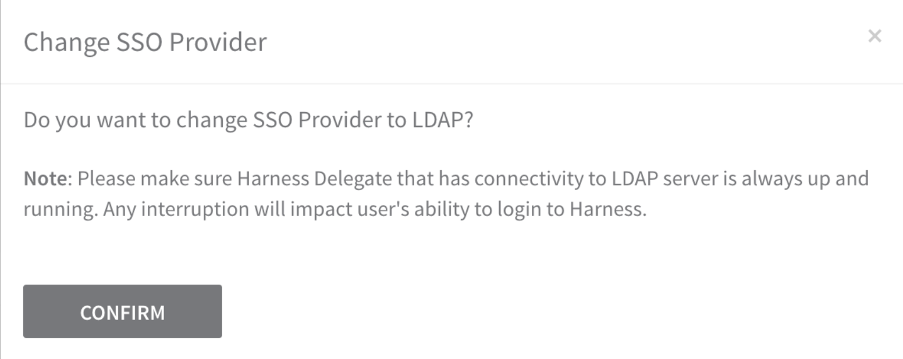
The confirmation dialog reminds you to ensure the Harness Delegate can connect to the LDAP server, and both are up and running. Any interruption in the connection will impact users' ability to log in to Harness.If you want to confirm the Harness delegate can connect and query the LDAP Provider, then close this dialog, open the LDAP Provider you configured in **Access Management**, and use the **TEST QUERY**, **TEST USER**, and **TEST GROUP** buttons in the **LDAP Provider** settings to verify connectivity and queries.
4. Click **CONFIRM**. The LDAP SSO Provider is enabled.


### Log In Using Synched User

Users provisioned with LDAP are sent an email invitation to log into Harness. They must use the invitation to log in. If SAML is also set up with Harness, then can log in via SAML. See [Single Sign-On (SSO) with SAML](single-sign-on-sso-with-saml.md).With a Harness user group synced with a LDAP group and LDAP SSO enabled, you can now log into Harness using LDAP users from the LDAP group.

To log into Harness using an LDAP user, do the following:

1. Select which user you want to test from the Harness user group you synched with your LDAP provider. If necessary, create a new user in your LDAP group, and, in Harness, refresh your user group with the LDAP provider to add that user to Harness.
2. If you are logged into Harness, log out.
3. Log into Harness using the email address and password for a user in your LDAP group. If you encounter errors, see [Troubleshooting](#troubleshooting).

### Delink a User Group from LDAP

In you want to remove the external link between a Harness user group and your LDAP provider, you can delink the Harness user group.

Delinking a User does not remove the User from Harness. It removes them from the LDAP-linked User Group. To removes the User, go to the **Users** page, find the individual User account, and delete the User.To delink a Harness user group from its linked LDAP provider, do the following:

1. In Harness, mouseover **Continuous Security**, and click **Access Management**.
2. Click **User Groups**.
3. Click the user group that is linked to the LDAP provider. The linked user groups are identified using a link icon, the LDAP Provider you set up in Harness, and the synched LDAP user group.

   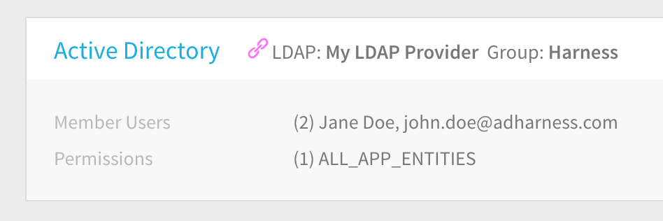
	 
4. Click the name of the user group to open its settings.

5. Click **Delink Group** to remove the link to the LDAP provider.

   
  
	 You are prompted to confirm.
	 
	 

6. Click **Retain all members in the user group** to keep the users in this Harness user group. If LDAP SSO is enabled in Harness, the users can still log into Harness. If LDAP SSO is disabled, then the user cannot log into Harness.

7. Click **CONFIRM**.

### LDAP-linked Users Locked Out of Harness

If any lockout problem occurs, contact Harness Support at [support@harness.io](mailto:support@harness.io). Harness SaaS and On-Prem admins can use **Local Login**, described below.If you have LDAP SSO enabled, the users and groups that the LDAP Provider in Harness can locate should be able to log into Harness. If login is not working, then it is likely due to one of the following causes:

* Harness cannot locate the user in the LDAP directory configured as its LDAP Provider.
* LDAP server cannot be reached by the Harness Delegate. See [Connection Query Error](sso-ldap.md#connection-query-error) below.
* LDAP SSO is disabled.
* LDAP SSO has been changed (for example, a password in LDAP) and Harness cannot locate or authenticate the user in the LDAP provider.
* LDAP directory (attributes, users, groups, membership, etc) has changed and Harness cannot locate the user in the LDAP provider according to the settings in its **LDAP Provider**.

#### Solutions

* If LDAP SSO is disabled, enable it.
* Locate the user(s) in your LDAP directory and then change the configuration of the LDAP Provider to find the user. Obtain the user(s)' base distinguished name and use that in the **User Queries** of the **LDAP Provider** configuration.
* Determine which LDAP setting has changed in your corporate LDAP directory configuration and update the LDAP settings in Harness. For example, if the Base DN password changed in your corporate LDAP configuration, update the Password in the Harness LDAP settings:

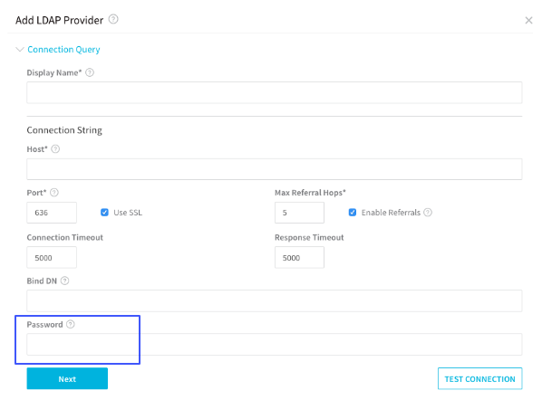
If you need to update a password in both Harness and your LDAP directory, update the password in Harness first, and then update it in your LDAP directory. For example:


```
dsquery user "OU=users,DC=example,DC=local" -limit 0 | dsmod user -pwd <new_password> -mustchpwd yes
```
This ensures that you can log into Harness once your LDAP directory password is updated. Harness syncs with your LDAP server every 15 minutes.

#### Harness Local Login

To prevent lockouts or in the event of OAuth downtime, a User in the Harness Administrators Group can use the [**Local Login**](http://app.harness.io/auth/#/local-login) URL (http://app.harness.io/auth/#/local-login) to log in and update the OAuth settings.


1. Log in using **Harness Local Login**.
2. Change the settings to enable users to log in.

### Troubleshooting

The following errors might occur during the set up or use of LDAP SSO.

#### Connection Query Error

When setting up the LDAP Provider and attempting the **Connection Query**, the following message appears.


```
Invalid request: No delegates could reach the resource.
```
Here is how the error appears in the LDAP Provider dialog.

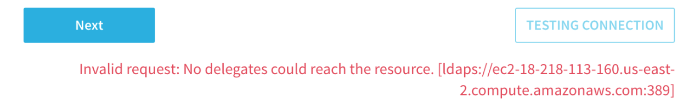
##### Cause

This can occur if the Harness delegate is unable to connect to the LDAP server.

##### Solution

* Ensure the delegate is running. In **Harness**, click **Setup**, click **Harness Delegates**, and then verify that the delegate is running. For more information, see [Delegate Installation](../../account/manage-delegates/delegate-installation.md).
* Ensure that the delegate can connect to the LDAP server from its network location. If the delegate is running in a VPC, ensure that it a has outbound HTTPS and LDAP connections over ports 443 and 389.
* Ensure the password in the **Connection Query** is correct.
* Try to connect with SSL disabled. You might not have SSL configured on your LDAP server.
* The delegate attempts to resolve the hostname of the LDAP server using DNS. Ensure that the LDAP server host name can be resolved in DNS using **nslookup** and ping its IP address.

#### User Query Error

When attempting the **User Queries** in the **LDAP Provider** dialog, the following message appears.


```
Please check configuration. Server returned zero record for the configuration.
```
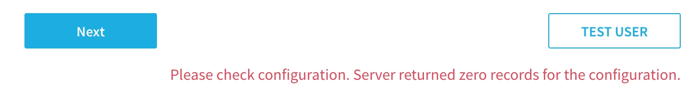
##### Cause

The User Query is unable to return users from the LDAP provider because its search settings do not match users in the LDAP directory.

##### Solution

* If the Connection Query is working, the failure of the User Query is likely because the Base DN does not have users in it. Try **CN=Users,DC=mycompany,DC=com** or **DC=mycompany,DC=com**.
* It is possible that the **Search Filter** does not return users. Try **(objectClass=person)** and **(objectClass=user)**.

#### No Members Returned from Link External LDAP Group Search

When you attempt to link a user group to an LDAP Provider, Harness uses the settings of the LDAP Provider you configured to locate the groups and group members in your LDAP directory.


In some cases, you might be unable to locate a group, or members of a group.

##### Cause

* LDAP Provider settings are incorrect, and cannot locate the group and users you want according to its **Connection**, **User**, and **Group Query** settings.

##### Solution

* Locate the group using your LDAP directory tools, such as **Active Directory Users and Groups**. Confirm the LDAP Base DN for the group and the members of the group. Use that Base DN in the User Query section of the LDAP Provider in Harness.

### Using PowerShell to Find Users

You can use Windows PowerShell to export a list of Active Directory users. When setting up your LDAP Provider, a list of the users you want to sync with Harness can be useful.

To get a list of attributes for a user:


```
Get-ADUser username -Properties *
```
Export all users by name to a csv file:


```
Get-ADUser -Filter * -Properties * | Select-Object name | export-csv -path c:\export\allusers.csv
```
Export all users by name and email:


```
Get-ADUser –filter * -property * | Select-object Name, mail
```
Export all from a specific OU:


```
Get-ADUser -Filter * -SearchBase "OU=Devops,OU=UserAccounts,DC=EXAMPLE,DC=COM"
```
#### Using Active Directory Users and Computers

You can also obtain a list of group members using the **Saved Queries** feature of **Active Directory Users and Computers**.

1. On the Active Directory domain controller, open Active Directory Users and Computers
2. Right-click **Saved Queries**, click **New**, and select **Query**.
3. Enter a name for your query, such as **Harness**.
4. Click the **Define Query** button.
5. From **Find**, select **Users, Contacts, and Groups**.
6. Click the **Advanced** tab.
7. Click **Field**, then **User**, and then **Member of**.
8. Using the condition **is (exactly)**, and paste the group's DN (such as **CN=Harness,CN=Users,DC=mycompany,DC=com**) into the **Value** field.
9. Click **Add**.
10. Click **OK** twice to complete the query.
11. Click the query and then click the **Refresh** button. Here is what the query and results look like: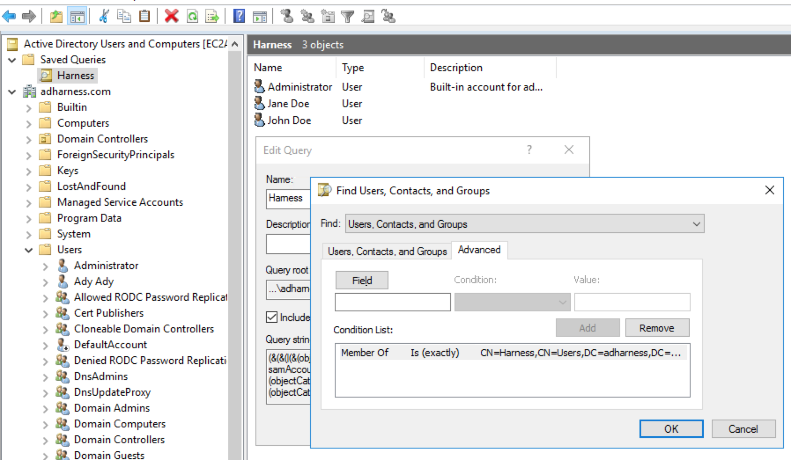

12. Click the **Export list** button to export the list to a file.

### Notes

* Once LDAP is set up and enabled in Harness, you cannot add a second LDAP SSO entry in Harness. The UI for adding LDAP will be disabled.

